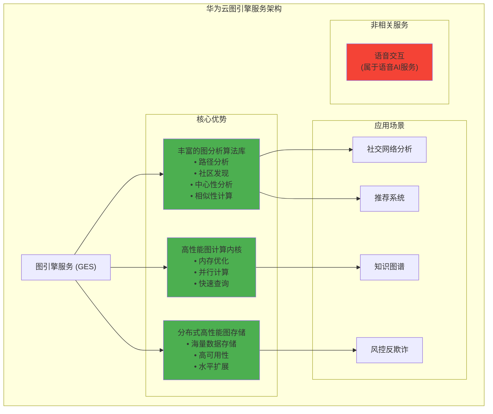

# HCIA-AI 题目分析 - 华为云图引擎服务优势

## 题目内容

**问题**: 下列哪几项是华为云图引擎服务(Graph Engine Service)的优势？

**选项**:
- A. 丰富的图分析算法库
- B. 高性能图计算内核
- C. 分布式高性能图存储擎
- D. 语音交互

## 选项分析表格

| 选项 | 内容 | 正确性 | 详细分析 | 知识点 |
|------|------|--------|----------|--------|
| A | 丰富的图分析算法库 | ✅ | 华为云图引擎服务提供了丰富的图算法库，包括路径分析、社区发现、中心性分析、相似性计算等多种图分析算法，满足不同业务场景需求 | 图算法库 |
| B | 高性能图计算内核 | ✅ | 图引擎服务采用高性能的图计算内核，支持大规模图数据的快速处理，具备优化的内存管理和并行计算能力 | 图计算引擎 |
| C | 分布式高性能图存储擎 | ✅ | 提供分布式图存储引擎，支持海量图数据的存储和管理，具备高可用性、高扩展性和高性能的特点 | 分布式存储 |
| D | 语音交互 | ❌ | 语音交互不是图引擎服务的功能特性，图引擎主要专注于图数据的存储、计算和分析，语音交互属于语音AI服务范畴 | 语音AI服务 |

## 正确答案
**答案**: ABC

**解题思路**: 
1. 华为云图引擎服务是专门的图数据库和图计算服务
2. 丰富的图分析算法库是其核心优势之一
3. 高性能图计算内核保证处理效率
4. 分布式图存储引擎支持大规模数据
5. 语音交互与图引擎服务无关

## 概念图解

## 知识点总结

### 核心概念
- **图引擎服务**: 专门处理图数据的云服务
- **图算法库**: 预置的图分析算法集合
- **图计算内核**: 图数据处理的核心引擎
- **分布式图存储**: 支持大规模图数据的存储架构

### 相关技术
- **图数据库**: Neo4j、ArangoDB等
- **图计算框架**: Apache Giraph、GraphX等
- **图算法**: PageRank、最短路径、社区检测
- **分布式存储**: 数据分片、副本管理、一致性

### 记忆要点
- **算法丰富**: 提供多种图分析算法
- **性能优异**: 高性能计算内核
- **存储强大**: 分布式高性能存储
- **专业专注**: 专门的图数据服务，不包含语音功能

## 扩展学习

### 相关文档
- 华为云图引擎服务官方文档
- 图数据库理论与实践
- 图算法设计与分析
- 分布式图存储技术

### 实践应用
- 社交网络关系分析
- 电商推荐系统构建
- 企业知识图谱建设
- 金融风控图分析