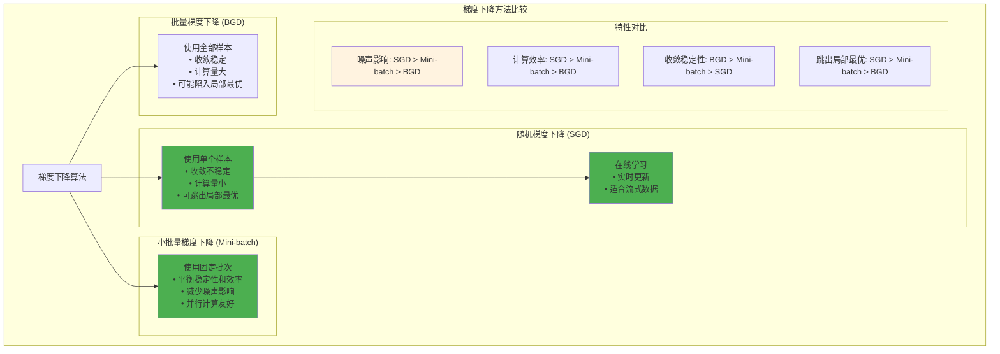

# HCIA-AI 题目分析 - 随机梯度下降和小批量梯度下降

## 题目内容

**问题**: 以下关于随机梯度下降和小批量梯度下降的描述，正确的是哪些项？

**选项**:
- A. 随机梯度下降的不稳定性可以帮助模型在收敛中跳过一些局部极值点
- B. 小批量梯度下降相比于随机梯度下降更容易受到噪声数据的影响
- C. 随机梯度下降的一种实现是在线学习(Online Learning)，它根据每一个样例来更新梯度
- D. 小批量梯度下降的思想是每次使用一小批固定尺寸(Batch Size)的样例来更新权值

## 选项分析表格

| 选项 | 内容 | 正确性 | 详细分析 | 知识点 |
|------|------|--------|----------|--------|
| A | 随机梯度下降的不稳定性可以帮助模型在收敛中跳过一些局部极值点 | ✅ | 随机梯度下降由于使用单个样本计算梯度，具有较大的随机性和噪声，这种不稳定性确实可以帮助模型跳出局部最优解，是其重要优势 | 优化算法特性 |
| B | 小批量梯度下降相比于随机梯度下降更容易受到噪声数据的影响 | ❌ | 错误。小批量梯度下降使用多个样本的平均梯度，相比单样本的随机梯度下降，噪声会被平均化，因此更稳定，不容易受噪声影响 | 噪声鲁棒性 |
| C | 随机梯度下降的一种实现是在线学习(Online Learning)，它根据每一个样例来更新梯度 | ✅ | 正确。在线学习是随机梯度下降的典型应用场景，每来一个新样本就立即更新模型参数，适合流式数据处理 | 在线学习 |
| D | 小批量梯度下降的思想是每次使用一小批固定尺寸(Batch Size)的样例来更新权值 | ✅ | 正确。小批量梯度下降的核心思想就是使用固定大小的样本批次来计算梯度和更新参数，平衡了计算效率和收敛稳定性 | 批量处理 |

## 正确答案
**答案**: ACD

**解题思路**: 
1. 分析各种梯度下降方法的特点和优缺点
2. 随机梯度下降的随机性有助于跳出局部最优
3. 小批量梯度下降通过平均化减少噪声影响
4. 在线学习是随机梯度下降的重要应用
5. 小批量方法使用固定批次大小更新参数

## 概念图解

## 知识点总结

### 核心概念
- **随机梯度下降(SGD)**: 每次使用一个样本更新参数
- **小批量梯度下降**: 使用固定大小的样本批次
- **在线学习**: 实时处理新到达的数据样本
- **局部最优**: 非全局最优的驻点

### 相关技术
- **动量法**: 加速收敛，减少震荡
- **自适应学习率**: Adam、RMSprop等
- **学习率调度**: 动态调整学习率
- **批量归一化**: 稳定训练过程

### 记忆要点
- **SGD随机性**: 有助跳出局部最优
- **Mini-batch稳定性**: 平均化减少噪声
- **在线学习**: SGD的重要应用场景
- **批次大小**: Mini-batch的核心参数

## 扩展学习

### 相关文档
- 深度学习优化算法详解
- 梯度下降方法比较研究
- 在线学习理论与实践
- 批量大小对训练的影响

### 实践应用
- 大规模数据集训练
- 实时推荐系统
- 流式数据处理
- 分布式机器学习