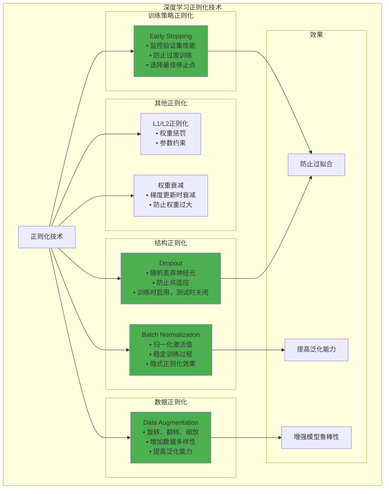

# HCIA-AI 题目分析 - 深度学习正则化技术

## 题目内容

**问题**: 以下哪些是深度学习中的正则化技术？

**选项**:
- A. Dropout
- B. Batch Normalization
- C. Early Stopping
- D. Data Augmentation

## 选项分析表格

| 选项 | 内容 | 正确性 | 详细分析 | 知识点 |
|------|------|--------|----------|--------|
| A | Dropout | ✅ | Dropout是经典的正则化技术，通过在训练过程中随机丢弃一定比例的神经元，防止模型过拟合，提高泛化能力 | 随机正则化 |
| B | Batch Normalization | ✅ | 批量归一化虽然主要目的是加速训练和稳定梯度，但它也具有正则化效果，能够减少过拟合，类似于一种隐式的正则化技术 | 归一化正则化 |
| C | Early Stopping | ✅ | 早停是重要的正则化策略，通过监控验证集性能，在模型开始过拟合前停止训练，防止模型在训练集上过度优化 | 训练策略正则化 |
| D | Data Augmentation | ✅ | 数据增强通过人工扩充训练数据集，增加数据的多样性，有效防止模型过拟合，是一种重要的正则化手段 | 数据正则化 |

## 正确答案
**答案**: ABCD

**解题思路**: 
1. 正则化技术的目标是防止过拟合，提高模型泛化能力
2. Dropout通过随机丢弃神经元实现正则化
3. Batch Normalization具有隐式正则化效果
4. Early Stopping通过控制训练时间防止过拟合
5. Data Augmentation通过增加数据多样性实现正则化

## 概念图解

## 知识点总结

### 核心概念
- **正则化**: 防止模型过拟合的技术
- **过拟合**: 模型在训练集上表现好但泛化能力差
- **泛化能力**: 模型在未见数据上的表现
- **隐式正则化**: 非直接但具有正则化效果的技术

### 相关技术
- **Dropout变种**: DropConnect、Spatial Dropout
- **归一化技术**: Layer Norm、Group Norm
- **数据增强**: Mixup、CutMix、AutoAugment
- **权重正则化**: L1、L2、Elastic Net

### 记忆要点
- **Dropout**: 随机丢弃，防止共适应
- **Batch Norm**: 归一化激活，隐式正则化
- **Early Stop**: 监控验证集，适时停止
- **Data Aug**: 增加多样性，扩充数据

## 扩展学习

### 相关文档
- 深度学习正则化技术综述
- Dropout原理与实现
- 批量归一化理论分析
- 数据增强策略研究

### 实践应用
- 图像分类模型正则化
- 自然语言处理中的正则化
- 推荐系统过拟合防止
- 时间序列预测正则化