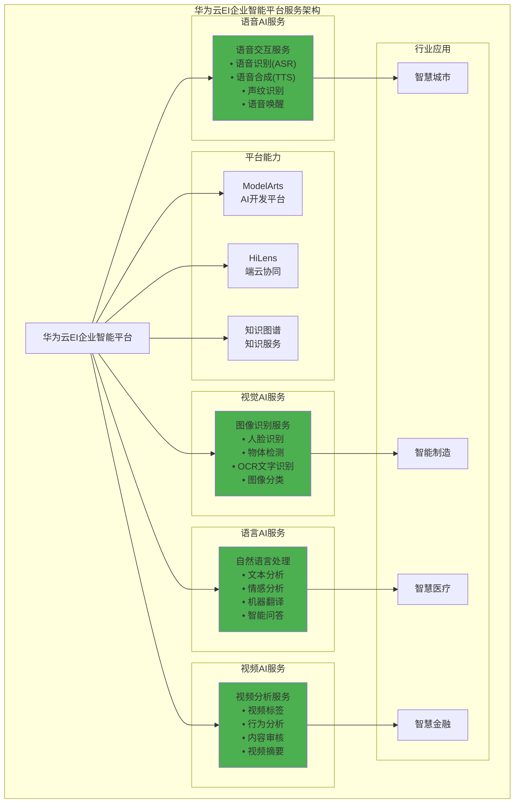

# HCIA-AI 题目分析 - 华为云EI企业智能平台服务

## 题目内容

**问题**: 华为云EI企业智能平台提供哪些服务？

**选项**:
- A. 语音交互服务
- B. 图像识别服务
- C. 自然语言处理服务
- D. 视频分析服务

## 选项分析表格

| 选项 | 内容 | 正确性 | 详细分析 | 知识点 |
|------|------|--------|----------|--------|
| A | 语音交互服务 | ✅ | 华为云EI平台提供完整的语音交互服务，包括语音识别(ASR)、语音合成(TTS)、声纹识别等，支持多语言和方言识别 | 语音AI服务 |
| B | 图像识别服务 | ✅ | 提供丰富的图像识别服务，包括人脸识别、物体检测、OCR文字识别、图像分类、图像搜索等计算机视觉能力 | 计算机视觉 |
| C | 自然语言处理服务 | ✅ | 提供全面的NLP服务，包括文本分析、情感分析、机器翻译、智能问答、知识图谱等自然语言理解和生成能力 | 自然语言处理 |
| D | 视频分析服务 | ✅ | 提供视频内容分析服务，包括视频标签、人脸检测、行为分析、内容审核、视频摘要等视频智能分析能力 | 视频分析 |

## 正确答案
**答案**: ABCD

**解题思路**: 
1. 华为云EI企业智能平台是全栈AI服务平台
2. 涵盖语音、视觉、语言、视频等多个AI领域
3. 提供从基础AI能力到行业解决方案的完整服务
4. 所有选项都是EI平台的核心服务组成部分

## 概念图解

## 知识点总结

### 核心概念
- **EI企业智能**: 华为云的AI服务平台
- **全栈AI服务**: 从基础能力到行业应用的完整服务
- **多模态AI**: 语音、视觉、语言、视频等多种AI能力
- **端云协同**: 云端和边缘设备的协同计算

### 相关技术
- **深度学习框架**: MindSpore、TensorFlow
- **AI芯片**: 昇腾系列处理器
- **边缘计算**: HiLens智能边缘平台
- **知识图谱**: 结构化知识表示和推理

### 记忆要点
- **四大核心服务**: 语音、图像、语言、视频
- **全面覆盖**: AI各个技术领域都有涉及
- **企业级**: 面向企业客户的智能化解决方案
- **华为生态**: 与华为硬件和软件生态深度集成

## 扩展学习

### 相关文档
- 华为云EI服务官方文档
- ModelArts AI开发平台指南
- HiLens端云协同开发
- 华为昇腾AI处理器架构

### 实践应用
- 智能客服系统构建
- 工业质检AI应用
- 智慧城市解决方案
- 金融风控AI系统