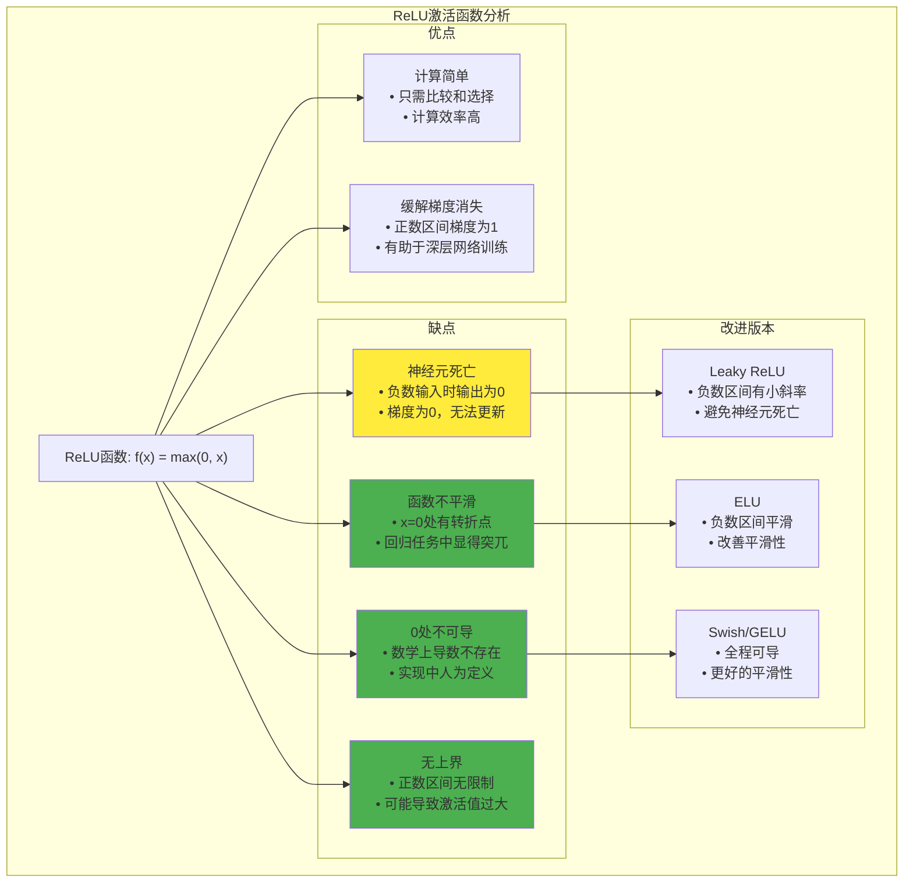

# HCIA-AI 题目分析 - ReLU激活函数缺点

## 题目内容

**问题**: 以下关于ReLU激活函数缺点的描述，正确的是哪些项？

**选项**:
- A. 有神经元死亡的现象
- B. 转折点定义的曲面也是有"棱角"的，在某些回归问题中，显得不够平滑
- C. 在0处不可导，强行定义了导数
- D. 无上界，训练相对发散

## 选项分析表格

| 选项 | 内容 | 正确性 | 详细分析 | 知识点 |
|------|------|--------|----------|--------|
| A | 有神经元死亡的现象 | ❌ | 错误。神经元死亡(Dead Neurons)是ReLU的一个问题，但题目问的是缺点，这确实是ReLU的缺点之一。当输入为负数时，ReLU输出为0，梯度也为0，可能导致神经元永远不被激活 | 神经元死亡 |
| B | 转折点定义的曲面也是有"棱角"的，在某些回归问题中，显得不够平滑 | ✅ | 正确。ReLU在x=0处有一个转折点，函数不平滑，在某些需要平滑输出的回归任务中可能不够理想 | 函数平滑性 |
| C | 在0处不可导，强行定义了导数 | ✅ | 正确。ReLU在x=0处数学上不可导，但在实际实现中通常将该点的导数定义为0或1，这是一种人为的定义 | 可导性问题 |
| D | 无上界，训练相对发散 | ✅ | 正确。ReLU函数在正数区间没有上界，理论上可以无限大，这可能导致激活值过大，影响训练稳定性 | 无界性问题 |

## 正确答案
**答案**: BCD

**解题思路**: 
1. 分析ReLU激活函数的数学特性和实际应用中的问题
2. 神经元死亡确实是ReLU的问题，但选项A的表述可能有误
3. ReLU在0处的转折导致不平滑
4. 0处不可导是数学上的问题
5. 无上界可能导致训练不稳定

## 概念图解

## 知识点总结

### 核心概念
- **ReLU函数**: f(x) = max(0, x)，最常用的激活函数
- **神经元死亡**: 神经元输出始终为0，无法参与学习
- **函数平滑性**: 函数在定义域内的连续可导性
- **激活函数饱和**: 函数在某些区间梯度接近0

### 相关技术
- **Leaky ReLU**: f(x) = max(αx, x)，α通常为0.01
- **ELU**: 指数线性单元，负数区间平滑
- **Swish**: f(x) = x·sigmoid(x)，自门控激活函数
- **GELU**: 高斯误差线性单元，Transformer中常用

### 记忆要点
- **计算简单**: ReLU的主要优势
- **梯度友好**: 正数区间梯度恒为1
- **死亡问题**: 负数输入导致的问题
- **平滑性差**: 0处转折影响某些任务
- **无界性**: 可能导致数值不稳定

## 扩展学习

### 相关文档
- 深度学习激活函数详解
- ReLU及其变种比较研究
- 激活函数选择指南
- 神经网络训练技巧

### 实践应用
- CNN中的激活函数选择
- 深层网络的梯度问题
- 回归任务中的激活函数
- 不同任务的激活函数优化