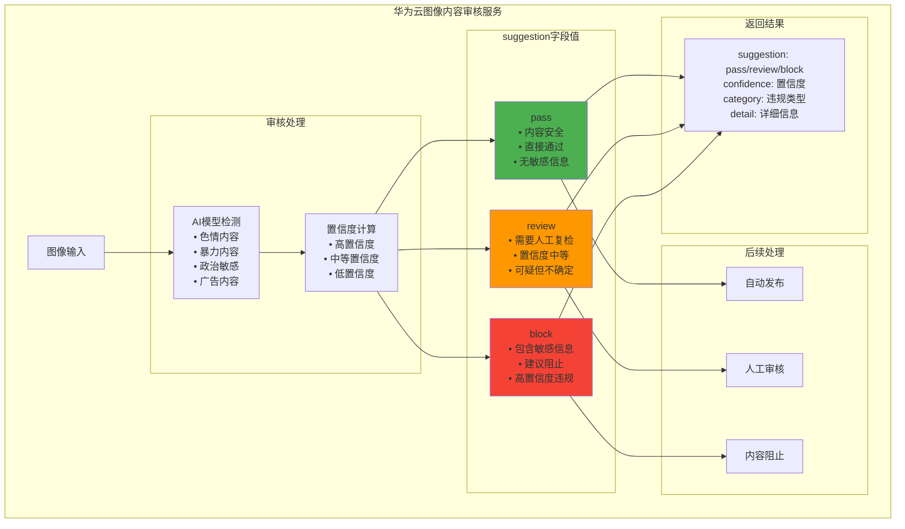

# HCIA-AI 题目分析 - 图像内容审核服务suggestion字段

## 题目内容

**问题**: 关于图像内容审核服务调用成功时返回的suggestion字段，说法正确的是？

**选项**:
- A. pass代表不包含敏感信息，通过
- B. review代表需要人工复检
- C. suggestion字段代表检测是否通过
- D. block代表包含敏感信息，不通过

## 选项分析表格

| 选项 | 内容 | 正确性 | 详细分析 | 知识点 |
|------|------|--------|----------|--------|
| A | pass代表不包含敏感信息，通过 | ✅ | 正确。在图像内容审核服务中，suggestion字段返回"pass"表示图像内容安全，不包含敏感信息，可以通过审核 | 内容审核结果 |
| B | review代表需要人工复检 | ✅ | 正确。"review"表示系统检测到可疑内容，但置信度不够高，需要人工进一步审核确认 | 人工复审机制 |
| C | suggestion字段代表检测是否通过 | ✅ | 正确。suggestion字段是内容审核服务的核心返回字段，用于表示审核建议和检测结果 | 字段含义 |
| D | block代表包含敏感信息，不通过 | ✅ | 正确。"block"表示检测到明确的敏感内容，建议阻止该内容的发布或传播 | 内容阻止 |

## 正确答案
**答案**: ABCD

**解题思路**: 
1. 理解图像内容审核服务的工作机制
2. suggestion字段是审核结果的核心指标
3. pass、review、block代表不同的审核建议
4. 这些字段值覆盖了内容审核的完整流程

## 概念图解

## 知识点总结

### 核心概念
- **内容审核**: 自动检测图像中的敏感内容
- **suggestion字段**: 审核服务的核心返回字段
- **置信度**: AI模型对检测结果的确信程度
- **人工复审**: 机器无法确定时的人工介入

### 相关技术
- **计算机视觉**: 图像识别和分析技术
- **深度学习**: 内容识别模型训练
- **多分类模型**: 不同类型敏感内容检测
- **阈值设置**: 不同置信度的判断标准

### 记忆要点
- **pass**: 通过，安全内容
- **review**: 复检，需要人工确认
- **block**: 阻止，明确违规内容
- **suggestion**: 审核建议的核心字段

## 扩展学习

### 相关文档
- 华为云内容审核服务API文档
- 图像内容安全技术白皮书
- AI内容审核最佳实践
- 内容安全合规指南

### 实践应用
- 社交媒体内容过滤
- 电商平台图片审核
- 在线教育内容安全
- 企业内容合规管理