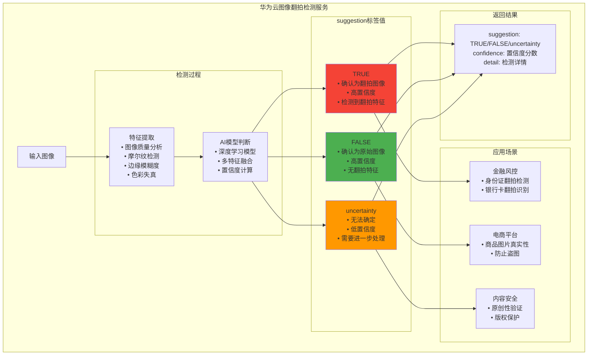

# HCIA-AI 题目分析 - 图像翻拍检测服务suggestion标签

## 题目内容

**问题**: 图像翻拍检测服务调用成功时标签suggestion有哪些情况？

**选项**:
- A. certainty
- B. FALSE
- C. uncertainty
- D. TRUE

## 选项分析表格

| 选项 | 内容 | 正确性 | 详细分析 | 知识点 |
|------|------|--------|----------|--------|
| A | certainty | ❌ | 错误。在图像翻拍检测服务中，suggestion字段不使用"certainty"这个值，这不是标准的返回标签 | 标签规范 |
| B | FALSE | ✅ | 正确。FALSE表示检测结果为非翻拍图像，即原始图像或正常拍摄的图像 | 非翻拍检测 |
| C | uncertainty | ✅ | 正确。uncertainty表示检测结果不确定，模型无法明确判断是否为翻拍图像，可能需要进一步处理 | 不确定性检测 |
| D | TRUE | ✅ | 正确。TRUE表示检测结果为翻拍图像，即通过拍摄屏幕、照片等方式获得的二次图像 | 翻拍检测 |

## 正确答案
**答案**: BCD

**解题思路**: 
1. 理解图像翻拍检测服务的功能和应用场景
2. suggestion字段返回布尔值和不确定状态
3. TRUE/FALSE表示明确的检测结果
4. uncertainty表示模型置信度不足的情况

## 概念图解

## 知识点总结

### 核心概念
- **图像翻拍**: 通过拍摄屏幕、照片等方式获得的二次图像
- **翻拍检测**: 识别图像是否为翻拍获得的技术
- **置信度**: 模型对检测结果的确信程度
- **不确定性**: 模型无法明确判断的情况

### 相关技术
- **摩尔纹检测**: 翻拍图像常见的视觉伪影
- **图像质量评估**: 分析图像的清晰度和失真
- **边缘检测**: 分析图像边缘的模糊程度
- **色彩分析**: 检测色彩空间的异常

### 记忆要点
- **TRUE**: 确认翻拍，高风险
- **FALSE**: 确认原图，安全
- **uncertainty**: 不确定，需要额外处理
- **应用**: 金融、电商、版权保护

## 扩展学习

### 相关文档
- 华为云图像翻拍检测API文档
- 图像质量评估技术原理
- 翻拍检测算法研究
- 金融场景反欺诈应用

### 实践应用
- 身份认证系统
- 电商图片审核
- 版权保护系统
- 金融风控平台