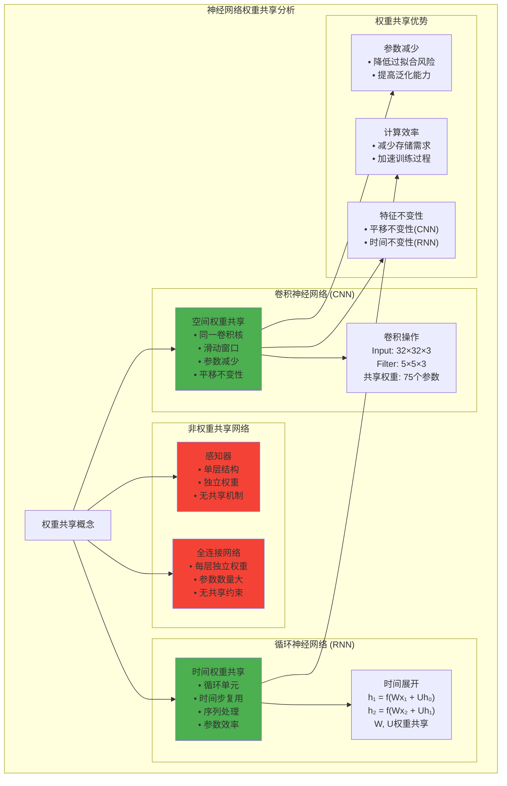

# HCIA-AI 题目分析 - 神经网络权重共享现象

## 题目内容

**问题**: 在神经网络中常有权重共享现象，以下哪些神经网络会发生权重共享？

**选项**:
- A. 感知器
- B. 卷积神经网络
- C. 全连接神经网络
- D. 循环神经网络

## 选项分析表格

| 选项 | 内容 | 正确性 | 详细分析 | 知识点 |
|------|------|--------|----------|--------|
| A | 感知器 | ❌ | 错误。感知器是最简单的神经网络模型，每个输入都有独立的权重，不存在权重共享机制 | 感知器结构 |
| B | 卷积神经网络 | ✅ | 正确。CNN的核心特征就是权重共享，同一个卷积核在整个特征图上滑动，所有位置共享相同的权重参数 | 卷积权重共享 |
| C | 全连接神经网络 | ❌ | 错误。全连接网络中每个神经元都有独立的权重参数，不同层之间、不同神经元之间不共享权重 | 全连接结构 |
| D | 循环神经网络 | ✅ | 正确。RNN在时间维度上共享权重，同一个循环单元的权重在所有时间步上都是相同的，这是RNN的核心特征 | 时间权重共享 |

## 正确答案
**答案**: BD

**解题思路**: 
1. 理解权重共享的概念和意义
2. 分析不同神经网络架构的权重使用方式
3. CNN通过卷积核实现空间权重共享
4. RNN通过循环单元实现时间权重共享
5. 感知器和全连接网络使用独立权重

## 概念图解

## 知识点总结

### 核心概念
- **权重共享**: 多个神经元或计算单元使用相同的权重参数
- **卷积操作**: 通过滑动窗口实现空间权重共享
- **循环结构**: 通过时间展开实现时间权重共享
- **参数效率**: 减少模型参数数量的技术

### 相关技术
- **卷积核**: CNN中的权重共享单元
- **池化操作**: 降维和特征提取
- **LSTM/GRU**: 改进的循环神经网络
- **注意力机制**: 动态权重分配

### 记忆要点
- **CNN空间共享**: 卷积核在空间维度滑动
- **RNN时间共享**: 循环单元在时间维度复用
- **感知器独立**: 每个输入独立权重
- **全连接独立**: 每个连接独立权重

## 扩展学习

### 相关文档
- 深度学习网络架构设计
- 卷积神经网络原理详解
- 循环神经网络时间建模
- 权重共享机制研究

### 实践应用
- 图像识别中的CNN应用
- 自然语言处理中的RNN应用
- 参数高效的模型设计
- 迁移学习中的权重复用