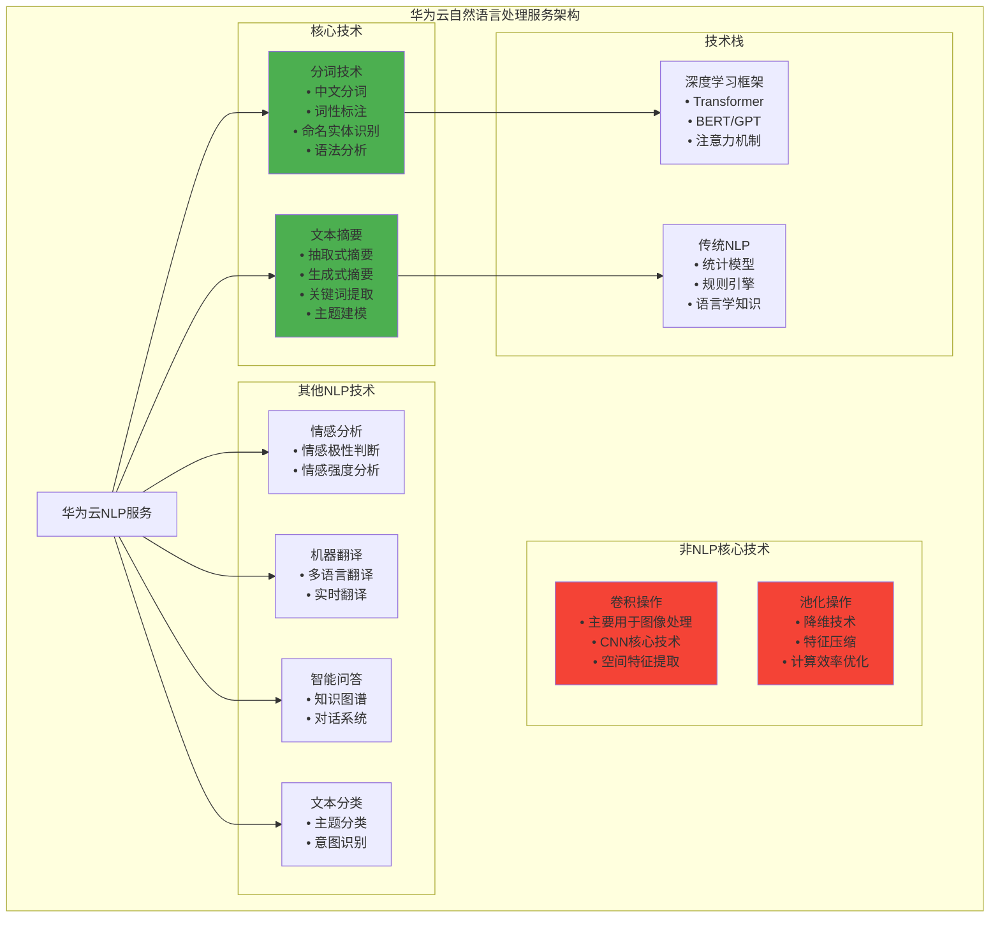

# HCIA-AI 题目分析 - 华为云自然语言处理关键技术

## 题目内容

**问题**: 下列哪些属于华为云自然语言处理(Natural Language Processing)服务的关键技术？

**选项**:
- A. 卷积
- B. 分词
- C. 文本摘要
- D. 池化

## 选项分析表格

| 选项 | 内容 | 正确性 | 详细分析 | 知识点 |
|------|------|--------|----------|--------|
| A | 卷积 | ❌ | 错误。卷积是计算机视觉领域的核心技术，主要用于图像处理，虽然在某些NLP任务中也有应用(如TextCNN)，但不是NLP服务的关键技术 | 计算机视觉技术 |
| B | 分词 | ✅ | 正确。分词是自然语言处理的基础技术，将连续的文本切分成有意义的词汇单元，是中文NLP处理的关键步骤 | 文本预处理 |
| C | 文本摘要 | ✅ | 正确。文本摘要是NLP的重要应用技术，能够从长文本中提取关键信息生成简洁摘要，是华为云NLP服务的核心功能之一 | 文本生成 |
| D | 池化 | ❌ | 错误。池化主要是深度学习中用于降维的技术，常见于CNN中，虽然在某些NLP模型中有应用，但不是NLP服务的关键技术 | 深度学习技术 |

## 正确答案
**答案**: BC

**解题思路**: 
1. 理解自然语言处理的核心技术领域
2. 分词是NLP的基础预处理技术
3. 文本摘要是NLP的重要应用功能
4. 卷积和池化主要属于计算机视觉技术
5. 华为云NLP服务专注于语言理解和生成

## 概念图解

## 知识点总结

### 核心概念
- **自然语言处理**: 计算机理解和生成人类语言的技术
- **分词**: 将文本切分成词汇单元的基础技术
- **文本摘要**: 从长文本中提取关键信息的技术
- **语言模型**: 理解和生成自然语言的数学模型

### 相关技术
- **Transformer**: 现代NLP的核心架构
- **BERT**: 双向编码器表示模型
- **GPT**: 生成式预训练模型
- **注意力机制**: 动态关注重要信息的技术

### 记忆要点
- **分词基础**: NLP处理的第一步
- **摘要应用**: 信息压缩的重要技术
- **卷积视觉**: 主要用于图像处理
- **池化降维**: 深度学习中的辅助技术

## 扩展学习

### 相关文档
- 华为云NLP服务API文档
- 自然语言处理技术综述
- 中文分词算法研究
- 文本摘要技术发展

### 实践应用
- 智能客服系统
- 新闻摘要生成
- 文档智能处理
- 多语言翻译服务