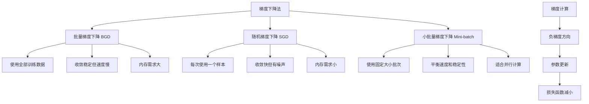

# HCIA-AI 题目分析 - 梯度下降法描述

## 题目内容

**问题**: 以下关于梯度下降法的描述中，正确的有哪几项？

**选项**:
- A. 梯度下降法的思想是让损失函数沿着梯度的方向进行搜索，不断迭代更新参数，最终使得损失函数最小化。
- B. 全局梯度下降法收敛过程比较慢，因为每次更新权值都需要计算所有的训练样例。
- C. 小批量梯度下降法每次使用一小批固定尺寸的样例来更新权值，兼顾了效率和梯度的稳定性
- D. 随机梯度下降根据每一个样例来更新权值，往往难以收敛到极值。

## 选项分析表格

| 选项 | 内容 | 正确性 | 详细分析 | 知识点 |
|------|------|--------|----------|--------|
| A | 梯度下降法的思想是让损失函数沿着梯度的方向进行搜索，不断迭代更新参数，最终使得损失函数最小化。 | ❌ | 这个描述是错误的。梯度下降法是沿着梯度的**负方向**进行搜索，因为梯度指向函数增长最快的方向，而我们要最小化损失函数，所以要沿着负梯度方向。 | 梯度下降基本原理 |
| B | 全局梯度下降法收敛过程比较慢，因为每次更新权值都需要计算所有的训练样例。 | ✅ | 正确。批量梯度下降（BGD）每次迭代都要计算整个训练集的梯度，计算量大，收敛速度慢，但梯度估计准确。 | 批量梯度下降特点 |
| C | 小批量梯度下降法每次使用一小批固定尺寸的样例来更新权值，兼顾了效率和梯度的稳定性 | ✅ | 正确。小批量梯度下降（Mini-batch GD）是BGD和SGD的折中方案，既保证了一定的计算效率，又保持了梯度估计的相对稳定性。 | 小批量梯度下降优势 |
| D | 随机梯度下降根据每一个样例来更新权值，往往难以收敛到极值。 | ❌ | 这个描述不准确。SGD虽然收敛过程有噪声，但在合适的学习率调度下是可以收敛的，而且有时候这种随机性反而有助于跳出局部最优。 | 随机梯度下降特性 |

## 正确答案
**答案**: BC

**解题思路**: 
1. 分析梯度下降的基本原理：沿负梯度方向搜索
2. 理解三种梯度下降变体的特点：
   - BGD：计算量大但稳定
   - SGD：计算快但有噪声
   - Mini-batch：平衡效率和稳定性
3. 识别常见误区：梯度方向vs负梯度方向

## 概念图解

## 知识点总结

### 核心概念
- **梯度下降原理**: 沿负梯度方向更新参数，使损失函数最小化
- **三种变体**: BGD、SGD、Mini-batch GD各有优缺点
- **收敛性**: 与学习率、批次大小、数据特性相关

### 相关技术
- **优化算法**: Adam、RMSprop、Momentum等改进版本
- **学习率调度**: 固定、衰减、自适应等策略
- **并行计算**: Mini-batch适合GPU并行处理

### 记忆要点
- **方向记忆**: 梯度上升，负梯度下降
- **速度vs稳定性**: BGD稳定慢，SGD快但噪声大，Mini-batch平衡
- **实际应用**: 深度学习中多用Mini-batch GD

## 扩展学习

### 相关文档
- 《深度学习》花书第8章：优化方法
- Andrew Ng机器学习课程：梯度下降算法
- MindSpore优化器文档

### 实践应用
- **深度学习训练**: 选择合适的批次大小和学习率
- **MindSpore实现**: 使用nn.SGD、nn.Adam等优化器
- **调参技巧**: 学习率预热、余弦退火等策略