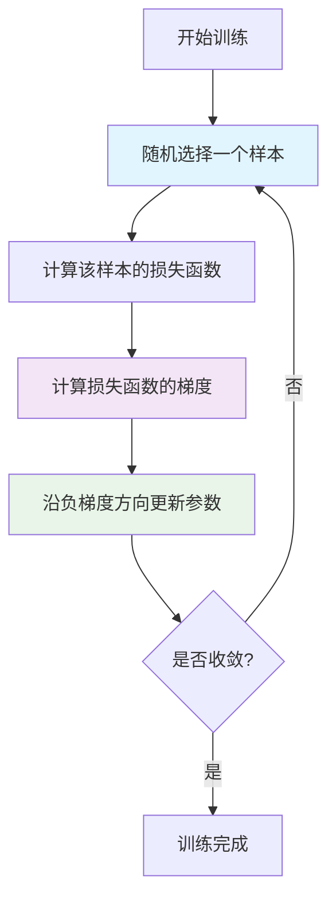

# HCIA-AI 题目分析 - 优化思想应用

## 题目内容

**问题**: 9. () 方法的优化思想是用前位置负梯度反方向作为搜索方向，该方向为当前位置最快下降方向，每次更新都使用一个样本与计算。(输入中文)

**选项**:
- A. 随机梯度下降法

## 选项分析表格

| 选项 | 内容 | 正确性 | 详细分析 | 知识点 |
|------|------|--------|----------|--------|
| A | 随机梯度下降法 | ✅ | 随机梯度下降法(SGD)的核心思想确实是使用负梯度方向作为搜索方向，这是最快下降方向。每次更新只使用一个样本来计算梯度，这正是SGD的特点。相比于批量梯度下降(BGD)使用全部样本，SGD每次只用一个样本，计算效率更高但收敛过程更加随机。 | 随机梯度下降、优化算法 |

## 正确答案
**答案**: A

**解题思路**: 
1. 题目描述了一种优化方法的特点：使用负梯度方向作为搜索方向
2. 强调每次更新使用一个样本进行计算
3. 这正是随机梯度下降法(SGD)的核心特征
4. SGD是深度学习中最基础和重要的优化算法之一

## 概念图解



## 知识点总结

### 核心概念
- **随机梯度下降法(SGD)**: 每次迭代只使用一个随机选择的样本来计算梯度
- **负梯度方向**: 函数值下降最快的方向，是优化的核心思想
- **搜索方向**: 参数更新的方向，决定了优化的效果

### 算法对比
- **批量梯度下降(BGD)**: 使用全部训练样本计算梯度
- **小批量梯度下降(Mini-batch GD)**: 使用小批量样本计算梯度
- **随机梯度下降(SGD)**: 使用单个样本计算梯度

### 数学表达
```
参数更新公式: θ = θ - α * ∇J(θ; x^(i), y^(i))
其中:
- θ: 模型参数
- α: 学习率
- ∇J: 损失函数梯度
- x^(i), y^(i): 第i个训练样本
```

### SGD特点
- **优点**: 计算效率高，内存需求小，能够在线学习
- **缺点**: 收敛过程噪声大，可能震荡，需要仔细调整学习率
- **应用**: 大规模数据集训练的首选方法

### 记忆要点
- SGD = 单样本 + 负梯度方向
- 每次只用一个样本，计算快但有噪声
- 是深度学习优化的基础算法

## 扩展学习

### SGD变种算法
- **Momentum SGD**: 加入动量项，减少震荡
- **AdaGrad**: 自适应学习率调整
- **Adam**: 结合动量和自适应学习率
- **RMSprop**: 改进的自适应学习率方法

### MindSpore中的实现
```python
# MindSpore中使用SGD优化器
import mindspore.nn as nn

# 创建SGD优化器
optimizer = nn.SGD(params=net.trainable_params(), 
                   learning_rate=0.01, 
                   momentum=0.9)
```

### 实践建议
- **学习率选择**: 通常从0.1开始，根据收敛情况调整
- **学习率衰减**: 训练过程中逐渐降低学习率
- **批量大小**: 虽然SGD理论上用单样本，实际常用小批量
- **收敛监控**: 观察损失函数变化，判断收敛状态

### 理论背景
- **梯度下降原理**: 基于函数的一阶导数信息
- **收敛性分析**: 在凸函数下有收敛保证
- **随机性影响**: 引入噪声有助于跳出局部最优
- **计算复杂度**: O(1)相对于样本数量