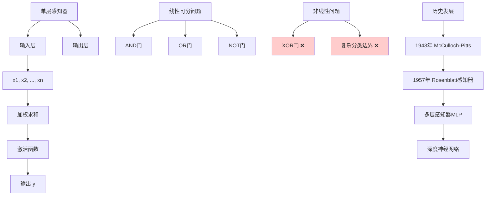

# HCIA-AI 题目分析 - 单层感知器描述

## 题目内容

**问题**: 以下关于单层感知器的描述中，正确的是哪几项？

**选项**:
- A. 单层感知器可以解决XOR问题。
- B. 单层感知器本质上是一种线性模型，只能处理线性分类问题。
- C. 单层感知器使用高维X向量做输入，在高维空间对输入的样本进行三分类，向量做输入，在高维空间对输入的样本进行二分类
- D. 单层感知器可以看做是前馈神经网络的基础。

## 选项分析表格

| 选项 | 内容 | 正确性 | 详细分析 | 知识点 |
|------|------|--------|----------|--------|
| A | 单层感知器可以解决XOR问题。 | ❌ | 错误。XOR问题是经典的非线性可分问题，单层感知器只能解决线性可分问题，无法解决XOR问题。这是单层感知器的根本局限性。 | 线性可分性限制 |
| B | 单层感知器本质上是一种线性模型，只能处理线性分类问题。 | ✅ | 正确。单层感知器的决策边界是线性的（超平面），只能将线性可分的数据正确分类，这是其本质特征。 | 线性模型特性 |
| C | 单层感知器使用高维X向量做输入，在高维空间对输入的样本进行三分类，向量做输入，在高维空间对输入的样本进行二分类 | ❌ | 错误。单层感知器主要用于二分类问题，虽然可以扩展到多分类，但描述中的表述混乱且不准确。标准的单层感知器是二分类器。 | 分类任务类型 |
| D | 单层感知器可以看做是前馈神经网络的基础。 | ✅ | 正确。单层感知器是最简单的神经网络模型，是多层感知器和深度神经网络的基础构建块，为现代神经网络奠定了理论基础。 | 神经网络发展史 |

## 正确答案
**答案**: BD

**解题思路**: 
1. 理解单层感知器的本质：线性分类器
2. 分析其局限性：无法解决非线性问题（如XOR）
3. 认识其历史地位：神经网络的基础模型
4. 明确其应用范围：主要用于二分类任务

## 概念图解

## 知识点总结

### 核心概念
- **线性分类器**: 决策边界为超平面，只能处理线性可分数据
- **XOR问题**: 经典的非线性问题，单层感知器无法解决
- **神经网络基础**: 现代深度学习的理论起点

### 相关技术
- **多层感知器**: 通过增加隐藏层解决非线性问题
- **激活函数**: 阶跃函数、sigmoid等
- **学习算法**: 感知器学习规则、梯度下降

### 记忆要点
- **线性限制**: 只能解决线性可分问题
- **XOR悖论**: 1969年Minsky证明单层感知器无法解决XOR
- **历史地位**: 神经网络的鼻祖，但有重要局限性

## 扩展学习

### 相关文档
- 《感知器》- Rosenblatt原始论文
- 《深度学习》第6章：深度前馈网络
- MindSpore神经网络基础教程

### 实践应用
- **简单分类**: 线性可分数据的快速分类
- **特征工程**: 通过特征变换使数据线性可分
- **教学演示**: 理解神经网络基本原理的最佳起点