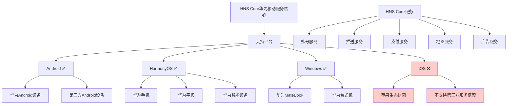

# HCIA-AI 题目分析 - HNS Core支持操作系统

## 题目内容

**问题**: HNS Core支持以下哪些操作系统？

**选项**:
- A. Android
- B. HarmonyOs
- C. Windows
- D. IOS

## 选项分析表格

| 选项 | 内容 | 正确性 | 详细分析 | 知识点 |
|------|------|--------|----------|--------|
| A | Android | ✅ | 正确。HNS Core（华为移动服务核心）支持Android系统，为Android设备提供华为移动服务的核心功能和API接口。 | 华为移动服务生态 |
| B | HarmonyOs | ✅ | 正确。HNS Core原生支持华为自研的HarmonyOS操作系统，这是华为全场景智慧生态的重要组成部分。 | 华为操作系统生态 |
| C | Windows | ✅ | 正确。HNS Core也支持Windows平台，特别是在华为PC设备上，提供跨平台的服务体验。 | 跨平台支持 |
| D | IOS | ❌ | 错误。由于苹果iOS系统的封闭性和生态限制，HNS Core不支持iOS系统。iOS设备只能使用苹果自己的服务框架。 | 平台限制 |

## 正确答案
**答案**: ABC

**解题思路**: 
1. 理解HNS Core的定位：华为移动服务核心框架
2. 分析华为设备生态：Android、HarmonyOS、Windows设备
3. 考虑平台开放性：iOS的封闭生态限制
4. 华为全场景战略：多平台协同服务

## 概念图解

## 知识点总结

### 核心概念
- **HNS Core**: 华为移动服务的核心框架，提供基础服务能力
- **全场景生态**: 华为1+8+N战略的技术支撑
- **跨平台服务**: 在多个操作系统上提供一致的服务体验

### 相关技术
- **HMS生态**: 华为移动服务完整解决方案
- **HarmonyOS**: 华为自研的分布式操作系统
- **服务框架**: 账号、推送、支付、地图等核心服务

### 记忆要点
- **支持三平台**: Android、HarmonyOS、Windows
- **不支持iOS**: 苹果生态封闭性限制
- **华为生态**: 全场景智慧生活的技术基础

## 扩展学习

### 相关文档
- 华为开发者联盟HMS Core文档
- HarmonyOS开发指南
- 华为移动服务集成指南

### 实践应用
- **应用开发**: 集成HMS Core服务到应用中
- **跨平台开发**: 利用HNS Core实现多平台一致体验
- **华为生态**: 构建基于华为服务的应用生态