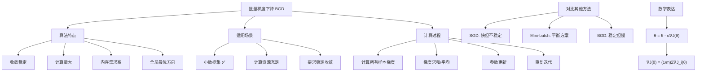

# HCIA-AI 题目分析 - 批量梯度下降描述

## 题目内容

**问题**: 以下关于批量梯度下降的描述中，哪些选项是正确的？

**选项**:
- A. 批量梯度下降（BGD）更适用于样本较少的数据集。
- B. 批量梯度下降（BGD）最稳定，但是过于消耗运算资源
- C. 批量梯度下降（BGD）损失函数在下降到极小值的过程中，产生动荡甚至反向的位移。
- D. 批量梯度下降（BGD）使用所有数据集中的样本（共m个样本）在当前点的梯度之和来对权重参数进行更新操作。

## 选项分析表格

| 选项 | 内容 | 正确性 | 详细分析 | 知识点 |
|------|------|--------|----------|--------|
| A | 批量梯度下降（BGD）更适用于样本较少的数据集。 | ✅ | 正确。BGD需要计算所有样本的梯度，当样本数量较少时，计算负担相对较轻，能够充分利用所有数据信息，收敛效果好。 | BGD适用场景 |
| B | 批量梯度下降（BGD）最稳定，但是过于消耗运算资源 | ❌ | 部分正确但表述不准确。BGD确实最稳定，但"过于消耗运算资源"的表述过于绝对。在小数据集上BGD是合理的选择。 | BGD特性权衡 |
| C | 批量梯度下降（BGD）损失函数在下降到极小值的过程中，产生动荡甚至反向的位移。 | ❌ | 错误。这是随机梯度下降（SGD）的特征。BGD使用全部数据计算梯度，下降过程平滑稳定，不会产生剧烈动荡。 | BGD vs SGD特性 |
| D | 批量梯度下降（BGD）使用所有数据集中的样本（共m个样本）在当前点的梯度之和来对权重参数进行更新操作。 | ✅ | 正确。这是BGD的核心定义：每次迭代都计算所有m个训练样本的梯度，然后求和（或平均）来更新参数。 | BGD算法原理 |

## 正确答案
**答案**: AD

**解题思路**: 
1. 理解BGD的核心特征：使用全部训练数据
2. 分析BGD的优势：稳定收敛，适合小数据集
3. 区分BGD与SGD：BGD平滑，SGD有噪声
4. 掌握BGD的计算过程：全样本梯度求和

## 概念图解

## 知识点总结

### 核心概念
- **全样本计算**: 每次迭代使用所有训练数据
- **稳定收敛**: 梯度方向准确，收敛路径平滑
- **计算复杂度**: O(m×n)，m为样本数，n为特征数

### 相关技术
- **梯度计算**: 损失函数对参数的偏导数
- **学习率调整**: 固定学习率或自适应调整
- **收敛判断**: 梯度范数、损失变化等指标

### 记忆要点
- **适用场景**: 小数据集，要求稳定收敛
- **计算特点**: 全样本梯度，计算量大但稳定
- **与SGD区别**: BGD平滑，SGD有噪声但快速

## 扩展学习

### 相关文档
- 《深度学习》第8章：优化算法详解
- Andrew Ng机器学习课程：梯度下降变体
- MindSpore优化器实现原理

### 实践应用
- **小规模训练**: 传统机器学习模型训练
- **精确优化**: 需要高精度收敛的场景
- **算法对比**: 理解不同优化算法的权衡