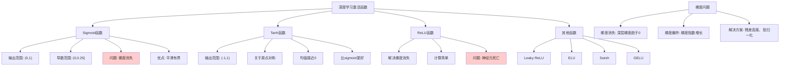

# HCIA-AI 题目分析 - 深度学习激活函数

## 题目内容

**问题**: 关于深度学习中常用的激活函数，以下哪些选项是正确的？

**选项**:
- A. sigmoid，tanh，Softsign函数在训练深度神经网络的过程中，都无法回避梯度消失的问题
- B. sigmoid函数容易导致梯度爆炸。
- C. sigmoid函数单调连续，求导容易，输出有界，网络比较容易收敛
- D. tanh函数关于原点对称，均值更接近于0。

## 选项分析表格

| 选项 | 内容 | 正确性 | 详细分析 | 知识点 |
|------|------|--------|----------|--------|
| A | sigmoid，tanh，Softsign函数在训练深度神经网络的过程中，都无法回避梯度消失的问题 | ❌ | 错误。虽然这些函数确实存在梯度消失问题，但说"无法回避"过于绝对。通过合适的网络设计、初始化方法、残差连接等技术可以缓解梯度消失问题。 | 梯度消失问题 |
| B | sigmoid函数容易导致梯度爆炸。 | ❌ | 错误。sigmoid函数的导数最大值为0.25，在深度网络中更容易导致梯度消失而不是梯度爆炸。梯度爆炸通常由权重初始化不当或网络结构问题引起。 | sigmoid函数特性 |
| C | sigmoid函数单调连续，求导容易，输出有界，网络比较容易收敛 | ✅ | 正确。sigmoid函数具有良好的数学性质：单调递增、连续可导、输出范围(0,1)有界，这些特性有利于网络训练和收敛。 | sigmoid函数优点 |
| D | tanh函数关于原点对称，均值更接近于0。 | ✅ | 正确。tanh函数是奇函数，关于原点对称，输出范围(-1,1)，均值为0，这比sigmoid函数(均值0.5)更有利于网络训练。 | tanh函数特性 |

## 正确答案
**答案**: CD

**解题思路**: 
1. 分析各激活函数的数学特性和优缺点
2. 理解梯度消失vs梯度爆炸的区别和成因
3. 掌握sigmoid和tanh函数的具体性质
4. 区分理论问题和实际解决方案

## 概念图解

## 知识点总结

### 核心概念
- **激活函数作用**: 引入非线性，使网络能够学习复杂模式
- **梯度传播**: 激活函数的导数影响梯度在网络中的传播
- **函数选择**: 不同任务和网络结构需要不同的激活函数

### 相关技术
- **现代激活函数**: ReLU、Leaky ReLU、ELU、Swish等
- **梯度优化**: 残差连接、批归一化、梯度裁剪
- **函数组合**: 不同层使用不同激活函数

### 记忆要点
- **Sigmoid特点**: 输出(0,1)，容易梯度消失，不是梯度爆炸
- **Tanh优势**: 零中心化，比sigmoid更适合隐藏层
- **ReLU革命**: 解决梯度消失，成为深度学习标配
- **问题解决**: 梯度消失可以通过多种技术缓解

## 扩展学习

### 相关文档
- 《深度学习》第6章：深度前馈网络
- "Understanding the difficulty of training deep feedforward neural networks"
- MindSpore激活函数API文档

### 实践应用
- **网络设计**: 根据任务选择合适的激活函数
- **调试技巧**: 监控梯度范数，诊断梯度问题
- **现代实践**: ReLU族函数在深度网络中的应用