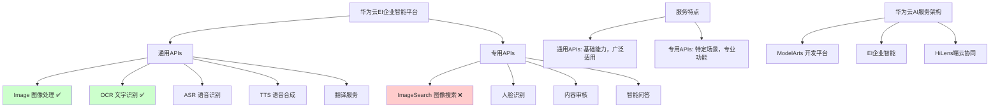

# HCIA-AI 题目分析 - 华为云通用APIs

## 题目内容

**问题**: 下面哪几项是属于华为云通用APIS？

**选项**:
- A. Image
- B. ImageSearch
- C. nLP
- D. OCR

## 选项分析表格

| 选项 | 内容 | 正确性 | 详细分析 | 知识点 |
|------|------|--------|----------|--------|
| A | Image | ✅ | 正确。Image是华为云EI企业智能平台提供的通用图像处理API服务，包括图像识别、图像分析等基础能力。 | 华为云图像服务 |
| B | ImageSearch | ❌ | 错误。ImageSearch（图像搜索）是华为云的专用API服务，不属于通用APIs范畴，而是针对特定业务场景的专业服务。 | 专用vs通用API |
| C | nLP | ❌ | 错误。虽然自然语言处理是通用能力，但这里的"nLP"表述不规范，华为云的标准服务名称是"NLP"（自然语言处理），且通常作为专业服务提供。 | 自然语言处理服务 |
| D | OCR | ✅ | 正确。OCR（光学字符识别）是华为云提供的通用API服务，支持各种文档、图片中的文字识别，是基础的通用能力。 | 华为云OCR服务 |

## 正确答案
**答案**: AD

**解题思路**: 
1. 理解华为云通用APIs的定义：基础、通用的AI能力服务
2. 区分通用APIs和专用APIs：
   - 通用APIs：Image、OCR等基础能力
   - 专用APIs：ImageSearch等特定场景服务
3. 注意服务名称的规范性和准确性

## 概念图解

## 知识点总结

### 核心概念
- **通用APIs**: 提供基础AI能力，适用于多种场景的标准化服务
- **专用APIs**: 针对特定业务场景优化的专业化服务
- **华为云EI**: 企业智能平台，提供全栈AI服务能力

### 相关技术
- **Image服务**: 图像分类、目标检测、图像增强等
- **OCR服务**: 通用文字识别、表格识别、证件识别等
- **API调用**: RESTful接口、SDK集成、在线调试

### 记忆要点
- **通用vs专用**: Image、OCR是通用，ImageSearch是专用
- **服务分类**: 按应用场景和技术复杂度区分
- **华为云生态**: EI平台是华为AI服务的核心载体

## 扩展学习

### 相关文档
- 华为云EI企业智能平台官方文档
- 华为云API参考手册
- 华为云开发者指南

### 实践应用
- **应用集成**: 通过API调用集成AI能力到业务系统
- **服务选择**: 根据业务需求选择合适的通用或专用服务
- **成本优化**: 合理使用通用APIs降低开发和运营成本