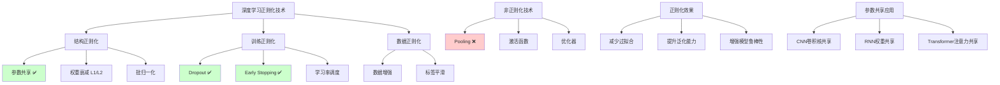

# HCIA-AI 题目分析 - 深度学习网络正则化技术

## 题目内容

**问题**: 在深度学习网络中，以下哪些技术是主要用来做网络正则化的提升模型泛化能力？

**选项**:
- A. 参数共享
- B. Pooling
- C. dropout
- D. Early stopping

## 选项分析表格

| 选项 | 内容 | 正确性 | 详细分析 | 知识点 |
|------|------|--------|----------|--------|
| A | 参数共享 | ✅ | 正确。参数共享是重要的正则化技术，通过减少模型参数数量来降低模型复杂度，防止过拟合。典型应用如CNN中的卷积核共享、RNN中的权重共享。 | 参数共享正则化 |
| B | Pooling | ❌ | 错误。池化层主要用于降维和特征提取，虽然能减少参数数量，但其主要目的不是正则化，而是减少计算量和提取空间不变性特征。 | 池化层功能 |
| C | dropout | ✅ | 正确。Dropout是经典的正则化技术，通过在训练过程中随机丢弃部分神经元，防止神经元之间过度依赖，有效减少过拟合。 | Dropout正则化 |
| D | Early stopping | ✅ | 正确。早停是重要的正则化策略，通过监控验证集性能，在模型开始过拟合前停止训练，防止模型在训练集上过度优化。 | 早停策略 |

## 正确答案
**答案**: ACD

**解题思路**: 
1. 理解正则化的目的：防止过拟合，提升泛化能力
2. 分析各技术的主要功能：
   - 参数共享：减少参数，降低复杂度
   - Pooling：降维和特征提取（非正则化）
   - Dropout：随机失活，防止过拟合
   - Early stopping：控制训练过程，防止过拟合
3. 区分主要功能和附带效果

## 概念图解

## 知识点总结

### 核心概念
- **正则化目标**: 防止过拟合，提升模型在未见数据上的表现
- **参数共享**: 通过权重复用减少模型参数，降低复杂度
- **Dropout**: 训练时随机失活神经元，测试时恢复全连接
- **Early Stopping**: 基于验证集性能的训练控制策略

### 相关技术
- **L1/L2正则化**: 在损失函数中添加权重惩罚项
- **批归一化**: 标准化层输入，稳定训练过程
- **数据增强**: 通过变换扩充训练数据
- **集成学习**: 组合多个模型提升泛化能力

### 记忆要点
- **正则化三类**: 结构、训练、数据正则化
- **Pooling误区**: 主要功能是降维，不是正则化
- **组合使用**: 多种正则化技术通常组合使用
- **验证重要性**: 通过验证集评估正则化效果

## 扩展学习

### 相关文档
- 《深度学习》第7章：深度学习中的正则化
- "Dropout: A Simple Way to Prevent Neural Networks from Overfitting"
- MindSpore正则化技术文档

### 实践应用
- **模型设计**: 在网络架构中集成正则化技术
- **超参调优**: 调整dropout率、权重衰减系数等
- **训练策略**: 实现early stopping和学习率调度
- **效果评估**: 通过验证集和测试集评估正则化效果