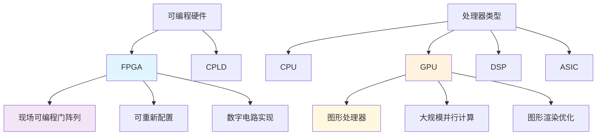

# HCIA-AI 题目分析 - FPGA概念判断

## 题目内容

**问题**: FPGA是图形处理器，是一种由大量运算单元组成的大规模并行计算架构，专为同时处理多重任务而设计。

**选项**:
- A. 正确
- B. 错误

## 选项分析表格

| 选项 | 内容 | 正确性 | 详细分析 | 知识点 |
|------|------|--------|----------|--------|
| A | 正确 | ❌ | FPGA不是图形处理器。FPGA(Field-Programmable Gate Array)是现场可编程门阵列，是一种可重新配置的数字电路芯片。题目中的描述实际上更符合GPU(Graphics Processing Unit)的特征。FPGA主要用于数字信号处理、通信、控制等领域，而不是专门用于图形处理。 | FPGA基本概念、硬件架构区分 |
| B | 错误 | ✅ | 正确答案。FPGA确实不是图形处理器。FPGA是现场可编程门阵列，是一种半定制化的可编程逻辑器件，可以通过编程来实现不同的数字电路功能。虽然FPGA也具有并行计算能力，但它与GPU在架构和应用领域上有本质区别。 | FPGA与GPU的区别、可编程逻辑器件 |

## 正确答案

**答案**: B

**解题思路**: 
1. 首先识别题目中的关键概念：FPGA、图形处理器、并行计算架构
2. 分析FPGA的真实定义：现场可编程门阵列(Field-Programmable Gate Array)
3. 对比FPGA与GPU的区别：
   - FPGA：可重新配置的数字电路，主要用于数字信号处理、通信等
   - GPU：图形处理器，专门用于图形渲染和并行计算
4. 判断题目描述是否准确：题目将FPGA描述为图形处理器是错误的

## 概念图解

## 知识点总结

### 核心概念
- **FPGA(Field-Programmable Gate Array)**: 现场可编程门阵列，是一种可重新配置的数字电路芯片
- **GPU(Graphics Processing Unit)**: 图形处理器，专门设计用于处理图形渲染和大规模并行计算
- **可编程逻辑器件**: 可以通过编程来改变其内部逻辑功能的集成电路

### 相关技术
- **华为昇腾芯片**: 华为自研的AI芯片，用于AI计算加速
- **FPGA在AI中的应用**: 可用于神经网络推理加速、边缘计算等场景
- **异构计算**: CPU+GPU+FPGA等不同处理器协同工作

### 记忆要点
- **区分口诀**: "FPGA是门阵列，GPU是图形牌"
- **应用领域**: FPGA主要用于通信、控制、信号处理；GPU主要用于图形、AI计算
- **可编程特性**: FPGA可以重新配置硬件逻辑，GPU主要通过软件编程
- **常见考试陷阱**: 不要将FPGA与GPU的特性混淆

## 扩展学习

### 相关文档
- 华为昇腾AI处理器技术白皮书
- FPGA在人工智能中的应用指南
- 异构计算平台架构设计

### 实践应用
- **边缘AI推理**: 使用FPGA进行低延迟AI推理
- **5G基站**: FPGA在5G信号处理中的应用
- **华为云FPGA实例**: 华为云提供的FPGA加速服务
- **ModelArts**: 华为AI开发平台中的硬件加速选项

### HCIA-AI考试要点
- 掌握FPGA、GPU、CPU、DSP等不同处理器的特点和应用场景
- 理解华为昇腾AI芯片的架构和优势
- 了解异构计算在AI训练和推理中的作用
- 熟悉华为AI平台中的硬件加速技术