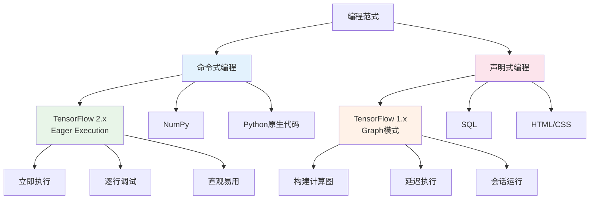

# HCIA-AI 题目分析 - TensorFlow 2.x Eager Execution模式

## 题目内容

**问题**: TensorFlow2.x框架中的Eager Execution模式是一种声明式编程(declarative programming)

**选项**:
- A. 正确
- B. 错误

## 选项分析表格

| 选项 | 内容 | 正确性 | 详细分析 | 知识点 |
|------|------|--------|----------|--------|
| A | 正确 | ❌ | Eager Execution模式实际上是**命令式编程(imperative programming)**，不是声明式编程。在Eager Execution模式下，操作会立即执行并返回具体值，这是典型的命令式编程特征。开发者可以逐行执行代码，立即看到结果，就像使用NumPy一样直观。 | Eager Execution特性、编程范式区分 |
| B | 错误 | ✅ | 正确答案。Eager Execution确实不是声明式编程。TensorFlow 2.x默认启用Eager Execution，这是一种命令式编程模式，操作会立即执行。与之相对的是TensorFlow 1.x的Graph模式，那才更接近声明式编程，需要先构建计算图，然后在会话中执行。 | TensorFlow版本差异、编程模式对比 |

## 正确答案
**答案**: B

**解题思路**: 
1. **理解Eager Execution的本质**：
   - Eager = 急切的、立即的
   - 操作立即执行并返回具体值
   - 无需构建计算图，无需会话

2. **区分编程范式**：
   - **命令式编程(Imperative)**：告诉计算机"如何做"，逐步执行
   - **声明式编程(Declarative)**：告诉计算机"做什么"，描述期望结果

3. **TensorFlow模式对比**：
   - **TensorFlow 1.x Graph模式**：声明式，先定义计算图，后执行
   - **TensorFlow 2.x Eager模式**：命令式，立即执行

## 概念图解



## 知识点总结

### 核心概念
- **Eager Execution**: TensorFlow 2.x的默认执行模式，属于命令式编程
- **命令式编程**: 描述"如何做"，操作立即执行，结果立即可见
- **声明式编程**: 描述"做什么"，先定义后执行，如TensorFlow 1.x的Graph模式

### TensorFlow版本对比
- **TensorFlow 1.x**: 默认Graph模式，声明式编程，需要会话执行
- **TensorFlow 2.x**: 默认Eager模式，命令式编程，立即执行
- **华为MindSpore**: 支持动态图(类似Eager)和静态图模式

### 记忆要点
- **记忆口诀**: "Eager急切立即执行，命令式编程很直观"
- **对比记忆**: Eager vs Graph = 命令式 vs 声明式 = 立即执行 vs 延迟执行
- **实际体验**: Eager模式就像写普通Python代码，Graph模式需要先"画图"再"执行"
- **常见考试陷阱**: 不要被"声明式"这个高大上的词汇迷惑

## 代码示例对比

### TensorFlow 2.x Eager模式 (命令式)
```python
import tensorflow as tf

# 立即执行，立即得到结果
a = tf.constant([1, 2, 3])
b = tf.constant([4, 5, 6])
c = a + b
print(c)  # 立即输出: tf.Tensor([5 7 9], shape=(3,), dtype=int32)
```

### TensorFlow 1.x Graph模式 (声明式)
```python
import tensorflow as tf

# 先声明计算图
a = tf.placeholder(tf.int32, shape=[3])
b = tf.placeholder(tf.int32, shape=[3])
c = a + b

# 后执行计算图
with tf.Session() as sess:
    result = sess.run(c, feed_dict={a: [1,2,3], b: [4,5,6]})
    print(result)  # 输出: [5 7 9]
```

## 扩展学习

### 相关文档
- TensorFlow 2.x官方文档 - Eager Execution指南
- 华为MindSpore动态图与静态图对比
- 深度学习框架编程范式比较

### 实践应用
- **模型调试**: Eager模式便于逐行调试和验证
- **快速原型**: 适合快速实验和模型开发
- **教学演示**: 更直观，适合AI教育和培训
- **华为ModelArts**: 支持TensorFlow 2.x的Eager模式开发

### HCIA-AI考试要点
- 掌握TensorFlow 1.x与2.x的核心差异
- 理解命令式编程与声明式编程的区别
- 熟悉华为MindSpore的动态图和静态图模式
- 了解不同深度学习框架的编程范式特点
- 掌握Eager Execution在模型开发中的优势和应用场景