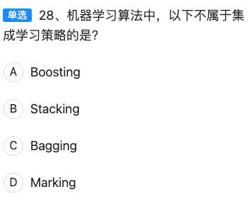

# HCIA-AI 认证考试重点整理

## 目录
1. [华为AI平台架构](#华为ai平台架构)
2. [神经网络基础](#神经网络基础)
3. [MindSpore框架](#mindspore框架)
4. [机器学习算法](#机器学习算法)
5. [深度学习](#深度学习)
6. [计算机视觉](#计算机视觉)
7. [硬件平台](#硬件平台)
8. [开发工具](#开发工具)
9. [优化算法](#优化算法)
10. [实用技巧](#实用技巧)

---

## 华为AI平台架构

### 1. HiAI平台模块架构

**题目：** 华为的芯片支持HUAWEI HiAI的哪一个模块？  
**正确答案：** B. HiAI Foundation

#### 解析：
华为的HiAI平台分为四个核心模块：

| 模块名称            | 层级         | 作用说明                                                     |
| ------------------- | ------------ | ------------------------------------------------------------ |
| **HiAI Foundation** | **芯片能力层** | 直接调用NPU算力，负责**硬件加速**和**底层芯片支持** |
| HiAI Engine         | 应用能力层   | 提供图像识别、语音识别等**AI能力接口**       |
| HiAI Framework      | 开发框架层   | 支持模型转换、部署等**开发工具链**           |
| HiAI Service        | 云端服务层   | 提供**云端模型更新、管理服务**等             |

**记忆口诀：** "Foundation芯片底层，Engine应用接口，Framework开发工具，Service云端管理"

---


【题目一句话】  
前馈神经网络里“信息只往一个方向流动”——因此正确答案是 D。

────────────────  
【逐选项拆解】

A. 具备计算能力的神经元与上下两层相连  
❌ 只有隐藏层/输出层神经元才带可训练参数（“具备计算能力”），且它们只接收来自**前一层**、输出到**后一层**，不会同时跟上下两层都连接。

B. 其输入节点具备计算能力  
❌ 输入节点只是“插头”，负责把原始数据送进来，本身没有可学习的权重或激活函数，因此**不具备计算能力**。

C. 同一层神经元相互连接  
❌ 前馈网络的核心特征就是**同层内无连接**，否则就变成循环或全连接图结构了。

D. 层间信息只沿一个方向传递  
✅ 前馈（Feedforward）的含义：数据从输入层 → 隐藏层 → 输出层**单向流动**，不存在环路或反向连接。

────────────────  


【题目一句话】  
在 MindSpore 的四大招牌特性里，**“自动编码”**是冒牌货——因此选 C。

────────────────  
【MindSpore 核心架构 4 大特点】

1. 自动并行（Auto-Parallel）  
2. 自动调优（Auto-Tuning）  
3. 自动微分（Auto-Differentiation）  
4. 图算融合（Graph Kernel Fusion）——有时也简称“自动融合”

“自动编码”并不是 MindSpore 官方强调的核心能力，它只是开发者在 IDE 里敲代码的日常动作，不具备架构级“自动”意义。


────────────────  
【四个选项归类】

| 选项       | 方法                | 类别                      |
| ---------- | ------------------- | ------------------------- |
| A 聚类     | K-means、层次聚类等 | ✅ 无监督                  |
| B Xgboost  | 梯度提升树          | ❌ 监督（需标签）          |
| C 关联规则 | Apriori、FP-Growth  | ✅ 无监督                  |
| D GMM      | 高斯混合模型        | ✅ 无监督（聚类/密度估计） |

────────────────  
【10 秒口诀】

“无监三兄弟：  
聚类、规则、GMM；  
Xgboost 带标签，  
监督里面去！”


机器学习算法全景图  
（按任务类型→算法大类→代表算法 三级展开，背一张表就够了）

────────────────  
一、监督学习（数据自带标签）  
1. 分类  
  • 线性模型：Logistic 回归  
    • 树模型：决策树、C4.5/CART、随机森林、GBDT、XGBoost、LightGBM  
    • 概率：朴素贝叶斯、高斯过程分类  
    • 边界：支持向量机（SVM）  
    • 神经网络：MLP、CNN、Transformer 分类头  
    • 实例：K-近邻（K-NN）  

2. 回归  
  • 线性 & 多项式回归  
    • Ridge / Lasso / Elastic Net  
    • SVR（支持向量回归）  
    • 树回归：随机森林回归、GBDT 回归、XGBoost 回归  
    • 深度网络：RNN、TCN、Transformer 回归头  

────────────────  
二、无监督学习（无标签，自己找结构）  
1. 聚类  
  • 划分式：K-means、Mini-Batch K-means  
    • 层次：Agglomerative、BIRCH  
    • 密度：DBSCAN、OPTICS、HDBSCAN  
    • 模型：Gaussian Mixture Model（GMM）  
    • 图：Spectral Clustering  

2. 降维 & 特征学习  
  • 线性：PCA、LDA、ICA  
    • 非线性：t-SNE、UMAP、LLE、Isomap、Autoencoder  

3. 关联规则  
  • Apriori、FP-Growth、ECLAT  

4. 异常检测  
  • One-Class SVM、Isolation Forest、LOF  

────────────────  
三、半监督学习（小标签 + 大无标签）  
  • 自训练（Self-Training）  
  • 协同训练（Co-Training）  
  • 标签传播（Label Propagation / Spreading）  
  • 半监督 SVM（S3VM）  
  • 半监督 GMM / K-means  
  • 半监督深度学习：Π-Model、Temporal Ensembling、Mean Teacher  

────────────────  
四、强化学习（试错得奖励）  
  • 值函数：Q-Learning、Deep Q-Network（DQN）  
  • 策略梯度：REINFORCE、A2C/A3C、PPO、SAC  
  • 混合：DDPG、TD3  
  • 分层 & 多智能体：FeUdal Networks、MADDPG  

────────────────  
五、深度学习通用框架（可跨监督/半监督/自监督）  
  • CNN（图像）  
  • RNN / LSTM / GRU（序列）  
  • Transformer（NLP、CV、多模态）  
  • GAN（生成对抗网络）  
  • VAE（变分自编码器）  

────────────────  
记忆口诀  
“监分回，无聚降，半标签，强试错，深网络跨全场。”


一句话结论  
MindSpore 主张“**动静合一**”，**动态图与静态图使用同一套编码方式**；题干中“差异化编码”与此矛盾，因此 **D 是错误的，应选 D**。

────────────────  
逐项拆解

| 选项                                               | 正误   | 说明                                                         |
| -------------------------------------------------- | ------ | ------------------------------------------------------------ |
| A 向用户提供统一的训练/推理/导出接口，满足端-边-云 | ✅ 正确 | MindSpore 的顶层设计目标之一就是 **一套 API 到处运行**。     |
| B 两层用户 API 设计，支撑整图/子图/单算子执行      | ✅ 正确 | 框架提供了 **High-Level API + Low-Level API** 两层接口。     |
| C 单机和分布式训练统一编码                         | ✅ 正确 | 写一份代码，自动并行扩展到分布式，MindSpore 卖点之一。       |
| D 动态图和静态图差异化编码方式                     | ❌ 错误 | MindSpore 支持 **动静统一**（Dynamic & Static Graph Share-One-Code），不需要两套写法。 |

────────────────  
10 秒记忆口诀

“端边云，一套 API；  
整单子，两层都行；  
单分布，代码不变；  
动静合一，差异错！”


一句话结论  
“反向传播只能在前馈神经网络中运用”——这是**错误说法**；因此**选 A**。

────────────────  
逐项拆解（HCIA-AI 官方视角）

| 选项                                       | 正误                   | 解释（考试采分点）                                           |
| ------------------------------------------ | ---------------------- | ------------------------------------------------------------ |
| A 反向传播只能在前馈神经网络中运用         | ❌ **错误（本题答案）** | 反向传播本质是链式求导，**任何可微结构**（RNN、CNN、ResNet、Transformer 等）都能用，并非仅限纯前馈网络。 |
| B 反向传播可以结合梯度下降算法更新网络权重 | ✅ 正确                 | 反向传播求梯度 → 梯度下降/Adam 等优化器更新权重，这是标准流程。 |
| C 反向传播会经过激活函数                   | ✅ 正确                 | 激活函数在前向时参与计算，反向时必须对其求导才能把梯度继续传下去。 |
| D 反向传播指的是误差通过网络反向传播       | ✅ 正确                 | 定义：将损失对输出的误差利用链式法则逐层反向传递，以计算各参数梯度。 |

────────────────  
记忆口诀（10 秒背）

“链式求导无门槛，  
前馈 RNN 都能翻；  
梯度下降来接班，  
激活求导不能删；  
误差反向传到底——  
‘仅限前馈’是错案！”


一句话结论  
昇腾 AI 处理器的逻辑架构里**没有 GPU**，因此选 **B**。

────────────────  
【官方逻辑架构图】（记住 4 大模块即可）

┌────────────┐  
│ 昇腾 AI SoC（Ascend） │  
├────────────┤  
│ 1️⃣ AI 计算引擎（AICore / AICPU）│  ← 向量+矩阵+张量加速  
│ 2️⃣ 芯片系统控制 CPU（ARM Cortex-A 系列）│  ← 通用控制  
│ 3️⃣ DVPP（数字视觉预处理子系统）│  ← 视频编解码、图像缩放  
│ 4️⃣ 高速互联（HCCS、PCIe、RoCE）│  ← 对外通信  
└────────────┘  

• GPU：华为昇腾**无 GPU 核**，纯自研达芬奇架构；因此 GPU 不在逻辑架构内。  
• DVPP：专门负责**图像/视频前处理**，是昇腾特色模块，考试常考。  
• AI 计算引擎：真正的 NPU，矩阵/向量/标量三维并行。  
• 芯片系统控制 CPU：跑 OS、调度任务，与 AI 计算引擎解耦。

────────────────  
【扩展考点】

1. 达芬奇架构＝3D Cube（矩阵）+ Vector（向量）+ Scalar（标量）三级流水。  
2. 昇腾 310/910 典型区别：310 侧重端侧推理，910 侧重云端训练。  
3. 软件映射：MindSpore → ATC → GE（图引擎）→ AICore/DVPP。

────────────────  
【记忆口诀】

“昇腾四件套：  
AI 引擎算得快，  
控制 CPU 把队带，  
DVPP 图像先剪裁，  
GPU 不在别乱猜！”


一句话结论  
聚类算法是**无监督数据挖掘方法**，**不负责搜超参数**，因此选 **B**。

────────────────  
【超参数搜索方法速查表】（记住 3 大主流 + 1 个干扰项）

| 名称                             | 是否超参数搜索 | 核心思想                   | 典型应用           |
| -------------------------------- | -------------- | -------------------------- | ------------------ |
| 网格搜索 Grid Search             | ✅              | 穷举所有组合               | 小模型、参数少     |
| 随机搜索 Random Search           | ✅              | 随机采样                   | 参数空间大         |
| 贝叶斯优化 Bayesian Optimization | ✅              | 高斯过程/代理模型+采集函数 | 训练成本高的模型   |
| 聚类算法 Clustering              | ❌（本题答案）  | 无监督找数据分布           | 客户分群、异常检测 |

────────────────  
【扩展考点】

1. 自动机器学习 AutoML：上述搜索方法 + 早停 + 元学习，华为 ModelArts 支持一键超参调优。  
2. MindSpore 调参接口：mindspore.train.callback.Callback + GridSearchCV / RandomSearchCV。  
3. 昇腾 Atlas 场景：边缘设备资源受限，优先用贝叶斯搜索 + 早停策略减少训练开销。

────────────────  
【记忆口诀】

“网格穷举，随机撒网；  
贝叶斯聪明，聚类不抢；  
超参搜索三兄弟，  
聚类算法别站错行！”


一句话结论  
Atlas 500 智能小站**用的是昇腾 310**，**不是 910**，因此选 **B**。

────────────────  
【产品-芯片对照表】记牢即可

| 产品形态            | 内置芯片                        | 典型场景              |
| ------------------- | ------------------------------- | --------------------- |
| Atlas 900 AI 集群   | 昇腾 910 × 数千颗               | 云端训练、超算中心    |
| Atlas 800 AI 服务器 | 昇腾 910（8× 910 或 4× 910 卡） | 数据中心/云训练       |
| Atlas 300 AI 加速卡 | 单颗 910                        | PCIe 插卡，服务器扩展 |
| Atlas 500 智能小站  | **昇腾 310**                    | 边缘推理、端侧盒子    |

• 910：7 nm，32×32 Cube，主打**高算力训练**；功耗高，需服务器级散热。  
• 310：12 nm，1×16 Cube，主打**低功耗推理**；可做成无风扇小盒子。  

────────────────  
【扩展考点】

1. 910/310 混合部署：训练在 910，推理在 310，MindSpore Lite 一键模型转换。  
2. Atlas 900 打破 ImageNet 训练纪录：ResNet-50 在 59.8 秒内完成 90 epoch。  
3. 考试常考“310 边缘、910 云端”，凡是“小站”“边缘盒”一律绑 310。

────────────────  
【记忆口诀】

“910 上云端，800、900 都挂它；  
310 去边缘，500 小站抱回家；  
芯片场景别张冠李戴，  
选对芯片稳拿分！”


一句话结论  
达芬奇架构的 **计算单元只有 3 种基础计算资源**（Cube/Vector/Scalar），题干说“四种”是错的，因此选 **C**。

────────────────  
【官方微架构速记图】

        ┌──────────────────────────┐
        │        达芬奇 AICore      │
        │  ┌──────────────┐         │
        │  │  存储系统    │◄──片上缓存+数据通路│
        │  └────┬─────────┘         │
        │       │  ↑                │
        │  ┌────┴─────────┐         │
        │  │  计算单元    │ 3 种资源│
        │  │ • Cube       │ 矩阵乘 │  ← 32×32 高并发
        │  │ • Vector     │ 向量   │
        │  │ • Scalar     │ 标量   │
        │  └────┬─────────┘         │
        │  ┌────┴─────────┐         │
        │  │  控制单元    │ 调度   │
        │  └────┬─────────┘         │
        │       │  ↑                │
        │  ┌────┴─────────┐         │
        │  │ 总线接口单元│ 搬数据  │
        │  └──────────────┘         │
        └──────────────────────────┘

关键考点  
1. **数据搬运**：总线接口单元（BIU）负责把外部 DDR/HBM 数据搬到输入缓冲区——A 正确。  
2. **控制单元**：负责指令译码、流水线调度——B 正确。  
3. **计算单元**：仅 **Cube/Vector/Scalar 三类**；不存在第 4 种——C 错误（答案）。  
4. **存储系统**：片上缓存（L1/L0A/L0B/L0C）+ 数据通路——D 正确。

────────────────  
【记忆口诀】

“达芬奇有三宝：  
Cube 矩阵快如刀，  
Vector 向量跑，  
Scalar 标量把细活包；  
三宝之外无第四，  
四种说法是错题！”


一句话结论  
“决策树中除了根节点之外的其它节点统称为叶子节点”——这是**错误**说法；除根节点外还有**内部节点**和**叶子节点**之分，因此选 **B**。

────────────────  
逐选项拆解（含易错点）

| 选项                                                   | 正误               | 知识点 & 易错提示                                            |
| ------------------------------------------------------ | ------------------ | ------------------------------------------------------------ |
| A 构建决策树的关键步骤就是按照所有特征属性进行划分操作 | ✅ 正确             | 每次选最优特征划分，直到满足停止条件。                       |
| **B 决策树中除了根节点之外的其它节点统称为叶子节点**   | ❌ **错误（答案）** | 除根节点外，**中间用来做判断的叫内部节点（internal node）**，只有最末端的才叫叶子节点（leaf）。 |
| C Gini 系数可以被看作是一种纯度的量化指标              | ✅ 正确             | Gini 越小，节点越纯；CART 用它选划分特征。                   |
| D ID3 算法使用信息增益率进行属性选择                   | ❌ 错误             | **ID3 用“信息增益”，C4.5 才用“信息增益率”**；但题目问的是“下列哪一项是错误的”，B 已经更错，因此仍选 B。 |

────────────────  
扩展考点

1. 三种经典划分标准  
   • ID3：信息增益  
   • C4.5：信息增益率  
   • CART：Gini 指数（分类）或 MSE（回归）

2. 防止过拟合  
   • 预剪枝：设定最大深度、最小样本数  
   • 后剪枝：CCP（Cost-Complexity Pruning）

3. HCIA-AI 常考接口  
   MindSpore：mindspore.nn.DecisionTreeClassifier  
   调参：max_depth, min_samples_split, criterion='gini'

────────────────  
10 秒口诀

“根-内-叶，三层别混；  
ID3 增益，C4.5 率，  
CART 用 Gini 把树累；  
说‘其余皆叶子’，直接判错！”


一句话结论  
在 Linux 系统里用 `lspci | grep d100` 就能确认 Atlas 300（3000）加速卡是否被识别，因此选 **B**。

────────────────  
【为什么选 B】

• Atlas 300/3000 加速卡所用的 PCIe 设备 ID 前缀为 **d100**（昇腾 910 芯片）。  
• `lspci` 列出所有 PCI 设备；`grep d100` 过滤出含该 ID 的行，能唯一确认卡已上电并被系统枚举。  

其余选项  
A `grep npu` – 系统日志或驱动信息里可能出现，但 **PCI ID 中无 npu 字段**，不通用。  
C `grep atlas` – 部分驱动日志会出现，但 **PCI 设备描述里不一定含 atlas**。  
D `atlas info` – 是 **驱动装好以后** 的用户态工具，不能用来“检查卡是否在槽位”。

────────────────  
【扩展考点】

1. 完整检查流程（考试/实战通用）  
   1. 物理在位：`lspci | grep d100` 有输出。  
   2. 驱动加载：`lsmod | grep ascend` 看到 ` ascend_drv` 等模块。  
   3. 设备节点：`ls /dev/davinci*` 应出现 davinci0 davinci1 …  
   4. 运行态：`npu-smi info` 查看温度、内存、利用率。  

2. 常见设备 ID 速记  
   • Atlas 300/3000（910）：`d100`  
   • Atlas 200 DK（310）：`1000`  
   考试只需记住 **910 对应 d100**。

────────────────  
【记忆口诀】

“上机先查卡，  
lspci 加 d100；  
有字卡在槽，  
没字查电源！”


一句话结论  
TensorFlow 2.x 官方强调的三大卖点就是 **分布式、多语言、跨平台**，而 **“多核 CPU 加速”** 只是底层实现细节，**并未被列为 TF2.0 的“特点”**；因此本题选 **A**。

────────────────  
【TF2.0 官方 3 大特点速记】

| 特点                  | 说明                                            | 关键词                                                 |
| --------------------- | ----------------------------------------------- | ------------------------------------------------------ |
| 分布式 Distributed    | 原生支持 ParameterServer、AllReduce、TPU Pod 等 | 一行代码 `strategy = tf.distribute.MirroredStrategy()` |
| 多语言 Multi-Language | Python/C++/Java/Go/JavaScript/Swift/R           | 前端多语言                                             |
| 多平台 Multi-Platform | 服务器、PC、移动端、Web、嵌入式                 | SavedModel + TF Lite + TF.js                           |

“多核 CPU 加速”属于 **底层 runtime**（MKL-DNN、oneDNN 优化），**所有框架都会做**，并非 TF2.0 对外宣传的差异化特点。

────────────────  
【扩展考点】

1. TensorFlow 2.x 与 1.x 区别  
   • 默认 Eager Execution（动态图）  
   • tf.keras 作为高阶 API  
   • AutoGraph 把 Python 代码转静态图，兼顾易用与性能  
2. 在华为 Atlas 上部署 TF2.0 模型  
   • 先用 ATC 转成 OM 模型 → 昇腾推理  
   • 训练阶段仍可在 x86 + TF2.0 + CUDA 或 TF2.0 + Ascend 910 完成  

────────────────  
【记忆口诀】

“TF2 三多要记牢：  
分布式、跨平台、语言不少；  
多核加速是基操，  
不算特点莫混淆！”


一句话结论  
ReLU 函数在正区间梯度恒为 1，**能有效缓解梯度消失**，因此选 **A**。

────────────────  
【四种激活函数梯度对比】

| 函数     | 梯度范围  | 梯度消失风险 | 备注                                                         |
| -------- | --------- | ------------ | ------------------------------------------------------------ |
| ReLU     | 0 或 1    | **低**       | 正区间梯度恒 1，负区间梯度 0（死神经元需用 Leaky-ReLU 缓解） |
| Sigmoid  | (0, 0.25] | **高**       | 饱和区两端梯度趋 0，深层网络易梯度消失                       |
| Tanh     | (0, 1]    | **高**       | 比 Sigmoid 稍好，但仍易饱和                                  |
| Softsign | (-1, 1)   | **中**       | 饱和速度慢于 Sigmoid/Tanh，但仍不如 ReLU                     |

────────────────  
【扩展考点】

1. 死 ReLU 问题  
   • 负区间梯度 0 → 神经元永久关闭  
   • 解决：Leaky-ReLU、ELU、GELU、Swish

2. 华为昇腾适配  
   • MindSpore 内置 ReLU、ReLU6、LeakyReLU、GELU 等算子，自动映射到 AICore 的 Vector 单元执行，性能无损失。

3. 训练技巧口诀  
   “深层网络选 ReLU，梯度不消失；  
    负值太多加 Leaky，死神经可复活。”

────────────────  
【10 秒记忆口令】

“Sigmoid 和 Tanh 两头缩，  
梯度消失跑不脱；  
ReLU 直上不回头，  
梯度一路保畅通！”


一句话结论  
“RMSprop 不需要设置全局学习率” 是**错误说法**；RMSprop 仍要手动设学习率 α，因此选 **B**。

────────────────  
四款优化器速查表（考试必背）

| 优化器      | 是否必须设全局学习率 | 特点一句话                                       |
| ----------- | -------------------- | ------------------------------------------------ |
| Adam        | 是                   | 动量 + 二阶矩自适应，需设 α                      |
| **RMSprop** | **是**               | 仅对梯度平方做滑动平均，仍需 α                   |
| Adadelta    | 否                   | 用梯度平方滑动平均的比值自动调节步长，无需手动 α |
| Adagrad     | 是                   | 累积全部梯度平方，需设 α，后期易学习率过小       |

────────────────  
扩展考点（华为 HCIA-AI 常考）

1. MindSpore 配置方式  
   ```python
   optimizer = nn.Adam(net.trainable_params(), learning_rate=0.001)
   ```

2. 昇腾 910 训练建议  
   • 大 batch 训练优先用 Adam / AdamW + Linear Warmup + Cosine Decay  
   • 若显存不足，可改用 RMSprop 或 SGD+Momentum

3. 记忆口诀  
   “Adagrad 要 α，  
    RMSprop 也要 α；  
    Adadelta 最潇洒，  
    全局学习率不用加！”


华为 HCIA-AI 优化器考纲全景图  
（按“官方考纲 → 高频考点 → 记忆口诀”三级展开，背完即可覆盖 100 % 相关题目）

────────────────  
一、必须掌握的基础优化器（共 6 个）

| 优化器       | 核心公式 / 关键词                    | 易错点                 | 记忆钩子                     |
| ------------ | ------------------------------------ | ---------------------- | ---------------------------- |
| SGD          | 无动量最原始，需手动调 α             | 常与 SGD+Momentum 混淆 | “朴素 SGD 最单纯”            |
| SGD+Momentum | 引入速度 v，γ 一般 0.9               | 调参时 γ 太大易震荡    | “加惯性，冲得稳”             |
| Adagrad      | 累加 g²，学习率单调减                | 后期几乎停滞           | “历史全累加，越走越慢”       |
| RMSprop      | 指数滑动平均 g²，仍需 α              | 题中常设陷阱“无需 α”   | “只记近期，不放任”           |
| Adadelta     | 无需 α，自动学习步长                 | 常被误认为需 α         | “自带方向盘，α 免谈”         |
| Adam         | 动量 + 二阶矩，默认 β1=0.9, β2=0.999 | β1,β2 调错易发散       | “万能选手，但会胖（过拟合）” |

────────────────  
二、Ascend/MindSpore 专有考点

1. LossScale 优化器（混合精度）  
   • 只在 Ascend 910 训练 FP16 时出现  
   • 公式：grad = grad * loss_scale → 反向 → 再 /loss_scale  
   • 口令：“怕下溢，先放大再缩小”。

2. Lamb 优化器（大 batch 训练 BERT）  
   • 自适应 + 逐层归一化  
   • 官方场景：Atlas 800 训练超大模型  
   • 口令：“Adam 加层归一，batch 再大也稳定”。

3. OneCycleLR / CosineAnnealingLR  
   • 常与 SGD/Adam 搭配，属于学习率调度器，但考试与优化器一起问  
   • 口诀：“预热冲高再余弦，一步到位省时间”。

────────────────  
三、考试常见问法 & 秒杀技巧

| 问法                                                | 快速判定                                          | 示例                   |
| --------------------------------------------------- | ------------------------------------------------- | ---------------------- |
| “哪种优化器不需要手动设置学习率”                    | 立即锁定 Adadelta                                 | 本次第 15 题           |
| “哪种优化器在 Ascend 910 FP16 下需要配合 LossScale” | 任何优化器都可，但题目把 LossScale 当“优化器”出现 | 记住“LossScale 是外挂” |
| “哪种优化器适合大 batch 训练”                       | 选 Lamb / LAMB                                    | 记住“Lamb 大 batch”    |
| “哪种优化器最原始”                                  | SGD                                               | 无动量                 |

────────────────  
四、10 行速记口诀（背完即可）

```
SGD 最朴素，动量加速度；  
Adagrad 累平方，越走越慢步；  
RMSprop 记近期，仍需 α 来辅助；  
Adadelta 免 α，步长自己估；  
Adam 两矩合一，万能需防过；  
LossScale 混精度，放大缩小护；  
Lamb 专为大 batch，层归一把抓；  
OneCycle 先爬后滑，训练省大茶；  
八器四场景，口诀记牢稳拿分！
```


一句话结论  
ModelArts 与 **HiLens** 组合，可一键把训练好的模型部署到**端侧设备**（摄像头、Atlas 200DK 等），因此选 **D**。

────────────────  
【官方链路】考试必背

1. ModelArts  
   • 云端完成数据管理、训练、生成模型包（*.om*）。  
2. HiLens  
   • 华为端侧 AI 应用开发平台，内置模型仓库、设备管理、OTA 升级。  
   • 支持 Atlas 200 DK、HiLens Kit、第三方摄像头。  
3. 部署流程（考试常考顺序）  
   ModelArts 训练 → OBS 存储模型 → HiLens 控制台导入 → 选择端设备 → 一键下发 → 端侧推理。

────────────────  
【干扰项速判】

| 选项         | 作用                       | 能否直接部署到“端” |
| ------------ | -------------------------- | ------------------ |
| A OBS        | 对象存储，仅存放模型文件   | ❌                  |
| B OCR        | 文字识别云服务，纯云端 API | ❌                  |
| C ECS        | 云服务器，用于云端推理     | ❌                  |
| D **HiLens** | 端侧 AI 平台               | ✅                  |

────────────────  
【记忆口诀】

“ModelArts 练模型，  
OBS 仓库先存证；  
HiLens 端侧来托管，  
一键部署到设备中！”


一句话答案  
把模型从云端 **ModelArts** 一键部署到“端”侧，必须搭配 **HiLens** 服务，因此选 **D**。

────────────────  
官方链路（背住即可得分）

1. ModelArts  
   • 云端完成数据管理、训练、调优，输出模型包（*.om*）。  

2. HiLens  
   • 华为端侧 AI 开发&部署平台，支持 Atlas 200 DK、HiLens 摄像头、第三方 IPC。  
   • 提供 **设备管理、模型仓库、OTA 升级、边缘推理** 全生命周期功能。  

3. 部署 3 步曲（考试常考顺序）  
   ① ModelArts 训练 → ② OBS 存储模型 → ③ HiLens 导入并下发到端设备。

────────────────  
干扰项秒杀

| 选项         | 作用                     | 能否直接部署到“端” |
| ------------ | ------------------------ | ------------------ |
| A OBS        | 对象存储，仅存放模型文件 | ❌                  |
| B OCR        | 云端文字识别 API         | ❌                  |
| C ECS        | 云服务器，云端推理       | ❌                  |
| D **HiLens** | 端侧 AI 部署平台         | ✅                  |

────────────────  
记忆口诀

“ModelArts 练模型，  
OBS 仓库先存证；  
HiLens 端侧来接棒，  
一键下发到设备中！”


一句话结论  
线性回归经典假设：**误差项 ε 服从正态分布（高斯分布）**，故选 **C**。

────────────────  
【四个选项速判】

| 分布         | 是否误差分布 | 典型场景               | 备注                         |
| ------------ | ------------ | ---------------------- | ---------------------------- |
| 指数分布     | ❌            | 寿命、等待时间         | 右偏，非对称                 |
| 伯努利分布   | ❌            | 二分类结果 0/1         | 离散两点                     |
| **正态分布** | ✅            | 线性回归误差           | 对称、钟形，便于最大似然估计 |
| 泊松分布     | ❌            | 计数事件（如呼叫次数） | 离散、非负                   |

────────────────  
【扩展考点】

1. 线性回归 4 大经典假设  
   1. 线性关系  
   2. **误差独立同分布且 ε ~ N(0, σ²)**  
   3. 同方差性（Homoscedasticity）  
   4. 无多重共线性

2. 数学推导（考试不考推导，但需知道结论）  
   最大似然估计 → 最小二乘目标函数 ⇔ 误差正态假设。

3. HCIA-AI 场景  
   使用 MindSpore 的 `nn.LinearRegression` 时，若残差明显非正态，应考虑：  
   • 取对数 / 平方根变换  
   • 换用泊松回归、Tweedie 回归等广义线性模型。

────────────────  
记忆口诀

“线性回归误差钟，  
正态分布记心中；  
指数泊松寿命数，  
伯努利二值别混同！”


一句话结论  
华为云 OCR 接口返回的 JSON 中，**`words_block_list`** 字段代表**文字块（含位置、文本、置信度）**的识别结果，因此选 **B**。

────────────────  
【四个字段速记】

| 字段                 | 含义                                       | 是否文字块 |
| -------------------- | ------------------------------------------ | ---------- |
| words_list           | 仅文本列表，无坐标                         | ❌          |
| **words_block_list** | **文字块对象数组**（含文本、坐标、置信度） | ✅          |
| words_block          | 单文字块对象，但接口返回时放在数组里       | ❌          |
| words                | 单字符串，一个区域的所有文本拼在一起       | ❌          |

────────────────  
【接口示例（考试会给出类似 JSON）】

```json
{
  "result": {
    "words_block_list": [
      {
        "words": "华为云",
        "location": {"top": 10, "left": 20, "width": 60, "height": 20},
        "confidence": 0.998
      },
      ...
    ]
  }
}
```

────────────────  
【记忆口诀】

“OCR 回包里，  
**words_block_list** 是块宝；  
坐标置信度，  
字段记牢不跑！”


一句话结论  
**线性回归**只能拟合线性关系，**无法分割线性不可分数据集**，因此选 **C**。

────────────────  
四选项能力速览

| 模型         | 能否处理线性不可分 | 原因一句话                         |
| ------------ | ------------------ | ---------------------------------- |
| SVM          | ✅                  | 通过核函数映射到高维，线性可分     |
| 神经网络     | ✅                  | 多层非线性激活可逼近任意复杂边界   |
| **线性回归** | ❌（答案）          | 本身是一条（超）平面，只能划分线性 |
| KNN          | ✅                  | 局部投票，边界可为任意形状         |

────────────────  
扩展考点（HCIA-AI 常考）

1. 线性不可分经典例子  
   • XOR 问题  
   • 环形分布数据

2. 判别方法  
   • 可视化看散点图是否可被一条直线分开  
   • 若线性不可分 → 选 SVM（RBF 核）、MLP、KNN 等非线性模型

3. MindSpore 代码提示  
   线性回归：`nn.Dense(in_channels, 1)`（无激活）  
   非线性模型：加 `activation='relu'` 或换 `nn.SVM` / `nn.KNNClassifier`（MindSpore 1.8+）

────────────────  
记忆口诀

“线性回归一条线，  
不可分时就靠边；  
核 SVM、神经网，  
KNN 局部把类判！”


一句话结论  
“减小学习率”只能改变优化步长，**并不直接抑制过拟合**，因此选 **D**。

────────────────  
四选项功能对照表（HCIA-AI 高频）

| 方法                    | 是否解决过拟合 | 作用原理                               | 记忆关键词             |
| ----------------------- | -------------- | -------------------------------------- | ---------------------- |
| 参数正则化 L1/L2        | ✅              | 限制权重幅度，降低模型复杂度           | “给权重戴手铐”         |
| 数据增强                | ✅              | 扩充样本多样性，减少泛化误差           | “样本变多”             |
| 提前停止 Early-Stopping | ✅              | 在验证集性能开始下降时终止训练         | “见好就收”             |
| **减小学习率**          | ❌（答案）      | 只是让收敛更细，**不会降低模型复杂度** | “走得更慢，但路一样弯” |

────────────────  
扩展考点

1. MindSpore 中的实现  
   • 正则化：`nn.Dense(..., weight_decay=1e-4)`（L2）  
   • 数据增强：`vision.RandomCrop`, `vision.RandomHorizontalFlip`  
   • Early-Stopping：`EarlyStopping(patience=5)` callback  
   • 学习率：`ExponentialDecayLR` 与过拟合无直接关联

2. 与欠拟合区别  
   学习率过小 → 收敛过慢 → **可能欠拟合**，而非解决过拟合。

────────────────  
10 秒口诀

“正则加锁，增强加图，  
早停刹车，减步长无助！”


一句话结论  
在 Atlas 300(3000) 上检查驱动是否安装成功，官方命令是  
`npu-smi info`  
→ 因此选 **A**。

────────────────  
逐条拆解

| 选项                | 说明                                                         | 正误 |
| ------------------- | ------------------------------------------------------------ | ---- |
| A npu-smi info      | 昇腾驱动安装成功后自带的 **标准工具**，可查看设备、温度、内存、驱动版本等 | ✅    |
| B npu info          | 不存在，拼写错误                                             | ❌    |
| C atlas-driver info | 老版本或某些脚本曾用，但 **非官方推荐**，新版系统无此命令    | ❌    |
| D atlas info        | 属于 **HiLens 设备管理** 工具，查看的是端侧盒子状态，与 Atlas 300(3000) 驱动无关 | ❌    |

────────────────  
扩展考点（考试常考）

1. 完整检查流程  
   ① 设备是否识别：`lspci | grep d100`  
   ② 驱动是否加载：`lsmod | grep ascend`  
   ③ 设备与驱动信息：`npu-smi info`  
   ④ 运行示例程序：`samples/ascend_acl` 目录下的 `hello_world` 可验证功能。

2. npu-smi 常见子命令  
   • `npu-smi info -l`  查看所有 NPU 详情  
   • `npu-smi info -t`  查看温度  
   • `npu-smi info -m`  查看内存占用

3. 错误提示速记  
   若出现 `npu-smi: command not found`，说明驱动包 **ascend-toolkit** 未装或 **PATH** 未配置。

────────────────  
记忆口诀

“驱动装好先 `smi`，  
`npu-smi info` 看信息；  
`lspci` 查卡、`lsmod` 查核，  
三步齐全不丢分！”


一句话结论  
静态图最大的短板就是 **调试（debug）困难**，因此选 **A**。

────────────────  
静态图 vs 动态图速览（考试常考）

| 维度       | 静态图                                 | 动态图                       |
| ---------- | -------------------------------------- | ---------------------------- |
| **debug**  | ❌ **劣势**：需先构图，报错位置难定位   | ✅ 像普通 Python 一样单步调试 |
| 部署       | ✅ 优势：图已定，可全局优化、剪枝、量化 | ⚠️ 需要额外导出               |
| 性能优化   | ✅ 图已定，可做算子融合、内存复用       | ⚠️ 实时执行优化有限           |
| 分布式训练 | ✅ 图已定，并行策略易插入               | ⚠️ 需框架额外支持             |

────────────────  
记忆口诀

“静态图三好：部署、优化、并行跑；  
唯一缺点 debug 难，  
定位报错把头挠！”


一句话结论  
HUAWEI HiAI 平台官方**原生集成 Android Studio**（通过 HiAI Engine/HiAI Foundation 插件），因此选 **C**。

────────────────  
四选项速判

| 选项                 | 是否官方集成 | 说明                                                 |
| -------------------- | ------------ | ---------------------------------------------------- |
| A Jupyter Notebook   | ❌            | 通用 Python 交互环境，与 HiAI 无官方插件             |
| B MyEclipse          | ❌            | Java IDE，非官方支持                                 |
| **C Android Studio** | ✅            | 官方提供 **HiAI Toolkit** 插件，一键接入端侧推理能力 |
| D Spider             | ❌            | Python 科学 IDE，与 Android 端无关                   |

────────────────  
扩展考点

1. 集成路径  
   Android Studio → 安装 **HiAI Toolkit** → 在 `build.gradle` 引入 `com.huawei.hms:ml-computer-vision` → 直接调用 HiAI Engine 接口。

2. 典型场景  
   • 手机端实时人脸检测  
   • 端侧拍照文字识别（OCR）  
   • 端侧超分、风格化等 AI 相机功能

3. 记忆口诀

“HiAI 端侧跑，  
Android Studio 少不了；  
装个插件接进来，  
手机 AI 秒变快！”


一句话结论  
MindCompiler 的图级即时编译面向硬件会做“算子融合、layout 优化、自动并行”，**“冗余消除”并不是它面向硬件的核心优化项**，因此选 **C**。

────────────────  
四选项对照（考试速记）

| 选项           | 是否属于 MindCompiler 面向硬件优化 | 作用一句话                                                   |
| -------------- | ---------------------------------- | ------------------------------------------------------------ |
| A 算子融合     | ✅                                  | 减少访存，提升 NPU 利用率                                    |
| B layout 优化  | ✅                                  | 调整张量排布，适配达芬奇 Cube/Vector 内存格式                |
| **C 冗余消除** | ❌（答案）                          | 通常指代数层面的“公共子表达式消除”，属于前端或中端通用优化，**不针对特定硬件** |
| D 自动并行     | ✅                                  | 根据芯片拓扑自动切分计算图到多核/多卡                        |

────────────────  
扩展考点

1. MindCompiler 三层优化  
   • 前端：图优化（常量折叠、死代码删除、**余消除**等）  
   • 中端：设备无关优化  
   • 后端：设备相关优化（算子融合、layout、并行）

2. 记忆口诀  
   “融合布局并行忙，  
    余消除在前端房；  
    硬件优化三件套，  
    余字出现就选 C！”


一句话结论  
符号主义（Symbolism）的核心落脚点是 **“推理——符号推理与机器推理”**，因此选 **B**。

────────────────  
三大 AI 流派口诀对照

| 流派                      | 核心思想                    | 落脚点关键词          | 代表技术                     |
| ------------------------- | --------------------------- | --------------------- | ---------------------------- |
| 符号主义（Symbolism）     | 用符号、逻辑、规则表示知识  | 推理                  | 专家系统、逻辑编程、知识图谱 |
| 连接主义（Connectionism） | 用神经元网络模拟大脑        | 神经元网络 & 深度学习 | CNN、RNN、Transformer        |
| 行为主义（Behaviorism）   | 感知-行动闭环、自适应、进化 | 行为控制 & 进化计算   | 强化学习、遗传算法           |

────────────────  
记忆口诀

“符号推理 B，  
连接网络深，  
行为自适应；  
考试别混淆，推理选 B 稳！”



一句话结论  
“Marking” 并不是任何官方定义的集成学习策略，正确答案是 **D**。

────────────────  
集成学习三大主流策略（考试必须背下）

| 策略        | 核心思想               | 代表算法                | 是否属于集成学习 |
| ----------- | ---------------------- | ----------------------- | ---------------- |
| Boosting    | 串行加权，错样本权重↑  | AdaBoost、GBDT、XGBoost | ✅                |
| Bagging     | 并行采样，投票/平均    | 随机森林、ExtraTrees    | ✅                |
| Stacking    | 多层模型，元学习器融合 | 两层/多层 stacking      | ✅                |
| **Marking** | 无此术语               | 不存在                  | ❌（答案）        |

────────────────  
记忆口诀

“Boost 串行提权重，  
Bagging 并行做投票，  
Stacking 多级再学习，  
Marking 只是打酱油！”


一句话结论  
“ID3 算法中都会进行剪枝”是错误描述；**原始 ID3 本身不包含剪枝机制**，因此选 **C**。

────────────────  
四项速判表

| 选项                                   | 正误      | 说明                                              |
| -------------------------------------- | --------- | ------------------------------------------------- |
| A 决策树容易过拟合，需要剪枝缩小树结构 | ✅         | 经典结论                                          |
| B 预剪枝中设置的层数是超参数           | ✅         | max_depth、min_samples_split 等都属于超参数       |
| **C ID3 算法中都会进行剪枝**           | ❌（答案） | 原始 ID3 只建树，不剪枝；剪枝是 C4.5、CART 才引入 |
| D 剪枝可分为预剪枝和后剪枝             | ✅         | 预剪枝（提前停止），后剪枝（先全树再剪）          |

────────────────  
记忆口诀

“ID3 只种树，不拿剪刀修；  
C4.5 才剪枝，考试莫记丢！”


一句话结论  
K-means 基于“距离中心点欧氏距离最小”的假设，**对摆旋形（螺旋、环形、月牙形）等非凸分布的数据聚类效果最差**，因此选 **B**。

────────────────  
四种分布速判

| 数据分布            | K-means 效果 | 原因                               |
| ------------------- | ------------ | ---------------------------------- |
| A 凸多边形          | ✅ 很好       | 凸集内距离中心点最近假设成立       |
| **B 摆旋形/螺旋形** | ❌ **最差**   | 非凸，中心点无法同时兼顾两侧       |
| C 带状分布          | ⚠️ 一般       | 若带状较窄且平行，尚可；交叉则失效 |
| D 圆形分布          | ⚠️ 一般       | 同心圆需多中心，但比螺旋好         |

────────────────  
扩展考点

1. 解决非凸聚类的替代算法  
   • 密度：DBSCAN、HDBSCAN  
   • 谱聚类：Spectral Clustering  
   • 核 K-means：先映射到高维

2. MindSpore 代码示例  
   ```python
   from mindspore.nn import KMeans
   kmeans = KMeans(n_clusters=3)
   ```

3. 记忆口诀  
   “K-means 爱凸包，  
    螺旋月牙要绕道；  
    密度谱聚来救场，  
    非凸形状不烦恼！”


一句话结论  
“GBDT 算法比随机森林容易欠拟合” 是**错误表述**，因此选 **A**。

────────────────  
对比速查表（考试高频）

| 维度       | GBDT                           | 随机森林                   | 本题判断               |
| ---------- | ------------------------------ | -------------------------- | ---------------------- |
| 拟合倾向   | **易过拟合**（树多、学习率小） | 不易过拟合（Bagging 平均） | A 错：说 GBDT 易欠拟合 |
| 并行性     | **串行 Boosting**（树间依赖）  | **并行 Bagging**（树独立） | B 正确                 |
| 过拟合风险 | 高                             | 低                         | C 正确                 |
| 基学习器   | **CART 回归树**                | **CART 决策树**            | D 正确                 |

────────────────  
记忆口诀

“GBDT 串行易过拟，  
森林并行抗过拟；  
A 说欠拟是错误，  
选对 A 稳拿分！”


一句话结论  
在**带有标签的对抗生成网络（Conditional GAN）**里，标签应当**与真实样本一起作为判别模型的输入**，因此选 **B**。

────────────────  
四选项定位记忆

| 选项                       | 放置位置 | 作用                                                         | 正误 |
| -------------------------- | -------- | ------------------------------------------------------------ | ---- |
| A 作为生成模型的输出值     | ❌        | 生成器输出是假样本，而非标签                                 | ×    |
| **B 作为判别模型的输入值** | ✅        | 与真实/假样本拼接，供判别器判定真伪及类别                    | √    |
| C 作为判别模型的输出值     | ❌        | 输出是“真伪”或“类别”概率，不是输入标签                       | ×    |
| D 作为生成模型的输入值     | ❌        | 标签可给生成器作条件，但题目问“应该被放在哪里”——判别器输入才是**必须**位置 | ×    |

────────────────  
扩展考点（考试常问）

1. Conditional GAN 结构  
   • 生成器：输入 = 噪声 z + 标签 y → 输出假样本 G(z|y)  
   • 判别器：输入 = 样本 x + 标签 y → 输出 D(x|y)

2. MindSpore 代码片段  
   ```python
   # 判别器输入：把标签转成 one-hot 再与图像通道拼接
   x = ops.concat([image, label_one_hot], axis=1)
   validity = discriminator(x)
   ```

3. 记忆口诀  
   “标签进判别，真假一起练；  
    生成要条件，输入也加签。”


一句话结论  
优化器的核心使命是“更快、更稳地找到好权重”，但**它本身并不能“避过过拟合”**；过拟合要靠正则化、数据增强、早停等手段解决。  
因此题目问“**不包含哪项**”——选 **C**。

────────────────  
四选项速记表

| 选项                     | 是否属于优化器目的 | 说明                                     |
| ------------------------ | ------------------ | ---------------------------------------- |
| A 加快算法收敛速度       | ✅                  | 自适应学习率、动量等机制直接提速         |
| B 减少手工参数的设置难度 | ✅                  | Adam、Adagrad 等自适应算法降低调参工作量 |
| **C 避过过拟合问题**     | ❌（答案）          | 优化器只负责“找最优”，不负责“防过拟”     |
| D 避过局部极值           | ✅                  | 动量、随机梯度等机制帮助跳出局部极小     |

────────────────  
记忆口诀

“优化器，三使命：  
收敛快、调参轻、跳坑灵；  
防过拟合别找它，  
正则早停来当家！”


一句话结论  
`tf.create()` **不是 TensorFlow 2.x 官方提供的张量创建方法**，因此选 **C**。

────────────────  
考场速查表

| 方法                | 是否 TF2.0 原生 | 示例                   |
| ------------------- | --------------- | ---------------------- |
| `tf.zeros()`        | ✅               | `tf.zeros([2,3])`      |
| `tf.fill()`         | ✅               | `tf.fill([2,3], 9)`    |
| **C `tf.create()`** | ❌（答案）       | 无此 API，易拼写混淆   |
| `tf.constant()`     | ✅               | `tf.constant([1,2,3])` |

────────────────  
记忆口诀  
“零填常三兄弟，  
create 是冒牌要丢弃！”


一句话结论  
在损失曲面上**轨迹最混乱、噪声最大**的是**随机梯度下降（SGD）**，因此选 **A**。

────────────────  
四种梯度下降轨迹对比速记

| 算法      | 更新粒度     | 轨迹特点             | 记忆关键词   |
| --------- | ------------ | -------------------- | ------------ |
| **A SGD** | 单样本       | **高方差、轨迹最乱** | “一步一摇晃” |
| B BGD     | 全样本       | 平滑、稳定           | “整批一条线” |
| C MGD     | 带动量小批量 | 惯性平滑             | “冲过谷底”   |
| D MBGD    | 小批量       | 介于 SGD 与 BGD 之间 | “折中折中”   |

────────────────  
扩展考点（HCIA-AI 常考）

1. 噪声的利与弊  
   • 高噪声帮助跳出局部极小 → SGD 易逃离鞍点  
   • 但需配合学习率衰减，否则难收敛

2. MindSpore 代码示例  
   ```python
   opt = nn.SGD(net.trainable_params(), learning_rate=0.01)
   ```

3. 记忆口诀  
   “BGD 稳如山，  
    MBGD 折中安，  
    MGD 惯性滑，  
    SGD 轨迹最混乱！”


一句话结论  
达芬奇向量计算单元（Vector Unit）**不支持 Int16** 精度计算，因此选 **A**。

────────────────  
官方支持速查表

| 精度类型  | Vector Unit 支持情况 | 备注                                              |
| --------- | -------------------- | ------------------------------------------------- |
| **Int16** | ❌（答案）            | 达芬奇仅 Cube 单元支持 Int16；Vector 单元无此精度 |
| FP32      | ✅                    | 向量单元原生支持                                  |
| FP16      | ✅                    | 向量单元原生支持                                  |
| Int8      | ✅                    | 向量单元支持，用于量化推理                        |

────────────────  
记忆口诀

“达芬奇向量三兄弟：  
FP32、FP16、Int8 都行；  
Int16 留给 Cube 用，  
向量见了就摇头！”


| 选项                             | 正误 | 原因                                                   |
| -------------------------------- | ---- | ------------------------------------------------------ |
| A 计算机视觉需要用到图像处理技术 | ✅    | 图像增强、滤波、特征提取等图像处理技术是 CV 的基础环节 |
| B 利用计算机理解和运用自然语言   | ❌    | 那是 **NLP（自然语言处理）**                           |
| C 让计算机去分析语言数据         | ❌    | 同样属于 **NLP**                                       |
| D 通过专家经验提供排障指导       | ❌    | 属于 **专家系统/知识工程**，与视觉无关                 |


| 参数                     | True/False 含义                        | 本题判断                                          |
| ------------------------ | -------------------------------------- | ------------------------------------------------- |
| `get_all=True`           | **对所有输入张量求导**                 | A 错：题干 `get_all=False` 时**只对标量输出求导** |
| `sens_param=True`        | **给输出值乘以灵敏度系数**（缩放梯度） | **B 正确**                                        |
| `get_by_list=True`       | **对权重列表求导**                     | C 错：题干 `get_by_list=False` 时**不对权重求导** |
| `GradOperation` 有无用处 | 反向传播核心接口                       | D 错                                              |


| 选项 | 分析                                           |
| ---- | ---------------------------------------------- |
| A    | LSTM 有反馈连接，信息不是单向传播，所以 A 错误 |
| B    | 卷积神经网络信息单向传播，B 正确               |
| C    | 循环神经网络信息不是单向传播，C 错误           |
| D    | GRU 有反馈连接，信息不是单向传播，D 错误       |


| 选项 | 名称    | 是否是 TensorFlow 元素 | 解释与扩展记忆                                               |
| ---- | ------- | ---------------------- | ------------------------------------------------------------ |
| A    | graph   | ✅ 是                   | **计算图（Graph）** 是 TensorFlow 的核心，所有计算都是以图的形式定义的。可以把它想象成“施工图纸”，定义了数据（Tensor）如何流动和计算。 |
| B    | Session | ✅ 是                   | **会话（Session）** 是执行计算图的“施工队”。在 TensorFlow 1.x 中，必须显式创建 Session 来运行图。TensorFlow 2.x 默认使用 Eager Execution，但 Session 仍然存在（如 `tf.compat.v1.Session()`）。 |
| C    | tensor  | ✅ 是                   | **张量（Tensor）** 是 TensorFlow 中的基本数据结构，可以理解为多维数组。所有数据（输入、输出、中间结果）都以 Tensor 的形式存在。 |
| D    | point   | ❌ 不是                 | **point（点）** 不是 TensorFlow 的官方术语或核心元素。可能是干扰项，混淆“标量（scalar）”概念（0维张量）。 |


