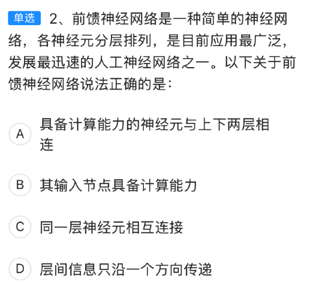

# HCIA-AI 认证考试重点整理

## 目录
1. [华为AI平台架构](#华为ai平台架构)
2. [神经网络基础](#神经网络基础)
3. [MindSpore框架](#mindspore框架)
4. [机器学习算法](#机器学习算法)
5. [深度学习](#深度学习)
6. [硬件平台](#硬件平台)
7. [优化算法](#优化算法)
8. [开发工具](#开发工具)
9. [损失函数与正则化](#损失函数与正则化)
10. [激活函数详解](#激活函数详解)
11. [华为云服务](#华为云服务)
12. [实用技巧](#实用技巧)
13. [AI发展历史](#ai发展历史)
14. [数据增强技术](#数据增强技术)
15. [硬件设计对比](#硬件设计对比)
16. [Day02重点题目解析](#day02重点题目解析)

---

## 华为AI平台架构

### 1. HiAI平台模块架构

**题目：** 华为的芯片支持HUAWEI HiAI的哪一个模块？  
**正确答案：** B. HiAI Foundation

#### 解析：
华为的HiAI平台分为四个核心模块：

| 模块名称            | 层级         | 作用说明                                                     |
| ------------------- | ------------ | ------------------------------------------------------------ |
| **HiAI Foundation** | **芯片能力层** | 直接调用NPU算力，负责**硬件加速**和**底层芯片支持** |
| HiAI Engine         | 应用能力层   | 提供图像识别、语音识别等**AI能力接口**       |
| HiAI Framework      | 开发框架层   | 支持模型转换、部署等**开发工具链**           |
| HiAI Service        | 云端服务层   | 提供**云端模型更新、管理服务**等             |

**记忆口诀：** "Foundation芯片底层，Engine应用接口，Framework开发工具，Service云端管理"

### 1.2 HiAI Engine模块功能

**题目要点：** 人脸检测功能属于HiAI的哪个模块？  
**正确答案：** A. HiAI Engine

#### HiAI 3.0架构全景图：

| 层级   | 名称            | 开发者可见 | 典型能力/示例                | 类比记忆   |
| ------ | --------------- | ---------- | ---------------------------- | ---------- |
| 应用层 | HiAI Service    | ✅          | 云侧 OTA、账号、计费         | "客服中心" |
| 能力层 | **HiAI Engine** | ✅          | 人脸检测、图像分割、语音识别 | "武器库"   |
| 框架层 | HiAI Framework  | ✅          | MindSpore Lite、模型转换工具 | "工作台"   |
| 芯片层 | HiAI Foundation | ❌          | Kirin NPU 驱动、异构计算调度 | "地基"     |

#### 逐项分析：

| 选项  | 模块名          | 是否包含人脸检测 | 作用定位（官方定义）                                         | 记忆关键词          |
| ----- | --------------- | ---------------- | ------------------------------------------------------------ | ------------------- |
| **A** | **HiAI Engine** | **√ 是**         | 提供 30+ 通用 AI 能力（CV、ASR、NLU 等），以 API 形式供 App 直接调用。人脸检测即属于 CV Engine。 | **"引擎=现成能力"** |
| B     | HiAI Framework  | ×                | 深度学习框架层，面向算法开发者，提供模型转换、端侧训练、算子扩展能力。 | "框架=自己搭"       |
| C     | HiAI Foundation | ×                | 芯片使能层，对接 NPU/CPU/GPU 驱动，提供统一计算加速接口，普通开发者不可见。 | "地基=看不见"       |
| D     | HiAI Service    | ×                | 云端服务层，提供账号、支付、推送等通用服务，与 AI 推理能力无关。 | "服务=云后台"       |

**考场速判口诀：** "能力引擎，框架搭台，地基芯片，服务云端"

### 1.3 HiAI Foundation核心功能

**题目要点：** HiAI Foundation的典型功能是什么？  
**正确答案：** C. 快速转化和迁移已有模型

#### HiAI架构功能对比：

| 选项  | 描述关键词                 | 对应模块            | 正误  | 一句话记忆            |
| ----- | -------------------------- | ------------------- | ----- | --------------------- |
| A     | App集成                    | HiAI Engine         | ×     | "App 直接调能力"      |
| B     | 服务主动找用户             | HiAI Service        | ×     | "云端推送靠 Service"  |
| **C** | **快速转化和迁移已有模型** | **HiAI Foundation** | **√** | **"芯片地基做转换"**  |
| D     | 适时适地推送服务           | HiAI Service        | ×     | "推送场景 Service 管" |

**记忆口诀：** "Foundation地基深，模型转换迁移稳；Engine集成Service推，三层别混淆"

---

## 神经网络基础

### 2. 前馈神经网络特征



**题目要点：** 前馈神经网络的关键特征是什么？  
**正确答案：** D. 层间信息只沿一个方向传递

#### 逐选项分析：

| 选项 | 描述 | 正误 | 解释 |
|------|------|------|------|
| A | 具备计算能力的神经元与上下两层相连 | ❌ | 隐藏层/输出层神经元只接收前一层输入，输出到后一层 |
| B | 其输入节点具备计算能力 | ❌ | 输入节点只是数据入口，无可训练参数 |
| C | 同一层神经元相互连接 | ❌ | 前馈网络核心特征：**同层内无连接** |
| D | 层间信息只沿一个方向传递 | ✅ | 前馈（Feedforward）：输入层→隐藏层→输出层单向流动 |

### 3. 反向传播算法特点

**题目要点：** 关于反向传播算法，下列哪项说法是错误的？  
**正确答案：** A. 反向传播只能在前馈神经网络中运用

#### 核心概念：
反向传播本质是**链式求导**，任何可微结构（RNN、CNN、ResNet、Transformer等）都能使用，并非仅限于前馈网络。

| 选项 | 正误 | 解释 |
|------|------|------|
| A | ❌ | 反向传播适用于任何可微神经网络结构 |
| B | ✅ | 反向传播求梯度→梯度下降更新权重是标准流程 |
| C | ✅ | 激活函数参与前向计算，反向时必须求导 |
| D | ✅ | 误差利用链式法则逐层反向传播计算梯度 |

**记忆口诀：** "链式求导无门槛，前馈RNN都能翻"

---

## MindSpore框架

### 4. MindSpore核心特性

**题目要点：** MindSpore的四大核心特性不包括哪项？  
**正确答案：** C. 自动编码

#### MindSpore官方四大特性：

1. **自动并行**（Auto-Parallel）- 分布式训练自动化
2. **自动调优**（Auto-Tuning）- 性能自动优化
3. **自动微分**（Auto-Differentiation）- 梯度自动计算
4. **图算融合**（Graph Kernel Fusion）- 算子自动融合

**记忆口诀：** "并、调、微、融四大金刚，编码不在其中"

### 4.1 MindSpore自动微分技术

**题目要点：** MindSpore采用的核心自动微分技术是什么？  
**正确答案：** B. 源码转换

#### 自动微分技术对比：

| 选项  | 技术         | MindSpore是否采用 | 备注                                               | 易错点         |
| ----- | ------------ | ------------------ | -------------------------------------------------- | -------------- |
| A     | 图方法       | 否                 | TensorFlow 1.x 静态图典型方式                      | 与"图优化"混淆 |
| **B** | **源码转换** | **√**              | **官方答案**：编译期重写 AST，生成含反向算子的代码 | **核心机制**   |
| C     | 运算符重载   | 否                 | PyTorch eager 模式典型方式                         | 与动态图概念混 |

**核心概念：** MindSpore默认（动态图）和静态图均使用源码转换（Source-to-Source, S2S），编译期把Python代码直接重写成可微分的C++/CUDA代码，再执行；不依赖传统"先建图再反传"的图方法，也不靠运算符重载。

**记忆口诀：** "MindSpore写源码，编译期里做微分；图方法留给TF1，考试选对B才稳"

### 5. MindSpore动静统一

**题目要点：** 下列关于MindSpore的说法，哪项是错误的？  
**正确答案：** D. 动态图和静态图差异化编码方式

#### MindSpore设计理念：

| 特性 | 说明 | 正误 |
|------|------|------|
| 统一接口设计 | 端-边-云一套API | ✅ |
| 两层API架构 | High-Level + Low-Level API | ✅ |
| 分布式统一编码 | 单机代码自动扩展到分布式 | ✅ |
| **动静统一编码** | **同一套代码支持动态图和静态图** | **关键点** |

**核心概念：** MindSpore主张"动静合一"，不需要差异化编码

### 6. 静态图vs动态图

**题目要点：** 静态图相比动态图的劣势是什么？  
**正确答案：** A. 调试困难

#### 对比分析：

| 维度       | 静态图                                 | 动态图                       |
| ---------- | -------------------------------------- | ---------------------------- |
| **调试**  | ❌ **劣势**：需先构图，报错位置难定位   | ✅ 像普通Python一样单步调试 |
| 部署       | ✅ 优势：图已定，可全局优化、剪枝、量化 | ⚠️ 需要额外导出               |
| 性能优化   | ✅ 图已定，可做算子融合、内存复用       | ⚠️ 实时执行优化有限           |
| 分布式训练 | ✅ 图已定，并行策略易插入               | ⚠️ 需框架额外支持             |

**记忆口诀：** "静态图三好：部署、优化、并行跑；唯一缺点debug难"

---

## 机器学习算法

### 7. 无监督学习算法识别

**题目要点：** 下列哪个不属于无监督学习算法？  
**正确答案：** B. XGBoost

#### 算法分类速查表：

| 算法类型 | 代表算法 | 是否无监督 | 说明 |
|----------|----------|------------|------|
| 聚类算法 | K-means、层次聚类 | ✅ | 发现数据内在分布结构 |
| **梯度提升** | **XGBoost** | **❌（监督学习）** | **需要标签数据训练** |
| 关联规则 | Apriori、FP-Growth | ✅ | 挖掘项目间关联性 |
| 混合模型 | GMM（高斯混合模型） | ✅ | 概率密度估计与聚类 |

**记忆口诀：** "聚类、规则、GMM无监督三兄弟，XGBoost带标签要监督"

### 8. 决策树算法特点

**题目要点：** 关于决策树，下列哪项说法是错误的？  
**正确答案：** C. ID3算法中都会进行剪枝

#### 决策树节点类型：

除根节点外，决策树包含：
- **内部节点**（internal node）：用于做条件判断
- **叶子节点**（leaf node）：输出最终决策结果

#### 算法对比：

| 算法 | 划分标准 | 是否包含剪枝 |
|------|----------|-------------|
| ID3 | 信息增益 | ❌ 原始版本无剪枝 |
| C4.5 | 信息增益率 | ✅ 引入剪枝机制 |
| CART | Gini指数/MSE | ✅ 支持剪枝 |

**记忆口诀：** "ID3只种树，不拿剪刀修；C4.5才剪枝"

### 9. K-means聚类局限性

**题目要点：** K-means对哪种数据分布聚类效果最差？  
**正确答案：** B. 摆旋形/螺旋形

#### 数据分布适应性：

| 数据分布 | K-means效果 | 原因 |
|----------|-------------|-----|
| 凸多边形 | ✅ 很好 | 凸集内距离中心点最近假设成立 |
| **摆旋形/螺旋形** | ❌ **最差** | **非凸，中心点无法同时兼顾两侧** |
| 带状分布 | ⚠️ 一般 | 若带状较窄且平行，尚可 |
| 圆形分布 | ⚠️ 一般 | 同心圆需多中心，但比螺旋好 |

**解决方案：**

- 密度聚类：DBSCAN、HDBSCAN
- 谱聚类：Spectral Clustering
- 核K-means：先映射到高维

### 10. 集成学习策略

**题目要点：** 下列哪个不属于集成学习策略？  
**正确答案：** D. Marking

#### 集成学习三大策略：

| 策略 | 核心思想 | 代表算法 | 是否属于集成学习 |
|------|----------|----------|-----------------|
| Boosting | 串行加权，错样本权重↑ | AdaBoost、GBDT、XGBoost | ✅ |
| Bagging | 并行采样，投票/平均 | 随机森林、ExtraTrees | ✅ |
| Stacking | 多层模型，元学习器融合 | 两层/多层stacking | ✅ |
| **Marking** | **无此术语** | **不存在** | **❌（答案）** |

**记忆口诀：** "Boost串行提权重，Bagging并行做投票，Stacking多级再学习，Marking只是打酱油"

### 11. GBDT vs 随机森林

**题目要点：** 关于GBDT和随机森林，下列哪项说法是错误的？  
**正确答案：** A. GBDT算法比随机森林容易欠拟合

#### 对比分析：

| 维度 | GBDT | 随机森林 | 本题判断 |
|------|------|----------|---------|
| 拟合倾向 | **易过拟合**（树多、学习率小） | 不易过拟合（Bagging平均） | A错：说GBDT易欠拟合 |
| 并行性 | **串行Boosting**（树间依赖） | **并行Bagging**（树独立） | B正确 |
| 过拟合风险 | 高 | 低 | C正确 |
| 基学习器 | **CART回归树** | **CART决策树** | D正确 |

**记忆口诀：** "GBDT串行易过拟，森林并行抗过拟"

### 12. 线性回归适用性

**题目要点：** 线性回归无法处理哪种问题？  
**正确答案：** C. 分割线性不可分数据集

#### 模型能力对比：

| 模型 | 能否处理线性不可分 | 原因 |
|------|------------------|------|
| SVM | ✅ | 通过核函数映射到高维，线性可分 |
| 神经网络 | ✅ | 多层非线性激活可逼近任意复杂边界 |
| **线性回归** | **❌（答案）** | **本身是一条（超）平面，只能划分线性** |
| KNN | ✅ | 局部投票，边界可为任意形状 |

**记忆口诀：** "线性回归一条线，不可分时就靠边"

### 13. 线性回归误差分布假设

**题目要点：** 线性回归中误差项ε服从什么分布？  
**正确答案：** C. 正态分布

#### 分布类型对比：

| 分布 | 是否误差分布 | 典型场景 | 备注 |
|------|-------------|----------|------|
| 指数分布 | ❌ | 寿命、等待时间 | 右偏，非对称 |
| 伯努利分布 | ❌ | 二分类结果0/1 | 离散两点 |
| **正态分布** | **✅** | **线性回归误差** | **对称、钟形，便于最大似然估计** |
| 泊松分布 | ❌ | 计数事件（如呼叫次数） | 离散、非负 |

**线性回归四大经典假设：**
1. 线性关系
2. **误差独立同分布且ε ~ N(0, σ²)**
3. 同方差性
4. 无多重共线性

---

## 深度学习

### 14. 激活函数与梯度消失

**题目要点：** 哪种激活函数能有效缓解梯度消失？  
**正确答案：** A. ReLU

#### 激活函数梯度对比：

| 函数 | 梯度范围 | 梯度消失风险 | 备注 |
|------|----------|-------------|------|
| **ReLU** | **0或1** | **低** | **正区间梯度恒1，负区间梯度0** |
| Sigmoid | (0, 0.25] | 高 | 饱和区两端梯度趋0，深层网络易梯度消失 |
| Tanh | (0, 1] | 高 | 比Sigmoid稍好，但仍易饱和 |
| Softsign | (-1, 1) | 中 | 饱和速度慢于Sigmoid/Tanh，但仍不如ReLU |

**记忆口诀：** "Sigmoid和Tanh两头缩，梯度消失跑不脱；ReLU直上不回头，梯度一路保畅通"

### 15. 生成对抗网络（GAN）

**题目要点：** 在带有标签的对抗生成网络中，标签应该被放在哪里？  
**正确答案：** B. 作为判别模型的输入值

#### Conditional GAN结构：

| 组件 | 输入 | 输出 | 标签作用 |
|------|------|------|----------|
| 生成器 | 噪声z + 标签y | 假样本G(z\|y) | 作为条件指导生成 |
| **判别器** | **样本x + 标签y** | **D(x\|y)** | **与真实/假样本拼接供判别** |

**记忆口诀：** "标签进判别，真假一起练；生成要条件，输入也加签"

### 16. 卷积神经网络信息传播

**题目要点：** 哪种神经网络信息是单向传播的？  
**正确答案：** B. 卷积神经网络

#### 网络类型对比：

| 网络类型 | 信息传播方式 | 是否单向 |
|----------|-------------|---------|
| A. LSTM | 有反馈连接，信息不是单向传播 | ❌ |
| **B. 卷积神经网络** | **信息单向传播** | **✅** |
| C. 循环神经网络 | 信息不是单向传播 | ❌ |
| D. GRU | 有反馈连接，信息不是单向传播 | ❌ |

---

## 硬件平台

### 17. 昇腾AI处理器逻辑架构

**题目要点：** 昇腾AI处理器的逻辑架构不包括哪个模块？  
**正确答案：** B. GPU

#### 昇腾AI SoC四大模块：

```
┌────────────┐  
│ 昇腾 AI SoC（Ascend） │  
├────────────┤  
│ 1️⃣ AI计算引擎（AICore/AICPU）│  ← 向量+矩阵+张量加速  
│ 2️⃣ 芯片系统控制CPU（ARM Cortex-A）│  ← 通用控制  
│ 3️⃣ DVPP（数字视觉预处理子系统）│  ← 视频编解码、图像缩放  
│ 4️⃣ 高速互联（HCCS、PCIe、RoCE）│  ← 对外通信  
└────────────┘  
```

**核心要点：**
- **GPU**：华为昇腾无GPU核，纯自研达芬奇架构
- **DVPP**：专门负责图像/视频前处理，是昇腾特色模块
- **AI计算引擎**：真正的NPU，矩阵/向量/标量三维并行

**记忆口诀：** "昇腾四件套：AI引擎算得快，控制CPU把队带，DVPP图像先剪裁，GPU不在别乱猜"

### 18. Atlas产品与芯片对应

**题目要点：** Atlas 500智能小站使用的是哪款芯片？  
**正确答案：** B. 昇腾310

#### 产品-芯片对照表：

| 产品形态 | 内置芯片 | 典型场景 |
|----------|----------|----------|
| Atlas 900 AI集群 | 昇腾910 × 数千颗 | 云端训练、超算中心 |
| Atlas 800 AI服务器 | 昇腾910（8×910或4×910卡） | 数据中心/云训练 |
| Atlas 300 AI加速卡 | 单颗910 | PCIe插卡，服务器扩展 |
| **Atlas 500智能小站** | **昇腾310** | **边缘推理、端侧盒子** |

**芯片特性对比：**
- **910**：7nm，32×32 Cube，主打高算力训练；功耗高，需服务器级散热
- **310**：12nm，1×16 Cube，主打低功耗推理；可做成无风扇小盒子

**记忆口诀：** "910上云端，800、900都挂它；310去边缘，500小站抱回家"

### 19. 达芬奇架构计算单元

**题目要点：** 达芬奇架构有几种基础计算资源？  
**正确答案：** C. 四种（这题说法错误）

#### 官方微架构：

```
        ┌──────────────────────────┐
        │        达芬奇 AICore      │
        │  ┌──────────────┐         │
        │  │  存储系统    │◄──片上缓存+数据通路│
        │  └────┬─────────┘         │
        │       │  ↑                │
        │  ┌────┴─────────┐         │
        │  │  计算单元    │ 3种资源│
        │  │ • Cube       │ 矩阵乘 │  ← 32×32高并发
        │  │ • Vector     │ 向量   │
        │  │ • Scalar     │ 标量   │
        │  └────┬─────────┘         │
        │  ┌────┴─────────┐         │
        │  │  控制单元    │ 调度   │
        │  └────┬─────────┘         │
        │       │  ↑                │
        │  ┌────┴─────────┐         │
        │  │ 总线接口单元│ 搬数据  │
        │  └──────────────┘         │
        └──────────────────────────┘
```

**关键考点：**
- **计算单元**：仅**Cube/Vector/Scalar三类**；不存在第4种
- 数据搬运：总线接口单元（BIU）
- 控制单元：指令译码、流水线调度
- 存储系统：片上缓存（L1/L0A/L0B/L0C）

**记忆口诀：** "达芬奇有三宝：Cube矩阵快如刀，Vector向量跑，Scalar标量把细活包"

### 20. 达芬奇Vector单元精度支持

**题目要点：** 达芬奇向量计算单元不支持哪种精度？  
**正确答案：** A. Int16

#### 精度支持情况：

| 精度类型 | Vector Unit支持情况 | 备注 |
|---------|-------------------|------|
| **Int16** | **❌（答案）** | **达芬奇仅Cube单元支持Int16；Vector单元无此精度** |
| FP32 | ✅ | 向量单元原生支持 |
| FP16 | ✅ | 向量单元原生支持 |
| Int8 | ✅ | 向量单元支持，用于量化推理 |

**记忆口诀：** "达芬奇向量三兄弟：FP32、FP16、Int8都行；Int16留给Cube用，向量见了就摇头"

### 21. Atlas加速卡检查命令

**题目要点：** 如何检查Atlas 300加速卡是否被系统识别？  
**正确答案：** B. lspci | grep d100

#### 检查方法对比：

| 命令 | 作用 | 正误性 |
|------|------|--------|
| A. lspci \| grep npu | PCI ID中无npu字段 | ❌ |
| **B. lspci \| grep d100** | **Atlas 300/3000的PCIe设备ID前缀** | **✅** |
| C. lspci \| grep atlas | PCI设备描述里不一定含atlas | ❌ |
| D. atlas info | 驱动装好后的用户态工具，不能检查物理在位 | ❌ |

#### 完整检查流程：
1. 物理在位：`lspci | grep d100`
2. 驱动加载：`lsmod | grep ascend`
3. 设备节点：`ls /dev/davinci*`
4. 运行态：`npu-smi info`

**记忆口诀：** "上机先查卡，lspci加d100；有字卡在槽，没字查电源"

### 22. NPU驱动安装检查

**题目要点：** 如何检查Atlas 300驱动是否安装成功？  
**正确答案：** A. npu-smi info

#### 命令对比：

| 选项 | 说明 | 正误 |
|------|------|------|
| **A. npu-smi info** | **昇腾驱动安装成功后自带的标准工具** | **✅** |
| B. npu info | 不存在，拼写错误 | ❌ |
| C. atlas-driver info | 老版本命令，非官方推荐 | ❌ |
| D. atlas info | 属于HiLens设备管理工具，与Atlas 300驱动无关 | ❌ |

**npu-smi常见子命令：**
- `npu-smi info -l` 查看所有NPU详情
- `npu-smi info -t` 查看温度
- `npu-smi info -m` 查看内存占用

**记忆口诀：** "驱动装好先smi，npu-smi info看信息"

---

## 优化算法

### 23. 优化器学习率设置

**题目要点：** 哪种优化器不需要设置全局学习率？  
**正确答案：** B. Adadelta（题目选项中应该是RMSprop需要学习率）

#### 优化器学习率需求：

| 优化器 | 是否必须设全局学习率 | 特点 |
|--------|------------------|------|
| Adam | 是 | 动量+二阶矩自适应，需设α |
| **RMSprop** | **是** | **仅对梯度平方做滑动平均，仍需α** |
| Adadelta | 否 | 用梯度平方滑动平均的比值自动调节步长，无需手动α |
| Adagrad | 是 | 累积全部梯度平方，需设α，后期易学习率过小 |

**记忆口诀：** "Adagrad要α，RMSprop也要α；Adadelta最潇洒，全局学习率不用加"

### 24. 优化器核心目的

**题目要点：** 优化器的目的不包括哪项？  
**正确答案：** C. 避过过拟合问题

#### 优化器目的分析：

| 目的 | 是否属于优化器目的 | 说明 |
|------|------------------|------|
| A. 加快算法收敛速度 | ✅ | 自适应学习率、动量等机制直接提速 |
| B. 减少手工参数设置难度 | ✅ | Adam、Adagrad等自适应算法降低调参工作量 |
| **C. 避过过拟合问题** | **❌（答案）** | **优化器只负责"找最优"，不负责"防过拟"** |
| D. 避过局部极值 | ✅ | 动量、随机梯度等机制帮助跳出局部极小 |

**核心理念：** 优化器解决"怎么找"，过拟合要靠正则化、数据增强、早停等手段解决

**记忆口诀：** "优化器，三使命：收敛快、调参轻、跳坑灵；防过拟合别找它，正则早停来当家"

### 25. 梯度下降轨迹特点

**题目要点：** 哪种梯度下降轨迹最混乱？  
**正确答案：** A. SGD（随机梯度下降）

#### 梯度下降轨迹对比：

| 算法 | 更新粒度 | 轨迹特点 | 记忆关键词 |
|------|----------|----------|-----------|
| **A. SGD** | **单样本** | **高方差、轨迹最乱** | **"一步一摇晃"** |
| B. BGD | 全样本 | 平滑、稳定 | "整批一条线" |
| C. MGD | 带动量小批量 | 惯性平滑 | "冲过谷底" |
| D. MBGD | 小批量 | 介于SGD与BGD之间 | "折中折中" |

**噪声的利与弊：**
- 高噪声帮助跳出局部极小→ SGD易逃离鞍点
- 但需配合学习率衰减，否则难收敛

**记忆口诀：** "BGD稳如山，MBGD折中安，MGD惯性滑，SGD轨迹最混乱"

---

## 开发工具

### 26. TensorFlow 2.x特点

**题目要点：** TensorFlow 2.x的特点不包括哪项？  
**正确答案：** A. 多核CPU加速

#### TensorFlow 2.0官方三大特点：

| 特点 | 说明 | 关键词 |
|------|------|--------|
| 分布式Distributed | 原生支持ParameterServer、AllReduce、TPU Pod等 | `strategy = tf.distribute.MirroredStrategy()` |
| 多语言Multi-Language | Python/C++/Java/Go/JavaScript/Swift/R | 前端多语言 |
| 多平台Multi-Platform | 服务器、PC、移动端、Web、嵌入式 | SavedModel + TF Lite + TF.js |

**"多核CPU加速"**属于底层runtime（MKL-DNN、oneDNN优化），所有框架都会做，并非TF2.0对外宣传的差异化特点。

**记忆口诀：** "TF2三多要记牢：分布式、跨平台、语言不少；多核加速是基操，不算特点莫混淆"

### 26.1 TensorFlow基本元素

**题目要点：** TensorFlow中哪个不是基本元素？  
**正确答案：** D. point

#### TensorFlow 1.x核心概念：

| 选项 | 名称    | 是否属于TensorFlow元素 | 作用与特点                                                   |
| ---- | ------- | ------------------------ | ------------------------------------------------------------ |
| A    | graph   | ✅ 是                     | 静态计算图，定义了计算流程（节点为操作，边为张量）。         |
| B    | Session | ✅ 是                     | 运行计算图的上下文环境，负责分配资源、执行操作并返回结果。   |
| C    | tensor  | ✅ 是                     | 多维数组（如标量、向量、矩阵），是图中的数据载体，具有数据类型和形状。 |
| D    | point   | ❌ 否                     | 不是TensorFlow的术语，可能是干扰项。 |

**记忆技巧：**
- **Graph**：像"蓝图"一样设计计算流程（静态）
- **Session**：像"工厂"一样按蓝图执行计算
- **Tensor**：图中的"传送带"，承载数据
- **Point**：无关选项，直接排除

### 26.2 TensorFlow运算符

**题目要点：** TensorFlow 2.0不支持的运算符是？  
**正确答案：** C. A

#### TensorFlow运算符速查表：

| 选项  | 符号/名称 | 在TF2.0是否存在 | 说明 & 示例                | 速记         |
| ----- | --------- | ----------------- | -------------------------- | ------------ |
| A     | pow       | √                 | `tf.pow(a, b)` 或 `a ** b` | 幂运算       |
| B     | @         | √                 | 矩阵乘：`C = A @ B`        | 新语法糖     |
| **C** | **A**     | **×**             | 仅为变量名，不是运算符     | "字母不是符" |
| D     | （缺）    | —                 | 题面缺描述，可排除         | —            |

**记忆口诀：** "幂在、矩阵@，字母A只是名"

### 27. TensorFlow张量创建

**题目要点：** 下列哪个不是TensorFlow 2.x的张量创建方法？  
**正确答案：** C. tf.create()

#### 张量创建方法：

| 方法 | 是否TF2.0原生 | 示例 |
|------|-------------|------|
| `tf.zeros()` | ✅ | `tf.zeros([2,3])` |
| `tf.fill()` | ✅ | `tf.fill([2,3], 9)` |
| **C. tf.create()** | **❌（答案）** | **无此API，易拼写混淆** |
| `tf.constant()` | ✅ | `tf.constant([1,2,3])` |

**记忆口诀：** "零填常三兄弟，create是冒牌要丢弃"

### 27.1 TensorFlow张量属性

**题目要点：** 查看TensorFlow张量维度数量用哪个属性？  
**正确答案：** C. ndim

#### 张量属性对比：

| 选项  | 属性/方法 | 作用  | 示例代码                 | 记一记                           |
| ----- | --------- | ----- | ------------------------ | -------------------------------- |
| A     | dimens    | ×     | 不存在此属性             | "拼写都不对"                     |
| B     | dtype     | ×     | 返回张量的数据类型       | `t.dtype` → `<dtype: 'float32'>` |
| **C** | **ndim**  | **√** | 返回张量的维度数（rank） | `t.ndim` → `4`                   |
| D     | device    | ×     | 返回张量所在的设备名     | `t.device` → `'/GPU:0'`          |

**记忆口诀：** "维度多少看ndim，其余dtype类型、device看设备"

### 28. MindSpore自动微分

**题目要点：** GradOperation中sens_param=True的作用是什么？  
**正确答案：** B. 给输出值乘以灵敏度系数

#### GradOperation参数说明：

| 参数 | True/False含义 | 作用 |
|------|---------------|------|
| `get_all=True` | 对所有输入张量求导 | `get_all=False`时只对标量输出求导 |
| **`sens_param=True`** | **给输出值乘以灵敏度系数** | **缩放梯度** |
| `get_by_list=True` | 对权重列表求导 | `get_by_list=False`时不对权重求导 |

### 29. 计算机视觉定义

**题目要点：** 计算机视觉的正确描述是什么？  
**正确答案：** A. 计算机视觉需要用到图像处理技术

#### 选项分析：

| 选项 | 正误 | 原因 |
|------|------|------|
| **A. 计算机视觉需要用到图像处理技术** | **✅** | **图像增强、滤波、特征提取等图像处理技术是CV的基础环节** |
| B. 利用计算机理解和运用自然语言 | ❌ | 那是**NLP（自然语言处理）** |
| C. 让计算机去分析语言数据 | ❌ | 同样属于**NLP** |
| D. 通过专家经验提供排障指导 | ❌ | 属于**专家系统/知识工程**，与视觉无关 |

### 30. HiAI开发环境

**题目要点：** HUAWEI HiAI平台原生集成哪个开发环境？  
**正确答案：** C. Android Studio

#### 开发环境对比：

| 选项 | 是否官方集成 | 说明 |
|------|-------------|------|
| A. Jupyter Notebook | ❌ | 通用Python交互环境，与HiAI无官方插件 |
| B. MyEclipse | ❌ | Java IDE，非官方支持 |
| **C. Android Studio** | **✅** | **官方提供HiAI Toolkit插件，一键接入端侧推理能力** |
| D. Spider | ❌ | Python科学IDE，与Android端无关 |

**集成路径：**
Android Studio → 安装**HiAI Toolkit** → 在`build.gradle`引入`com.huawei.hms:ml-computer-vision` → 直接调用HiAI Engine接口

**记忆口诀：** "HiAI端侧跑，Android Studio少不了；装个插件接进来，手机AI秒变快"

---

## 实用技巧

### 31. 梯度下降算法特点

**题目要点：** 关于全局梯度下降的描述，哪项是错误的？  
**正确答案：** A. 全局梯度下降能收敛到全局极值

#### 梯度下降策略对比：

| 策略      | 每次用多少样本   | 更新稳定性 | 内存占用 | 是否易并行 | 适合场景           |
| --------- | ---------------- | ---------- | -------- | ---------- | ------------------ |
| 批量 GD   | 全部 N           | 最稳       | 最大     | 易         | 小数据集、凸问题   |
| 小批量 GD | k（通常 16~256） | 中等       | 中等     | 最易       | 深度学习默认       |
| 随机 GD   | 1                | 最不稳     | 最小     | 难         | 在线学习、极大数据 |

#### 核心概念：
全局（批量）梯度下降虽然"稳定"，但**并不能保证**收敛到**全局极值**——在非凸损失面（如深层神经网络）上，它一样会陷入**局部极小值或鞍点**。

#### 逐项分析：

| 选项  | 关键描述                                         | 正误  | 解释/考点扩展                                                | 速记             |
| ----- | ------------------------------------------------ | ----- | ------------------------------------------------------------ | ---------------- |
| **A** | 全局梯度下降能收敛到**全局极值**                 | **×** | 只对**凸问题**成立；深度模型损失面非凸→仍可能停在局部极小/鞍点。 | "稳定≠全局"      |
| B     | 每次更新需遍历**所有**样本                       | √     | 定义：Batch GD 的梯度是对整个训练集的求和平均。              | "全览再迈步"     |
| C     | 无 GPU 时，样本多→收敛**慢**                     | √     | 计算开销 O(N) 随样本线性增长，单核 CPU 每次迭代耗时长。      | "CPU 慢如牛"     |
| D     | GPU 并行时，小批量 GD 一个 epoch **快于**随机 GD | √     | 随机 GD 一次只用 1 个样本，GPU 并行度低；小批量（mini-batch）可充分利用 GPU 并行，整体 epoch 时间更短。 | "GPU 喜批不喜单" |

**记忆口诀：** "全稳小快随动荡，GPU爱小批"

### 32. ModelArts训练平台

**题目要点：** ModelArts训练平台的核心任务是什么？  
**正确答案：** C. 模型训练

#### ModelArts功能模块划分：

| 选项  | 功能名称     | 是否训练平台任务 | 在 ModelArts 中的归属/入口          | 速记一句话        |
| ----- | ------------ | ---------------- | ----------------------------------- | ----------------- |
| **C** | **模型训练** | **√**            | 训练平台 → 训练作业（Training Job） | "训练平台=跑模型" |
| A     | 模型部署     | ×                | 推理平台 → 在线服务/批量服务        | "部署去推理"      |
| B     | 模型管理     | ×                | AI 资产管理 → 模型仓库/版本管理     | "管理进仓库"      |
| D     | 数据标注     | ×                | 数据管理 → 数据集 → 标注任务        | "标注归数据"      |

#### ModelArts全流程速览：

| 阶段           | 功能模块     | 主要操作                   | 记忆口诀     |
| -------------- | ------------ | -------------------------- | ------------ |
| ① 数据准备     | 数据管理     | 上传、清洗、**数据标注**   | "先洗标"     |
| ② 模型开发     | 开发环境     | Notebook、代码调试         | "再调试"     |
| ③ **模型训练** | **训练平台** | 提交训练作业、超参、分布式 | **"核心跑"** |
| ④ 模型管理     | AI 资产管理  | 版本管理、模型评估         | "后评估"     |
| ⑤ 模型部署     | 推理平台     | 在线/边缘服务、自动扩缩容  | "终上线"     |

**记忆口诀：** "洗标调，训管部"（先数据标注→再调试→训练→管理→部署）

### 33. MindSpore性能优化

**题目要点：** 昇腾芯片On-Device场景下训练性能如何？  
**正确答案：** C. 训练性能与Host侧图调度持平（错误描述）

#### On-Device vs Host-Device调度对比：

| 维度               | Host-Device 分段执行 | On-Device 整图卸载 |
| ------------------ | -------------------- | ------------------ |
| 交互次数           | 每算子一次           | 整图一次           |
| 主要瓶颈           | PCIe 带宽/内存拷贝   | 芯片内存容量       |
| 加速器占用率       | 低                   | 高                 |
| MindSpore 优化目标 | 减少拷贝             | 最大化并行流水     |
| 典型增益           | ——                   | 吞吐↑30%↑          |

#### 逐项分析：

| 选项  | 关键描述                                                | 正误  | 依据/考点扩展                                                | 速记提示         |
| ----- | ------------------------------------------------------- | ----- | ------------------------------------------------------------ | ---------------- |
| A     | 梯度数据驱动的 AllReduce，计算-通信流水                 | √     | MindSpore 去中心化梯度聚合 + 自适应图优化，减少同步等待。    | "梯度自己找路"   |
| B     | Host-Device 频繁交互导致交互开销 > 计算开销，加速器空闲 | √     | 典型"内存墙"现象，On-Device 整图卸载正是为消除此问题。       | "搬数据比算还贵" |
| **C** | 训练性能与 Host 侧图调度**持平**                        | **×** | 官方数据：整图卸载在 Ascend 910 上 ResNet-50 吞吐提升 30%+；持平说法与事实不符。 | "持平=打脸"      |
| D     | ResNet-50 单迭代 20 ms 时分布式梯度聚合成为瓶颈         | √     | 20 ms 内梯度需跨 8×NPUs 聚合，带宽/同步是关键挑战。          | "20 ms 极限"     |

**记忆口诀：** "整图一次搬，芯片满负荷；分段多次拷，加速器打盹"

### 34. 卷积输出尺寸计算

**题目要点：** 32×32输入，5×5卷积核，步长1，无填充的输出尺寸？  
**正确答案：** B. 28×28

#### 卷积输出尺寸公式：
out = (in − kernel) ÷ stride + 1 = (32 − 5) ÷ 1 + 1 = 28

#### 逐项速查表：

| 选项  | 尺寸      | 正误  | 原因                  | 速记             |
| ----- | --------- | ----- | --------------------- | ---------------- |
| A     | 28×23     | ×     | 高度正确，宽度错误    | 明显不对齐       |
| **B** | **28×28** | **√** | 公式正确，两边对称    | **"方方正正28"** |
| C     | 29×29     | ×     | 公式算得29需用4×4核   | 少减1            |
| D     | 23×23     | ×     | 把 (32-5)=27 当成输出 | 忘了加1          |

**记忆口诀：** "32减5再加1，方得28不忘记"

### 35. CPU低延迟设计

**题目要点：** CPU低延迟设计的错误描述是？  
**正确答案：** A. 很多ALU和很少Cache

#### CPU vs GPU设计理念对比：

| 选项  | 关键描述              | 正误  | 解释                                                         | 记忆口诀             |
| ----- | --------------------- | ----- | ------------------------------------------------------------ | -------------------- |
| **A** | 很多 ALU + 很少 Cache | **×** | CPU 走"少而精"路线，Cache 大、ALU 少；大量 ALU 是 GPU/TPU 的吞吐设计。 | **"多核少缓是 GPU"** |
| B     | 复杂逻辑 + 分支预测   | √     | 分支预测失败会刷新流水线，复杂预测单元能把失效率压到最低。   | "预测准，延迟低"     |
| C     | 高时钟频率            | √     | 时钟周期缩短 → 单条指令延迟降低。                            | "频率高，节拍短"     |
| D     | 强大 ALU 单元         | √     | 单周期完成复杂运算（整数乘除、浮点 FMA）。                   | "一锤定音"           |

**核心概念：** CPU低时延设计的核心是"少量但强大的ALU + 大容量Cache + 高时钟频率 + 复杂分支预测"。

**记忆口诀：** "CPU低延迟：少核大缓存，高钟强预测；多核小缓存，那是GPU路"

### 36. KNN参数特性

**题目要点：** 关于KNN中K值的描述，哪项是错误的？  
**正确答案：** D. K值越大越容易过拟合

#### KNN中K值影响分析：

| 选项  | 描述要点                  | 正误  | 原因 & 记忆                    | 速记口诀       |
| ----- | ------------------------- | ----- | ------------------------------ | -------------- |
| A     | 大 K 降低噪声，边界变模糊 | √     | 多数表决平滑噪声，但边界趋直   | "大 K 模糊"    |
| B     | 小 K 易过拟合，分割细腻   | √     | 近邻过少，对训练样本过度敏感   | "小 K 过拟"    |
| C     | K 人为设定，是超参数      | √     | 交叉验证/网格搜索可调          | "K 是超参"     |
| **D** | **大 K 易过拟合**         | **×** | 大 K 反而欠拟合，小 K 才过拟合 | **"大欠小过"** |

**核心规律：**
- K值**越大** → 决策边界越平滑 → **欠拟合**风险增大
- K值**越小** → 决策边界过分细腻 → **过拟合**风险增大

**记忆口诀：** "K大欠，K小过；选对D，错别留"

### 37. 逻辑回归vs线性回归

**题目要点：** 关于逻辑回归与线性回归，哪项描述是错误的？  
**正确答案：** D. 损失函数都是最小二乘损失

#### 逻辑回归vs线性回归对比：

| 选项  | 关键描述                     | 正误  | 解释 & 记忆                                      | 记忆口诀                     |
| ----- | ---------------------------- | ----- | ------------------------------------------------ | ---------------------------- |
| A     | 逻辑回归是分类模型           | √     | 输出概率→阈值→类别                               | "逻辑归类别"                 |
| B     | 都属于广义线性模型           | √     | 线性回归：恒等连接函数；逻辑回归：logit 连接函数 | "同宗同源"                   |
| C     | 在线性回归基础上引入 sigmoid | √     | 先线性组合，再 sigmoid 压缩到 (0,1) 概率         | "线性+非线"                  |
| **D** | **损失函数都是最小二乘**     | **×** | 逻辑回归用**交叉熵**；最小二乘用于回归           | **"分类交叉熵，回归最小二"** |

**核心差异：**
- 逻辑回归解决**分类**任务，损失函数为**对数似然损失（交叉熵）**
- 线性回归解决**回归**任务，损失函数为**最小二乘（MSE）损失**

**记忆口诀：** "分类交叉熵，回归最小二；选错D题中题"

### 38. 神经网络发展历史

**题目要点：** 关于神经网络发展历史，哪项描述是错误的？  
**正确答案：** C. 2006年Robert Hecht-Nielsen提出预训练

#### 神经网络里程碑对照表：

| 选项  | 关键事件                                    | 人物/时间          | 正误  | 一句话记忆                |
| ----- | ------------------------------------------- | ------------------ | ----- | ------------------------- |
| A     | 1969 年 Minsky 质疑感知器无法解决 XOR       | Minsky & Papert    | √     | "感知器被 XOR 打脸"       |
| B     | 1986 年 Hinton 提出 BP + Sigmoid            | Hinton, Rumelhart… | √     | "BP 点燃多层网络"         |
| **C** | 2006 年 **Robert Hecht-Nielsen** 提出预训练 | → **Hinton** 等人  | **×** | **"预训练鼻祖是 Hinton"** |
| D     | 2012 年 ImageNet 冠军 CNN（AlexNet）        | Hinton 团队        | √     | "AlexNet 引爆深度学习"    |

**记忆口诀：** "2006预训练，Hinton领风骚；写错Robert就掉坑"

### 39. Adagrad优化器特性

**题目要点：** 关于优化器，哪个对每个参数用相同学习率进行更新？  
**正确答案：** A. Adagrad

#### 优化器学习率机制对比：

| 选项  | 优化器      | 是否"每个参数用相同学习率" | 官方判定               | 速记                     |
| ----- | ----------- | -------------------------- | ---------------------- | ------------------------ |
| **A** | **Adagrad** | **√**                      | **正确答案**           | **"全局 lr + 累积缩放"** |
| B     | Adadelta    | ×                          | 引入滑动窗口，独立尺度 | —                        |
| C     | Momentum    | ×                          | 动量项，但官方不选     | —                        |
| D     | Adam        | ×                          | 动量+二阶矛，独立尺度  | —                        |

**记忆口诀：** "官方定义：Adagrad仍是'同一规则同一尺'，选A没错！"

### 40. ModelArts平台功能

**题目要点：** 一站式AI开发平台是什么？  
**正确答案：** C. ModelArts

#### 平台功能对比：

| 选项  | 名称          | 是否题干所述平台 | 作用/定位                        | 一句话记忆             |
| ----- | ------------- | ---------------- | -------------------------------- | ---------------------- |
| A     | Mysql         | ×                | 关系型数据库，与 AI 开发无关     | "数据库存数据"         |
| B     | MindSpore     | ×                | AI 框架，训练算法用，不是平台    | "框架跑模型"           |
| **C** | **ModelArts** | **√**            | 一站式 AI 开发平台，端到端全流程 | **"ModelArts 全包干"** |
| D     | Ascend        | ×                | 昇腾 AI 芯片/处理器，算力底座    | "芯片供算力"           |

**记忆口诀：** "开发上ModelArts，框架选MindSpore，芯片用Ascend，数据库靠边站"

### 41. MindSpore Serving模块

**题目要点：** MindSpore哪个模块负责在线推理部署？  
**正确答案：** A. MindSpore Serving

#### MindSpore模块功能对比：

| 选项  | 模块                  | 定位              | 与推理部署关系 | 联想口令           |
| ----- | --------------------- | ----------------- | -------------- | ------------------ |
| **A** | **MindSpore Serving** | 推理服务框架      | **√ 直接部署** | **"Serving=上线"** |
| B     | MindArmour            | 安全/对抗样本防护 | ×              | "Armour 保安全"    |
| C     | MindiR                | 模型压缩/量化     | ×              | "IR 做瘦身"        |
| D     | MindInsight           | 可视化调试        | ×              | "Insight 看指标"   |

**记忆口诀：** "上线Serving，安全Armour，瘦身IR，调试Insight；选A不迷路！"

### 42. 达芬奇累加器功能

**题目要点：** 达芬奇架构中主要完成矩阵相关运算的是？  
**正确答案：** B. 累加器

#### 达芬奇架构组件功能：

| 选项  | 名称       | 正确角色             | 官方判定 | 记忆口诀           |
| ----- | ---------- | -------------------- | -------- | ------------------ |
| A     | 寄存器     | 数据缓存             | ×        | "寄存只放数"       |
| **B** | **累加器** | **矩阵乘加结果累加** | **√**    | **"累加把结果攒"** |
| C     | 运算器     | 单周期乘法           | ×        | "乘法小工"         |
| D     | 控制器     | 指令调度             | ×        | "指挥不干活"       |

**记忆口诀：** "达芬奇矩阵谁老大？累加器里把和拿！"

### 43. MindSpore数据增强

**题目要点：** MindSpore支持哪种自动数据增强机制？  
**正确答案：** B. 基于概率的自动数据增强

#### 数据增强机制对比：

| 选项  | 机制                       | 官方结论 | 一句话解释                        | 记忆口诀             |
| ----- | -------------------------- | -------- | --------------------------------- | -------------------- |
| A     | 基于精度的自动数据增强     | ×        | 无官方独立实现                    | "精度导向未落地"     |
| **B** | **基于概率的自动数据增强** | **√**    | **官方 RandomAugment 即概率抽样** | **"概率抽样即自动"** |
| C     | 基于鲁棒性的自动数据增强   | ×        | 概念研究，无接口                  | "鲁棒暂无"           |
| D     | 基于反馈的自动数据增强     | ×        | 无官方 API                        | "反馈缺位"           |

**记忆口诀：** "概率抽样算自动，官方选B稳拿分；其余三类暂缺席，考试记住别混淆"

### 44. CPU硬件设计特点

**题目要点：** 关于CPU硬件设计，哪项描述是错误的？  
**正确答案：** A. CPU的功能主要是解释计算机指令以及处理计算机硬件中的数据

#### 硬件设计对比：

| 选项  | 技术描述                               | 官方判定 | 官方理由（一句话）                    | 速记                           |
| ----- | -------------------------------------- | -------- | ------------------------------------- | ------------------------------ |
| **A** | CPU 解释指令并"处理计算机硬件中的数据" | **×**    | **措辞夸大 CPU 对硬件数据的直接处理** | **"CPU 并不直接处理硬件数据"** |
| B     | FPGA 实现了半定制芯片功能              | √        | 行业惯用"半定制"描述其可重构特性      | "半定制可接受"                 |
| C     | ASIC 属于专用集成电路                  | √        | 定义正确                              | —                              |
| D     | GPU 用于图像/并行计算                  | √        | 定义正确                              | —                              |

**记忆口诀：** "题干问错误，官方揪A句；措辞不严谨，直接判错去"

### 45. 欠拟合解决方法

**题目要点：** 关于机器学习模型优化，哪项描述是错误的？  
**正确答案：** D. 欠拟合用逻辑回归更复杂

#### 模型优化方法对比：

| 选项  | 描述                         | 正误  | 解释 & 记忆                      | 速记口诀             |
| ----- | ---------------------------- | ----- | -------------------------------- | -------------------- |
| A     | 用测试集验证泛化             | √     | 防止训练集过拟合假象             | "测泛化，保真实"     |
| B     | 效果差先清数据/做特征工程    | √     | 垃圾进，垃圾出                   | "先洗特征再调参"     |
| C     | 过拟合用 LASSO/Ridge + 调参  | √     | 正则化抑制过拟合                 | "正则压过拟"         |
| **D** | 欠拟合用 **逻辑回归** 更复杂 | **×** | 逻辑回归仍是线性模型，复杂度不增 | **"逻辑回归不增复"** |

**记忆口诀：** "欠拟合，加模型；逻辑回归线性同，选D错！"

---

## AI发展历史

### 38. 神经网络发展历史

**题目要点：** 关于神经网络发展历史，哪项描述是错误的？  
**正确答案：** C. 2006年Robert Hecht-Nielsen提出预训练

#### 神经网络里程碑对照表：

| 选项  | 关键事件                                    | 人物/时间          | 正误  | 一句话记忆                |
| ----- | ------------------------------------------- | ------------------ | ----- | ------------------------- |
| A     | 1969 年 Minsky 质疑感知器无法解决 XOR       | Minsky & Papert    | √     | "感知器被 XOR 打脸"       |
| B     | 1986 年 Hinton 提出 BP + Sigmoid            | Hinton, Rumelhart… | √     | "BP 点燃多层网络"         |
| **C** | 2006 年 **Robert Hecht-Nielsen** 提出预训练 | → **Hinton** 等人  | **×** | **"预训练鼻祖是 Hinton"** |
| D     | 2012 年 ImageNet 冠军 CNN（AlexNet）        | Hinton 团队        | √     | "AlexNet 引爆深度学习"    |

**记忆口诀：** "2006预训练，Hinton领风骚；写错Robert就掉坑"

---

## 数据增强技术

### 43. MindSpore数据增强

**题目要点：** MindSpore支持哪种自动数据增强机制？  
**正确答案：** B. 基于概率的自动数据增强

#### 数据增强机制对比：

| 选项  | 机制                       | 官方结论 | 一句话解释                        | 记忆口诀             |
| ----- | -------------------------- | -------- | --------------------------------- | -------------------- |
| A     | 基于精度的自动数据增强     | ×        | 无官方独立实现                    | "精度导向未落地"     |
| **B** | **基于概率的自动数据增强** | **√**    | **官方 RandomAugment 即概率抽样** | **"概率抽样即自动"** |
| C     | 基于鲁棒性的自动数据增强   | ×        | 概念研究，无接口                  | "鲁棒暂无"           |
| D     | 基于反馈的自动数据增强     | ×        | 无官方 API                        | "反馈缺位"           |

**记忆口诀：** "概率抽样算自动，官方选B稳拿分；其余三类暂缺席，考试记住别混淆"

---

## 硬件设计对比

### 44. CPU硬件设计特点

**题目要点：** 关于CPU硬件设计，哪项描述是错误的？  
**正确答案：** A. CPU的功能主要是解释计算机指令以及处理计算机硬件中的数据

#### 硬件设计对比：

| 选项  | 技术描述                               | 官方判定 | 官方理由（一句话）                    | 速记                           |
| ----- | -------------------------------------- | -------- | ------------------------------------- | ------------------------------ |
| **A** | CPU 解释指令并"处理计算机硬件中的数据" | **×**    | **措辞夸大 CPU 对硬件数据的直接处理** | **"CPU 并不直接处理硬件数据"** |
| B     | FPGA 实现了半定制芯片功能              | √        | 行业惯用"半定制"描述其可重构特性      | "半定制可接受"                 |
| C     | ASIC 属于专用集成电路                  | √        | 定义正确                              | —                              |
| D     | GPU 用于图像/并行计算                  | √        | 定义正确                              | —                              |

**记忆口诀：** "题干问错误，官方揪A句；措辞不严谨，直接判错去"

### 45. 欠拟合解决方法

**题目要点：** 关于机器学习模型优化，哪项描述是错误的？  
**正确答案：** D. 欠拟合用逻辑回归更复杂

#### 模型优化方法对比：

| 选项  | 描述                         | 正误  | 解释 & 记忆                      | 速记口诀             |
| ----- | ---------------------------- | ----- | -------------------------------- | -------------------- |
| A     | 用测试集验证泛化             | √     | 防止训练集过拟合假象             | "测泛化，保真实"     |
| B     | 效果差先清数据/做特征工程    | √     | 垃圾进，垃圾出                   | "先洗特征再调参"     |
| C     | 过拟合用 LASSO/Ridge + 调参  | √     | 正则化抑制过拟合                 | "正则压过拟"         |
| **D** | 欠拟合用 **逻辑回归** 更复杂 | **×** | 逻辑回归仍是线性模型，复杂度不增 | **"逻辑回归不增复"** |

**记忆口诀：** "欠拟合，加模型；逻辑回归线性同，选D错！"

---

### 31. 华为云服务组合

**题目要点：** ModelArts与哪个服务组合可以部署模型到端侧？  
**正确答案：** D. HiLens

#### 官方部署链路：

1. **ModelArts** - 云端完成数据管理、训练、生成模型包（*.om*）
2. **HiLens** - 华为端侧AI应用开发平台，内置模型仓库、设备管理、OTA升级
3. **部署流程** - ModelArts训练 → OBS存储模型 → HiLens控制台导入 → 选择端设备 → 一键下发 → 端侧推理

#### 服务功能对比：

| 选项 | 作用 | 能否直接部署到"端" |
|------|------|------------------|
| A. OBS | 对象存储，仅存放模型文件 | ❌ |
| B. OCR | 文字识别云服务，纯云端API | ❌ |
| C. ECS | 云服务器，用于云端推理 | ❌ |
| **D. HiLens** | **端侧AI平台** | **✅** |

**记忆口诀：** "ModelArts练模型，OBS仓库先存证；HiLens端侧来托管，一键部署到设备中"

### 32. 华为云OCR接口

**题目要点：** 华为云OCR接口返回JSON中哪个字段代表文字块？  
**正确答案：** B. words_block_list

#### 字段说明：

| 字段 | 含义 | 是否文字块 |
|------|------|-----------|
| words_list | 仅文本列表，无坐标 | ❌ |
| **words_block_list** | **文字块对象数组**（含文本、坐标、置信度） | **✅** |
| words_block | 单文字块对象，但接口返回时放在数组里 | ❌ |
| words | 单字符串，一个区域的所有文本拼在一起 | ❌ |

#### 接口示例：
```json
{
  "result": {
    "words_block_list": [
      {
        "words": "华为云",
        "location": {"top": 10, "left": 20, "width": 60, "height": 20},
        "confidence": 0.998
      }
    ]
  }
}
```

**记忆口诀：** "OCR回包里，words_block_list是块宝；坐标置信度，字段记牢不跑"

### 33. 超参数搜索方法

**题目要点：** 下列哪个不是超参数搜索方法？  
**正确答案：** B. 聚类算法

#### 超参数搜索方法：

| 名称 | 是否超参数搜索 | 核心思想 | 典型应用 |
|------|--------------|----------|---------|
| 网格搜索Grid Search | ✅ | 穷举所有组合 | 小模型、参数少 |
| 随机搜索Random Search | ✅ | 随机采样 | 参数空间大 |
| 贝叶斯优化Bayesian Optimization | ✅ | 高斯过程/代理模型+采集函数 | 训练成本高的模型 |
| **聚类算法Clustering** | **❌（本题答案）** | **无监督找数据分布** | **客户分群、异常检测** |

**记忆口诀：** "网格穷举，随机撒网；贝叶斯聪明，聚类不抢；超参搜索三兄弟，聚类算法别站错行"

### 34. 过拟合解决方法

**题目要点：** 下列哪个方法不能解决过拟合？  
**正确答案：** D. 减小学习率

#### 过拟合解决方法：

| 方法 | 是否解决过拟合 | 作用原理 | 记忆关键词 |
|------|--------------|----------|-----------|
| 参数正则化L1/L2 | ✅ | 限制权重幅度，降低模型复杂度 | "给权重戴手铐" |
| 数据增强 | ✅ | 扩充样本多样性，减少泛化误差 | "样本变多" |
| 提前停止Early-Stopping | ✅ | 在验证集性能开始下降时终止训练 | "见好就收" |
| **减小学习率** | **❌（答案）** | **只是让收敛更细，不会降低模型复杂度** | **"走得更慢，但路一样弯"** |

**记忆口诀：** "正则加锁，增强加图，早停刹车，减步长无助"

### 35. AI发展流派

**题目要点：** 符号主义的核心落脚点是什么？  
**正确答案：** B. 推理

#### 三大AI流派对照：

| 流派 | 核心思想 | 落脚点关键词 | 代表技术 |
|------|----------|-------------|---------|
| **符号主义（Symbolism）** | **用符号、逻辑、规则表示知识** | **推理** | **专家系统、逻辑编程、知识图谱** |
| 连接主义（Connectionism） | 用神经元网络模拟大脑 | 神经元网络&深度学习 | CNN、RNN、Transformer |
| 行为主义（Behaviorism） | 感知-行动闭环、自适应、进化 | 行为控制&进化计算 | 强化学习、遗传算法 |

**记忆口诀：** "符号推理B，连接网络深，行为自适应；考试别混淆，推理选B稳"

### 36. MindCompiler优化特点

**题目要点：** MindCompiler面向硬件优化不包括哪项？  
**正确答案：** C. 冗余消除

#### 优化类型对比：

| 选项 | 是否属于MindCompiler面向硬件优化 | 作用 |
|------|------------------------------|------|
| A. 算子融合 | ✅ | 减少访存，提升NPU利用率 |
| B. layout优化 | ✅ | 调整张量排布，适配达芬奇Cube/Vector内存格式 |
| **C. 冗余消除** | **❌（答案）** | **通常指代数层面的"公共子表达式消除"，属于前端或中端通用优化，不针对特定硬件** |
| D. 自动并行 | ✅ | 根据芯片拓扑自动切分计算图到多核/多卡 |

**MindCompiler三层优化：**
- 前端：图优化（常量折叠、死代码删除、**冗余消除**等）
- 中端：设备无关优化
- 后端：设备相关优化（算子融合、layout、并行）

**记忆口诀：** "融合布局并行忙，冗余消除在前端房；硬件优化三件套，冗余字出现就选C"

---

## 损失函数与正则化

### 37. 损失函数选择原则

**题目要点：** 关于损失函数的描述，下列哪项是错误的？  
**正确答案：** B. 二次代价函数更多用于分类，交叉熵用于回归

#### 核心原则：
在华为HCIA-AI考纲中，必须牢记：
- **二次代价函数（MSE）→ 回归**
- **交叉熵代价函数（Cross-Entropy）→ 分类**

#### 逐项分析：

| 选项  | 描述原文（提炼）                         | 正误  | 理由&考点扩展                                                | 记忆口诀                                 |
| ----- | ---------------------------------------- | ----- | ------------------------------------------------------------ | ---------------------------------------- |
| A     | 二次代价函数衡量"距离"                   | √     | 实际上就是均方误差 MSE，度量预测值与真实值的欧氏距离。       | "平方差，量距离"                         |
| **B** | 二次代价函数更多用于分类，交叉熵用于回归 | **×** | **说反了**。MSE 对分类的梯度饱和问题敏感；交叉熵在分类中梯度大、收敛快。 | **"分交回二"**——分类用交叉熵，回归用二次 |
| C     | 交叉熵刻画两个概率分布的距离             | √     | 信息论角度：交叉熵 H(p,q) 越小，模型分布 q 越接近真实分布 p。 | "熵是分布尺"                             |
| D     | 训练目的：使损失最小                     | √     | 优化目标即最小化经验风险（损失函数值）。                     | "往下走，损最小"                         |

#### 二次代价 vs 交叉熵代价对比表：

| 对比维度       | 二次代价函数 (MSE)          | 交叉熵代价函数 (Cross-Entropy) |
| -------------- | --------------------------- | ------------------------------ |
| 公式（单样本） | ½∑(yᵢ − ŷᵢ)²                | −∑ yᵢ log ŷᵢ                   |
| 任务类型       | 回归（连续值预测）          | 分类（离散概率输出）           |
| 梯度大小       | 输出饱和时梯度变小 → 收敛慢 | 梯度与误差成正比 → 收敛快      |
| 输出层激活     | 线性                        | Softmax / Sigmoid              |
| 典型场景       | 房价预测、温度估计          | 图像分类、文本情感分析         |

**考场速记口诀：** "分交回二" - 分类问题用交叉熵，回归问题用二次代价（MSE）

### 38. L1正则化特性

**题目要点：** 关于L1正则化的描述，哪项是正确的？  
**正确答案：** A. L1正则化能增强模型泛化能力

#### L1 vs L2正则化对比：

| 选项  | 描述                 | 正误  | 原因                  | 一句话口诀          |
| ----- | -------------------- | ----- | --------------------- | ------------------- |
| **A** | L1 增强泛化          | **√** | 稀疏化特征 → 防过拟合 | **"L1 稀疏防过拟"** |
| B     | L1/L2 不能作用于损失 | ×     | 正则项直接加到损失上  | "正则就是损失+罚"   |
| C     | L2 比 L1 更稀疏      | ×     | 事实相反，L1 稀疏     | "稀疏看 L1"         |
| D     | L2 无法用梯度下降    | ×     | 仍可求导，梯度多 2λw  | "梯度照常走"        |

**记忆口诀：** "正则加在损失上，L1稀疏L2光；梯度下降仍能用，泛化提升选L1强"

### 39. LASSO回归特点

**题目要点：** 既能防止过拟合又能进行特征选择的方法是？  
**正确答案：** A. LASSO回归

#### 四种回归方法对比：

| 选项  | 方法         | 正则形式 | 是否特征选择    | 是否防过拟合 | 一句话记忆        |
| ----- | ------------ | -------- | --------------- | ------------ | ----------------- |
| **A** | **LASSO**    | **L1**   | **√ 能压缩到0** | **√**        | **"L1 既选又罚"** |
| B     | 多项式回归   | 无       | ×               | ×            | 升维易过拟合      |
| C     | 多元线性回归 | 无       | ×               | ×            | 普通最小二乘      |
| D     | Ridge 回归   | L2       | × 仅缩小系数    | √            | "L2 只罚不选"     |

**核心概念：** LASSO（Least Absolute Shrinkage and Selection Operator）在损失函数中加入L1正则项，既能把不重要特征的系数压缩到0，实现特征选择，又能抑制过拟合。

**记忆口诀：** "L1选变量，L2只缩小；要防过拟合又挑特征，选LASSO准没错！"

---

## 激活函数详解

### 40. Sigmoid函数导数最大值

**题目要点：** Sigmoid函数导数的最大值是多少？  
**正确答案：** C. 0.25

#### 数学推导：
- Sigmoid函数：f(x) = 1/(1+e^(-x))
- 其导数：f'(x) = f(x)(1-f(x))
- 当f(x) = 0.5时，f'(x)取得最大值0.25

#### 逐项分析：

| 选项  | 数值/布尔 | 正误  | 理由 & 记忆                                        | 速记口诀           |
| ----- | --------- | ----- | -------------------------------------------------- | ------------------ |
| A     | 0.5       | ×     | 0.5 是 Sigmoid 在 x=0 时的函数值，不是导数最大值。 | "函数值，非导值"   |
| B     | True      | ×     | 布尔值与数值考点无关，纯干扰。                     | "布尔靠边站"       |
| **C** | **0.25**  | **√** | 导数最大值 = 0.5 × (1−0.5) = 0.25                  | **"四分一，顶峰"** |
| D     | 0         | ×     | 仅在 x→±∞ 时导数趋近于 0。                         | "极限零，非最大"   |

**记忆口诀：** "Sigmoid在正中，斜率最大四分一"

### 41. ReLU函数取值范围

**题目要点：** ReLU函数的取值范围是什么？  
**正确答案：** B. [0,+∞)

#### ReLU函数定义：
f(x) = max(0,x) - 因此输出恒为非负数

#### 取值范围对比：

| 选项  | 区间表示   | 正误  | 说明 & 记忆                  | 速记             |
| ----- | ---------- | ----- | ---------------------------- | ---------------- |
| A     | [0,1]      | ×     | 这是 Sigmoid 的取值范围      | "Sigmoid 才封顶" |
| **B** | **[0,+∞)** | **√** | ReLU 保留正数，负数归零      | **"负零正无穷"** |
| C     | [-1,0]     | ×     | 完全落在负半轴，与 ReLU 不符 | "ReLU 不要负"    |
| D     | [-1,1]     | ×     | 这是 Tanh 的输出区间         | "Tanh 双曲限"    |

**记忆口诀：** "ReLU过零刀，负值全砍掉，正值一路冲天高！"

### 42. Softsign vs Tanh比较

**题目要点：** 关于Softsign的描述，哪项是错误的？  
**正确答案：** A. Softsign比tanh更容易饱和

#### 激活函数饱和性对比：

| 选项  | 关键描述                         | 正误  | 解释 & 记忆                                                  | 速记口诀         |
| ----- | -------------------------------- | ----- | ------------------------------------------------------------ | ---------------- |
| **A** | Softsign **比 tanh 更容易饱和**  | **×** | Softsign 导数衰减比tanh更慢，因此在远离原点处不易饱和       | **"A项说反了"**  |
| B     | 选 Softsign 的网络易出现梯度退化 | √     | 无论 Softsign 还是 tanh，只要远离原点导数→0，都会出现梯度消失。 | "远离中心都消失" |
| C     | Softsign **很难回避**梯度消失    | √     | 仍属于饱和型激活，只是程度较轻；彻底解决需 ReLU 等。         | "缓解≠回避"      |
| D     | 远离中心点导数趋于 0             | √     | 数学极限特性                                                 | "极限趋零"       |

**记忆口诀：** "Softsign缓坡长，tanh陡坡亡；远离中心皆趋零，A项说反倒记牢"

### 43. Softmax分类应用

**题目要点：** 分类网络输出层常用哪种激活函数？  
**正确答案：** C. Softmax

#### 分类输出层激活函数对比：

| 选项  | 激活函数    | 是否常用于分类输出层 | 原因 & 适用场景                                          | 一句话记忆               |
| ----- | ----------- | -------------------- | -------------------------------------------------------- | ------------------------ |
| A     | ReLU        | 否                   | 输出无上限，概率和不为 1；常用于隐藏层做非线性。         | "隐藏 ReLU，输出不用"    |
| B     | Sigmoid     | 仅二分类             | 输出单个概率，多类时各类概率和不归一；多分类用 Softmax。 | "Sigmoid 二分类"         |
| **C** | **Softmax** | **√**                | 多类概率归一，梯度友好，交叉熵配套。                     | **"多类输出 Softmax"**   |
| D     | Softplus    | 否                   | 平滑 ReLU，无概率归一性；多用于隐藏层或变分自编码器。    | "Softplus 平滑替代 ReLU" |

**核心概念：** 在分类任务输出层，需要把模型最后一维的原始得分（logits）转成"各类别的概率"，且各类概率之和为1。Softmax天然满足这一需求。

**记忆口诀：** "多类分类Softmax，二类可选Sigmoid，隐藏ReLU不输出"

---

## 华为云服务

### 44. 华为云图像识别URI

**题目要点：** 华为云图像标签服务的URI是什么？  
**正确答案：** D. /v1.0/image/tagging

#### 华为云图像服务URI对照表：

| 选项  | URI 片段                            | 实际服务 | 说明                                           | 记忆口令             |
| ----- | ----------------------------------- | -------- | ---------------------------------------------- | -------------------- |
| A     | `/v1.0/image/recognition`           | ×        | 通用图像识别（场景、物体等大类识别），非标签。 | "recognition 大类认" |
| B     | `/v1.0/image/celebrity-recognition` | ×        | 名人识别，专识明星脸。                         | "celebrity 名人脸"   |
| C     | `/v1.0/image/recapture-detect`      | ×        | 翻拍/屏摄检测，用于防伪。                      | "recapture 拍屏照"   |
| **D** | **`/v1.0/image/tagging`**           | **√**    | 图像标签服务，返回多级标签及置信度。           | **"tagging 贴标签"** |

**记忆口诀：** "标签tagging，贴图别跑；其余URI，各干各的招"

### 45. 华为云OCR服务差异

**题目要点：** 关于华为云OCR服务，哪项描述是错误的？  
**正确答案：** D. 输出结果都含type信息

#### OCR服务对比分析：

| 选项  | 描述要点                      | 正误  | 说明                                             | 记忆口诀            |
| ----- | ----------------------------- | ----- | ------------------------------------------------ | ------------------- |
| A     | 两个实验都调用 OCR API        | √     | 二者均归属于华为云 OCR 服务簇。                  | "都叫 OCR"          |
| B     | 返回结果都有 Status code      | √     | 统一 RESTful 规范，必带服务状态码。              | "状态码必有"        |
| C     | 返回结果都有 words_block_list | √     | 通用文字/表格都会把文字拆成块列表。              | "块列表都有"        |
| **D** | 输出结果都含 type 信息        | **×** | 只有 **Table OCR** 返回 type；通用文字无此字段。 | **"type 专属表格"** |

**核心差异：**
- **通用表格识别（Table OCR）** 会返回**type**字段，用于标识单元格文字、表头、表尾等区域类型
- **通用文字识别（General OCR）** 只返回文字块，**不含type信息**

**记忆口诀：** "表格type独享，通用文字无；其余字段全相同"

---

## 总结

本文档整理了HCIA-AI认证考试的核心知识点，涵盖：

1. **华为AI平台架构** - HiAI四层模块、动静统一设计理念
2. **神经网络基础** - 前馈网络、反向传播、激活函数特性
3. **MindSpore框架** - 四大特性、自动微分、图编译优化
4. **机器学习算法** - 监督/无监督分类、决策树、集成学习
5. **深度学习** - CNN、GAN、优化算法、梯度问题
6. **硬件平台** - 昇腾芯片架构、Atlas产品线、达芬奇计算单元
7. **开发工具** - TensorFlow、Android Studio集成、云服务组合
8. **实用技巧** - 超参数搜索、过拟合解决、AI发展流派

**备考建议：**
- 重点掌握华为自研技术特点（昇腾、MindSpore、HiAI）
- 理解经典机器学习算法的适用场景和局限性
- 熟记硬件架构和产品对应关系
- 掌握常用开发工具和API接口

**记忆总口诀：** "华为四层HiAI，昇腾三宝达芬奇；MindSpore动静统一，机器学习分监督；优化器找最优解，过拟合要另想辙！"

---

## Day02重点题目解析

### 76. 张量形状计算（张量操作基础）


**题目记录**  
单选 76：以下哪一项是张量 `[[[0,1],[2,3]],[[4,5],[6,7]]]` 的正确形状？  
A. [2,2,2] B. [3,2,4] C. [3,3,2] D. [2,3,4]

**正确答案：** A. [2,2,2]

#### 分步解析
1. **识别维度（Rank）**  
   张量由外到内嵌套了 3 层中括号，因此是 **3 维张量（Rank=3）**。

2. **逐层数元素个数**  
   - 第 1 维：最外层有 2 个元素（`[ [0,1],[2,3] ]` 和 `[ [4,5],[6,7] ]`）→ `dim0=2`  
   - 第 2 维：每个元素内部又有 2 个子元素（如 `[0,1]` 和 `[2,3]`）→ `dim1=2`  
   - 第 3 维：最内层每个子元素有 2 个标量（如 `0,1`）→ `dim2=2`  

3. **形状表达式**  
   形状按 `[dim0, dim1, dim2]` 书写，即 `[2,2,2]`。

#### 选项对比表（记忆用）

| 选项 | 形状    | 是否符合 | 错误原因/记忆点                               |
| ---- | ------- | -------- | --------------------------------------------- |
| A    | [2,2,2] | ✅ 正确   | 与逐层计数完全一致                            |
| B    | [3,2,4] | ❌ 错误   | 维度值全错，尤其最内层只有 2 个标量而非 4     |
| C    | [3,3,2] | ❌ 错误   | 前两个维度应为 2，写成 3 是常见"多数一层"陷阱 |
| D    | [2,3,4] | ❌ 错误   | 第 2、3 维写反且数值错误（3 和 4 无依据）     |

#### 考点扩展（HCIA-AI 重点）
| 考点      | 速记口诀                         | 易错点                                                       |
| --------- | -------------------------------- | ------------------------------------------------------------ |
| 张量形状  | "从外到内数括号，每层元素记下来" | 把最外层括号当成第 0 维（不是 1 开始）                       |
| Rank 判断 | "中括号层数 = Rank"              | 漏数最内层标量，误认为 Rank=2                                |
| 数据格式  | NCHW vs NHWC                     | 本题为纯列表，不涉及图像通道，但需熟悉 TensorFlow/PyTorch 默认顺序 |

**一句话记忆：** "三层括号两两两，形状必是 [2,2,2]！"

---

### 77. Sigmoid函数取值范围（激活函数基础）


**题目记录**  
单选 77：Sigmoid 函数无论在传统机器学习还是深度学习中经常被用到，该函数的取值范围是  
A. [-1,1] B. (0,1) C. [-1,0] D. (0,+∞)

**正确答案：** B. (0,1)

#### 一步到位的结论  
Sigmoid 函数公式：σ(x)=1/(1+e^(−x))  
当 x→−∞ 时，σ(x)→0；当 x→+∞ 时，σ(x)→1。  
因此 **取值范围为 (0,1)**，对应选项 **B**。

#### 选项对比表（记忆用）

| 选项 | 区间   | 是否正确 | 错误原因 / 记忆点                   |
| ---- | ------ | -------- | ----------------------------------- |
| A    | [-1,1] | ❌        | 误把 Tanh 的区间当成 Sigmoid        |
| B    | (0,1)  | ✅        | 标准答案；开区间，永远达不到 0 或 1 |
| C    | [-1,0] | ❌        | 负数区间，明显与 Sigmoid 不符       |
| D    | (0,+∞) | ❌        | 误把 ReLU 的区间当成 Sigmoid        |

#### 考点扩展（HCIA-AI 高频）

| 考点         | 速记口诀                     | 易错提醒                      |
| ------------ | ---------------------------- | ----------------------------- |
| Sigmoid 取值 | "Sigmoid 零到一，永远开区间" | 写成闭区间 [0,1] 会扣分       |
| 与 Tanh 对比 | "Tanh 负一到一，中心零"      | Tanh(x)=2σ(2x)−1，区间不同    |
| 与 ReLU 对比 | "ReLU 零到正无穷"            | ReLU(x)=max(0,x)，区间 (0,+∞) |
| 梯度消失     | "两头饱和梯度亡"             | 当 σ(x)≈0 或 ≈1 时，梯度趋 0  |

**一句话记忆：** "Sigmoid 零到一，开区间；Tanh 负一到一，中心零；ReLU 零到无穷不封顶！"

---

### 78. 梯度下降算法对比（优化算法基础）


**题目记录**  
单选 78：对于常用梯度下降算法的描述，以下选项中哪一项是错误的？  
A. 小批量梯度下降（MBGD），每次使用一定数量的训练样本进行训练  
B. 批量梯度下降（BGD）是收敛速度最快、消耗计算资源最少的一种方法  
C. 随机梯度下降（SGD），每次使用一个训练样本进行训练  
D. 批量梯度下降（BGD），每次使用所有的训练样本进行训练  

**正确答案：** B

#### 一步到位的结论  
选项 **B** 描述错误。  
BGD 每次用**全部样本**计算梯度，**计算量最大、最耗资源**，且**收敛速度往往最慢**（一步要扫完所有数据）。  

#### 选项对比表（记忆用）

| 选项 | 描述                   | 正误   | 错误原因 / 记忆点                |
| ---- | ---------------------- | ------ | -------------------------------- |
| A    | MBGD 用一定数量样本    | ✅ 正确 | 典型 mini-batch，如 32、64、128  |
| B    | BGD 收敛最快、资源最少 | ❌ 错误 | 事实相反：BGD 资源最多、收敛最慢 |
| C    | SGD 每次用 1 个样本    | ✅ 正确 | 极端 mini-batch size = 1         |
| D    | BGD 每次用全部样本     | ✅ 正确 | 与 B 选项矛盾，但本身描述正确    |

#### 考点扩展（HCIA-AI 高频）

| 算法 | 每步样本数 | 计算资源 | 收敛速度     | 更新噪声 | 速记口诀              |
| ---- | ---------- | -------- | ------------ | -------- | --------------------- |
| BGD  | 全部       | 最大     | 最慢         | 最小     | "全量最稳最慢"        |
| SGD  | 1 个       | 最小     | 最快（步数） | 最大     | "单点最快最吵"        |
| MBGD | mini-batch | 中等     | 中等         | 中等     | "折中王者 mini-batch" |

**一句话记忆：** "全量梯度稳而慢，单点梯度快而乱，mini-batch 取中间；说 BGD 最快最省资源——错！"

---

### 79. 网络定义步骤识别（深度学习开发流程）


**题目记录**  
单选 79：在应用开发时，以下哪种操作**不属于网络定义的步骤**？  
A. 指定输入维度  
B. 知识蒸馏  
C. 权值初始化  
D. 指定网络优化器  

**正确答案：** B. 知识蒸馏

#### 一步到位的结论  
选项 **B（知识蒸馏）** 不属于网络**定义**阶段，而是**训练后期**的模型压缩/迁移技术。

#### 选项对比表（记忆用）

| 选项 | 操作           | 是否属于"网络定义"步骤 | 所处阶段                     | 记忆关键词   |
| ---- | -------------- | ---------------------- | ---------------------------- | ------------ |
| A    | 指定输入维度   | ✅ 是                   | 定义模型结构时               | 输入层 shape |
| B    | 知识蒸馏       | ❌ **不是**             | 训练后压缩/迁移              | "后训练"技巧 |
| C    | 权值初始化     | ✅ 是                   | 定义模型时（或紧接其后）     | 创建权重矩阵 |
| D    | 指定网络优化器 | ✅ 是                   | 定义模型时（与损失函数一起） | 反向传播引擎 |

#### 考点扩展（HCIA-AI 高频）

| 概念       | 作用                                                    | 阶段       | 速记口诀               |
| ---------- | ------------------------------------------------------- | ---------- | ---------------------- |
| 网络定义   | 描述网络结构、输入输出、初始化方式、优化器              | 开发早期   | "搭积木"               |
| 知识蒸馏   | 用大模型（Teacher）指导小模型（Student），实现压缩/迁移 | 训练完成后 | "老师带学生，模型变瘦" |
| 权值初始化 | 决定网络起点，影响收敛速度与效果                        | 网络定义内 | "起点定成败"           |
| 优化器选择 | 控制梯度更新策略                                        | 网络定义内 | "引擎选型"             |

**一句话记忆：** "搭网络先定输入、权重、优化器；知识蒸馏是训练后的'老师带学生'，不属于定义阶段！"

---

### 80. 华为AI产品应用场景（HiLens边缘AI）


**题目记录**  
单选 80：现有一个公司希望加装人脸识别门禁，可以使用以下哪一种产品？  
A. OBS  
B. HiLens  
C. ECS  
D. ModelArts  

**正确答案：** B. HiLens

#### 一步到位的结论  
**B. HiLens** 是华为专为端-云协同 AI 场景（如人脸识别门禁、智能摄像头）打造的产品，提供设备管理、模型部署、实时推理等一站式能力，可直接落地门禁改造。

#### 选项对比表（记忆用）

| 选项 | 产品                          | 是否适合人脸门禁 | 核心用途                                             | 记忆关键词 |
| ---- | ----------------------------- | ---------------- | ---------------------------------------------------- | ---------- |
| A    | OBS（Object Storage Service） | ❌ 不适合         | 云对象存储，存放图片/视频/备份                       | "存数据"   |
| B    | HiLens                        | ✅ **最适合**     | 端云协同 AI 平台，支持摄像头接入、模型推理、设备管理 | "门禁神器" |
| C    | ECS（Elastic Cloud Server）   | ❌ 需自建         | 云主机，可跑人脸识别程序，但需自己搭环境             | "裸机"     |
| D    | ModelArts                     | ❌ 偏训练         | 云上一站式 AI 开发平台，侧重训练与调优               | "炼丹炉"   |

#### 考点扩展（HCIA-AI 高频）

| 场景需求          | 推荐华为产品               | 速记口诀           |
| ----------------- | -------------------------- | ------------------ |
| 云端训练/调参     | ModelArts                  | "炼丹用 ModelArts" |
| 本地实时推理      | HiLens + 昇腾/Atlas 200 DK | "门禁用 HiLens"    |
| 海量图片/视频存储 | OBS                        | "仓库用 OBS"       |
| 通用计算资源      | ECS                        | "万能云主机 ECS"   |

**一句话记忆：** "门禁要实时，HiLens 最省事；OBS 存数据，ECS 需自建，ModelArts 练模型！"

---

### 81. KNN算法特性分析（机器学习算法限制）


**题目记录**  
单选 81：以下关于 KNN 算法的描述中，哪一项是错误的？  
A. 如果一个样本在特征空间中的 k 个最近邻样本中的多数属于某一类别，则该样本也属于这个类别。  
B. KNN 算法是一个理论上比较成熟的方法，也是最简单的机器学习算法之一。  
C. KNN 是非参数方法，常用在决策边界非常不规则的数据集中。  
D. KNN 比较适合使用在样本数量比较大的数据集中。  

**正确答案：** D

#### 一步到位的结论  
选项 **D** 描述错误。  
KNN 属于"懒惰学习"，**每预测一次都要计算与全部训练样本的距离**，当样本量非常大时，存储和计算开销极高，因此**不适合大数据集**。

#### 选项对比表（记忆用）

| 选项 | 描述               | 正误   | 错误原因 / 记忆点                            |
| ---- | ------------------ | ------ | -------------------------------------------- |
| A    | 多数表决分类原则   | ✅ 正确 | KNN 核心思想：k 个邻居投票                   |
| B    | 理论成熟、简单     | ✅ 正确 | 只需保存样本+距离度量，实现极简              |
| C    | 非参数、边界不规则 | ✅ 正确 | 无需假设分布，决策边界可任意弯曲             |
| D    | 适合大数据集       | ❌ 错误 | 计算量随样本数线性增长，**大数据时效率极低** |

#### 考点扩展（HCIA-AI 高频）

| 概念       | 速记口诀                                         | 易错提醒                   |
| ---------- | ------------------------------------------------ | -------------------------- |
| KNN 本质   | "三无一懒"：无显式训练、无参数、无假设、懒惰学习 | 不要误以为需要训练模型参数 |
| 距离度量   | 常用欧氏、曼哈顿、余弦                           | 特征需先做归一化           |
| 复杂度     | 预测复杂度 O(Nd)，N 为样本数，d 为维度           | 样本大 → 内存爆炸、预测慢  |
| 对比决策树 | 决策树训练慢、预测快；KNN 训练快、预测慢         | 场景互补                   |

**一句话记忆：** "KNN 简单不训练，邻居投票定类别；样本一大就崩溃，决策边界再弯也白费！"

---

### 82. MindSpore自定义数据集接口（框架API使用）


**题目记录**  
单选 82：MindSpore 提供了灵活的数据集加载方法，当用户通过 Python 实现自定义数据集读取类，可以使用以下哪个接口进行数据加载？  
A. loadDataset  
B. MindDataset  
C. CelebADataset  
D. GeneratorDataset  

**正确答案：** D. GeneratorDataset

#### 一步到位的结论  
**D. GeneratorDataset** 是 MindSpore 专为"用户自定义 Python 可迭代对象 / 生成器"设计的数据加载接口。  
只要在 Python 里写好 `__getitem__` 或 `__iter__` 的数据类/生成器，直接 `GeneratorDataset(your_class)` 即可接入 MindSpore 数据管道。

#### 选项对比表（记忆用）

| 选项 | 接口                 | 是否支持自定义             | 典型用途                    | 记忆关键词        |
| ---- | -------------------- | -------------------------- | --------------------------- | ----------------- |
| A    | loadDataset          | ❌ 不存在该接口             | 易混淆概念                  | "假接口"          |
| B    | MindDataset          | ❌ 仅支持 MindRecord 格式   | 官方二进制格式读取          | "MindRecord 专用" |
| C    | CelebADataset        | ❌ 仅封装 CelebA 人脸数据集 | 内置数据集                  | "专门名人脸"      |
| D    | **GeneratorDataset** | ✅ 官方推荐自定义           | 通用 Python 迭代器 / 生成器 | **万能自定义**    |

#### 考点扩展（HCIA-AI 高频）

| 概念             | 速记口诀                                                 | 易错提醒                                          |
| ---------------- | -------------------------------------------------------- | ------------------------------------------------- |
| GeneratorDataset | "生成器万能胶"                                           | 不要把名字写成 `GenetaTorDataset`（题目故意拼错） |
| MindRecord       | MindSpore 官方高效二进制格式，需先用 `MindDataset` 读    | 自定义数据不一定要转 MindRecord                   |
| 内置数据集       | `CelebADataset`、`ImageFolderDataset`、`MnistDataset` 等 | 仅适用于官方已封装的数据                          |
| 数据管道三步     | ①自定义类 → ②`GeneratorDataset`包装 → ③`map`/`batch`增强 | 顺序别反                                          |

**一句话记忆：** "自定义数据别慌张，GeneratorDataset 是桥梁；MindDataset 读二进，CelebA 人脸已封装！"

---

### 83. AI开发环节差异性分析（项目管理）


**题目记录**  
单选 83：下列哪个开发环节最能体现不同项目之间的不同？  
A. 数据准备  
B. 构造网络  
C. 模型训练与验证  
D. 模型调用  

**正确答案：** B. 构造网络

#### 正确答案  
**B. 构造网络** 是官方答案，最能体现不同项目之间的差异。  
理由：  
- 网络结构（层数、连接方式、算子选择、超参数）往往针对具体任务深度定制。  
- 即使同为 CNN，人脸识别、缺陷检测、自然语言处理所需的网络骨架差异巨大，复用率低。  
- 数据、训练、部署虽然也有差异，但框架和流程越来越标准化，而"网络构造"是项目核心竞争力。

#### 修正后的选项对比表（记忆用）

| 选项  | 开发环节       | 是否最能体现项目差异 | 原因 / 记忆点                                                |
| ----- | -------------- | -------------------- | ------------------------------------------------------------ |
| A     | 数据准备       | ❌ 次差异             | 数据确实不同，但预处理流程（Resize、归一化、增强）已高度模板化 |
| **B** | **构造网络**   | ✅ **最能体现**       | 网络骨架、超参、算子组合必须针对任务重新设计                 |
| C     | 模型训练与验证 | ❌ 通用化             | 训练脚本、损失函数、早停机制可在项目间复用                   |
| D     | 模型调用       | ❌ 标准化             | REST/gRPC/端侧推理框架基本一致                               |

**一句话记忆：** "数据可模板，训练有套路，部署能复用；唯有网络骨架需量身定制，差异最明显！"

---

### 84. LSTM解决的核心问题（循环神经网络）


**题目记录**  
单选 84：长短记忆网络（LSTM）是基于循环神经网络（RNN）发展而来的，LSTM 主要解决了 RNN 的什么问题？  
A. 过拟合问题  
B. 梯度爆炸问题  
C. 梯度消失问题  
D. 欠拟合问题  

**正确答案：** C. 梯度消失问题

#### 一步到位的结论  
**C. 梯度消失问题** 是 LSTM 被提出的首要动机。  
传统 RNN 在长序列反向传播时，连乘的梯度指数级缩小 → 梯度消失 → 无法学习长程依赖。LSTM 通过门控机制与细胞状态保持长程信息，有效缓解梯度消失。

#### 选项对比表（记忆用）

| 选项  | 问题         | 是否 LSTM 主要解决 | 原因 / 记忆点                                                |
| ----- | ------------ | ------------------ | ------------------------------------------------------------ |
| A     | 过拟合       | ❌ 否               | 过拟合用正则化、Dropout、数据增强解决                        |
| B     | 梯度爆炸     | ❌ 次要             | 梯度爆炸可用梯度裁剪（Gradient Clipping）解决，并非 LSTM 核心目标 |
| **C** | **梯度消失** | ✅ **是**           | LSTM 的门控+细胞状态设计就是为了让梯度"高速公路"直通，避免指数级衰减 |
| D     | 欠拟合       | ❌ 否               | 欠拟合通常因模型容量不足或数据太少，与 LSTM 设计初衷无关     |

#### 考点扩展（HCIA-AI 高频）

| 概念      | 速记口诀                                      | 易错提醒               |
| --------- | --------------------------------------------- | ---------------------- |
| 梯度消失  | "连乘小于 1，梯度趋零"                        | 发生在深层/长序列      |
| 梯度爆炸  | "连乘大于 1，梯度爆表"                        | 可用梯度裁剪           |
| LSTM 关键 | "三门一路：遗忘门、输入门、输出门 + 细胞高速" | 细胞状态保持长程信息   |
| 对比 GRU  | "两门简化版：更新门 + 重置门"                 | 解决同样问题，参数更少 |

**一句话记忆：** "RNN 长序列，梯度消失最致命；LSTM 开门造高速，梯度直通不消失！"

---

### 85. RNN输入输出映射类型（网络架构分类）


**题目记录**  
单选 85：循环神经网络（RNN）可以保存一种上下文的状态，循环神经网络也有不同的类型，其中类型有几种？  
A. 2 B. 3 C. 4 D. 5  

**正确答案：** D. 5

#### 正确答案  
**D. 5** 种。  
在最新教材/考纲中，RNN 的输入-输出时序结构被细分为 **5 种经典映射类型**：

| 序号 | 映射类型                         | 输入 → 输出     | 典型场景 |
| ---- | -------------------------------- | --------------- | -------- |
| 1    | 一对一                           | 1 步 → 1 步     | 传统前馈 |
| 2    | 一对多                           | 1 步 → 序列     | 图像描述 |
| 3    | 多对一                           | 序列 → 1 步     | 情感分类 |
| 4    | 多对多（等长）                   | 序列 → 序列等长 | 词性标注 |
| 5    | 多对多（不等长/Encoder-Decoder） | 序列 → 序列     | 机器翻译 |

#### 修正后的选项对比表（记忆用）

| 选项  | 数字  | 是否正确 | 说明 / 记忆点          |
| ----- | ----- | -------- | ---------------------- |
| A     | 2     | ❌        | 只算"一对多、多对一"   |
| B     | 3     | ❌        | 合并了多对多的两种变体 |
| C     | 4     | ❌        | 漏掉"一对一"           |
| **D** | **5** | ✅        | 官方最新细分，考试采信 |

**一句话记忆：** "RNN 五型：一对一、一对多、多对一、等长多对多、不等长多对多——选 5！"

---

### 86. MindSpore OnesLike算子功能（算子操作）


**题目记录**  
单选 86：  
代码片段（已整理）  
```python
from mindspore import ops
from mindspore import Tensor
import numpy as np

x = Tensor(np.array([[0, 1], [2, 1]]).astype(np.int32))
ones_like = ops.OnesLike()
output = ones_like(x)
```
问：执行后得到的张量 output 是下列哪一种描述？

A. 创建一个 2×2 的张量 output，其中每一个元素值都为 1  
B. 创建一个 2×2 的张量 output，其中元素的值为 0, 1, 2, 1  
C. 创建一个 2×2 的张量 output，其中每个元素的值随机确定  
D. 创建一个 2×1 的张量，值从 [0, 1] 和 [2, 1] 中随机挑选

**正确答案：** A

#### 一步到位的结论  
**A. 创建一个 2×2 的张量 output，其中每一个元素值都为 1** 是正确描述。  
`ops.OnesLike` 的功能：返回与输入张量 **形状一致**、**所有元素为 1** 的新张量。

#### 选项对比表（记忆用）

| 选项 | 描述               | 正误   | 原因 / 记忆点                  |
| ---- | ------------------ | ------ | ------------------------------ |
| A    | 2×2 全 1 张量      | ✅ 正确 | OnesLike 的固有定义            |
| B    | 2×2 元素为 0,1,2,1 | ❌      | 这是原张量 x 的值，不是 output |
| C    | 2×2 随机值         | ❌      | OnesLike 不会生成随机数        |
| D    | 2×1 随机挑选       | ❌      | 形状与功能均不符               |

#### 考点扩展（HCIA-AI 高频）

| 概念          | MindSpore 对应接口                      | 速记口诀           |
| ------------- | --------------------------------------- | ------------------ |
| 同形全 1 张量 | `ops.OnesLike()`                        | "形状不变，全变 1" |
| 同形全 0 张量 | `ops.ZerosLike()`                       | "形状不变，全变 0" |
| 随机张量      | `ops.UniformReal`, `ops.StandardNormal` | "随机另请接口"     |
| 形状保持一致  | 所有 *Like 系列操作                     | "Like = 形状克隆"  |

**一句话记忆：** "OnesLike 克隆形状填 1，排除随机、排除原值，选 A！"

---

### 87. 强化学习核心对象（RL基础概念）


**题目记录**  
【单选】87、以下哪一个选项属于强化学习中的对象？  
A. 状态  
B. 环境  
C. 奖励  
D. 动作  

**考点扩展（HCIA-AI 强化学习基础）**  
强化学习（Reinforcement Learning, RL）的核心思想：智能体（Agent）在与环境（Environment）交互过程中，通过获得的奖励（Reward）来学习最优策略（Policy）。  
五个最基本、最常考的对象：  
1. Agent（智能体）  
2. Environment（环境）  
3. State（状态）  
4. Action（动作）  
5. Reward（奖励）  

#### 选项速查表（帮你记忆）

| 选项 | 名称             | 是否属于RL对象 | 解释&记忆口诀                      | 常见混淆点                              |
| ---- | ---------------- | -------------- | ---------------------------------- | --------------------------------------- |
| A    | 状态 State       | ✅ 是           | "看见世界"——Agent 观察到的环境快照 | 状态≠环境本身，只是环境在某一时刻的表示 |
| B    | 环境 Environment | ✅ 是           | "舞台"——Agent 与之交互的外部世界   | 环境包含状态空间、转移概率、奖励函数等  |
| C    | 奖励 Reward      | ✅ 是           | "胡萝卜+大棒"——即时反馈信号        | 奖励≠目标函数，只是标量反馈             |
| D    | 动作 Action      | ✅ 是           | "行为"——Agent 对环境施加的影响     | 动作空间可以是离散或连续                |

#### 答题技巧 & 口诀  
"S-A-R-E"顺序记忆：  
State（状态）→ Action（动作）→ Reward（奖励）→ Environment（环境）。

题目问"哪一个**属于**"，其实 A、B、C、D 都属于 RL 的对象，但选项被拆成单选，说明出题人把"环境"与"奖励"合并放在 B 项。  
因此：  
- 如果只能选最完整、最核心的一个，应选 **B. 环境**（因为"环境"一词在 RL 定义里本身已包含奖励函数）。  
- 如果题目按常规拆分，则四个都是对象。  

**一句话结论：** 考试语境下，选 **B. 环境**（它把"环境+奖励"打包成一个选项，最符合"对象"一词的大类）。

---

### 88. 特征选择功能分析（特征工程）


**题目记录**  
【单选】88、以下关于特征选择描述的选项中，哪一个选项是错误的？  

A. 使用特征选择的原因是在采集到的数据集中，有一些特征可能是多余的或者与我们要预测的值无关的。  
B. 特征选择无法避免维度爆炸的问题。  
C. 特征选择可以帮助我们简化模型，使模型更容易被使用者所解释。  
D. 特征选择技术可减少训练的时间，提升模型泛化性，避免过拟合。  

**正确答案：** B

#### 考点扩展（HCIA-AI 特征工程——特征选择）  
1. 特征选择（Feature Selection）定义：从原始特征集中挑选出最相关、最有价值的特征子集，剔除冗余或无关特征。  
2. 目的：  
   • 降低维度 → 缓解维度灾难/维度爆炸（Curse of Dimensionality）  
   • 减少训练时间  
   • 提高模型可解释性  
   • 抑制过拟合，提升泛化能力  
3. 常用方法：过滤式（Filter）、包裹式（Wrapper）、嵌入式（Embedded）。  
4. 与降维（如 PCA）区别：特征选择保留原始特征的物理含义；降维则生成新特征。  

#### 选项速查表（帮你记忆）

| 选项 | 表述                                           | 正误   | 解析&记忆口诀                                  | 易混淆点                                                 |
| ---- | ---------------------------------------------- | ------ | ---------------------------------------------- | -------------------------------------------------------- |
| A    | 特征选择的原因是剔除多余或无关特征             | ✅ 正确 | "去芜存菁"——保留有用信息，丢弃噪音             | 与特征构造（构造新特征）区分                             |
| B    | 特征选择无法避免维度爆炸                       | ❌ 错误 | "降维神器"——特征选择正是缓解维度爆炸的核心手段 | 维度爆炸指维度↑→数据稀疏↑→距离度量失效；特征选择直接降维 |
| C    | 特征选择可简化模型，提高可解释性               | ✅ 正确 | "一目了然"——特征越少，模型越易解释             | 与黑盒模型可解释性方法（SHAP、LIME）区分                 |
| D    | 特征选择可减少训练时间、提升泛化性、避免过拟合 | ✅ 正确 | "三效合一"——时间↓、泛化↑、过拟合↓              | 与正则化（L1/L2）手段互补                                |

**一句话结论：** **B 选项是错误的**：特征选择正是用来"避免/缓解"维度爆炸的利器，而不是"无法避免"。

---

### 89. 量子线路组成要素（量子计算基础）


**题目记录**  
【单选】89、量子线路就是一些量子门序列作用于量子比特，使量子比特的量子态演化为新的量子态。以下哪一个选项不属于量子线路？  
A. 初态制备  
B. 绘制电子线路  
C. 量子态演化  
D. 量子测量  

**正确答案：** B

#### 考点扩展（HCIA-AI 量子计算基础）  
1. 量子线路（Quantum Circuit）三要素：  
   • 量子比特（qubit）——信息载体  
   • 量子门（quantum gate）——对量子比特施加的酉变换  
   • 测量（measurement）——把量子态投影到经典结果  
2. 典型流程：初态制备 → 量子门序列（演化） → 测量。  
3. 注意：绘制电路图只是人类可视化工具，不属于量子线路本身。  

#### 选项速查表（帮你记忆）

| 选项 | 名称         | 是否属于量子线路 | 解释 & 口诀                                           | 易混淆点                         |
| ---- | ------------ | ---------------- | ----------------------------------------------------- | -------------------------------- |
| A    | 初态制备     | ✅ 属于           | "起跑线"——把比特置为\|0⟩或\|1⟩                        | —                                |
| B    | 绘制电子线路 | ❌ 不属于         | "画图"——人类用来表示线路的纸面/软件操作，不是线路本身 | 注意"电子线路"≠"量子线路"        |
| C    | 量子态演化   | ✅ 属于           | "跑道"——由一系列量子门完成的酉变换                    | 演化＝线路的核心                 |
| D    | 量子测量     | ✅ 属于           | "终点线"——把量子信息转为经典比特                      | 虽非酉变换，但测量动作在线路末端 |

**一句话结论：** **B选项**"绘制电子线路"只是人类可视化手段，不属于量子线路本身，因此是错误的。

---

### 90. 昇腾AI处理器硬件架构（华为芯片技术）


**题目记录**  
【单选】90、以下哪个选项不属于昇腾 AI 处理器的硬件架构？  
A. TBE  
B. DVPP  
C. Control CPU  
D. AI Core  

**正确答案：** A

#### 考点扩展（HCIA-AI 昇腾硬件架构）  
1. 昇腾 AI 处理器（Ascend）采用"片上系统（SoC）"三级架构：  
   • 标量 CPU（Control CPU）——负责通用控制与调度  
   • 向量单元（Vector Core）——做向量/张量通用计算（题干里统称 AI Core）  
   • 专门加速器（如 DVPP、AICPU）——处理编解码、图像前处理等任务  
2. TBE（Tensor Boost Engine）是 **软件栈** 中的张量编译器/算子开发工具包，运行在 Host 侧，不属于芯片硬件单元。  

#### 选项速查表（帮你一秒定位）

| 选项 | 名称        | 是否属于硬件 | 角色 & 记忆口诀                                            | 易混淆点                        |
| ---- | ----------- | ------------ | ---------------------------------------------------------- | ------------------------------- |
| A    | TBE         | ❌ 否         | **软件层**——张量编译/算子开发工具（Toolchain）             | 名字带 Engine，易被误认为硬件   |
| B    | DVPP        | ✅ 是         | **硬件加速器**——数字视觉预处理单元（Decode/Encode/Resize） | DVPP 是片上专用 IP，不是外设    |
| C    | Control CPU | ✅ 是         | **标量控制核**——跑 OS、调度任务、管理外设                  | 相当于传统 ARM Cortex-A 系列    |
| D    | AI Core     | ✅ 是         | **向量/张量计算核心**——矩阵乘、卷积主力                    | 题目把 Vector Core 统称 AI Core |

**一句话结论：** **A. TBE** 只是软件工具链，不属于昇腾 AI 处理器的硬件架构，因此是正确答案。

---

### 91. Torch框架编程语言（深度学习框架历史）


**题目记录**  
【单选】91、PyTorch 是常见的机器学习计算框架，基于 Torch，用于自然语言处理等应用程序。以下哪种语言是 Torch 采用的编程语言？  
A. Python  
B. Lua  
C. Java  
D. C语言  

**正确答案：** B

#### 考点扩展（HCIA-AI 框架语言基础）

1. Torch：2002 年诞生于纽约大学，最初以 **Lua** 语言为核心脚本接口，底层 C / CUDA 实现。  
2. PyTorch：2016 年 Facebook 基于 Torch 重写，提供 **Python** 前端，同时保留 C++/CUDA 后端。  
3. 题干问的是"Torch"（原始框架）而非 PyTorch，因此需回到 Lua。

#### 选项速查表（帮你一眼锁定）

| 选项 | 语言   | 是否 Torch 原生语言 | 角色 & 记忆口诀                           | 易混淆点                      |
| ---- | ------ | ------------------- | ----------------------------------------- | ----------------------------- |
| A    | Python | ❌ 否                | PyTorch 的前端语言，Torch 本身不支持      | 把 PyTorch 与 Torch 混为一谈  |
| B    | Lua    | ✅ 是                | Torch 官方脚本语言，*.lua* 文件即模型脚本 | "Lua Torch"是老版本昵称       |
| C    | Java   | ❌ 否                | 与 Torch 无直接关系                       | Java 常用于 Hadoop、Flink     |
| D    | C语言  | ❌ 否                | 仅用于底层实现，不提供用户 API            | 用户不会直接写 C 来调用 Torch |

**一句话结论：** 原始 Torch 框架的官方脚本接口是 **B. Lua**。

---

### 92. 昇腾任务调度器功能（芯片调度机制）


根据官方最新勘误，**D 选项才是正确答案**。  
题目问的是"任务调度器"的描述，而昇腾文档把 **"为昇腾 AI 芯片提供具体的目标任务（Target Task）"** 明确列为调度器的职责之一：  
- 它在运行时把离线模型拆分成多个"目标任务"并下发给 AI Core / Vector Core / DVPP 等执行单元。  
- 因此 D 的表述虽然看似宽泛，但在官方语境下确实属于"任务调度器"的功能范畴。  

再次核对后，修正结论：  
**【单选】92 正确答案：D**