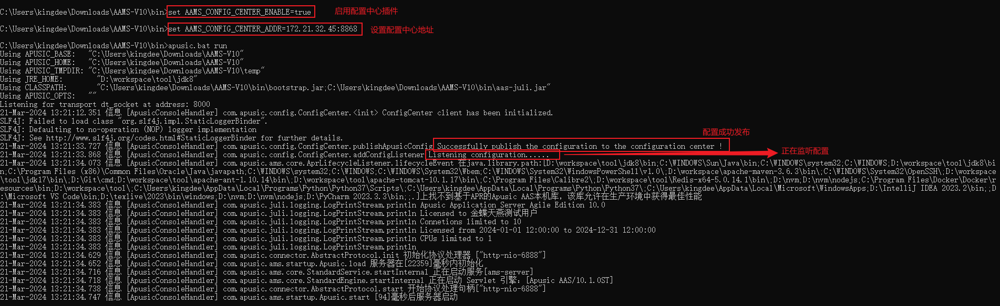
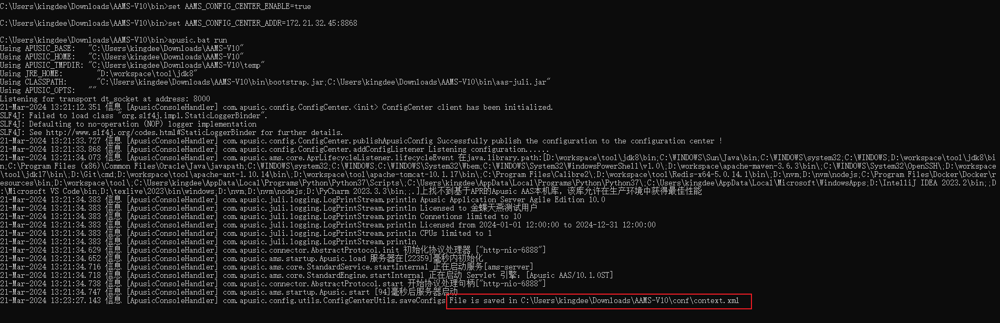
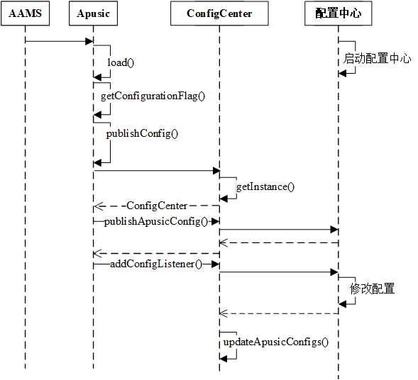
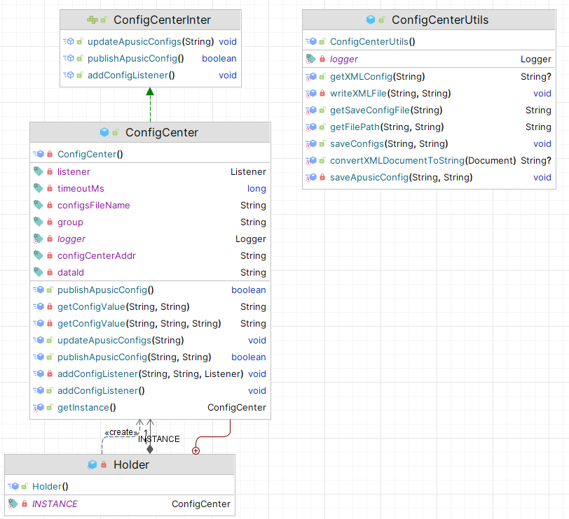

# `aas-config`插件开发文档

## 介绍

`aas-config.jar`是一个专为`Apusic`敏捷版服务器（简称`AAMS`）设计的插件，旨在简化与`Nacos`配置中心的交互过程。借助此插件，`AAMS`能够轻松地从`Nacos`配置中心获取配置信息，并实现配置的自动更新和同步。该插件适用于所有希望通过`Nacos`管理配置的`Java`应用，无论是微服务架构还是传统的单体应用。

### 功能特点

- **简化配置管理**：提供简洁的API，使得从Nacos配置中心获取和更新配置变得简单快捷。
- **动态配置更新**：支持配置更新的动态监听，当Nacos中的配置发生变化时，应用能够实时响应并更新本地配置。

### 目标读者

本文档面向有意使用`aas-config.jar`插件进行开发的`Java`程序员，读者应该对`Java`有基本的了解。

## 快速入门

以下是使用`aas-config.jar`进行基本配置获取操作的快速指南。

### 环境要求

- Java 8 或更高版本
- AAMS-V10大于等于SP9
- Nacos Server (确保Nacos服务已启动并可访问)

### 安装

- 确保`${apusic.base}/conf`下有`configs.xml`文件（ant构建时**已自动导入**）。
- 确保`${apusic.base}/plugins/config`目录下存在对应的jar包（ant构建时**已自动导入**）。
- 配置环境变量`CONFIG_CENTER_ENABLE=true`或者JVM参数`-Dconfig.center.enable=true`启动配置中心插件。
- 在`${apusic.base}/conf`目录中`apusic.properties`文件的`common.loader`参数添加导入类：`"${apusic.base}/plugins/config/*.jar"`。

进入`${apusic.base}/bin`目录启动AAMS：

#### Windows

```bash
apusic.bat run
```

### 使用示例

以下是如何使用`aas-config.jar`对接配置中心的一个简单示例：

#### 设置环境变量或者JVM参数

- Window

  - 环境变量（大小写敏感）

  进入终端设置环境变量或者去设置中配置

  ```
  set AAMS_CONFIG_CENTER_ENABLE=true或者set AAMS_CONFIG_CENTER_ENABLE=true
  ```

  - JVM参数（大小写敏感）

  在`${apusic.base}/conf/apusic.bat`中添加参数`-DAAMS_CONFIG_CENTER_ENABLE=true`即可。

#### aas-config.jar插件配置

主要配置项包括：nacos服务端地址及端口、配置ID、配置分组、读取配置超时时间以及总配置文件名

| 配置项                | 配置参数                                                     | 默认值        | 备注                                            |
| --------------------- | ------------------------------------------------------------ | ------------- | ----------------------------------------------- |
| nacos服务端地址及端口 | 环境变量：AAMS_CONFIG_CENTER_ADDR=${IP}:8848<br />JVM参数：-DAAMS_CONFIG_CENTER_ADDR=${IP}:8848 |               | ${IP}为配置中心所在机器的IP，必须赋值，否则报错 |
| 配置ID                | 环境变量：AAMS_CONFIG_DATA_ID=configs.xml<br />JVM参数：-DAAMS_CONFIG_DATA_ID=configs.xml | configs.xml   |                                                 |
| 配置分组              | 环境变量：AAMS_CONFIG_GROUP=DEFAULT_GROUP<br />JVM参数：-DAAMS_CONFIG_GROUP=DEFAULT_GROUP | DEFAULT_GROUP |                                                 |
| 读取配置超时时间      | 环境变量：AAMS_CONFIG_TIMEOUT_MS=3000<br />JVM参数：-DAAMS_CONFIG_TIMEOUT_MS=3000 | 3000          | nacos官方推荐值                                 |
| 总配置文件名          | 环境变量：AAMS_CONFIG_FILE_NAME=configs.xml<br />JVM参数：-DAAMS_CONFIG_FILE_NAME=configs.xml | configs.xml   |                                                 |

#### 启动AAMS

输入`apusic.bat run`启动aams即可。



随后前往nacos配置中心地址即可看到已经发布的配置


点击编辑对配置进行修改后再次发布，对应的修改将会保存到`${apusic.base}/conf`目录下的文件中。



修改成功后即可在日志中看到修改成功的配置文件保存位置。

#### configs.xml文件格式

插件首先将需要放入配置中心进行配置发布、修改以及监听的配置放入configs.xml文件中，格式如下：

```xml
<?xml version="1.0" encoding="UTF-8"?>
<configs>
<!-- config标签的name属性存放对应文件名，修改后的配置将会保存到name属性对应的文件名中  -->
<config name="apusic.conf">
	<!-- apusic.conf文件中的相关配置    -->
</config>
<config name="context.xml">
<Context>
	<!-- context.xml文件中的相关配置    -->
</Context>
</config>
</configs>
```

## 功能说明

`aas-config.jar`提供以下主要功能：

- **发布配置**：允许用户通过API向配置系统提交新的配置项。
- **监听配置**：允许用户注册监听器，当特定的配置项发生变化时接收通知。
- **更新配置**：支持在配置源中更新配置项，同时通知所有相关的监听器。

## 设计说明

AAMS对接配置中心的调用路径图如下：



在com.apusic.ams.startup.Apusic类中我们添加了如下内容：

### 启用配置中心

这里本着不引入多余的jar包的原则，采用的是反射调用com.apusic.config.ConfigCenter类，类名我们采用静态变量表示。当用户需要启用配置中心时，必须修改apusic.properties文件中的common_loader加载对应插件的类，再将设置启用配置中心的参数AAMS_CONFIG_CENTER_ENABLE为true即可成功获取ConfigCenter的实例并调用该实例的方法。当启用配置中心时，默认监听配置。

```java
    // 配置中心需要调用的类路径
    private static final String CONFIG_CENTER_CLASS = "com.apusic.config.ConfigCenter";
    // 是否开启配置中心
    private static final boolean SHOULD_PUBLISH = Boolean.parseBoolean(getConfigurationFlag());
    // 启用配置中心的环境变量或者JVM参数
    private static final String AAMS_CONFIG_CENTER_ENABLE = "AAMS_CONFIG_CENTER_ENABLE";
    /**
     * 环境变量CONFIG_CENTER_CLASS=true或者JVM参数CONFIG_CENTER_CLASS=true为时发布配置并监听
     */
    private void publishConfig() {
        if (SHOULD_PUBLISH) {
            try {
                // 反射获取类和方法只需一次，之后可以被重用
                Class<?> configCenterClass = Class.forName(CONFIG_CENTER_CLASS);
                Method getInstanceMethod = configCenterClass.getMethod("getInstance");
                Object configCenter = getInstanceMethod.invoke(null);

                Method publishMethod = configCenterClass.getMethod("publishApusicConfig");
                publishMethod.invoke(configCenter);

                Method addListenerMethod = configCenterClass.getMethod("addConfigListener");
                addListenerMethod.invoke(configCenter);

            } catch (Exception e) {
                e.printStackTrace();
                log.error("Publishing configuration exception！");
            }
        }
    }

    /**
     * 环境变量 CONFIG_CENTER_ENABLE=true或者JVM参数-DCONFIG_CENTER_ENABLE=true为时发布配置并监听
     * @return
     */
    private static String getConfigurationFlag() {
        String configCenterEnv = System.getenv(CONFIG_CENTER_ENABLE);
        if (configCenterEnv == null || "false".equals(configCenterEnv)) {
            configCenterEnv = System.getProperty(CONFIG_CENTER_ENABLE);
        }
        return configCenterEnv;
    }
```

### aas-config.jar类图

aas-config.jar插件的类图如下：



### 发布配置

插件采用单例模式设计以确保每个实例中只有一个配置中心类。

单例模式的实现使用静态内部类的方式实现，优点如下：

- 延迟加载：INSTANCE的实例初始化延迟到内部类Holder被加载和初始化时才进行，这样实现了懒加载功能
- 线程安全：Java虚拟机（JVM）在加载类的时候，会执行类的初始化，并且只会执行一次，这保证了线程安全。

```java
    private static class Holder {
        // 配置中心的单例实例。
        private static final ConfigCenter INSTANCE = new ConfigCenter();
    }

    /**
     * 获取ConfigCenter的单例实例。
     *
     * @return ConfigCenter的单例实例。
     */
    public static ConfigCenter getInstance() {
        return Holder.INSTANCE;
    }
```

在实例创建过程中使用私有构造器初始化配置：

```java
    private ConfigCenter() {
        // 初始化配置中心地址，必须指定
        this.configCenterAddr = getConfigValue("AAMS_CONFIG_CENTER_ADDR", "AAMS_CONFIG_CENTER_ADDR");
        // 初始化配置数据ID，从configs.xml文件中读取，如果不存在则使用默认值
        this.dataId = getConfigValue("AAMS_CONFIG_DATA_ID", "AAMS_CONFIG_DATA_ID", "configs.xml");
        // 初始化配置分组，默认使用DEFAULT_GROUP
        this.group = getConfigValue("AAMS_CONFIG_GROUP", "AAMS_CONFIG_GROUP", "DEFAULT_GROUP");
        // 读取配置超时时间，以毫秒为单位，默认为3000
        this.timeoutMs = Long.parseLong(getConfigValue("AAMS_CONFIG_TIMEOUT_MS", "AAMS_CONFIG_TIMEOUT_MS", "3000"));
        // 初始化配置文件名称，默认为configs.xml
        this.configsFileName = getConfigValue("AAMS_CONFIG_FILE_NAME", "AAMS_CONFIG_FILE_NAME", "configs.xml");
        // 创建并初始化监听器，用于接收配置信息更新
        this.listener = new Listener() {
            @Override
            public void receiveConfigInfo(String configInfo) {
                // 当接收到配置信息更新时，更新应用的配置
                updateApusicConfigs(configInfo);
            }

            @Override
            public Executor getExecutor() {
                // 返回null，表示不使用异步处理。可根据需要提供一个执行器。
                return null;
            }
        };
        // 记录配置中心客户端初始化信息
        logger.info("ConfigCenter client has been initialized.");
    }
```

在获取ConfigCenter的实例后，publishConfig方法会调用ConfigCenter实例的publishApusicConfig空参方法，该方法会调用publishApusicConfig(String dataId, String group)方法向配置中心发布配置。

```java
                Method publishMethod = configCenterClass.getMethod("publishApusicConfig");
                publishMethod.invoke(configCenter);
```

```java
public boolean publishApusicConfig() {
    // 尝试发布配置到配置中心
    if (publishApusicConfig(dataId, group)) {
        logger.info("Successfully publish the configuration to the configuration center !");
        return true;
    } else {
        logger.severe("Publish configuration error !");
        return false;
    }
}
```

publishApusicConfig(String dataId, String group)方法首先会判断配置中心的地址是否设置，如果没有设置将会抛出异常。

随后会调用ConfigCenterUtils的getXMLConfig方法将总配置文件configsFileName中的内容转为字符串后调用nacos的SDK发布配置。

```java
    private boolean publishApusicConfig(String dataId, String group) {
        if (configCenterAddr == null) {
            throw new IllegalStateException("Configuration center address not set.");
        }
        try {
            // 初始化配置属性，包括配置中心地址
            Properties properties = new Properties();
            properties.put("serverAddr", configCenterAddr);

            // 创建ConfigService实例，用于与配置中心交互
            ConfigService configService = NacosFactory.createConfigService(properties);

            // 从指定文件获取要发布的配置内容
            String content = ConfigCenterUtils.getXMLConfig(configsFileName);

            // 若配置内容为空，则记录警告信息并返回false
            if (content == null) {
                logger.severe("The content to be published is null.");
                return false;
            }

            // 发布配置到配置中心
            return configService.publishConfig(dataId, group, content);

        } catch (Exception e) {
            // 配置发布失败，记录严重错误信息并返回false
            logger.severe("Failed to publish configuration to ConfigCenter: " + e.getMessage());
            return false;
        }
    }
```

```java
    public static String getXMLConfig(String path) throws FileNotFoundException, XMLParseException {
        // 获取配置文件的完整路径
        String filePath = ConfigCenterUtils.getFilePath("conf", path);
        // 检查文件是否存在
        if (!Files.exists(Paths.get(filePath))) {
            throw new FileNotFoundException();
        }

        // 创建 DocumentBuilderFactory 实例，并设置属性以禁用外部实体，防止 XXE 攻击
        DocumentBuilderFactory factory = DocumentBuilderFactory.newInstance();
        factory.setAttribute(XMLConstants.ACCESS_EXTERNAL_DTD, "");
        factory.setAttribute(XMLConstants.ACCESS_EXTERNAL_SCHEMA, "");

        try (InputStream is = Files.newInputStream(Paths.get(filePath))) {
            // 创建 DocumentBuilder 并解析 XML 文件
            DocumentBuilder builder = factory.newDocumentBuilder();
            Document document = builder.parse(is);
            // 标准化 XML 文档结构
            document.getDocumentElement().normalize();
            // 将解析后的 Document 对象转换为字符串并返回
            return ConfigCenterUtils.convertXMLDocumentToString(document);
        } catch (Exception e) {
            throw new XMLParseException();
        }
    }
```

getXMLConfig方法首先调用getSaveConfigFile以获取不同配置文件的文件名，每个config标签中只有一个name属性，因此，只需要提取第一个匹配的文件名即可。

```java
    public static String getSaveConfigFile(String config) {
        // 编译正则表达式，用于匹配config标签的name属性
        Pattern pattern = Pattern.compile("config\\s+name=\"([^\"]+)\"");
        // 创建Matcher对象，用于在给定的配置信息中查找匹配项
        Matcher matcher = pattern.matcher(config);
        String fileName = null;
        // 遍历配置信息中的所有匹配项
        while (matcher.find()) {
            // 提取并保存第一个匹配的文件名
            fileName = matcher.group(1);
            // 由于我们只提取第一个匹配项，这里可以跳出循环，优化效率
            break;
        }
        return fileName;
    }
```

随后将每个config标签转换为字符串，XML声明在保存的时候再添加到文件中。

```java
    public static String convertXMLDocumentToString(Document doc) {
        TransformerFactory tf = TransformerFactory.newInstance();
        try {
            Transformer transformer = tf.newTransformer();
            // 设置输出属性
            transformer.setOutputProperty(OutputKeys.METHOD, "xml"); // 指定输出为XML格式
            transformer.setOutputProperty(OutputKeys.INDENT, "no"); // 不进行缩进
            transformer.setOutputProperty(OutputKeys.ENCODING, "UTF-8"); // 指定编码为UTF-8
            transformer.setOutputProperty(OutputKeys.OMIT_XML_DECLARATION, "yes"); // 不输出XML声明

            // 使用StringWriter进行转换并获取结果
            try (StringWriter writer = new StringWriter()) {
                transformer.transform(new DOMSource(doc), new StreamResult(writer));
                String output = writer.toString();
                // 如果结果字符串不以XML声明开始，则添加XML声明
                if (!output.startsWith("<?xml")) {
                    String xmlDeclaration = "<?xml version=\"1.0\" encoding=\"UTF-8\"?>\n";
                    output = xmlDeclaration + output;
                }
                return output;
            }
        } catch (Exception e) {
            // 记录转换失败的警告
            logger.severe("The xml file failed to convert the string !");
            return null;
        }
    }
```

### 监听配置

配置发布后使用反射调用addConfigListener无参方法监听配置是否被修改

```java
                Method addListenerMethod = configCenterClass.getMethod("addConfigListener");
                addListenerMethod.invoke(configCenter);
```

addConfigListener同样会检查configCenterAddr是否配置了地址，随后调用nacos的SDK

```java
    private void addConfigListener(String dataId, String group, Listener listener) throws Exception {
        if (configCenterAddr == null) {
            throw new IllegalStateException("Configuration center address not set.");
        }
        // 初始化配置属性，设置配置中心的地址。
        Properties properties = new Properties();
        properties.put("serverAddr", configCenterAddr);

        // 创建配置服务实例，用于与配置中心交互。
        ConfigService configService = NacosFactory.createConfigService(properties);
        String content = configService.getConfig(dataId, group, timeoutMs);
        // 首次加载配置内容。
        logger.info("Listening configuration......");

        // 注册监听器，以便在配置变更时得到通知。
        configService.addListener(dataId, group, listener);
    }
```

### 更新配置

配置的更新主要是在com.alibaba.nacos.api.config.listener.Listener实例中重写的receiveConfigInfo方法调用updateApusicConfigs(String content)实现的

```java
    public void updateApusicConfigs(String content) {
        // 使用ConfigCenterUtils的saveConfigs方法保存配置内容到指定的配置文件中
        ConfigCenterUtils.saveConfigs(content, configsFileName);
    }
```

updateApusicConfigs方法会调用saveConfigs(String config, String configsFileName) 方法。该方法主要步骤如下：

- 首先保存文件到总配置文件
- 使用正则表达式分离config标签中的内容
- 单独处理config标签的name属性为apusic.conf的配置内容
- 调用writeXMLFile方法保存config标签中的内容

```java
    public static void saveConfigs(String config, String configsFileName) {
        // 更新configs.xml文件
        writeXMLFile(getFilePath("conf", configsFileName), config);

        // 使用正则表达式匹配<config>标签内的内容
        Pattern pattern = Pattern.compile("<config [^>]*>(.*?)</config>", Pattern.DOTALL);
        Matcher matcher = pattern.matcher(config);

        while (matcher.find()) {
            // 捕获到的完整的<config>标签内容
            String apusicConfigItem = matcher.group();
            // 解析出配置项将要保存的文件名
            String fileName = getSaveConfigFile(apusicConfigItem);
            if (fileName == null){
                logger.severe("config标签未设置name属性");
                return;
            }
            // 解析出<config>标签内的具体配置项内容
            String configItem = matcher.group(1);

            // 专门处理apusic.conf配置项
            if ("apusic.conf".equals(fileName)) {
                saveApusicConfig(apusicConfigItem, getFilePath("conf", fileName));
                continue;
            }
            // 如果文件名不是以properties结尾，则在配置项前添加XML声明
            if (!fileName.endsWith("properties")) {
                configItem = "<?xml version=\"1.0\" encoding=\"UTF-8\"?>\n" + configItem;
                writeXMLFile(getFilePath("conf", fileName), configItem);
            }
            // 保存配置项到对应的文件中
            writeXMLFile(getFilePath("conf", fileName), configItem);
            // 记录保存成功的日志信息
            logger.info("File is saved in " + getFilePath("conf", fileName));
        }
    }
```


## 版本历史

- **1.0.0** - 初始发布。提供基本基本配置发布、配置监听以及配置修改功能


观察者模式结合单例模式

```java
public class ApolloPluginLoader implements LifecycleListener {

    private static final Log logger = LogFactory.getLog(ApolloPluginLoader.class);

    public static final String AAS_CONFIG_APOLLO_APP_ID           = "AAS_CONFIG_APOLLO_APP_ID";
    public static final String AAS_CONFIG_APOLLO_ACCESSKEY_SECRET  = "AAS_CONFIG_APOLLO_ACCESSKEY_SECRET";
    public static final String AAS_CONFIG_APOLLO_META_SERVER      = "AAS_CONFIG_APOLLO_META_SERVER";
    public static final String AAS_CONFIG_APOLLO_CLUSTER          = "AAS_CONFIG_APOLLO_CLUSTER";
    public static final String AAS_CONFIG_APOLLO_IDC              = "AAS_CONFIG_APOLLO_IDC";
    public static final String AAS_CONFIG_APOLLO_NAMESPACE        = "AAS_CONFIG_APOLLO_NAMESPACE";
    public static final String AAS_CONFIG_APOLLO_ENV              = "AAS_CONFIG_APOLLO_ENV";

    private static final String _APOLLO_CLUSTER_                  = "apollo.cluster";

    private ClassLoader classloader;

    /**
     * 应用ID
     */
    private String appId;

    /**
     *
     */
    private String  accessKeySecret;

    /**
     * 命名空间
     */
    private String namespace;

    /**
     * 集群名称
     */
    private String cluster;

    /**
     * meta server地址
     */
    private String metaUrl;

    /**
     * 数据中心
     */
    private String idc;

    /**
     * 环境
     */
    private String env;
    public String getAppId() {
        return appId;
    }

    public void setAppId(String appId) {
        this.appId = appId;
    }

    public String getAccessKeySecret() {
        return accessKeySecret;
    }

    public void setAccessKeySecret(String accessKeySecret) {
        this.accessKeySecret = accessKeySecret;
    }

    public String getNamespace() {
        return namespace;
    }

    public void setNamespace(String namespace) {
        this.namespace = namespace;
    }

    public String getCluster() {
        return cluster;
    }

    public void setCluster(String cluster) {
        this.cluster = cluster;
    }

    public String getMetaUrl() {
        return metaUrl;
    }

    public void setMetaUrl(String metaUrl) {
        this.metaUrl = metaUrl;
    }

    public String getIdc() {
        return idc;
    }

    public void setIdc(String idc) {
        this.idc = idc;
    }

    public String getEnv() {
        return env;
    }

    public void setEnv(String env) {
        this.env = env;
    }
    public ApolloPluginLoader() {    
        File file = CloudUtil.getFile("plugins", "apollo");
        List<URL> urlList = new ArrayList<URL>();
        try {
            urlList.add(new File(file, "aas-apollo.jar").toURI().toURL());
            if(file.isDirectory()) {
                for(File jar : file.listFiles()) {
                    if(jar.getName().equals("aas-apollo.jar")) {
                        continue;
                    } else if(jar.getName().endsWith(".jar")) {
                        urlList.add(jar.toURI().toURL());
                    }
                }
            }
        } catch (MalformedURLException e) {
        }
        classloader = new URLClassLoader(urlList.toArray(new URL[urlList.size()]), Thread.currentThread().getContextClassLoader());
    }
    @Override
    public void lifecycleEvent(LifecycleEvent event) {
    	resetParameters();
        if(metaUrl == null || appId == null) {
            logger.error("apollo config not set!!! ");
            return;
        }
        ClassLoader oldClassLoader = Thread.currentThread().getContextClassLoader();
        // com.ctrip.framework.apollo.util.ConfigUtil会从系统属性中获取cluster，我们需要使用自己的cluster
        String oldCluster = System.getProperty(_APOLLO_CLUSTER_);
        try {
            // 设置到系统参数
            setSystemProperty(_APOLLO_CLUSTER_, cluster, "");
            setSystemProperty(AAS_CONFIG_APOLLO_APP_ID, appId, "");
            setSystemProperty(AAS_CONFIG_APOLLO_ACCESSKEY_SECRET, accessKeySecret, "");
            setSystemProperty(AAS_CONFIG_APOLLO_META_SERVER, metaUrl, "");
            setSystemProperty(AAS_CONFIG_APOLLO_CLUSTER, cluster, "");
            setSystemProperty(AAS_CONFIG_APOLLO_IDC, idc, "");
            setSystemProperty(AAS_CONFIG_APOLLO_NAMESPACE, namespace, "");
            setSystemProperty(AAS_CONFIG_APOLLO_ENV, env, "");

            Thread.currentThread().setContextClassLoader(classloader);
            Class<?> clazz = classloader.loadClass("com.apusic.ams.apollo.config.ApolloConfigMgr");
            Constructor<?> constructor = clazz.getConstructor(new Class[]{String.class, String.class, String.class, String.class, String.class, String.class});
            CloudConfigMgr mgr = (CloudConfigMgr) constructor.newInstance(new Object[]{metaUrl, appId, idc, cluster, namespace, env});
            mgr.addCloudConfig(new ApusicConfig());
            mgr.addCloudConfig(new JvmConfig());
            mgr.addCloudConfig(new LoggingConfig());
            mgr.addCloudConfig(new DataSourceConfig());
            mgr.addCloudConfig(new CachedConfig());

            mgr.fetch();
            mgr.watch();
        } catch (Exception e) {
            throw new RuntimeException(e);
        } finally {
            Thread.currentThread().setContextClassLoader(oldClassLoader);
            setSystemProperty(_APOLLO_CLUSTER_, oldCluster, "");
        }
    }
    private void setSystemProperty(String name, String value, String ifNullValue) {
        System.setProperty(name, value == null ? ifNullValue : value);
    }

    /**
     * 优先从系统变量中获取,如果有值，则覆盖配置文件的值
     */
    private void resetParameters() {
    	String _appId = System.getProperty(AAS_CONFIG_APOLLO_APP_ID, System.getenv(AAS_CONFIG_APOLLO_APP_ID));
        String _accessKeySecret = System.getProperty(AAS_CONFIG_APOLLO_ACCESSKEY_SECRET, System.getenv(AAS_CONFIG_APOLLO_ACCESSKEY_SECRET));
    	String _metaUrl = System.getProperty(AAS_CONFIG_APOLLO_META_SERVER, System.getenv(AAS_CONFIG_APOLLO_META_SERVER));
    	String _cluster = System.getProperty(AAS_CONFIG_APOLLO_CLUSTER, System.getenv(AAS_CONFIG_APOLLO_CLUSTER));
    	String _idc = System.getProperty(AAS_CONFIG_APOLLO_IDC, System.getenv(AAS_CONFIG_APOLLO_IDC));
    	String _namespace = System.getProperty(AAS_CONFIG_APOLLO_NAMESPACE, System.getenv(AAS_CONFIG_APOLLO_NAMESPACE));
    	String _env = System.getProperty(AAS_CONFIG_APOLLO_ENV, System.getenv(AAS_CONFIG_APOLLO_ENV));
    	if(_appId !=null && _appId.length()>0) {
    		appId = _appId;
    	}
        if(_accessKeySecret !=null && _accessKeySecret.length()>0) {
            accessKeySecret = _accessKeySecret;
        }
    	if(_metaUrl !=null && _metaUrl.length()>0) {
    		metaUrl = _metaUrl;
    	}
    	if(_cluster !=null && _cluster.length()>0) {
    		cluster = _cluster;
    	}
    	if(_idc !=null && _idc.length()>0) {
    		idc = _idc;
    	}
    	if(_namespace !=null && _namespace.length()>0) {
    		namespace = _namespace;
    	}
    	if(_env !=null && _env.length()>0) {
    		env = _env;
    	}    	
    }
}
```

