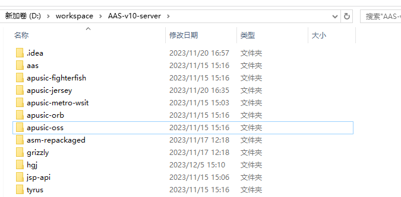

# 【AAS-V10】构建方式

## 前置条件

```shell
JDK8+
Maven 3.0.3+
apusic-fighterfish (http://gitlab.apusic.com/aas-group/apusic-fighterfish.git)
apusic-jersey (http://gitlab.apusic.com/aas-group/apusic-jersey.git)
apusic-metro-wsit (http://gitlab.apusic.com/aas-group/apusic-metro-wsit.git)
grizzly (http://gitlab.apusic.com/aas-group/grizzly.git)
apusic-oss (http://gitlab.apusic.com/aas-group/apusic-oss.git)
```

## 目录



## 构建命令

```shell
D:\workspace\AAS-v10-server\apusic-oss>mvn install
D:\workspace\AAS-v10-server\aas\prerequisites>mvn initialize
D:\workspace\AAS-v10-server\aas>mvn -Pstaging clean  install -Dmaven.multiModuleProjectDirectory=D:\workspace\AAS-v10-learn\apusic-jersey -Djdk8_tools_jar=D:\workspace\jdk1.8.0_144\lib\tools.jar
D:\workspace\AAS-v10-server\aas>mvn -Pstaging clean  install -Dmaven.multiModuleProjectDirectory=D:\workspace\AAS-v10-learn\apusic-metro-wsit\wsit -Djdk8_tools_jar=D:\workspace\jdk1.8.0_144\lib\tools.jar
D:\workspace\AAS-v10-server\aas>mvn -Pstaging clean  install -Dmaven.multiModuleProjectDirectory=D:\workspace\AAS-v10-learn\apusic-fighterfish -Djdk8_tools_jar=D:\workspace\jdk1.8.0_144\lib\tools.jar

cd apusic-oss mvn install
cd ../aas/prerequisites>mvn initialize
```

# 打包成docker镜像文件

## 设置镜像加速

```shell
vim /etc/docker/daemon.json
```

```json
{
	"registry-mirrors": [
		"https://9cpn8tt6.mirror.aliyuncs.com",
		"https://registry.docker-cn.com"
	]
}
```

## 重启docker

```
systemctl restart docker
```

## 前置条件

```
sudo mkdir /opt/AAS
cp -r ${AAS-V10.zip-Path} 
unzip AAS-V10.zip -d AAS-V10 # 只能在linux下解压
启动AAS并设置密码，随后关闭AAS
rm -r -f AAS-V10.zip
docker build  -t  aas-v10 .
docker run -p 6888:6888 -p 6848:6848 --name="AAS-V10" -dit aas-v10 # 测试运行
docker save aas-v10 > aas-v10-docker.tar # 导出镜像
```

```dockerfile
FROM adoptopenjdk/openjdk8
# 第一次打包成镜像后不用再次RUN
RUN apt-get -o Acquire::Check-Valid-Until=false update && apt-get install vim -y && \
    apt-get  install net-tools -y
ADD . /opt
WORKDIR /opt/AAS-V10/ApusicAS/aas/bin
# CMD /opt/AAS-V10/ApusicAS/aas/bin/asadmin start-domain && tail -f /dev/null
CMD /opt/AAS-V10/ApusicAS/aas/bin/startserv -d
EXPOSE 6888/tcp 6848/tcp
```

