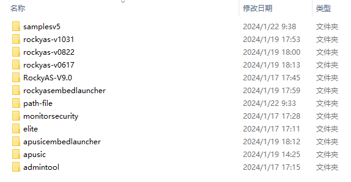

# 【AAS-V9】构建方式

## 平安版本

### 前置条件

```
jdk1.8
maven 3.6.3
ant 1.10.14
```

文件结构：



### 0617

```bash
@echo off
SET EmbedLauncherDir=ApusicEmbedLauncher
SET BuildVersion=build-pingan
SET RELEASE_TYPE=D

call ant -file backup.xml -DEmbedLauncherDir=%EmbedLauncherDir% -DBuildVersion=%BuildVersion% -DRELEASE_TYPE=%RELEASE_TYPE% clean
if %ERRORLEVEL% neq 0 exit /b %ERRORLEVEL%

call ant -file build.xml -DEmbedLauncherDir=%EmbedLauncherDir% -DBuildVersion=%BuildVersion% -DRELEASE_TYPE=%RELEASE_TYPE%
if %ERRORLEVEL% neq 0 exit /b %ERRORLEVEL%

call ant -file build.xml -DEmbedLauncherDir=%EmbedLauncherDir% -DBuildVersion=%BuildVersion% -DRELEASE_TYPE=%RELEASE_TYPE% -Dtest.skip=true dist-all
if %ERRORLEVEL% neq 0 exit /b %ERRORLEVEL%

call ant -file build.xml -DEmbedLauncherDir=%EmbedLauncherDir% -DBuildVersion=%BuildVersion% -DRELEASE_TYPE=%RELEASE_TYPE% -Ddebug=true -Drazor.file=../admintool/dist/razor.jar -Dtest.skip=true copy-razor-webtool -propertyfile build-pingan.properties
if %ERRORLEVEL% neq 0 exit /b %ERRORLEVEL%

call ant -file build.xml -DEmbedLauncherDir=%EmbedLauncherDir% -DBuildVersion=%BuildVersion% -DRELEASE_TYPE=%RELEASE_TYPE% -Dproduct.release.type=%RELEASE_TYPE% dist-zip -propertyfile build-pingan.properties
if %ERRORLEVEL% neq 0 exit /b %ERRORLEVEL%

call ant -file backup.xml -DEmbedLauncherDir=%EmbedLauncherDir% -DBuildVersion=%BuildVersion% -DRELEASE_TYPE=%RELEASE_TYPE% source.backup
if %ERRORLEVEL% neq 0 exit /b %ERRORLEVEL%

call mvn -f ../../monitorsecurity/apusic-aasadmin-maven-build/pom.xml clean install -Dcobertura.aggregate=false -Dmaven.test.skip=true
if %ERRORLEVEL% neq 0 exit /b %ERRORLEVEL%

echo All tasks completed successfully.
```

```shell
#!/bin/bash

# Setting environment variables
EmbedLauncherDir="ApusicEmbedLauncher"
BuildVersion="build-pingan"
RELEASE_TYPE="D"

# Call ant with backup.xml and check for errors
ant -file backup.xml -DEmbedLauncherDir="$EmbedLauncherDir" -DBuildVersion="$BuildVersion" -DRELEASE_TYPE="$RELEASE_TYPE" clean
if [ $? -ne 0 ]; then
    exit $?
fi

# Call ant with build.xml and check for errors
ant -file build.xml -DEmbedLauncherDir="$EmbedLauncherDir" -DBuildVersion="$BuildVersion" -DRELEASE_TYPE="$RELEASE_TYPE"
if [ $? -ne 0 ]; then
    exit $?
fi

# Call ant with build.xml for dist-all and check for errors
ant -file build.xml -DEmbedLauncherDir="$EmbedLauncherDir" -DBuildVersion="$BuildVersion" -DRELEASE_TYPE="$RELEASE_TYPE" -Dtest.skip=true dist-all
if [ $? -ne 0 ]; then
    exit $?
fi

# Call ant with build.xml for copy-razor-webtool and check for errors
ant -file build.xml -DEmbedLauncherDir="$EmbedLauncherDir" -DBuildVersion="$BuildVersion" -DRELEASE_TYPE="$RELEASE_TYPE" -Ddebug=true -Drazor.file=../admintool/dist/razor.jar -Dtest.skip=true copy-razor-webtool -propertyfile build-pingan.properties
if [ $? -ne 0 ]; then
    exit $?
fi

# Call ant with build.xml for dist-zip and check for errors
ant -file build.xml -DEmbedLauncherDir="$EmbedLauncherDir" -DBuildVersion="$BuildVersion" -DRELEASE_TYPE="$RELEASE_TYPE" -Dproduct.release.type="$RELEASE_TYPE" dist-zip -propertyfile build-pingan.properties
if [ $? -ne 0 ]; then
    exit $?
fi

# Call ant with backup.xml for source.backup and check for errors
ant -file backup.xml -DEmbedLauncherDir="$EmbedLauncherDir" -DBuildVersion="$BuildVersion" -DRELEASE_TYPE="$RELEASE_TYPE" source.backup
if [ $? -ne 0 ]; then
    exit $?
fi

# Call mvn clean install and check for errors
mvn -f ../../monitorsecurity/apusic-aasadmin-maven-build/pom.xml clean install -Dcobertura.aggregate=false -Dmaven.test.skip=true
if [ $? -ne 0 ]; then
    exit $?
fi

echo "All tasks completed successfully."
```


### 0822

```bash
@echo off
SET EmbedLauncherDir=RockyASEmbedLauncher
SET BuildVersion=build-pingan
SET RELEASE_TYPE=D

call ant -file backup.xml -DEmbedLauncherDir=%EmbedLauncherDir% -DBuildVersion=%BuildVersion% -DRELEASE_TYPE=%RELEASE_TYPE% clean
if %ERRORLEVEL% neq 0 exit /b %ERRORLEVEL%

call ant -file build.xml -DEmbedLauncherDir=%EmbedLauncherDir% -DBuildVersion=%BuildVersion% -DRELEASE_TYPE=%RELEASE_TYPE%
if %ERRORLEVEL% neq 0 exit /b %ERRORLEVEL%

call ant -file build.xml -DEmbedLauncherDir=%EmbedLauncherDir% -DBuildVersion=%BuildVersion% -DRELEASE_TYPE=%RELEASE_TYPE% -Dtest.skip=true dist-all
if %ERRORLEVEL% neq 0 exit /b %ERRORLEVEL%

call ant -file build.xml -DEmbedLauncherDir=%EmbedLauncherDir% -DBuildVersion=%BuildVersion% -DRELEASE_TYPE=%RELEASE_TYPE% -Ddebug=true -Drazor.file=../admintool/dist/razor.jar -Dtest.skip=true copy-razor-webtool -propertyfile build-pingan.properties
if %ERRORLEVEL% neq 0 exit /b %ERRORLEVEL%

call ant -file build.xml -DEmbedLauncherDir=%EmbedLauncherDir% -DBuildVersion=%BuildVersion% -DRELEASE_TYPE=%RELEASE_TYPE% -Dproduct.release.type=%RELEASE_TYPE% dist-zip -propertyfile build-pingan.properties
if %ERRORLEVEL% neq 0 exit /b %ERRORLEVEL%

call ant -file backup.xml -DEmbedLauncherDir=%EmbedLauncherDir% -DBuildVersion=%BuildVersion% -DRELEASE_TYPE=%RELEASE_TYPE% source.backup
if %ERRORLEVEL% neq 0 exit /b %ERRORLEVEL%

call mvn -f ../../monitorsecurity/apusic-aasadmin-maven-build/pom.xml clean install -Dcobertura.aggregate=false -Dmaven.test.skip=true
if %ERRORLEVEL% neq 0 exit /b %ERRORLEVEL%

echo All tasks completed successfully.
```

```shell
#!/bin/bash

# Disable echo to prevent command output
set +x

# Set environment variables
EmbedLauncherDir="RockyASEmbedLauncher"
BuildVersion="build-pingan"
RELEASE_TYPE="D"

# Call ant with backup.xml and check for errors
ant -file backup.xml -DEmbedLauncherDir="${EmbedLauncherDir}" -DBuildVersion="${BuildVersion}" -DRELEASE_TYPE="${RELEASE_TYPE}" clean
if [ $? -ne 0 ]; then
    exit $?
fi

# Call ant with build.xml and check for errors
ant -file build.xml -DEmbedLauncherDir="${EmbedLauncherDir}" -DBuildVersion="${BuildVersion}" -DRELEASE_TYPE="${RELEASE_TYPE}"
if [ $? -ne 0 ]; then
    exit $?
fi

# Call ant with build.xml for dist-all and check for errors
ant -file build.xml -DEmbedLauncherDir="${EmbedLauncherDir}" -DBuildVersion="${BuildVersion}" -DRELEASE_TYPE="${RELEASE_TYPE}" -Dtest.skip=true dist-all
if [ $? -ne 0 ]; then
    exit $?
fi

# Call ant with build.xml for copy-razor-webtool and check for errors
ant -file build.xml -DEmbedLauncherDir="${EmbedLauncherDir}" -DBuildVersion="${BuildVersion}" -DRELEASE_TYPE="${RELEASE_TYPE}" -Ddebug=true -Drazor.file=../admintool/dist/razor.jar -Dtest.skip=true copy-razor-webtool -propertyfile build-pingan.properties
if [ $? -ne 0 ]; then
    exit $?
fi

# Call ant with build.xml for dist-zip and check for errors
ant -file build.xml -DEmbedLauncherDir="${EmbedLauncherDir}" -DBuildVersion="${BuildVersion}" -DRELEASE_TYPE="${RELEASE_TYPE}" -Dproduct.release.type="${RELEASE_TYPE}" dist-zip -propertyfile build-pingan.properties
if [ $? -ne 0 ]; then
    exit $?
fi

# Call ant with backup.xml for source.backup and check for errors
ant -file backup.xml -DEmbedLauncherDir="${EmbedLauncherDir}" -DBuildVersion="${BuildVersion}" -DRELEASE_TYPE="${RELEASE_TYPE}" source.backup
if [ $? -ne 0 ]; then
    exit $?
fi

# Call mvn clean install and check for errors
mvn -f ../../monitorsecurity/apusic-aasadmin-maven-build/pom.xml clean install -Dcobertura.aggregate=false -Dmaven.test.skip=true
if [ $? -ne 0 ]; then
    exit $?
fi

echo "All tasks completed successfully."
```


### 1031

```bash
@echo off
SET EmbedLauncherDir=RockyASEmbedLauncher
SET BuildVersion=build-pingan
SET RELEASE_TYPE=D

call ant -file backup.xml -DEmbedLauncherDir=%EmbedLauncherDir% -DBuildVersion=%BuildVersion% -DRELEASE_TYPE=%RELEASE_TYPE% clean
if %ERRORLEVEL% neq 0 exit /b %ERRORLEVEL%

call ant -file build.xml -DEmbedLauncherDir=%EmbedLauncherDir% -DBuildVersion=%BuildVersion% -DRELEASE_TYPE=%RELEASE_TYPE%
if %ERRORLEVEL% neq 0 exit /b %ERRORLEVEL%

call ant -file build.xml -DEmbedLauncherDir=%EmbedLauncherDir% -DBuildVersion=%BuildVersion% -DRELEASE_TYPE=%RELEASE_TYPE% -Dtest.skip=true dist-all
if %ERRORLEVEL% neq 0 exit /b %ERRORLEVEL%

call ant -file build.xml -DEmbedLauncherDir=%EmbedLauncherDir% -DBuildVersion=%BuildVersion% -DRELEASE_TYPE=%RELEASE_TYPE% -Ddebug=true -Drazor.file=../admintool/dist/razor.jar -Dtest.skip=true copy-razor-webtool -propertyfile build-pingan.properties
if %ERRORLEVEL% neq 0 exit /b %ERRORLEVEL%

call ant -file build.xml -DEmbedLauncherDir=%EmbedLauncherDir% -DBuildVersion=%BuildVersion% -DRELEASE_TYPE=%RELEASE_TYPE% -Dproduct.release.type=%RELEASE_TYPE% dist-zip -propertyfile build-pingan.properties
if %ERRORLEVEL% neq 0 exit /b %ERRORLEVEL%

call ant -file backup.xml -DEmbedLauncherDir=%EmbedLauncherDir% -DBuildVersion=%BuildVersion% -DRELEASE_TYPE=%RELEASE_TYPE% source.backup
if %ERRORLEVEL% neq 0 exit /b %ERRORLEVEL%

call mvn -f ../../monitorsecurity/apusic-aasadmin-maven-build/pom.xml clean install -Dcobertura.aggregate=false -Dmaven.test.skip=true
if %ERRORLEVEL% neq 0 exit /b %ERRORLEVEL%

echo All tasks completed successfully.
```

```shell
#!/bin/bash

# Disable echo to prevent command output
set +x

# Set environment variables
EmbedLauncherDir="RockyASEmbedLauncher"
BuildVersion="build-pingan"
RELEASE_TYPE="D"

# Call ant with backup.xml and check for errors
ant -file backup.xml -DEmbedLauncherDir="${EmbedLauncherDir}" -DBuildVersion="${BuildVersion}" -DRELEASE_TYPE="${RELEASE_TYPE}" clean
if [ $? -ne 0 ]; then
    exit $?
fi

# Call ant with build.xml and check for errors
ant -file build.xml -DEmbedLauncherDir="${EmbedLauncherDir}" -DBuildVersion="${BuildVersion}" -DRELEASE_TYPE="${RELEASE_TYPE}"
if [ $? -ne 0 ]; then
    exit $?
fi

# Call ant with build.xml for dist-all and check for errors
ant -file build.xml -DEmbedLauncherDir="${EmbedLauncherDir}" -DBuildVersion="${BuildVersion}" -DRELEASE_TYPE="${RELEASE_TYPE}" -Dtest.skip=true dist-all
if [ $? -ne 0 ]; then
    exit $?
fi

# Call ant with build.xml for copy-razor-webtool and check for errors
ant -file build.xml -DEmbedLauncherDir="${EmbedLauncherDir}" -DBuildVersion="${BuildVersion}" -DRELEASE_TYPE="${RELEASE_TYPE}" -Ddebug=true -Drazor.file=../admintool/dist/razor.jar -Dtest.skip=true copy-razor-webtool -propertyfile build-pingan.properties
if [ $? -ne 0 ]; then
    exit $?
fi

# Call ant with build.xml for dist-zip and check for errors
ant -file build.xml -DEmbedLauncherDir="${EmbedLauncherDir}" -DBuildVersion="${BuildVersion}" -DRELEASE_TYPE="${RELEASE_TYPE}" -Dproduct.release.type="${RELEASE_TYPE}" dist-zip -propertyfile build-pingan.properties
if [ $? -ne 0 ]; then
    exit $?
fi

# Call ant with backup.xml for source.backup and check for errors
ant -file backup.xml -DEmbedLauncherDir="${EmbedLauncherDir}" -DBuildVersion="${BuildVersion}" -DRELEASE_TYPE="${RELEASE_TYPE}" source.backup
if [ $? -ne 0 ]; then
    exit $?
fi

# Call mvn clean install and check for errors
mvn -f ../../monitorsecurity/apusic-aasadmin-maven-build/pom.xml clean install -Dcobertura.aggregate=false -Dmaven.test.skip=true
if [ $? -ne 0 ]; then
    exit $?
fi

echo "All tasks completed successfully."
```

