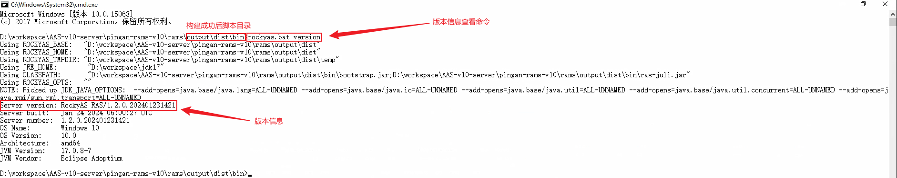
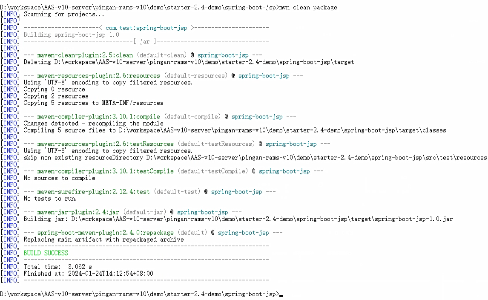
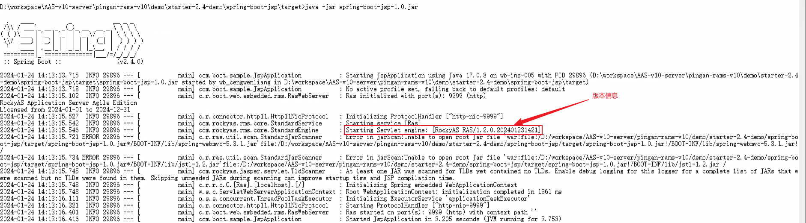

# 【RAS-V10】平安版本号变更方式

## 需求

要求RAMS-V10和RAMS-V11版本号变更，变更要求下：

```
RockyASRAS/1.2.0.202401231421——>对应RAMS-V10
RockyASRAS/1.3.0.202401231421——>对应RAMS-V11
```

## 实现

修改`pingan-rams/rams/build-pingan.properties`文件：

### RAMS-V10

修改细节如下，其中`202401231421`表示在`2024`年`1`月`23`日`14:21`时修改过该版本。

```properties
_inc.dir=lic/include-pingan
version.major=1
version.minor=2
version.build=0
version.patch=202401231421
version.suffix=
use.domain=false
tomcat-native.version=1.2.23
```

### RAMS-V11

与`RAMS-V10`同理。

```properties
_inc.dir=lic/include-pingan
version.major=1
version.minor=3
version.build=0
version.patch=202401231421
version.suffix=
use.domain=false
tomcat-native.version=1.2.23
```

## 验证

构建完成并导入到`maven`仓库之后，可以通过以下方式进行验证：

### 敏捷版

构建成功后进入脚本目录，输入命令`rockyas.bat version`查看版本，如下图所示，版本信息会在`Server version`后输出。



### 嵌入版

嵌入版需要运行相应的`demo`验证效果，在`pingan-rams-v10/demo`中存放了不同版本的`demo`。选中一个打包后，使用命令`java -jar xxx.jar`运行即可在终端查看到版本信息。下面以`pingan-rams-v10\demo\starter-2.4-demo\spring-boot-jsp`为例进行验证。

#### 打包



#### 运行验证

验证需要将`license.xml`和要运行的`jar`包放在同一目录下，运行`java -jar spring-boot-jsp-1.0.jar`后可以在终端看到版本信息已经输出。



### 脚本查看版本信息

```bash
@echo off
setlocal enabledelayedexpansion

REM 检查命令行参数并设置外部JAR文件路径
if "%~1"=="-j" (
    set "OUTER_JAR_FILE=%~2"
) else (
    echo Usage: %~nx0 -j [JAR_FILE]
    exit /b
)

REM 设置内部JAR文件和properties文件的路径
set INNER_JAR_PATH=BOOT-INF/lib/ras-embed-core-11.0.0.jar
set PROP_FILE_PATH=com\rockyas\rms\util\ServerInfo.properties

REM 创建临时目录用来存放提取的JAR和properties文件
set TEMP_DIR=%~dp0temp
set INNER_JAR_TEMP_DIR=%TEMP_DIR%\inner_jar
mkdir "%INNER_JAR_TEMP_DIR%" >nul 2>&1

REM 提取内部JAR到临时目录
pushd "%TEMP_DIR%"
jar -xf "%~dp0%OUTER_JAR_FILE%" "%INNER_JAR_PATH%"
if errorlevel 1 (
    echo Error: Failed to extract %INNER_JAR_PATH% from %OUTER_JAR_FILE%
    exit /b
)
popd

REM 解压内部JAR以获取properties文件
pushd "%INNER_JAR_TEMP_DIR%"
jar -xf "%TEMP_DIR%\%INNER_JAR_PATH%" "%PROP_FILE_PATH%"
if errorlevel 1 (
    echo Error: Failed to extract %PROP_FILE_PATH% from %INNER_JAR_PATH%
    exit /b
)
popd

REM 读取properties文件中的属性值
set PROP_VALUE=
for /f "tokens=1* delims==" %%a in ('type "%INNER_JAR_TEMP_DIR%\%PROP_FILE_PATH%" 2^>nul') do (
    if "%%a"=="server.info" (
        REM 删除行首和行尾的空格
        set "PROP_VALUE=%%b"
        set "PROP_VALUE=!PROP_VALUE: =!"
        goto output
    )
)

:output
REM 输出属性值
if not defined PROP_VALUE (
    echo Property server.info not found.
) else (
    echo server.info=!PROP_VALUE!
)

REM 清理临时文件
rmdir /q /s "%TEMP_DIR%"

endlocal
```

