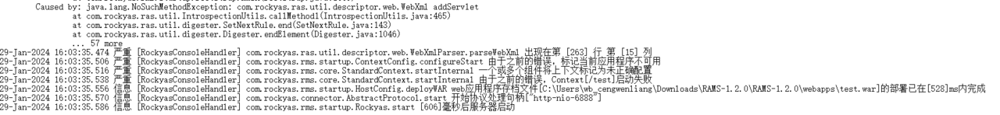
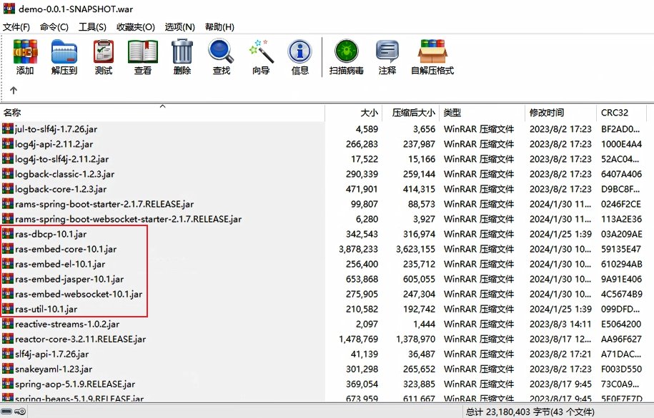

# 【RAS-V10】应用部署问题

## 问题描述

在嵌入版上成功启动Spring boot应用后，打包成为war无法放在RAMS的webapps下部署，控制台报错如下：

## 问题原因

这个问题是因为RAMS/lib下的ras-util-scan.jar与应用中的core包冲突导致的问题。

## 实现方案

删除应用中的六个嵌入版的jar包即可解决该问题。

## 关联影响

无关联影响。
