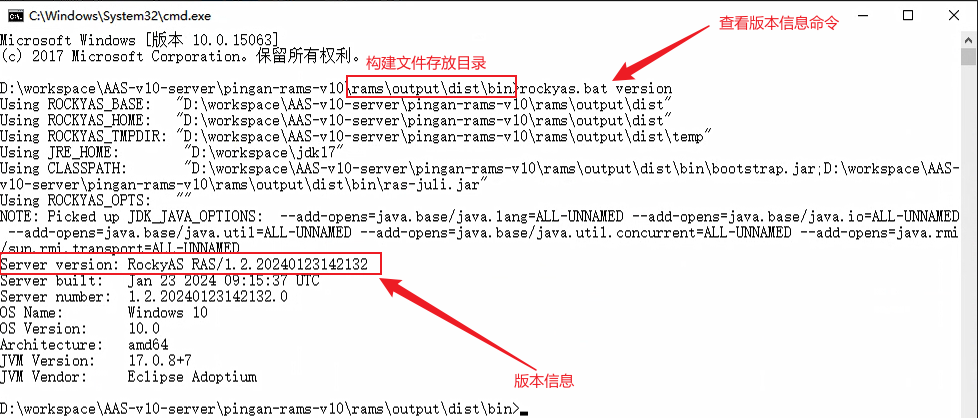
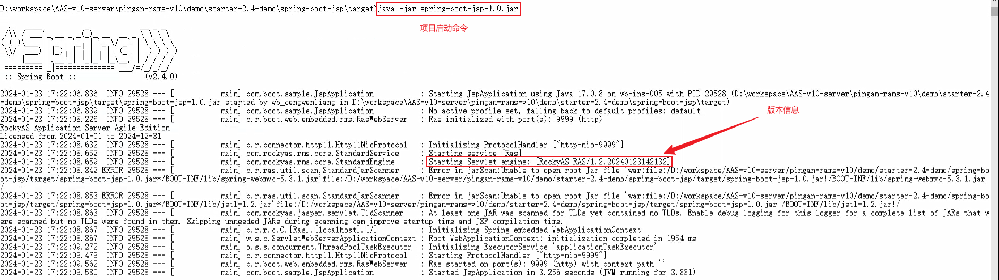

# 【RAMS】平安版本号变更方式

## 需求

要求RAMS-V10和RAMS-V11版本号变更，变更要求下：

```
RockyASRAS/1.2.202401231421——>对应RAMS-V10
RockyASRAS/1.3.202401231421——>对应RAMS-V11
```

## 实现

修改`pingan-rams/rams/build-pingan.properties`文件：

### RAMS-V10

修改细节如下，其中`20240123142132`表示在`2024`年`1`月`23`日`14:21:32`时修改过该版本。

```properties
_inc.dir=lic/include-pingan
version.major=1
version.minor=2
version.build=20240123142132
version.patch=0
version.suffix=
use.domain=false
tomcat-native.version=1.2.23
```

### RAMS-V11

与`RAMS-V10`同理。

```properties
_inc.dir=lic/include-pingan
version.major=1
version.minor=3
version.build=20240123142132
version.patch=0
version.suffix=
use.domain=false
tomcat-native.version=1.2.23
```

## 验证

构建完成并导入到`maven`仓库之后，可以通过以下方式进行验证：

### 敏捷版

构建成功后进入脚本目录，输入命令`rockyas.bat version`查看版本，如下图所示，版本信息会在`Server version`后输出。



### 嵌入版

嵌入版需要运行相应的`demo`验证效果，在`pingan-rams-v10/demo`中存放了不同版本的`demo`。选中一个打包后，使用命令`java -jar xxx.jar`运行即可在终端查看到版本信息。下面以`pingan-rams-v10\demo\starter-2.4-demo\spring-boot-jsp`为例进行验证。

#### 打包


#### 运行验证

验证需要将`license.xml`和要运行的`jar`包放在同一目录下，运行`java -jar spring-boot-jsp-1.0.jar`后可以在终端看到版本信息已经输出。

