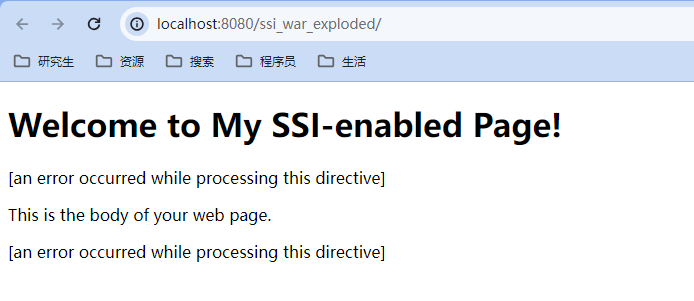
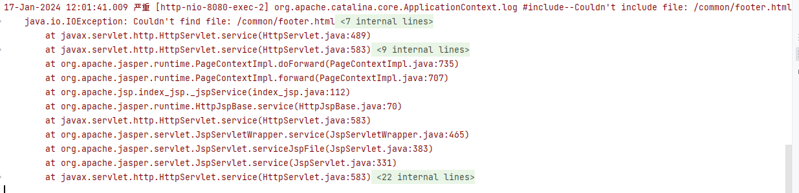
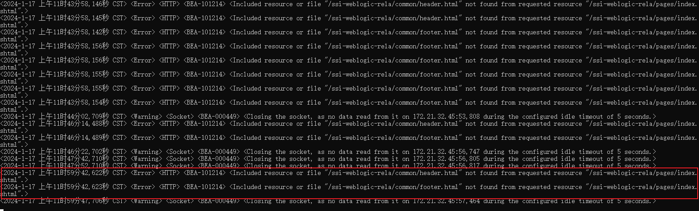

# 【AAS-6296】SSI找不到文件

## 源码

**index.jsp**

```jsp
<%@ page contentType="text/html;charset=UTF-8" language="java" %>
<jsp:forward page="/pages/index.shtml"></jsp:forward>
```

**index.shtml**

```html
<!-- index.shtml -->
<!DOCTYPE html>
<html lang="en">
<head>
    <meta charset="UTF-8">
    <title>My SSI Page</title>
</head>
<body>
<h1>Welcome to My SSI-enabled Page!</h1>
<!--#include virtual="/common/header.html"-->
<p>This is the body of your web page.</p>
<!--#include virtual="/common/footer.html"-->
</body>
</html>
```

**header.html**

```html
<!-- header.html -->
<header>
  <h2>This is the header.</h2>
</header>
```

**footer.html**

```html
<!-- footer.html -->
<footer>
  <p>&copy; 2023 My Website</p>
</footer>
```

## 文件目录


## Tomcat测试

### web.xml配置

```xml
<?xml version="1.0" encoding="UTF-8"?>
<web-app xmlns="http://xmlns.jcp.org/xml/ns/javaee"
         xmlns:xsi="http://www.w3.org/2001/XMLSchema-instance"
         xsi:schemaLocation="http://xmlns.jcp.org/xml/ns/javaee http://xmlns.jcp.org/xml/ns/javaee/web-app_4_0.xsd"
         version="4.0">
    <servlet>
        <servlet-name>ssi</servlet-name>
        <servlet-class>
            org.apache.catalina.ssi.SSIServlet
        </servlet-class>
        <init-param>
            <param-name>buffered</param-name>
            <param-value>1</param-value>
        </init-param>
        <init-param>
            <param-name>debug</param-name>
            <param-value>0</param-value>
        </init-param>
        <init-param>
            <param-name>expires</param-name>
            <param-value>666</param-value>
        </init-param>
        <init-param>
            <param-name>isVirtualWebappRelative</param-name>
            <!--这里不修改为true的话会出现问题-->
            <param-value>true</param-value>
        </init-param>
        <!--手动配置编码-->
        <init-param>
            <param-name>inputEncoding</param-name>
            <param-value>UTF-8</param-value>
        </init-param>
        <init-param>
            <param-name>outputEncoding</param-name>
            <param-value>UTF-8</param-value>
        </init-param>

        <load-on-startup>4</load-on-startup>
    </servlet>
    <servlet-mapping>
        <servlet-name>ssi</servlet-name>
        <url-pattern>*.shtml</url-pattern>
        <url-pattern>*.html</url-pattern>
    </servlet-mapping>
    <mime-mapping>
        <extension>shtml</extension>
        <mime-type>text/html</mime-type>
    </mime-mapping>
    <welcome-file-list>
        <welcome-file>index.jsp</welcome-file>
    </welcome-file-list>
</web-app>
```

### 访问测试

访问http://localhost:8080/ssi_war_exploded/显示如下：



### 错误信息



### 错误分析

错误信息显示找不到/comon/footer.html文件，

## weblogic测试

### web.xml配置

```xml
<?xml version="1.0" encoding="UTF-8"?>
<web-app xmlns="http://xmlns.jcp.org/xml/ns/javaee"
         xmlns:xsi="http://www.w3.org/2001/XMLSchema-instance"
         xsi:schemaLocation="http://xmlns.jcp.org/xml/ns/javaee http://xmlns.jcp.org/xml/ns/javaee/web-app_4_0.xsd"
         version="4.0">
    <servlet>
        <servlet-name>ssi</servlet-name>
        <servlet-class>weblogic.servlet.ServerSideIncludeServlet</servlet-class>
        <init-param>
            <param-name>inputEncoding</param-name>
            <param-value>utf-8</param-value>
        </init-param>
        <init-param>
            <param-name>outputEncoding</param-name>
            <param-value>utf-8</param-value>
        </init-param>
    </servlet>
    <servlet-mapping>
        <servlet-name>ssi</servlet-name>
        <url-pattern>*.shtml</url-pattern>
        <url-pattern>*.html</url-pattern>
    </servlet-mapping>
    <mime-mapping>
        <extension>shtml</extension>
        <mime-type>text/html</mime-type>
    </mime-mapping>
    <welcome-file-list>
        <welcome-file>index.jsp</welcome-file>
    </welcome-file-list>
</web-app>
```

### 访问测试

访问http://localhost:8080/ssi_war_exploded/显示如下：


### 错误信息


## AAS测试

### web.xml配置

```xml
<?xml version="1.0" encoding="UTF-8"?>
<web-app xmlns="http://xmlns.jcp.org/xml/ns/javaee"
         xmlns:xsi="http://www.w3.org/2001/XMLSchema-instance"
         xsi:schemaLocation="http://xmlns.jcp.org/xml/ns/javaee http://xmlns.jcp.org/xml/ns/javaee/web-app_4_0.xsd"
         version="4.0">
    <welcome-file-list>
        <welcome-file>index.jsp</welcome-file>
    </welcome-file-list>
</web-app>
```

### 访问测试

访问http://localhost:8080/ssi_war_exploded/显示如下：


### 错误信息



### 问题分析

在debug模式下定位问题输出现在获取fullURI的过程中出现了问题，AAS获取的路径并不是ssi-aas-rela/pages/common/header.shtml，而是ssi-aas-rela/common/header.shtml，然而在web下并没有common文件夹，导致找不到这个shtml。


### 解决思路

在绝对路径下查找失败后，拼接资源地址，随后传输给getRequestDispathcher方法。

修改代码如下：

```
try {
	    RequestDispatcher rd = getServletContext().getRequestDispatcher(target);
	    rd.include(request, response);
	} catch (FileNotFoundException e) {
	} catch (FileNotFoundException e1) {
	    error(_T(SSI_INCLUDE_NOT_FOUND, target));
		try{
			RequestDispatcher rd = getServletContext().getRequestDispatcher(Utils.resolvePath(this.path, target));
			rd.include(request, response);
		}catch  (FileNotFoundException e2) {
			error(_T(SSI_INCLUDE_NOT_FOUND, target));
		}
	}
```

这种方式下的修改还是会出现问题，因为做了error操作，这会导致页面上出现一行错误之后才能出现一行正常的，因此需要对其进行改进，使用判断文件是否存在来决定用哪种方法，如果两个位置都不存在的话，则在相对路径下报告异常，代码如下：

