# 【Bug】Nacos发布流控规则无法到Sentinel Dashboard

## 目录
[1. 目录](#目录)
[2. 依赖](#依赖)
[3. 配置](#配置)
[4. nacos配置流控](#nacos配置流控)
[5. Sentinel Dashboard配置流控](#sentinel-dashboard配置流控)
    [5.1 情况一](#情况一)
    [5.2 情况二](#情况二)


## 依赖

```xml
<!-- sentinel-gateway依赖 -->
<dependency>
    <groupId>com.alibaba.cloud</groupId>
    <artifactId>spring-cloud-alibaba-sentinel-gateway</artifactId>
</dependency>
<!-- sentinel-datasource-nacos依赖 -->
<dependency>
    <groupId>com.alibaba.csp</groupId>
    <artifactId>sentinel-datasource-nacos</artifactId>
</dependency>
```

## 配置

```yaml
spring:
  cloud:
    nacos:
      server-addr:  # Nacos 服务器地址
      username: # Nacos用户名
      password: # Nacos密码
      discovery: # 【配置中心】配置项
        namespace: dev # 命名空间。这里使用 dev 开发环境
        group: DEFAULT_GROUP # 使用的 Nacos 配置分组，默认为 DEFAULT_GROUP
      config: # 【注册中心】配置项
        namespace: dev # 命名空间。这里使用 dev 开发环境
        group: DEFAULT_GROUP # 使用的 Nacos 配置分组，默认为 DEFAULT_GROUP
    sentinel:
      datasource:
        r1:
          nacos:
            username: # Nacos用户名
            password: # Nacos密码
            namespace: dev
            # nacos地址
            server-addr: # Nacos 服务器地址
            # nacos中配置文件的data-id
            data-id: ${spring.application.name}-sentinel
            # nacos 分组
            group-id: DEFAULT_GROUP
            # 规则类型 流控
            rule-type: flow
      transport:
        dashboard: 127.0.0.1:8080
        client-ip: 127.0.0.1
```

## nacos配置流控

由于微服务创建的时候是用的是`dev`命名空间，因此需要在`dev`命名空间中创建配置。

```json
[
	{
        "resource": "system-admin-api",
        "resourceMode": 0,
        "count": 10,
        "grade": 1,
		"controlBehavior": 0,
        "intervalSec": 10,
        "burst": 0,
        "maxQueueingTimeoutMs": 1000
	}
]
```

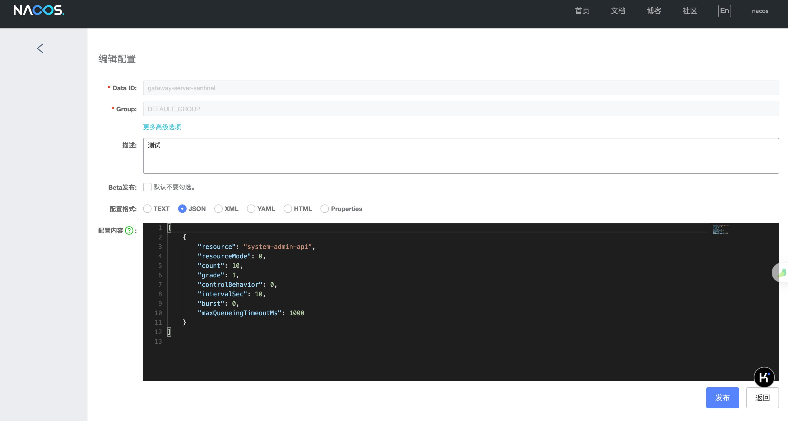

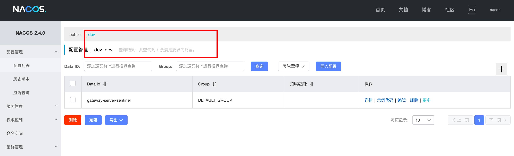

此时可以看到我们设置的QPS是10，然后启动Sentinel Dashboard、网关和相应的业务微服务。

访问system-admin-api服务，可以看到QPS设置为10时访问没问题。

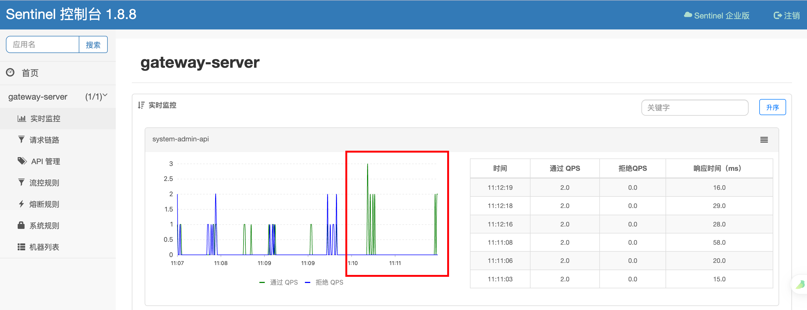

修改Nacos配置进行限流（修改count为2）

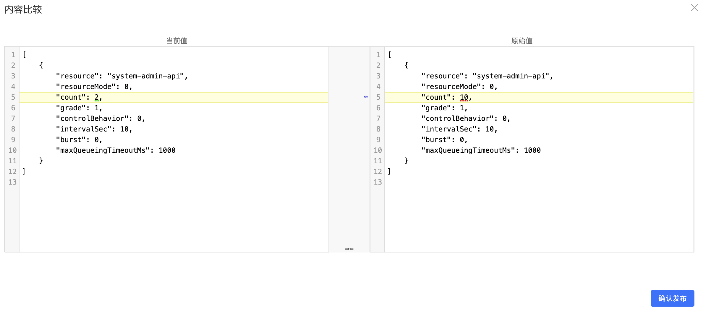

查看sentinel的record日志可以看到已经修改成功。

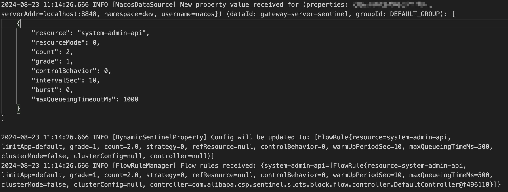


测试后可以发现已经生效，1s内如果发送三个请求会被拦截一个。

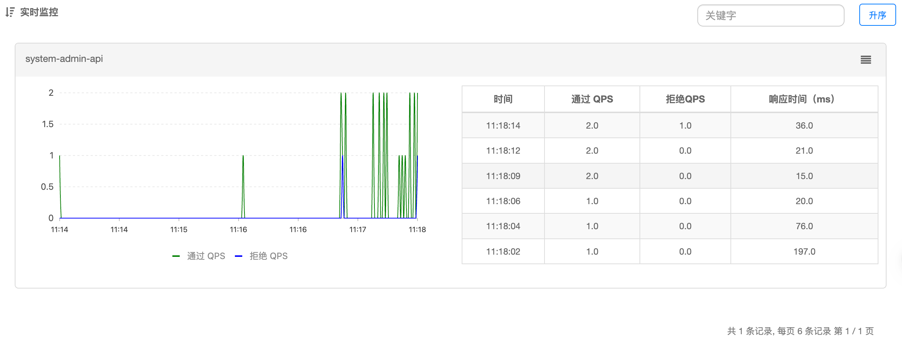

但是Sentinel Dashboard并未显示对应的值。

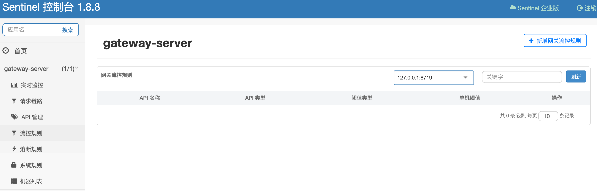

## Sentinel Dashboard配置流控

### 情况一

在上面的情况中我们直接添加流控规则，将QPS的阈值设置为10。

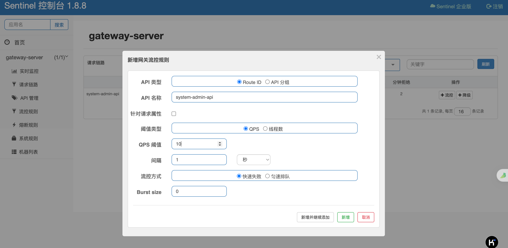

可以看到并未生效

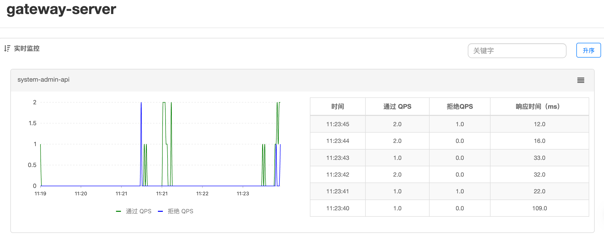

但是Dashboard控制台显示修改成功。

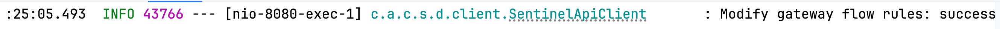

### 情况二

重启网关和其他服务，先从dashboard配置再从nacos配置

此时nacos中的配置如下

```json
[
	{
        "resource": "system-admin-api",
        "resourceMode": 0,
        "count": 2,
        "grade": 1,
		"controlBehavior": 0,
        "intervalSec": 10,
        "burst": 0,
        "maxQueueingTimeoutMs": 1000
	}
]
```

dashboard的流控规则界面如下，由于是从内存中读取，每次的流控规则需要重新配置。

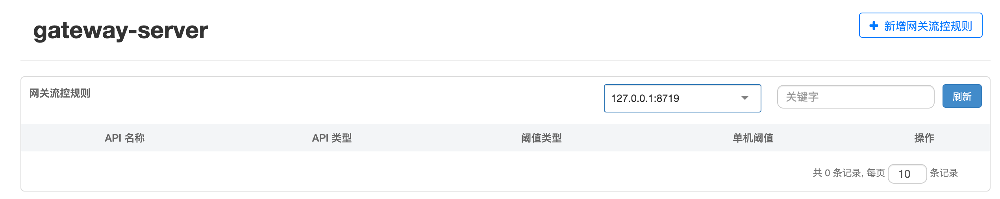

但是从实时监控的面板上可以看到nacos中的配置已经生效了

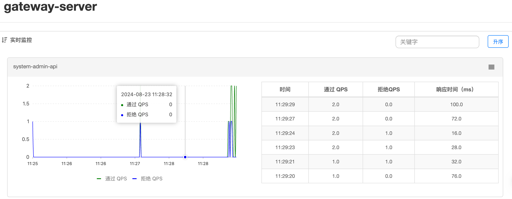

此时通过dashboard配置流控规则将QPS设置为1。

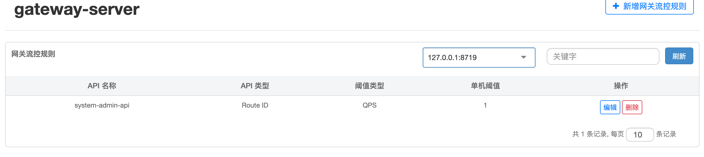

可以看到已经生效


然后再去nacos发布如下配置

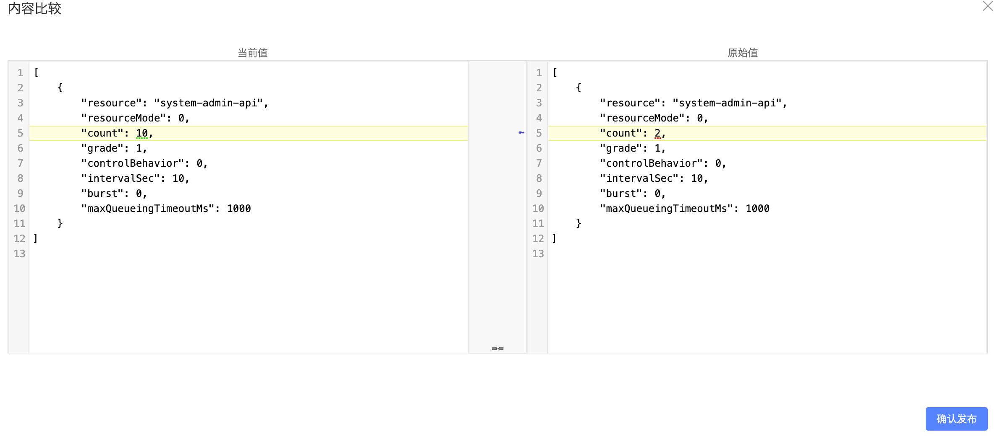

在sentinel record日志中可以看到已经更新了

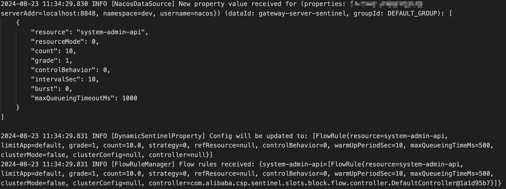

但是实际测试中显示更新失败

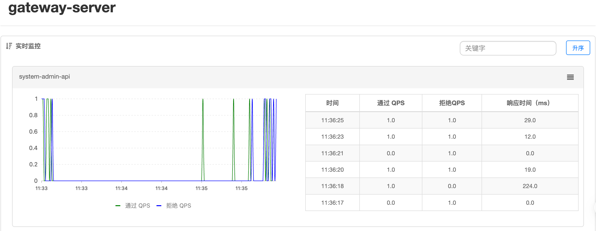

同时dashboard中显示的流控规则的QPS没有改变。

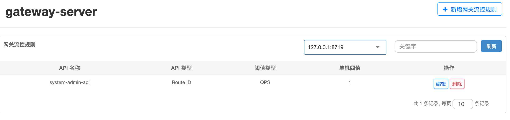