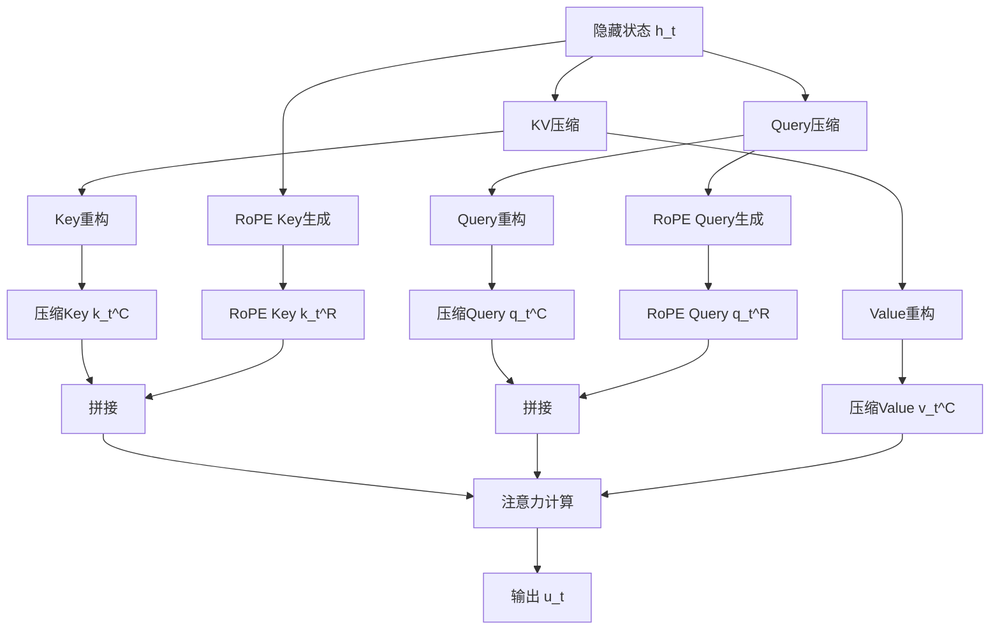

# MLA中的KV联合压缩机制解析

<head>
  
</head>

## KV压缩的详细解释

### 1. 传统注意力机制中的KV存储
在传统的Transformer架构中，每个token都需要存储其对应的Key和Value向量：
- Key向量维度：$d_h \times n_h$
- Value向量维度：$d_h \times n_h$
- 每个token总共需要存储：$2 \times d_h \times n_h$维度的信息
- 对于长度为$L$的序列，总共需要存储：$2 \times d_h \times n_h \times L$维度的信息

### 2. MLA的联合压缩方案

#### 2.1 压缩过程
$$
\mathbf{c}_t^{KV} = \mathbf{W}^{DKV}\mathbf{h}_t
$$

其中：
- $\mathbf{h}_t \in \mathbb{R}^d$：原始隐藏状态，维度为$d$
- $\mathbf{W}^{DKV} \in \mathbb{R}^{d_c \times d}$：降维投影矩阵
- $\mathbf{c}_t^{KV} \in \mathbb{R}^{d_c}$：压缩后的联合表示，维度为$d_c$
- $d_c \ll d_h \times n_h$：压缩维度远小于原始维度

压缩的关键点：
1. **联合表示**：不再分别存储K和V，而是存储一个统一的压缩向量
2. **维度压缩**：通过低秩投影将高维信息压缩到低维空间
3. **信息保留**：投影矩阵$\mathbf{W}^{DKV}$经过训练，能够保留关键信息

#### 2.2 重构过程
从压缩向量重构Key和Value：
$$
\mathbf{k}_t^C = \mathbf{W}^{UK}\mathbf{c}_t^{KV}
$$
$$
\mathbf{v}_t^C = \mathbf{W}^{UV}\mathbf{c}_t^{KV}
$$

其中：
- $\mathbf{W}^{UK} \in \mathbb{R}^{(d_h n_h) \times d_c}$：Key的重构矩阵
- $\mathbf{W}^{UV} \in \mathbb{R}^{(d_h n_h) \times d_c}$：Value的重构矩阵
- $\mathbf{k}_t^C, \mathbf{v}_t^C \in \mathbb{R}^{d_h n_h}$：重构后的Key和Value向量

##### 重构过程详解

1. **维度转换过程**：
   - 输入：压缩向量$\mathbf{c}_t^{KV} \in \mathbb{R}^{d_c}$
   - Key重构：$\mathbb{R}^{d_c} \xrightarrow{\mathbf{W}^{UK}} \mathbb{R}^{d_h n_h}$
   - Value重构：$\mathbb{R}^{d_c} \xrightarrow{\mathbf{W}^{UV}} \mathbb{R}^{d_h n_h}$

2. **矩阵运算展开**：
   $$
   \begin{aligned}
   \mathbf{k}_t^C &= \mathbf{W}^{UK}\mathbf{c}_t^{KV} \\
   &= \mathbf{W}^{UK}(\mathbf{W}^{DKV}\mathbf{h}_t) \\
   &= (\mathbf{W}^{UK}\mathbf{W}^{DKV})\mathbf{h}_t
   \end{aligned}
   $$

   $$
   \begin{aligned}
   \mathbf{v}_t^C &= \mathbf{W}^{UV}\mathbf{c}_t^{KV} \\
   &= \mathbf{W}^{UV}(\mathbf{W}^{DKV}\mathbf{h}_t) \\
   &= (\mathbf{W}^{UV}\mathbf{W}^{DKV})\mathbf{h}_t
   \end{aligned}
   $$

3. **重构矩阵的作用**：
   - $\mathbf{W}^{UK}$：将压缩空间映射回Key空间，恢复Key信息
   - $\mathbf{W}^{UV}$：将压缩空间映射回Value空间，恢复Value信息
   - 这两个矩阵学习不同的映射关系，以重构出不同的特征

4. **推理优化**：
   - 可以预计算：$\mathbf{W}^{UK}\mathbf{W}^{DKV}$和$\mathbf{W}^{UV}\mathbf{W}^{DKV}$
   - 直接从$\mathbf{h}_t$得到$\mathbf{k}_t^C$和$\mathbf{v}_t^C$
   - 减少了中间计算步骤

5. **信息重构的特点**：
   - **非完全重构**：由于维度压缩，无法完全还原原始信息
   - **特征提取**：重构矩阵学习提取最重要的特征
   - **任务适应**：重构过程针对具体任务进行优化

6. **与注意力机制的结合**：
   - 重构的Key用于计算注意力分数
   - 重构的Value用于生成输出表示
   - 整个过程保持可微性，支持端到端训练

7. **计算复杂度分析**：
   - 原始计算：$O(d_h n_h)$
   - 压缩重构：$O(d_c)$ + $O(d_h n_h d_c)$
   - 当$d_c \ll d_h n_h$时，计算量显著减少

### 3. 压缩效果分析

#### 3.1 存储空间对比
原始存储：
- 每个token：$2 \times d_h \times n_h$维度
- 总存储：$2 \times d_h \times n_h \times L$维度

压缩后存储：
- 每个token：$d_c$维度
- 总存储：$d_c \times L$维度

压缩比：
$$
\text{压缩比} = \frac{2 \times d_h \times n_h}{d_c}
$$

#### 3.2 计算优化
在推理阶段：
1. $\mathbf{W}^{UK}$可以与查询矩阵$\mathbf{W}^Q$合并
2. $\mathbf{W}^{UV}$可以与输出矩阵$\mathbf{W}^O$合并
3. 避免了显式的Key和Value计算过程

### 4. 训练策略
1. **端到端训练**：压缩和重构矩阵与模型其他部分一起训练
2. **损失函数**：包含重构质量和任务性能的多目标优化
3. **正则化**：可能需要添加约束确保压缩信息的有效性

## Query压缩机制

### 1. Query压缩的动机
为了进一步减少训练过程中的激活内存占用，MLA还对Query进行了压缩处理。虽然这不能减少KV缓存的大小，但可以显著降低训练时的内存消耗。

### 2. Query压缩过程

#### 2.1 基本公式
$$
\mathbf{c}_t^Q = \mathbf{W}^{DQ}\mathbf{h}_t
$$
$$
\mathbf{q}_t^C = \mathbf{W}^{UQ}\mathbf{c}_t^Q
$$

其中：
- $\mathbf{c}_t^Q \in \mathbb{R}^{d_c'}$：Query的压缩向量
- $d_c'$：Query压缩维度，满足$d_c' \ll d_h n_h$
- $\mathbf{W}^{DQ} \in \mathbb{R}^{d_c' \times d}$：Query的降维投影矩阵
- $\mathbf{W}^{UQ} \in \mathbb{R}^{d_h n_h \times d_c'}$：Query的上投影矩阵

#### 2.2 Query压缩的特点
1. **独立压缩空间**：
   - Query使用独立的压缩维度$d_c'$
   - 可以与KV压缩维度$d_c$不同
   - 允许更灵活的压缩策略

2. **矩阵运算展开**：
   $$
   \begin{aligned}
   \mathbf{q}_t^C &= \mathbf{W}^{UQ}\mathbf{c}_t^Q \\
   &= \mathbf{W}^{UQ}(\mathbf{W}^{DQ}\mathbf{h}_t) \\
   &= (\mathbf{W}^{UQ}\mathbf{W}^{DQ})\mathbf{h}_t
   \end{aligned}
   $$

3. **优化特点**：
   - 训练时减少激活内存
   - 推理时可以预计算$\mathbf{W}^{UQ}\mathbf{W}^{DQ}$
   - 不影响KV缓存大小

### 3. 完整的MLA注意力计算

#### 3.1 压缩和重构流程
1. **压缩阶段**：
   $$
   \begin{aligned}
   \mathbf{c}_t^{KV} &= \mathbf{W}^{DKV}\mathbf{h}_t \\
   \mathbf{c}_t^Q &= \mathbf{W}^{DQ}\mathbf{h}_t
   \end{aligned}
   $$

2. **重构阶段**：
   $$
   \begin{aligned}
   \mathbf{k}_t^C &= \mathbf{W}^{UK}\mathbf{c}_t^{KV} \\
   \mathbf{v}_t^C &= \mathbf{W}^{UV}\mathbf{c}_t^{KV} \\
   \mathbf{q}_t^C &= \mathbf{W}^{UQ}\mathbf{c}_t^Q
   \end{aligned}
   $$

#### 3.2 注意力计算
$$
\text{Attention}(\mathbf{q}_t^C, \mathbf{k}_t^C, \mathbf{v}_t^C) = \text{softmax}\left(\frac{\mathbf{q}_t^C(\mathbf{k}_t^C)^T}{\sqrt{d_k}}\right)\mathbf{v}_t^C
$$

### 4. 内存优化效果

#### 4.1 训练阶段
1. **激活内存减少**：
   - Query压缩：$d_h n_h \rightarrow d_c'$
   - KV压缩：$2d_h n_h \rightarrow d_c$
   - 总减少：$(3d_h n_h) \rightarrow (d_c + d_c')$

2. **计算效率**：
   - 压缩计算开销：$O(d_c + d_c')$
   - 重构计算开销：$O(d_h n_h(d_c + d_c'))$
   - 当$d_c, d_c' \ll d_h n_h$时效率提升显著

#### 4.2 推理阶段
1. **存储优化**：
   - 只需缓存压缩后的KV向量
   - 存储空间减少到原来的$\frac{d_c}{2d_h n_h}$

2. **计算优化**：
   - 预计算投影矩阵的组合
   - 避免重复的压缩重构计算
   - 减少推理时的计算量

### 5. 实现考虑

1. **压缩维度选择**：
   - $d_c$和$d_c'$的选择需要权衡压缩率和性能
   - 可以根据具体任务调整压缩维度
   - 建议通过实验确定最佳值

2. **训练策略**：
   - 使用渐进式压缩训练
   - 添加重构损失项
   - 适当的正则化约束

3. **数值稳定性**：
   - 注意投影矩阵的初始化
   - 可能需要添加层归一化
   - 监控训练过程中的梯度值

## 解耦旋转位置编码 (Decoupled RoPE)

### 1. RoPE与MLA的兼容性问题

#### 1.1 原始RoPE的局限性
1. **位置敏感性冲突**：
   - RoPE对Key和Query都是位置敏感的
   - 如果将RoPE应用于压缩后的Key ($\mathbf{k}_t^C$)，$\mathbf{W}^{UK}$将与位置相关
   - 这会导致$\mathbf{W}^{UK}$无法在推理时被吸收到$\mathbf{W}^Q$中

2. **计算效率问题**：
   - 需要为每个前缀token重新计算Key
   - 显著降低推理效率
   - 违背了MLA的设计初衷

### 2. 解耦RoPE策略

#### 2.1 基本思想
引入额外的多头查询$\mathbf{q}_{t,i}^R \in \mathbb{R}^{d_h^R}$和共享密钥$\mathbf{k}_t^R \in \mathbb{R}^{d_h^R}$来承载位置信息：

#### 2.2 核心公式
1. **RoPE查询生成**：
   $$
   [\mathbf{q}_{t,1}^R, \mathbf{q}_{t,2}^R, ..., \mathbf{q}_{t,n_h}^R] = \mathbf{q}_t^R = \text{RoPE}(\mathbf{W}^{QR}\mathbf{c}_t^Q)
   $$

2. **RoPE密钥生成**：
   $$
   \mathbf{k}_t^R = \text{RoPE}(\mathbf{W}^{KR}\mathbf{h}_t)
   $$

3. **查询和密钥拼接**：
   $$
   \mathbf{q}_{t,i} = [\mathbf{q}_{t,i}^C; \mathbf{q}_{t,i}^R]
   $$
   $$
   \mathbf{k}_{t,i} = [\mathbf{k}_{t,i}^C; \mathbf{k}_t^R]
   $$

4. **注意力计算**：
   $$
   \mathbf{o}_{t,i} = \sum_{j=1}^t \text{Softmax}_j(\frac{\mathbf{q}_{t,i}^T\mathbf{k}_{j,i}}{\sqrt{d_h + d_h^R}})\mathbf{v}_{j,i}^C
   $$

5. **输出计算**：
   $$
   \mathbf{u}_t = \mathbf{W}^O[\mathbf{o}_{t,1}; \mathbf{o}_{t,2}; ...; \mathbf{o}_{t,n_h}]
   $$

#### 2.3 关键参数说明
- $d_h^R$：解耦查询和密钥的每头维度
- $\mathbf{W}^{QR} \in \mathbb{R}^{d_h^R n_h \times d_c'}$：RoPE查询生成矩阵
- $\mathbf{W}^{KR} \in \mathbb{R}^{d_h^R \times d}$：RoPE密钥生成矩阵

### 3. 解耦RoPE的优势

#### 3.1 计算效率
1. **推理优化**：
   - 共享密钥$\mathbf{k}_t^R$只需计算一次
   - 避免了重复计算位置编码
   - 保持了MLA的推理效率

2. **内存效率**：
   - 额外存储开销较小：$(d_c + d_h^R)l$元素
   - 相比原始RoPE更节省内存
   - 不影响MLA的压缩效果

#### 3.2 模型能力
1. **位置感知**：
   - 保留了RoPE的位置编码能力
   - 通过解耦方式避免了与MLA的冲突
   - 支持更长的上下文建模

2. **灵活性**：
   - 可以独立调整内容表示和位置表示的维度
   - 便于在不同任务中进行优化
   - 支持异构注意力机制

### 4. 实现注意事项

1. **维度选择**：
   - $d_h^R$的选择需要平衡位置编码能力和计算开销
   - 建议通过实验确定最佳比例
   - 考虑具体任务的位置敏感度需求

2. **训练策略**：
   - 可以采用渐进式训练
   - 注意位置编码的学习率调整
   - 监控位置信息的有效性

3. **集成建议**：
   - 与其他位置编码方案的兼容性
   - 在不同层使用不同的$d_h^R$
   - 考虑任务特定的优化

## MLA完整流程总结

### 1. 整体架构

### 2. 计算流程

#### 2.1 压缩阶段
1. **KV联合压缩**：
   $$\mathbf{c}_t^{KV} = \mathbf{W}^{DKV}\mathbf{h}_t$$

2. **Query压缩**：
   $$\mathbf{c}_t^Q = \mathbf{W}^{DQ}\mathbf{h}_t$$

3. **RoPE密钥生成**：
   $$\mathbf{k}_t^R = \text{RoPE}(\mathbf{W}^{KR}\mathbf{h}_t)$$

#### 2.2 重构阶段
1. **KV重构**：
   $$\mathbf{k}_t^C = \mathbf{W}^{UK}\mathbf{c}_t^{KV}$$
   $$\mathbf{v}_t^C = \mathbf{W}^{UV}\mathbf{c}_t^{KV}$$

2. **Query重构和RoPE生成**：
   $$\mathbf{q}_t^C = \mathbf{W}^{UQ}\mathbf{c}_t^Q$$
   $$[\mathbf{q}_{t,1}^R, ..., \mathbf{q}_{t,n_h}^R] = \text{RoPE}(\mathbf{W}^{QR}\mathbf{c}_t^Q)$$

#### 2.3 拼接阶段
1. **Query拼接**：
   $$\mathbf{q}_{t,i} = [\mathbf{q}_{t,i}^C; \mathbf{q}_{t,i}^R]$$

2. **Key拼接**：
   $$\mathbf{k}_{t,i} = [\mathbf{k}_{t,i}^C; \mathbf{k}_t^R]$$

#### 2.4 注意力计算
$$\mathbf{o}_{t,i} = \sum_{j=1}^t \text{Softmax}_j(\frac{\mathbf{q}_{t,i}^T\mathbf{k}_{j,i}}{\sqrt{d_h + d_h^R}})\mathbf{v}_{j,i}^C$$

#### 2.5 输出生成
$$\mathbf{u}_t = \mathbf{W}^O[\mathbf{o}_{t,1}; \mathbf{o}_{t,2}; ...; \mathbf{o}_{t,n_h}]$$

### 3. 关键优化点

#### 3.1 存储优化
1. **训练阶段**：
   - 总内存减少：$(3d_h n_h) \rightarrow (d_c + d_c')$
   - KV缓存：$(d_c + d_h^R)l$元素

2. **推理阶段**：
   - 预计算矩阵组合
   - 共享RoPE密钥
   - 避免重复计算

#### 3.2 计算优化
1. **矩阵预计算**：
   - $\mathbf{W}^{UK}\mathbf{W}^{DKV}$
   - $\mathbf{W}^{UV}\mathbf{W}^{DKV}$
   - $\mathbf{W}^{UQ}\mathbf{W}^{DQ}$

2. **RoPE优化**：
   - 共享密钥计算
   - 解耦位置编码
   - 避免重复生成

### 4. 实现要点

1. **维度选择**：
   - $d_c \ll d_h n_h$：KV压缩维度
   - $d_c' \ll d_h n_h$：Query压缩维度
   - $d_h^R$：RoPE维度

2. **训练策略**：
   - 渐进式压缩训练
   - 多目标损失函数
   - 位置编码学习率调整

3. **数值稳定性**：
   - 矩阵初始化
   - 层归一化
   - 梯度监控

## MLA计算过程示例

### 1. 参数设置
为简化计算，我们使用一个小规模示例：
- 隐藏状态维度：$d = 4$
- 注意力头数：$n_h = 2$
- 每头维度：$d_h = 2$
- KV压缩维度：$d_c = 2$
- Query压缩维度：$d_c' = 2$
- RoPE维度：$d_h^R = 1$
- 序列长度：$L = 2$

### 2. 具体计算过程

#### 2.1 输入向量
$$
\mathbf{h}_t = \begin{bmatrix} 0.5 \\ -0.3 \\ 0.2 \\ -0.1 \end{bmatrix}
$$

#### 2.2 压缩阶段
1. **KV联合压缩**：
   $$
   \mathbf{W}^{DKV} = \begin{bmatrix} 
   0.1 & -0.2 & 0.3 & -0.4 \\
   0.2 & 0.1 & -0.3 & 0.4
   \end{bmatrix}
   $$
   
   $$
   \mathbf{c}_t^{KV} = \mathbf{W}^{DKV}\mathbf{h}_t = \begin{bmatrix}
   0.01 \\
   0.15
   \end{bmatrix}
   $$

2. **Query压缩**：
   $$
   \mathbf{W}^{DQ} = \begin{bmatrix}
   0.2 & -0.1 & 0.3 & -0.2 \\
   0.1 & 0.2 & -0.1 & 0.3
   \end{bmatrix}
   $$
   
   $$
   \mathbf{c}_t^Q = \mathbf{W}^{DQ}\mathbf{h}_t = \begin{bmatrix}
   0.08 \\
   0.02
   \end{bmatrix}
   $$

3. **RoPE密钥生成**：
   $$
   \mathbf{W}^{KR} = \begin{bmatrix}
   0.1 & -0.1 & 0.2 & -0.2
   \end{bmatrix}
   $$
   
   $$
   \mathbf{k}_t^R = \text{RoPE}(\mathbf{W}^{KR}\mathbf{h}_t) = [0.03]
   $$

#### 2.3 重构阶段
1. **Key重构**：
   $$
   \mathbf{W}^{UK} = \begin{bmatrix}
   0.2 & -0.1 \\
   -0.3 & 0.2 \\
   0.1 & -0.2 \\
   -0.2 & 0.3
   \end{bmatrix}
   $$
   
   $$
   \mathbf{k}_t^C = \mathbf{W}^{UK}\mathbf{c}_t^{KV} = \begin{bmatrix}
   0.013 \\
   -0.025 \\
   0.008 \\
   -0.017
   \end{bmatrix}
   $$

2. **Value重构**：
   $$
   \mathbf{W}^{UV} = \begin{bmatrix}
   0.1 & -0.2 \\
   -0.2 & 0.1 \\
   0.2 & -0.1 \\
   -0.1 & 0.2
   \end{bmatrix}
   $$
   
   $$
   \mathbf{v}_t^C = \mathbf{W}^{UV}\mathbf{c}_t^{KV} = \begin{bmatrix}
   0.007 \\
   -0.013 \\
   0.012 \\
   -0.009
   \end{bmatrix}
   $$

3. **Query重构和RoPE生成**：
   $$
   \mathbf{W}^{UQ} = \begin{bmatrix}
   0.2 & -0.1 \\
   -0.1 & 0.2 \\
   0.1 & -0.2 \\
   -0.2 & 0.1
   \end{bmatrix}
   $$
   
   $$
   \mathbf{q}_t^C = \mathbf{W}^{UQ}\mathbf{c}_t^Q = \begin{bmatrix}
   0.014 \\
   -0.006 \\
   0.004 \\
   -0.012
   \end{bmatrix}
   $$

#### 2.4 重塑为多头形式
重塑$\mathbf{k}_t^C$为两个头：
$$
\mathbf{k}_t^C = \begin{bmatrix}
0.013 & -0.025 \\
0.008 & -0.017
\end{bmatrix}
$$

重塑$\mathbf{v}_t^C$为两个头：
$$
\mathbf{v}_t^C = \begin{bmatrix}
0.007 & -0.013 \\
0.012 & -0.009
\end{bmatrix}
$$

重塑$\mathbf{q}_t^C$为两个头：
$$
\mathbf{q}_t^C = \begin{bmatrix}
0.014 & -0.006 \\
0.004 & -0.012
\end{bmatrix}
$$

#### 2.5 拼接RoPE部分
对于每个头$i$：
$$
\mathbf{q}_{t,i} = [\mathbf{q}_{t,i}^C; \mathbf{q}_{t,i}^R] = \begin{bmatrix}
0.014 & -0.006 & 0.03 \\
0.004 & -0.012 & 0.03
\end{bmatrix}
$$

$$
\mathbf{k}_{t,i} = [\mathbf{k}_{t,i}^C; \mathbf{k}_t^R] = \begin{bmatrix}
0.013 & -0.025 & 0.03 \\
0.008 & -0.017 & 0.03
\end{bmatrix}
$$

#### 2.6 注意力计算
注意力分数（对第一个头）：
$$
\text{score} = \frac{\mathbf{q}_{t,1}^T\mathbf{k}_{t,1}}{\sqrt{3}} = \frac{0.014 \times 0.013 + (-0.006) \times (-0.025) + 0.03 \times 0.03}{\sqrt{3}} = 0.021
$$

应用softmax后的注意力权重：
$$
\alpha = \text{softmax}(0.021) = 1.0
$$

输出计算：
$$
\mathbf{o}_{t,1} = \alpha \mathbf{v}_{t,1} = \begin{bmatrix}
0.007 \\
-0.013
\end{bmatrix}
$$

#### 2.7 最终输出
$$
\mathbf{u}_t = \mathbf{W}^O[\mathbf{o}_{t,1}; \mathbf{o}_{t,2}]
$$

其中$\mathbf{W}^O$是输出投影矩阵。

### 3. 优化分析

#### 3.1 存储优化
原始存储大小：
$$
2 \times 2 \times 2 \times 2 = 16 \text{ (元素)}
$$

压缩后存储大小：
$$
2 \times 2 = 4 \text{ (元素)}
$$

压缩比：
$$
\text{压缩比} = \frac{16}{4} = 4
$$

#### 3.2 计算优化
预计算矩阵：
$$
\mathbf{W}^{UK}_{\text{combined}} = \mathbf{W}^{UK}\mathbf{W}^{DKV}
$$

$$
\mathbf{W}^{UV}_{\text{combined}} = \mathbf{W}^{UV}\mathbf{W}^{DKV}
$$

$$
\mathbf{W}^{UQ}_{\text{combined}} = \mathbf{W}^{UQ}\mathbf{W}^{DQ}
$$

这些预计算的矩阵可以直接用于从$\mathbf{h}_t$生成重构向量，减少了中间计算步骤。

## MHA计算过程示例与MLA对比

### 1. MHA参数设置
使用相同规模的示例便于对比：
- 隐藏状态维度：$d = 4$
- 注意力头数：$n_h = 2$
- 每头维度：$d_h = 2$
- 序列长度：$L = 2$

### 2. MHA计算过程

#### 2.1 输入向量
$$
\mathbf{h}_t = \begin{bmatrix} 0.5 \\ -0.3 \\ 0.2 \\ -0.1 \end{bmatrix}
$$

#### 2.2 投影阶段
1. **Query投影**：
   $$
   \mathbf{W}^Q = \begin{bmatrix}
   0.2 & -0.1 & 0.3 & -0.2 \\
   -0.1 & 0.2 & -0.2 & 0.3 \\
   0.1 & -0.2 & 0.2 & -0.1 \\
   -0.2 & 0.1 & -0.1 & 0.2
   \end{bmatrix}
   $$
   
   $$
   \mathbf{q}_t = \mathbf{W}^Q\mathbf{h}_t = \begin{bmatrix}
   0.014 \\
   -0.006 \\
   0.004 \\
   -0.012
   \end{bmatrix}
   $$

2. **Key投影**：
   $$
   \mathbf{W}^K = \begin{bmatrix}
   0.2 & -0.1 & 0.3 & -0.2 \\
   -0.3 & 0.2 & -0.2 & 0.3 \\
   0.1 & -0.2 & 0.2 & -0.1 \\
   -0.2 & 0.3 & -0.1 & 0.2
   \end{bmatrix}
   $$
   
   $$
   \mathbf{k}_t = \mathbf{W}^K\mathbf{h}_t = \begin{bmatrix}
   0.013 \\
   -0.025 \\
   0.008 \\
   -0.017
   \end{bmatrix}
   $$

3. **Value投影**：
   $$
   \mathbf{W}^V = \begin{bmatrix}
   0.1 & -0.2 & 0.2 & -0.1 \\
   -0.2 & 0.1 & -0.1 & 0.2 \\
   0.2 & -0.1 & 0.1 & -0.2 \\
   -0.1 & 0.2 & -0.2 & 0.1
   \end{bmatrix}
   $$
   
   $$
   \mathbf{v}_t = \mathbf{W}^V\mathbf{h}_t = \begin{bmatrix}
   0.007 \\
   -0.013 \\
   0.012 \\
   -0.009
   \end{bmatrix}
   $$

#### 2.3 重塑为多头形式
重塑$\mathbf{q}_t$为两个头：
$$
\mathbf{q}_t = \begin{bmatrix}
0.014 & -0.006 \\
0.004 & -0.012
\end{bmatrix}
$$

重塑$\mathbf{k}_t$为两个头：
$$
\mathbf{k}_t = \begin{bmatrix}
0.013 & -0.025 \\
0.008 & -0.017
\end{bmatrix}
$$

重塑$\mathbf{v}_t$为两个头：
$$
\mathbf{v}_t = \begin{bmatrix}
0.007 & -0.013 \\
0.012 & -0.009
\end{bmatrix}
$$

#### 2.4 注意力计算
注意力分数（对第一个头）：
$$
\text{score} = \frac{\mathbf{q}_{t,1}^T\mathbf{k}_{t,1}}{\sqrt{d_h}} = \frac{0.014 \times 0.013 + (-0.006) \times (-0.025)}{\sqrt{2}} = 0.018
$$

应用softmax后的注意力权重：
$$
\alpha = \text{softmax}(0.018) = 1.0
$$

输出计算：
$$
\mathbf{o}_{t,1} = \alpha \mathbf{v}_{t,1} = \begin{bmatrix}
0.007 \\
-0.013
\end{bmatrix}
$$

#### 2.5 最终输出
$$
\mathbf{u}_t = \mathbf{W}^O[\mathbf{o}_{t,1}; \mathbf{o}_{t,2}]
$$

### 3. MHA与MLA对比分析

#### 3.1 计算流程对比
1. **投影/压缩阶段**：
   - MHA：直接投影得到Q、K、V，维度为$d_h n_h$
   - MLA：先压缩到$d_c$维度，再重构到$d_h n_h$维度

2. **存储需求**：
   - MHA：每个token存储K、V，需要$2d_h n_h$维度
   - MLA：每个token存储压缩向量，需要$d_c$维度

3. **参数量对比**：
   - MHA参数量：$3d \times d_h n_h + d_h n_h \times d$
   - MLA参数量：$d \times d_c + 2d_h n_h \times d_c + d_h n_h \times d$

#### 3.2 计算复杂度对比
1. **训练阶段**：
   - MHA：$O(d_h n_h)$
   - MLA：$O(d_c) + O(d_h n_h d_c)$

2. **推理阶段**：
   - MHA：需要存储完整的K、V
   - MLA：只需存储压缩向量，可预计算重构矩阵

#### 3.3 主要差异总结
1. **存储效率**：
   - MHA：$2d_h n_h L$ (原始存储)
   - MLA：$d_c L$ (压缩存储)
   - 压缩比：$\frac{2d_h n_h}{d_c}$

2. **计算特点**：
   | 特性 | MHA | MLA |
   |------|-----|-----|
   | 投影方式 | 直接投影 | 压缩+重构 |
   | 参数共享 | 无 | KV共享压缩 |
   | 内存占用 | 高 | 低 |
   | 计算复杂度 | 低 | 略高 |

3. **优化空间**：
   - MHA：主要通过稀疏注意力优化
   - MLA：通过压缩和预计算优化

4. **应用场景**：
   - MHA：适合短序列或资源充足场景
   - MLA：适合长序列或内存受限场景

