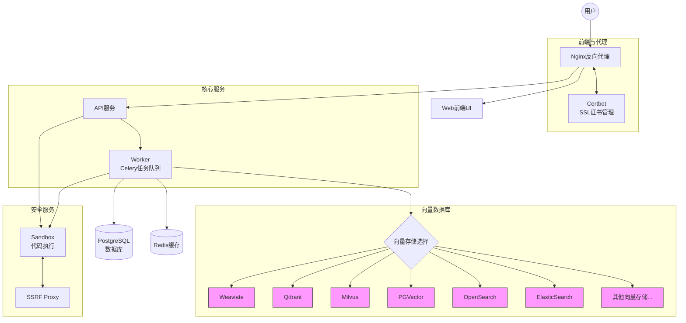

# Dify Docker部署架构文档

## 服务组件关系图

## 服务组件说明

### 前端与代理层
- **Nginx**: 作为反向代理服务器，处理所有来自用户的请求并转发到相应的后端服务
- **Certbot**: 负责SSL证书的自动获取和更新，确保HTTPS连接安全

### 核心应用层
- **API服务**: 处理所有业务逻辑和请求
- **Web前端UI**: 提供用户界面
- **Worker**: 基于Celery的任务队列，处理异步任务和后台作业

### 数据存储层
- **PostgreSQL**: 主数据库，存储应用数据
- **Redis**: 用于缓存和消息队列

### 向量数据库层
系统支持多种向量数据库，但一般只使用其中一种:
- **Weaviate**: 默认向量存储
- **Qdrant**: 可选向量数据库
- **Milvus**: 可选向量数据库
- **PGVector**: 基于PostgreSQL的向量扩展
- **OpenSearch**: 可选向量搜索引擎
- **ElasticSearch**: 可选向量搜索引擎
- **其他向量存储选项**: TiDB、Chroma、OceanBase等

### 安全服务层
- **Sandbox**: 安全的代码执行环境
- **SSRF Proxy**: 防止服务器端请求伪造，提供安全的外部资源访问

## 配置与使用
- 所有服务配置通过`.env`文件统一管理
- 使用`docker-compose.yaml`定义和编排服务
- 可通过设置`VECTOR_STORE`环境变量选择不同的向量数据库
- 使用`docker compose up`启动所有服务

## 服务间通信流程
1. 用户请求通过Nginx代理
2. 请求根据类型分发到API或Web服务
3. API服务处理请求并可能将任务分配给Worker
4. 数据存储在PostgreSQL和向量数据库中
5. Redis用于缓存和任务队列
6. 安全服务确保代码执行和外部资源访问的安全性

## 部署步骤
1. 确保安装了Docker和Docker Compose
2. 进入`docker`目录
3. 执行`cp .env.example .env`创建环境配置文件
4. 根据需要修改`.env`文件中的配置
5. 执行`docker compose up`启动服务 