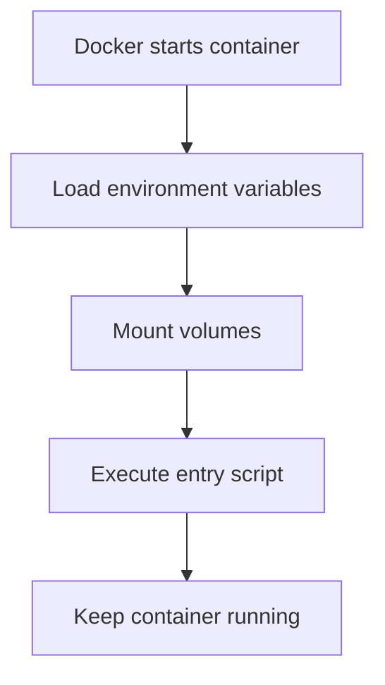
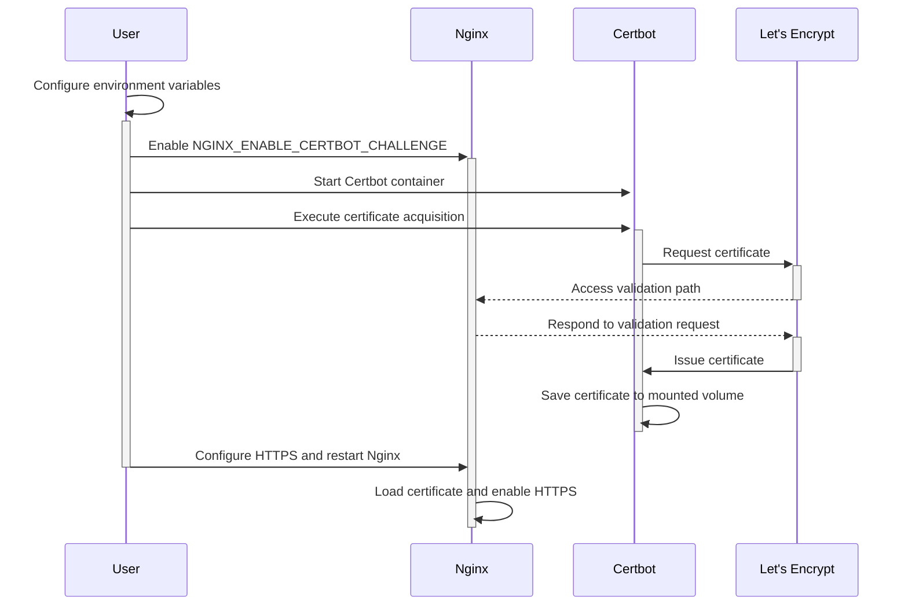

# 【Dify】Certbot Image Startup Process 🔐

## Overview 📋

The Certbot service in the Dify platform is responsible for automatically obtaining and renewing SSL certificates, ensuring the platform provides secure HTTPS connections. This document details the startup process, configuration options, and collaboration mechanism with Nginx for the Certbot image.

## Certbot's Role in Dify 🔄

In the Dify architecture, Certbot is an optional service primarily responsible for:

1. **SSL Certificate Acquisition**: Automatically obtaining free SSL certificates from Let's Encrypt
2. **Certificate Renewal**: Periodically checking and automatically renewing certificates that are about to expire
3. **Nginx Collaboration**: Providing valid SSL certificates to Nginx to enable HTTPS access
4. **Domain Validation**: Proving domain ownership through the web validation method (HTTP-01 challenge)

Through Docker Compose's profile mechanism, Certbot is integrated into the Dify platform as an optional component, allowing users to enable it as needed for automated HTTPS configuration.

## Docker-Compose Configuration Analysis 🔍

```yaml
# Certbot service
# use `docker-compose --profile certbot up` to start the certbot service
certbot:
  image: certbot/certbot
  profiles:
    - certbot
  volumes:
    - ./volumes/certbot/conf:/etc/letsencrypt
    - ./volumes/certbot/www:/var/www/html
    - ./volumes/certbot/logs:/var/log/letsencrypt
    - ./volumes/certbot/conf/live:/etc/letsencrypt/live
    - ./certbot/update-cert.template.txt:/update-cert.template.txt
    - ./certbot/docker-entrypoint.sh:/docker-entrypoint.sh
  environment:
    - CERTBOT_EMAIL=${CERTBOT_EMAIL}
    - CERTBOT_DOMAIN=${CERTBOT_DOMAIN}
    - CERTBOT_OPTIONS=${CERTBOT_OPTIONS:-}
  entrypoint: [ '/docker-entrypoint.sh' ]
  command: [ 'tail', '-f', '/dev/null' ]
```

### Key Configuration Points:

1. **Image Selection**: Uses the official `certbot/certbot` image
2. **Profile Mechanism**: Set as an optional service via `profiles: [certbot]`
3. **Volume Mounts**:
   - Certificate storage directory: `./volumes/certbot/conf:/etc/letsencrypt`
   - Website root directory: `./volumes/certbot/www:/var/www/html`
   - Log directory: `./volumes/certbot/logs:/var/log/letsencrypt`
4. **Custom Scripts**: Mounts custom entry script and certificate update template
5. **Environment Variables**: Configures domain, email, and other information needed by Certbot
6. **Persistent Running**: Uses `tail -f /dev/null` to keep the container running

## Startup Process 🚀

The Certbot container's startup process includes the following key phases:

### 1. Container Initialization



When Docker creates and starts the Certbot container:

1. Environment variables are loaded, including `CERTBOT_EMAIL`, `CERTBOT_DOMAIN`, and `CERTBOT_OPTIONS`
2. Necessary volumes are mounted, ensuring correct certificate storage and validation paths
3. The custom `docker-entrypoint.sh` entry script is executed
4. The container is kept running in the background via the `tail -f /dev/null` command

### 2. Entry Script Execution

The entry script `docker-entrypoint.sh` performs the following operations:

1. Prints environment variable information for debugging checks
2. Verifies if mounted directories are correct
3. Generates the certificate update script `update-cert.sh` based on the template
4. Replaces variables in the template with actual environment variable values
5. Finally executes the container's main command (`tail -f /dev/null`)

### 3. Certificate Operations (Manually Triggered)

Certificate acquisition and renewal are not automatically executed when the container starts but need to be manually triggered:

```bash
docker compose exec -it certbot /bin/sh /update-cert.sh
```

After executing this command, the `update-cert.sh` script will:

1. Check if the certificate already exists
2. If the certificate doesn't exist, execute the initial acquisition command
3. If the certificate exists, execute the renewal command
4. After completion, prompt that Nginx needs to be reloaded to apply the new certificate

## Environment Variables and Configuration ⚙️

The Certbot service can be configured through the following environment variables:

```properties
# Domain configuration, must fill in an actually accessible domain
CERTBOT_DOMAIN=your_domain.com

# Email address for certificate expiration notifications and emergency contact
CERTBOT_EMAIL=your_email@example.com

# Additional certbot command options, such as test mode
CERTBOT_OPTIONS=--dry-run

# Nginx-related configuration
NGINX_ENABLE_CERTBOT_CHALLENGE=true
NGINX_SSL_CERT_FILENAME=fullchain.pem
NGINX_SSL_CERT_KEY_FILENAME=privkey.pem
NGINX_HTTPS_ENABLED=true
```

## Collaboration Mechanism with Nginx 🔄

The collaboration flow between Certbot and Nginx:



1. **Configuration Preparation**:
   - Set `NGINX_ENABLE_CERTBOT_CHALLENGE=true` to enable Nginx's validation path
   - Ensure Nginx can access Certbot's mounted directories

2. **Validation Process**:
   - When Certbot requests a certificate, Let's Encrypt will attempt to access the validation path of the specified domain
   - Nginx is configured to direct these validation requests to Certbot's mounted directory

3. **Certificate Application**:
   - After certificate acquisition, Nginx needs to reload its configuration
   - Set `NGINX_HTTPS_ENABLED=true` to enable HTTPS

## Logs and Monitoring 📊

Certbot service's log recording:

1. **Log Location**:
   - Inside container: `/var/log/letsencrypt`
   - Mounted to host: `./volumes/certbot/logs`

2. **Key Log Files**:
   - `letsencrypt.log`: Main operation log
   - Specific log files for each domain

3. **Viewing Logs**:
   ```bash
   docker compose exec certbot cat /var/log/letsencrypt/letsencrypt.log
   ```

## Troubleshooting 🛠️

Common issues and solutions:

1. **Domain Validation Failure**:
   - Confirm the domain DNS is correctly set up and publicly accessible
   - Check if Nginx's certbot challenge configuration is correct
   - View Certbot logs to understand the specific failure reason

2. **Certificate Cannot Auto-renew**:
   - Confirm update script permissions are correct
   - Check if volume mounts are correct
   - Consider setting up a scheduled task for automatic updates

3. **Nginx Doesn't Load New Certificate**:
   - Confirm certificate file permissions are correct
   - Check certificate path in Nginx configuration
   - Execute `docker compose exec nginx nginx -s reload` to reload

## Best Practices 💡

1. **Automatic Certificate Renewal**:
   - Set up cron jobs to periodically execute the update script
   - Recommend updating certificates monthly

2. **Security Enhancement**:
   - Regularly check certificate validity and expiration dates
   - Protect certificate private key files, restrict access permissions

3. **Testing and Migration**:
   - Use the `--dry-run` option to test the certificate acquisition process
   - Develop strategies for backing up and restoring certificates

---

> 👉 [中文版](../【Dify】Certbot镜像启动过程.md) 