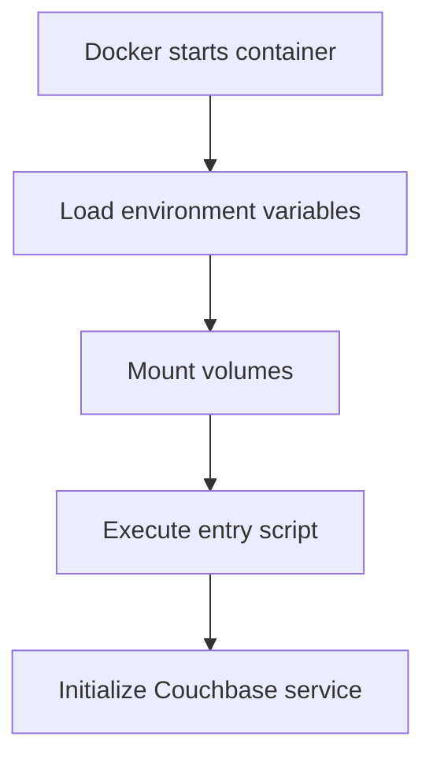
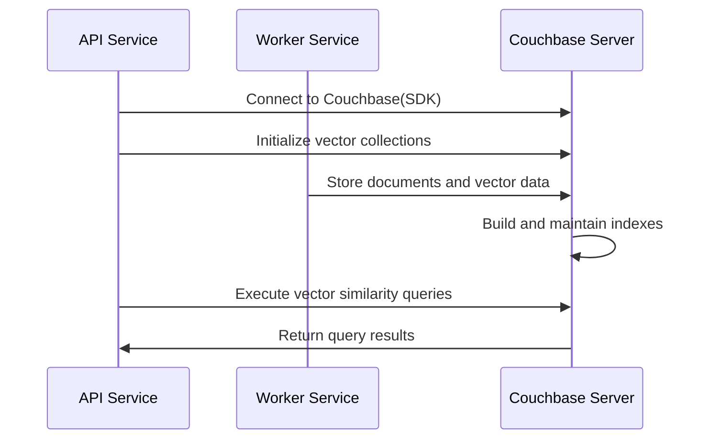

# 【Dify】Couchbase-Server Image Startup Process 🔍

## Overview 📋

Couchbase Server is a distributed NoSQL document database that serves as an optional vector storage service in the Dify platform, providing high-performance document storage and vector retrieval capabilities. This document details the startup process of the Couchbase Server image, its configuration options, and its application within the Dify architecture.

## Couchbase Server's Role in Dify 🔄

In the Dify architecture, Couchbase Server functions as an optional vector database service, primarily responsible for:

1. **Vector Storage & Indexing**: Storing and indexing vector data, supporting efficient similarity searches
2. **Document Database Capabilities**: Providing NoSQL document storage functionality, supporting JSON data models
3. **Full-Text Search**: Offering content retrieval capabilities through the FTS (Full-Text Search) service
4. **High Availability**: Supporting data replication and fault recovery mechanisms

Couchbase Server is deployed through Docker containerization, offering Dify a feature-rich vector storage solution.

## Docker-Compose Configuration Analysis 🔍

```yaml
# The Couchbase vector store.
couchbase-server:
  build: ./couchbase-server
  profiles:
    - couchbase
  restart: always
  environment:
    - CLUSTER_NAME=dify_search
    - COUCHBASE_ADMINISTRATOR_USERNAME=${COUCHBASE_USER:-Administrator}
    - COUCHBASE_ADMINISTRATOR_PASSWORD=${COUCHBASE_PASSWORD:-password}
    - COUCHBASE_BUCKET=${COUCHBASE_BUCKET_NAME:-Embeddings}
    - COUCHBASE_BUCKET_RAMSIZE=512
    - COUCHBASE_RAM_SIZE=2048
    - COUCHBASE_EVENTING_RAM_SIZE=512
    - COUCHBASE_INDEX_RAM_SIZE=512
    - COUCHBASE_FTS_RAM_SIZE=1024
  hostname: couchbase-server
  container_name: couchbase-server
  working_dir: /opt/couchbase
  stdin_open: true
  tty: true
  entrypoint: [ "" ]
  command: sh -c "/opt/couchbase/init/init-cbserver.sh"
  volumes:
    - ./volumes/couchbase/data:/opt/couchbase/var/lib/couchbase/data
```

### Key Configuration Points:

1. **Build Method**: Uses a Dockerfile in the local `./couchbase-server` directory
2. **Optional Service**: Configured as an optional service via `profiles: [couchbase]`, enabled only when needed
3. **Auto Restart**: Sets `restart: always` to ensure service recovery after crashes
4. **Environment Variable Configuration**:
   - Cluster Name: `CLUSTER_NAME=dify_search`
   - Administrator Account: Defaults to `Administrator`
   - Administrator Password: Defaults to `password`
   - Bucket Name: Defaults to `Embeddings`
   - Memory Allocations: Appropriate RAM allocated for different services
5. **Command Configuration**: Uses custom script `init-cbserver.sh` to initialize the server
6. **Data Persistence**: Mounts the `./volumes/couchbase/data` directory to the storage path inside the container

## Custom Build Analysis 🏗️

Dify project uses a custom Dockerfile to build the Couchbase image, with these core files:

### Dockerfile

```dockerfile
FROM couchbase/server:latest AS stage_base
COPY init-cbserver.sh /opt/couchbase/init/
RUN chmod +x /opt/couchbase/init/init-cbserver.sh
```

### Initialization Script (init-cbserver.sh)

This script is the core of the startup process, performing the following operations:

1. Starting the Couchbase server (`/entrypoint.sh couchbase-server &`)
2. Checking if initialization has completed (by checking for the `setupComplete.txt` file)
3. If not initialized, configuring the cluster (using `couchbase-cli cluster-init`)
4. Creating a bucket (using `couchbase-cli bucket-create`)
5. Creating a setup completion marker file
6. Keeping the container running (`tail -f /dev/null`)

## Dify Platform's Environment Variable Configuration ⚙️

The Dify platform provides the following Couchbase-related environment variables for API and Worker services:

```properties
# Couchbase connection settings
COUCHBASE_CONNECTION_STRING=couchbase://couchbase-server
COUCHBASE_USER=Administrator
COUCHBASE_PASSWORD=password
COUCHBASE_BUCKET_NAME=Embeddings
COUCHBASE_SCOPE_NAME=_default
```

## Startup Process 🚀

The Couchbase Server container's startup process includes the following key phases:

### 1. Container Initialization



When Docker creates and starts the Couchbase Server container:

1. Docker engine parses the docker-compose configuration and prepares the container environment
2. Environment variables are loaded, setting Couchbase's configuration parameters
3. The `./volumes/couchbase/data` directory is mounted inside the container, ensuring data persistence
4. The custom `init-cbserver.sh` initialization script is executed

### 2. Couchbase Service Startup

The initialization script first starts the base Couchbase service:

1. Executes the official container's entry script: `/entrypoint.sh couchbase-server &`
2. Starts the Couchbase server process in the background
3. Waits for the server to fully start (the script includes a 20-second wait time)

### 3. Cluster Initialization

If this is the first startup (no `setupComplete.txt` marker file exists), the script performs cluster initialization:

```bash
/opt/couchbase/bin/couchbase-cli cluster-init -c 127.0.0.1 \
  --cluster-username $COUCHBASE_ADMINISTRATOR_USERNAME \
  --cluster-password $COUCHBASE_ADMINISTRATOR_PASSWORD \
  --services data,index,query,fts \
  --cluster-ramsize $COUCHBASE_RAM_SIZE \
  --cluster-index-ramsize $COUCHBASE_INDEX_RAM_SIZE \
  --cluster-eventing-ramsize $COUCHBASE_EVENTING_RAM_SIZE \
  --cluster-fts-ramsize $COUCHBASE_FTS_RAM_SIZE \
  --index-storage-setting default
```

This step configures:
- Cluster administrator credentials
- Enabled services (data, index, query, full-text search)
- Memory allocation for each service
- Index storage settings

### 4. Bucket Creation

After cluster initialization, the script creates a default bucket:

```bash
/opt/couchbase/bin/couchbase-cli bucket-create -c localhost:8091 \
  --username $COUCHBASE_ADMINISTRATOR_USERNAME \
  --password $COUCHBASE_ADMINISTRATOR_PASSWORD \
  --bucket $COUCHBASE_BUCKET \
  --bucket-ramsize $COUCHBASE_BUCKET_RAMSIZE \
  --bucket-type couchbase
```

This step creates a bucket with the specified name (defaults to "Embeddings") and allocates the appropriate memory.

### 5. Initialization Completion

After initialization is complete, the script:

1. Creates the marker file `/opt/couchbase/init/setupComplete.txt`
2. Keeps the container running via the `tail -f /dev/null` command

## Service Ports and Interfaces 🌐

Couchbase Server enables multiple service ports by default:

1. **8091**: Web console and REST API
2. **8092**: View queries
3. **8093**: Query service (N1QL)
4. **8094**: Full-text search service
5. **8095**: Analytics service
6. **8096**: Eventing service
7. **11210**: Data service

In Dify's deployment, these ports are primarily accessed internally within the container and don't need to be exposed externally.

## Interaction with Dify Components 🔗

The interaction flow between Couchbase Server and other Dify platform components:



1. **Connection Mechanism**:
   - API and Worker services connect to Couchbase Server through the Couchbase SDK
   - Connection parameters are configured via environment variables, including connection string, username, password, etc.

2. **Data Operations**:
   - Collection Management: Creating and configuring document collections via API
   - Vector Storage: Worker service converts text to vectors and stores them in Couchbase
   - Vector Retrieval: Using vector search APIs to query similar documents

## Monitoring and Management 📊

Couchbase Server provides multiple monitoring and management methods:

1. **Web Console**:
   Access `http://couchbase-server:8091` to open the Couchbase Web Console, providing a graphical management interface

2. **REST API**:
   Couchbase provides a complete REST API for automated management and monitoring

3. **Health Check**:
   Docker Compose configures a health check to ensure the bucket is created correctly:
   ```yaml
   healthcheck:
     test: [ "CMD-SHELL", "curl -s -f -u Administrator:password http://localhost:8091/pools/default/buckets | grep -q '\\[{' || exit 1" ]
     interval: 10s
   ```

4. **Log Viewing**:
   ```bash
   docker compose logs couchbase-server
   ```

## Troubleshooting 🛠️

Common issues and solutions:

1. **Service Fails to Start**:
   - Check if ports (8091-8096, 11210) are already in use
   - Check Docker logs for specific error information
   - Verify that data directory permissions are correct

2. **Insufficient Memory Allocation**:
   - Adjust memory allocation parameters for each service appropriately
   - Ensure the host machine has sufficient available memory

3. **Connection Issues**:
   - Verify environment variable configurations are correct
   - Check if network connections are normal
   - Confirm credentials are correct

## Data Management and Optimization 💾

1. **Data Backup**:
   - Couchbase data is stored in the `./volumes/couchbase/data` directory
   - Backup tools provided by Couchbase can be used, or the data directory can be backed up directly

2. **Performance Optimization**:
   - Allocate memory resources appropriately, especially for index and full-text search services
   - Create appropriate indexes for frequently used queries
   - Configure appropriate memory and storage resources for large-scale deployments

3. **Expansion Recommendations**:
   - Single-node deployment is suitable for development and testing environments
   - Consider configuring a Couchbase cluster for production environments to improve availability and performance
   - Consider adding nodes and memory allocation for large-scale data

---

> 👉 [中文版](../【Dify】Couchbase-Server镜像启动过程.md) 