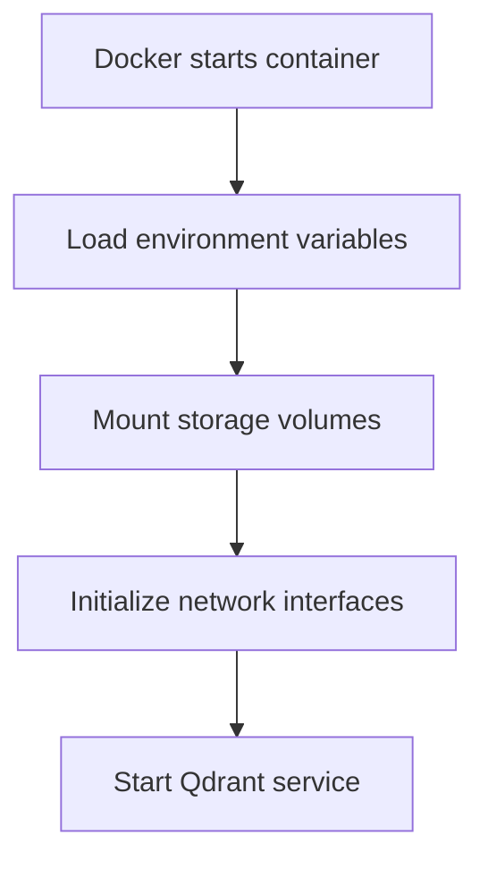
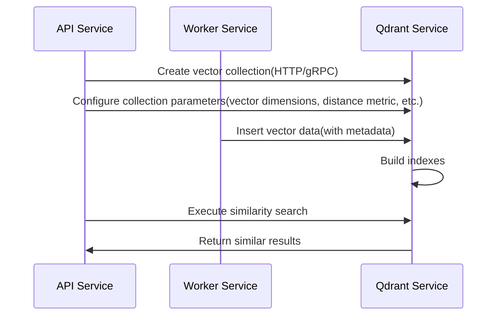

# 【Dify】Qdrant Image Startup Process 🔍

## Overview 📋

Qdrant is an efficient vector similarity search engine that serves as an optional vector database service in the Dify platform, providing high-performance similarity retrieval and data management capabilities. This document details the startup process of the Qdrant image, its configuration options, and its application within the Dify architecture.

## Qdrant's Role in Dify 🔄

In the Dify architecture, Qdrant functions as an optional vector database service, primarily responsible for:

1. **Vector Indexing & Storage**: Efficiently storing and indexing vector data, supporting fast similarity searches
2. **Similarity Search**: Providing similarity search functionality with various distance metrics
3. **Filter-based Retrieval**: Supporting composite filtering queries based on structured metadata
4. **Data Persistence**: Ensuring secure storage and persistence of vector data

Qdrant is deployed through Docker containerization, offering Dify a lightweight yet powerful vector retrieval infrastructure.

## Docker-Compose Configuration Analysis 🔍

```yaml
# Qdrant vector store.
# (if used, you need to set VECTOR_STORE to qdrant in the api & worker service.)
qdrant:
  image: langgenius/qdrant:v1.7.3
  profiles:
    - qdrant
  restart: always
  volumes:
    - ./volumes/qdrant:/qdrant/storage
  environment:
    QDRANT_API_KEY: ${QDRANT_API_KEY:-difyai123456}
```

### Key Configuration Points:

1. **Image Version**: Uses the `langgenius/qdrant:v1.7.3` image, a customized version based on the official Qdrant image
2. **Optional Service**: Configured as an optional service via `profiles: [qdrant]`, enabled only when needed
3. **Auto Restart**: Sets `restart: always` to ensure service recovery after crashes
4. **Data Persistence**: Mounts the `./volumes/qdrant` directory to `/qdrant/storage` inside the container for persistent data storage
5. **Security Configuration**: Sets the API key through the `QDRANT_API_KEY` environment variable, with a default value of `difyai123456`

## Dify Platform's Related Environment Variables ⚙️

The Dify platform provides the following Qdrant-related environment variables for API and Worker services:

```properties
# Qdrant connection settings
QDRANT_URL=http://qdrant:6333
QDRANT_API_KEY=difyai123456
QDRANT_CLIENT_TIMEOUT=20
QDRANT_GRPC_ENABLED=false
QDRANT_GRPC_PORT=6334
```

## Startup Process 🚀

The Qdrant container's startup process includes the following key phases:

### 1. Container Initialization



When Docker creates and starts the Qdrant container:

1. Docker engine parses the docker-compose configuration and prepares the container environment
2. Environment variables are loaded, including `QDRANT_API_KEY`, used to set API access security
3. The `./volumes/qdrant` directory is mounted to `/qdrant/storage` inside the container, ensuring data persistence
4. Network interfaces are initialized, with default listening ports including:
   - 6333: HTTP API and Web UI
   - 6334: gRPC API
   - 6335: Distributed deployment (cluster internal communication)
5. The main Qdrant process is started

### 2. Configuration Loading

Qdrant loads configuration in the following priority order:

1. Built-in default configuration
2. Optional `/qdrant/config/config.yaml` file
3. Optional `/qdrant/config/production.yaml` file (based on default RUN_MODE=production)
4. Optional `/qdrant/config/local.yaml` file
5. Environment variables (highest priority)

In Dify's deployment, security is primarily configured through the `QDRANT_API_KEY` environment variable.

### 3. Storage Initialization

After starting, Qdrant initializes the storage system:

1. **Check Storage Directory**: Examines and initializes the `/qdrant/storage` directory
2. **WAL Recovery**: Recovers data from Write-Ahead Log (WAL) files if they exist
3. **Collection Loading**: Loads existing vector collections
4. **Index Preparation**: Initializes HNSW indexes and other retrieval structures

### 4. API Service Startup

After storage initialization is complete, Qdrant starts the API services:

1. **HTTP Service**: Starts the REST API service on port 6333
2. **gRPC Service**: Starts the gRPC API service on port 6334 (if enabled)
3. **Web Interface**: Provides the Dashboard Web UI on the HTTP port

## Interaction with Dify Components 🔗

The interaction flow between Qdrant and other Dify platform components:



1. **Connection Mechanism**:
   - API and Worker services connect to Qdrant via HTTP or gRPC protocol
   - Connection parameters are configured through environment variables, including URL, API key, and timeout settings

2. **Vector Operations**:
   - Collection Management: Create and configure vector collections via API
   - Data Indexing: Worker service converts text to vectors and stores them in Qdrant
   - Similarity Search: API service sends vectors for similarity retrieval

## Qdrant Core Configuration Options 🔧

Core configuration options for the Qdrant service include:

1. **Log Level**:
   ```yaml
   log_level: INFO  # Options: TRACE, DEBUG, INFO, WARN, ERROR
   ```

2. **Storage Configuration**:
   ```yaml
   storage:
     # Data storage location
     storage_path: ./storage
     # Snapshot storage location
     snapshots_path: ./snapshots
     # Payload storage configuration
     on_disk_payload: true
   ```

3. **Performance Tuning**:
   ```yaml
   storage:
     performance:
       # Number of search threads, 0 means auto-selection
       max_search_threads: 0
       # Number of optimization threads, 0 means no limit
       max_optimization_threads: 0
   ```

4. **Security Configuration**:
   ```yaml
   service:
     # API key for access control
     api_key: ${QDRANT_API_KEY}
   ```

## Monitoring and Logs 📊

Qdrant service monitoring and logs:

1. **Log Viewing**:
   ```bash
   docker compose logs qdrant
   ```

2. **Health Check**:
   Service health status can be verified via HTTP interface:
   ```bash
   curl http://qdrant:6333/healthz
   ```
   
3. **Metrics Monitoring**:
   Qdrant provides metrics in Prometheus format:
   ```bash
   curl http://qdrant:6333/metrics
   ```

4. **Web Interface**:
   Access the visualization interface via `http://qdrant:6333/dashboard`

## Troubleshooting 🛠️

Common issues and solutions:

1. **Service Fails to Start**:
   - Check if ports (6333, 6334, 6335) are already in use
   - Check Docker logs for specific error information
   - Verify that storage directory permissions are correct

2. **API Connection Failures**:
   - Verify that `QDRANT_URL` and `QDRANT_API_KEY` configurations are correct
   - Check if network connections are normal
   - If using gRPC, confirm that `QDRANT_GRPC_ENABLED` and `QDRANT_GRPC_PORT` are correctly configured

3. **Search Performance Issues**:
   - Adjust collection `hnsw_config` parameters to optimize search performance
   - Consider increasing the `max_search_threads` parameter
   - Consider enabling Quantization functionality for large data volumes

## Data Management and Optimization 💾

1. **Data Backup**:
   - Qdrant data is stored in the `./volumes/qdrant` directory
   - Regular backups can be made by backing up this directory or using Qdrant's snapshot API

2. **Performance Optimization**:
   - Choose appropriate vector distance types for collections (cosine similarity, Euclidean distance, or dot product)
   - Adjust HNSW index parameters, such as `m` and `ef_construct`
   - Consider enabling vector quantization for large-scale data

3. **Expansion Recommendations**:
   - Single-instance deployment is suitable for small to medium-scale applications
   - For large production environments, consider configuring Qdrant in cluster mode
   - For resource-constrained environments, adjust `on_disk_payload` to optimize memory usage

---

> 👉 [中文版](../【Dify】Qdrant镜像启动过程.md) 