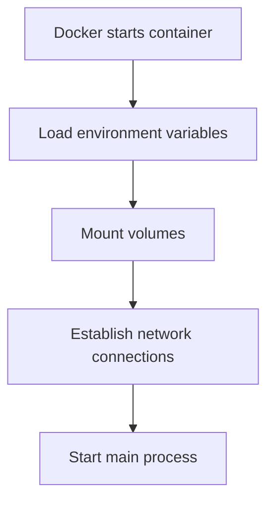
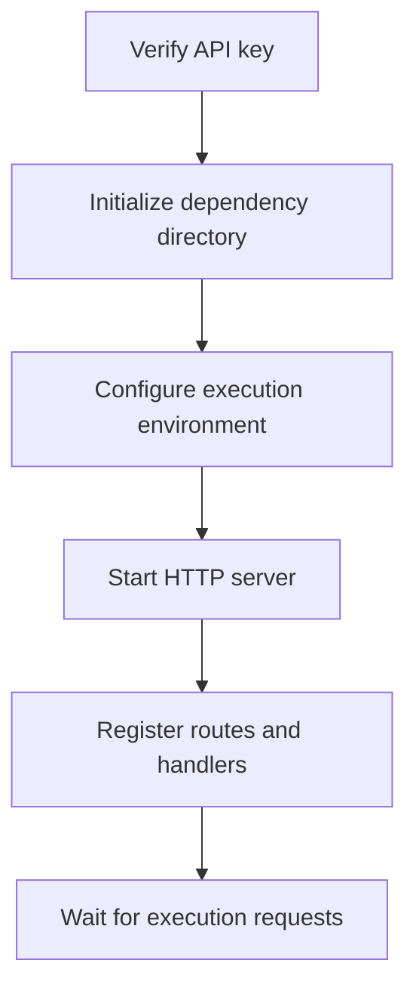
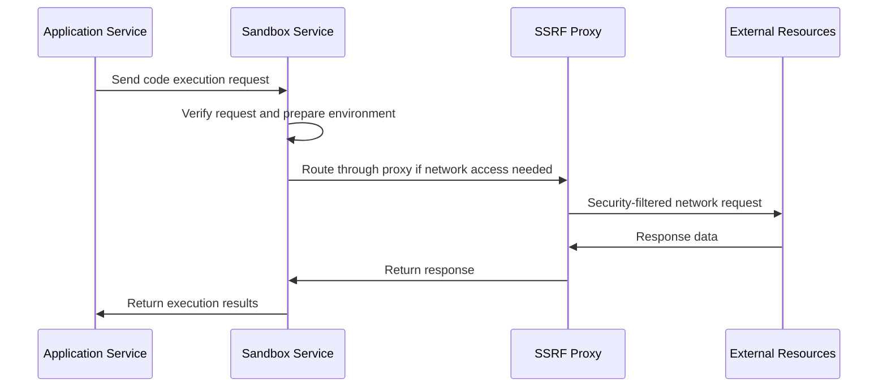

# 【Dify】Sandbox Image Startup Process 🚀

## Overview 📋

The Sandbox service provides a secure code execution environment for the Dify platform, implementing isolated execution and resource limitations through containerization technology. This document details the startup process, configuration options, and operational mechanisms of the Sandbox image.

## Startup Process 🔄

### 1. Container Initialization 🏁



### 2. Environment Variable Configuration ⚙️

When starting, the Sandbox service loads the following key environment variables:

```properties
API_KEY=${SANDBOX_API_KEY:-dify-sandbox}
GIN_MODE=${SANDBOX_GIN_MODE:-release}
WORKER_TIMEOUT=${SANDBOX_WORKER_TIMEOUT:-15}
ENABLE_NETWORK=${SANDBOX_ENABLE_NETWORK:-true}
HTTP_PROXY=${SANDBOX_HTTP_PROXY:-http://ssrf_proxy:3128}
HTTPS_PROXY=${SANDBOX_HTTPS_PROXY:-http://ssrf_proxy:3128}
SANDBOX_PORT=${SANDBOX_PORT:-8194}
```

### 3. File System Preparation 📂

During container startup, the following mount operations are performed:
- The host's `./volumes/sandbox/dependencies` directory is mounted to `/dependencies` inside the container
- This directory is used to store dependencies required for code execution

### 4. Network Configuration 🌐

- Connects to the dedicated `ssrf_proxy_network`
- Implements secure network access control through the SSRF proxy
- Default proxy setting is `http://ssrf_proxy:3128`

### 5. Service Initialization 🔍

After the main process starts, it executes the following steps:



## Security Mechanisms 🔒

The Sandbox employs multi-layered security protection:

1. Resource limitations: Restricts CPU and memory usage to prevent resource exhaustion attacks
2. Network isolation: Controls network access through the SSRF proxy
3. Execution timeout: Default 15-second timeout mechanism prevents long-running operations
4. API key verification: All requests must provide a valid API key

## Monitoring and Logging 📊

The Sandbox service's log output:
- Provides detailed logs in `GIN_MODE=debug` mode
- Records all code execution requests and results
- Captures and logs errors during execution

## Troubleshooting 🛠️

Common issues and solutions:

1. Service fails to start:
   - Check environment variable configuration
   - Confirm if the port is already in use
   - Verify network connections

2. Code execution failures:
   - Review logs for specific errors
   - Confirm the dependency directory is properly mounted
   - Check if code complies with sandbox execution standards

## Interaction with Other Services 🔗

The interaction flow between Sandbox and other Dify services:



## Optimization Recommendations 💡

1. Performance optimization:
   - Adjust `WORKER_TIMEOUT` to balance execution time and resource usage
   - Preload common dependencies to reduce initialization time

2. Security enhancements:
   - Update API keys regularly
   - Adjust network access policies based on actual needs

---

> 👉 [中文版](../【Dify】Sandbox镜像启动过程.md) 