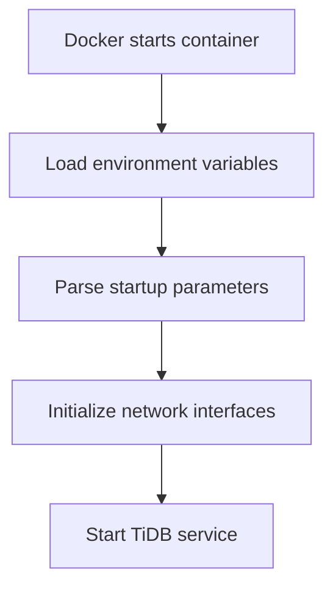
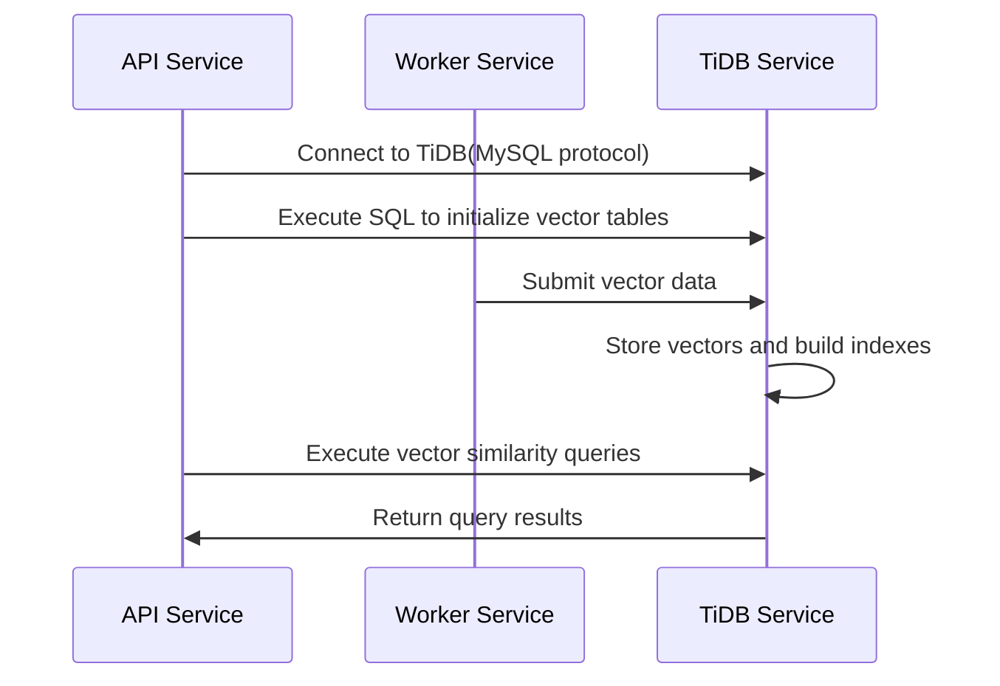

# 【Dify】TiDB Image Startup Process 🔍

## Overview 📋

TiDB is an open-source distributed SQL database that serves as one of the vector storage options in the Dify platform, supporting efficient vector retrieval and data query capabilities. This document details the startup process of the TiDB image, its configuration options, and its application within the Dify architecture.

## TiDB's Role in Dify 🔄

In the Dify architecture, TiDB functions as an optional vector database service, primarily responsible for:

1. **Vector Data Storage**: Storing embedded vector representations, supporting similarity searches
2. **SQL Capabilities**: Providing a complete SQL interface for complex query operations
3. **Data Persistence**: Ensuring reliable data storage and recovery
4. **Distributed Transactions**: Supporting ACID transactions to ensure data consistency

TiDB is deployed through Docker containerization, offering Dify a vector storage solution with SQL capabilities.

## Docker-Compose Configuration Analysis 🔍

```yaml
# The TiDB vector store.
# For production use, please refer to https://github.com/pingcap/tidb-docker-compose
tidb:
  image: pingcap/tidb:v8.4.0
  profiles:
    - tidb
  command:
    - --store=unistore
  restart: always
```

### Key Configuration Points:

1. **Image Version**: Uses the official `pingcap/tidb:v8.4.0` image
2. **Profile Mechanism**: Configured as an optional service via `profiles: [tidb]`
3. **Storage Engine**: Uses the `--store=unistore` parameter to configure the local storage engine
4. **Auto Restart**: Sets `restart: always` to ensure service recovery after crashes
5. **Simplified Configuration**: Dify adopts a minimalist configuration, suitable for development and testing environments

## Startup Process 🚀

The TiDB container's startup process includes the following key phases:

### 1. Container Initialization



When Docker creates and starts the TiDB container:

1. Docker engine parses the docker-compose configuration and prepares the container environment
2. Environment variables are loaded to determine runtime parameters
3. Command-line parameters are parsed, particularly the `--store=unistore` parameter
4. Network interfaces are initialized, with default listening on port 4000 (MySQL protocol) and port 10080 (HTTP status report)
5. The main TiDB process is started

### 2. Service Initialization

When the TiDB service starts, it performs the following initialization steps:

1. **Storage Engine Initialization**: Initializes the local storage engine based on the `--store=unistore` parameter
2. **Data Directory Check**: Checks and initializes the data storage directory, default is `/tmp/tidb`
3. **System Table Creation**: Initializes system tables and metadata
4. **SQL Parser Initialization**: Prepares the SQL parsing and execution environment
5. **Transaction Manager Initialization**: Initializes the transaction processing system

### 3. Port Listening Setup

TiDB enables two main ports by default:

1. **Port 4000**: MySQL protocol port for SQL connections and data operations
2. **Port 10080**: HTTP status reporting port, providing monitoring and management interfaces

### 4. Storage Engine Startup

TiDB uses the local storage engine unistore in Dify:

1. **Unistore Initialization**: Starts the built-in unistore storage engine
2. **Memory Allocation**: Allocates memory resources for the storage engine
3. **Storage Structure Creation**: Initializes data storage structures
4. **Index System Startup**: Prepares the index system to support efficient queries

## Interaction with Dify Components 🔗

The interaction flow between TiDB and other Dify platform components:



1. **Connection Mechanism**:
   - API and Worker services connect to TiDB via MySQL protocol
   - Connection parameters are configured by environment variables such as `TIDB_VECTOR_HOST`, `TIDB_VECTOR_PORT`, etc.

2. **Data Operations**:
   - Table Creation: Using SQL statements to create vector tables and indexes
   - Data Writing: Inserting vector data through SQL
   - Vector Retrieval: Using special SQL functions for similarity queries

## Environment Variables and Configuration ⚙️

The TiDB service can be configured through the following key environment variables:

```properties
# TiDB server connection information
TIDB_VECTOR_HOST=tidb
TIDB_VECTOR_PORT=4000
TIDB_VECTOR_USER=root  # Default user
TIDB_VECTOR_PASSWORD=  # Default no password
TIDB_VECTOR_DATABASE=dify  # Default database name

# Storage configuration
# --store=unistore: Use local storage engine
# --path: Data directory, default is /tmp/tidb
```

## Command Line Parameters 🔧

Main command-line parameters when starting TiDB:

1. **--store**:
   - Value `unistore`: Uses local storage engine, suitable for single-machine test environments
   - Value `tikv`: Uses distributed storage engine for production environments, requires PD and TiKV components

2. **--path**:
   - Storage engine data directory
   - Default for local storage engine (unistore) is `/tmp/tidb`
   - Using `--path=""` enables pure memory mode

3. **--host**:
   - Service listening address, default is `0.0.0.0`
   
4. **-P**:
   - MySQL protocol port, default is `4000`

5. **--status**:
   - HTTP status port, default is `10080`

## Monitoring and Logs 📊

TiDB service logs and monitoring:

1. **Log Viewing**:
   ```bash
   docker compose logs tidb
   ```

2. **Health Check**:
   Service health status can be verified via HTTP interface:
   ```bash
   curl http://tidb:10080/status
   ```
   
3. **Monitoring Metrics**:
   TiDB provides rich monitoring metrics, accessible via:
   ```bash
   # Get metrics via HTTP interface
   curl http://tidb:10080/metrics
   ```

## Troubleshooting 🛠️

Common issues and solutions:

1. **Service Fails to Start**:
   - Check if ports (4000 and 10080) are already in use
   - Check Docker logs for specific error information
   - Verify that data directory permissions are correct

2. **Connection Failures**:
   - Verify connection parameters (host, port, username, password) are correct
   - Check if network connections are normal
   - Confirm TiDB service is running properly

3. **Performance Issues**:
   - The local storage engine (unistore) is mainly for testing and not suitable for production environments with large data volumes
   - For production environments, using a complete TiDB cluster (TiDB+TiKV+PD) is recommended

## Data Management and Optimization 💾

1. **Data Backup**:
   - For local storage engines, backups can be achieved by backing up the data directory (`/tmp/tidb`)
   - Use tools like mysqldump to export data

2. **Performance Optimization**:
   - Local storage engine is suitable for development testing, data volume should not be too large
   - Increasing memory allocation can improve performance
   - Consider using indexes to optimize queries

3. **Production Environment Recommendations**:
   - Single-machine TiDB+unistore is only suitable for development and testing environments
   - For production environments, using a complete TiDB cluster deployment is recommended
   - Refer to official documentation for cluster configuration and optimization: https://github.com/pingcap/tidb-docker-compose

---

> 👉 [中文版](../【Dify】TiDB镜像启动过程.md) 