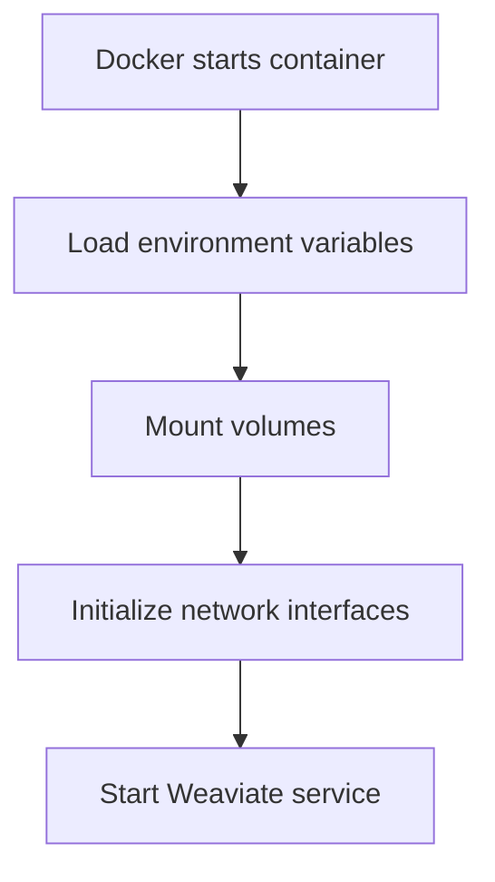
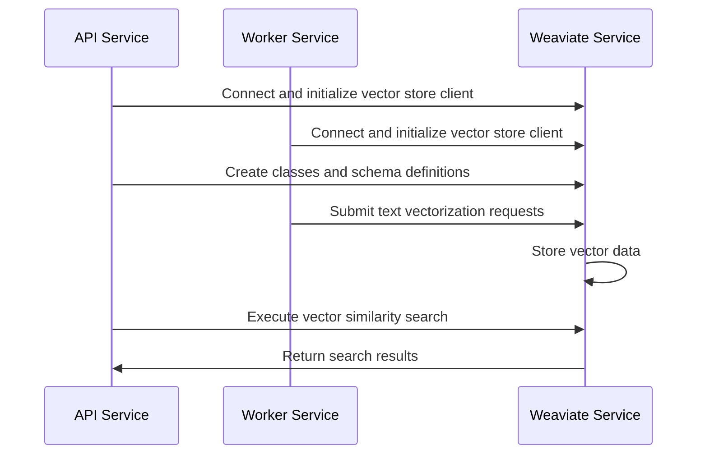

# 【Dify】Weaviate Image Startup Process 🔍

## Overview 📋

The Weaviate service acts as a vector database in the Dify platform, providing efficient semantic search and similarity retrieval capabilities for applications. This document details the startup process of the Weaviate image, its configuration options, and its application within Dify.

## Weaviate's Role in Dify 🔄

In the Dify architecture, Weaviate serves as the default vector database, primarily responsible for:

1. **Vector Storage**: Storing vector representations of unstructured data such as text and images
2. **Semantic Search**: Providing efficient retrieval based on semantic similarity
3. **Data Persistence**: Saving vector data to ensure data is not lost after system restarts
4. **API Service**: Providing RESTful and GraphQL interfaces for easy integration with other services

Weaviate is deployed as a Docker container, providing Dify with a scalable vector search infrastructure.

## Docker-Compose Configuration Analysis 🔍

```yaml
# The Weaviate vector store
weaviate:
  image: semitechnologies/weaviate:1.19.0
  profiles:
    - ''
    - weaviate
  restart: always
  volumes:
    # Mount the Weaviate data directory to the container
    - ./volumes/weaviate:/var/lib/weaviate
  environment:
    # Weaviate configurations
    # You can refer to the [Weaviate](https://weaviate.io/developers/weaviate/config-refs/env-vars) documentation for more information
    PERSISTENCE_DATA_PATH: ${WEAVIATE_PERSISTENCE_DATA_PATH:-/var/lib/weaviate}
    QUERY_DEFAULTS_LIMIT: ${WEAVIATE_QUERY_DEFAULTS_LIMIT:-25}
    AUTHENTICATION_ANONYMOUS_ACCESS_ENABLED: ${WEAVIATE_AUTHENTICATION_ANONYMOUS_ACCESS_ENABLED:-false}
    DEFAULT_VECTORIZER_MODULE: ${WEAVIATE_DEFAULT_VECTORIZER_MODULE:-none}
    CLUSTER_HOSTNAME: ${WEAVIATE_CLUSTER_HOSTNAME:-node1}
    AUTHENTICATION_APIKEY_ENABLED: ${WEAVIATE_AUTHENTICATION_APIKEY_ENABLED:-true}
    AUTHENTICATION_APIKEY_ALLOWED_KEYS: ${WEAVIATE_AUTHENTICATION_APIKEY_ALLOWED_KEYS:-WVF5YThaHlkYwhGUSmCRgsX3tD5ngdN8pkih}
    AUTHENTICATION_APIKEY_USERS: ${WEAVIATE_AUTHENTICATION_APIKEY_USERS:-hello@dify.ai}
    AUTHORIZATION_ADMINLIST_ENABLED: ${WEAVIATE_AUTHORIZATION_ADMINLIST_ENABLED:-true}
    AUTHORIZATION_ADMINLIST_USERS: ${WEAVIATE_AUTHORIZATION_ADMINLIST_USERS:-hello@dify.ai}
```

### Key Configuration Points:

1. **Image Version**: Uses the `semitechnologies/weaviate:1.19.0` image
2. **Profile Mechanism**: Supports default configuration and weaviate-specific profiles
3. **Auto Restart**: Sets `restart: always` to ensure service recovery after crashes
4. **Volume Mounting**: Mounts `./volumes/weaviate:/var/lib/weaviate` to ensure data persistence
5. **Environment Variable Configuration**: Sets various Weaviate runtime parameters, including:
   - Data storage path
   - Query limits
   - Authentication methods
   - Vectorizer module settings
   - Cluster configuration

## Startup Process 🚀

The Weaviate container's startup process includes the following key phases:

### 1. Container Initialization



When Docker creates and starts the Weaviate container:

1. Docker engine parses the docker-compose configuration and prepares the container environment
2. Environment variables are loaded, setting Weaviate's runtime parameters
3. The `./volumes/weaviate` directory is mounted to `/var/lib/weaviate` inside the container, ensuring data persistence
4. Network interfaces are initialized, with default listening on port 8080
5. The main Weaviate process is started

### 2. Service Initialization

When the Weaviate service starts, it performs the following initialization steps:

1. **Configuration Loading**: Reads configuration information from environment variables
2. **Data Directory Check**: Checks and initializes the data directory specified by `PERSISTENCE_DATA_PATH`
3. **Module Loading**: Loads vectorization modules based on `DEFAULT_VECTORIZER_MODULE`
4. **Security Initialization**: Sets up API keys and authentication mechanisms
5. **Cluster Initialization**: Sets node identity based on `CLUSTER_HOSTNAME`

### 3. Data Recovery

If previous data exists in the mounted volume, Weaviate performs data recovery operations:

1. Reads persisted data files
2. Restores the index structure
3. Loads vector data into memory
4. Verifies data integrity

### 4. API Service Startup

After data recovery is complete, Weaviate starts the API service:

1. Starts the HTTP server, listening on the configured port (default 8080)
2. Initializes RESTful API interfaces
3. Initializes GraphQL interfaces
4. Prepares to receive requests from other services

## Interaction with Dify Components 🔗

The interaction flow between Weaviate and other Dify platform components:



1. **Service Connection**:
   - API and Worker services connect to Weaviate using `WEAVIATE_ENDPOINT` and `WEAVIATE_API_KEY`
   - Connection parameters are configured in the `.env` file

2. **Vector Operations**:
   - Document Indexing: Worker service converts documents to vectors and stores them in Weaviate
   - Vector Retrieval: API service performs similarity searches to provide relevant content for applications

## Environment Variables and Configuration ⚙️

The Weaviate service can be configured through the following key environment variables:

```properties
# Data persistence path
WEAVIATE_PERSISTENCE_DATA_PATH=/var/lib/weaviate

# Query default limit, controls the number of returned results
WEAVIATE_QUERY_DEFAULTS_LIMIT=25

# Anonymous access control
WEAVIATE_AUTHENTICATION_ANONYMOUS_ACCESS_ENABLED=false

# Default vectorizer module
WEAVIATE_DEFAULT_VECTORIZER_MODULE=none

# Cluster hostname
WEAVIATE_CLUSTER_HOSTNAME=node1

# API key authentication settings
WEAVIATE_AUTHENTICATION_APIKEY_ENABLED=true
WEAVIATE_AUTHENTICATION_APIKEY_ALLOWED_KEYS=WVF5YThaHlkYwhGUSmCRgsX3tD5ngdN8pkih

# Admin list settings
WEAVIATE_AUTHORIZATION_ADMINLIST_ENABLED=true
WEAVIATE_AUTHORIZATION_ADMINLIST_USERS=hello@dify.ai
```

## Monitoring and Logs 📊

Weaviate service log recording:

1. **Log Viewing**:
   ```bash
   docker compose logs weaviate
   ```

2. **Health Check**:
   Service health status can be verified via API:
   ```bash
   curl -I http://weaviate:8080/v1/meta
   ```
   
3. **Monitoring Metrics**:
   Weaviate provides health metrics and status information, which can be viewed using:
   ```bash
   curl http://weaviate:8080/v1/meta
   ```

## Troubleshooting 🛠️

Common issues and solutions:

1. **Service Fails to Start**:
   - Check if the port is already in use
   - Verify data directory permissions
   - Check Docker logs for specific errors

2. **Connection Timeout**:
   - Confirm that API and Worker services are configured with the correct `WEAVIATE_ENDPOINT`
   - Check if network connections are normal
   - Verify that the API key is correct

3. **Query Performance Issues**:
   - Adjust `WEAVIATE_QUERY_DEFAULTS_LIMIT`
   - Consider increasing container resource limits
   - Check if the data volume is too large

## Data Management and Optimization 💾

1. **Data Backup**:
   - Weaviate's data is stored in the `./volumes/weaviate` directory
   - Back up this directory regularly to prevent data loss

2. **Performance Optimization**:
   - Increase the `QUERY_DEFAULTS_LIMIT` value to improve query result quantity
   - Adjust authentication settings based on actual needs
   - Consider using dedicated vectorization modules to improve efficiency

3. **Expansion Suggestions**:
   - Single-machine deployment is suitable for small to medium-scale applications
   - Consider configuring a Weaviate cluster for large-scale applications
   - Monitor data growth and adjust resource configuration accordingly

---

> 👉 [中文版](../【Dify】Weaviate镜像启动过程.md) 