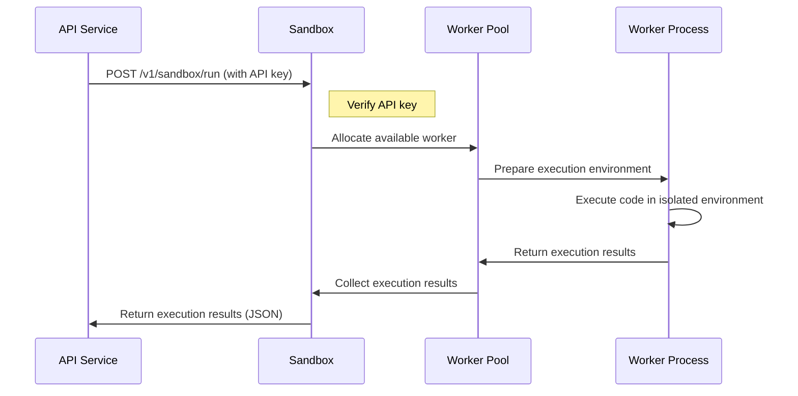
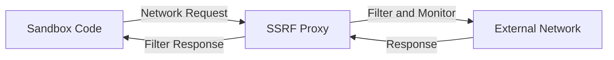

# 【Dify】Detailed Guide to Sandbox Service Startup Process 🚀

> This article provides a detailed analysis of the startup mechanism, security isolation architecture, and code execution flow of the Sandbox service in the Dify platform, helping users gain a deep understanding of how the platform's secure code execution system works.

## Table of Contents 📑

- [Role of Sandbox Service in Dify](#role-of-sandbox-service-in-dify)
- [Docker-Compose Configuration Analysis](#docker-compose-configuration-analysis)
- [Image Building and Content](#image-building-and-content)
- [Startup Process](#startup-process)
- [Environment Variables and Configuration](#environment-variables-and-configuration)
- [Code Execution Mechanism](#code-execution-mechanism)
- [Security Isolation Model](#security-isolation-model)
- [Interaction with API Service](#interaction-with-api-service)
- [Monitoring and Health Checks](#monitoring-and-health-checks)
- [Common Issues and Solutions](#common-issues-and-solutions)

## Role of Sandbox Service in Dify 🔄

In the Dify architecture, the Sandbox service is a secure isolated code execution environment that provides controlled and safe code running capabilities for the platform, serving as a key component for implementing rich AI application features. Its main responsibilities include:

1. **Secure Code Execution**: Running user or AI-generated code in an isolated environment
2. **Language Support**: Providing execution environments for multiple programming languages, mainly including Python and Node.js
3. **Resource Limitation**: Restricting resource usage for code execution, such as CPU, memory, execution time, etc.
4. **Network Isolation**: Controlling code access to network resources through proxies
5. **Environment Management**: Providing dependency management and environment isolation
6. **Error Handling**: Safely capturing and reporting errors during code execution

The Sandbox service uses the specially designed `langgenius/dify-sandbox` image, running as an independent container in Dify, and connects to the SSRF proxy and API service through a dedicated network, forming the core architecture of the platform's secure code execution.

## Docker-Compose Configuration Analysis 🔍

```yaml
# Secure code execution sandbox
sandbox:
  image: langgenius/dify-sandbox:0.2.10
  restart: always
  environment:
    # Sandbox configurations
    # Make sure you are changing this key for your deployment with a strong key
    # You can generate a strong key using `openssl rand -base64 42`
    API_KEY: ${SANDBOX_API_KEY:-dify-sandbox}
    GIN_MODE: ${SANDBOX_GIN_MODE:-release}
    WORKER_TIMEOUT: ${SANDBOX_WORKER_TIMEOUT:-15}
    ENABLE_NETWORK: ${SANDBOX_ENABLE_NETWORK:-true}
    HTTP_PROXY: ${SANDBOX_HTTP_PROXY:-http://ssrf_proxy:3128}
    HTTPS_PROXY: ${SANDBOX_HTTPS_PROXY:-http://ssrf_proxy:3128}
    SANDBOX_PORT: ${SANDBOX_PORT:-8194}
  volumes:
    # Mount dependencies directory, used to store installed packages
    - ./volumes/sandbox/dependencies:/dependencies
  healthcheck:
    test: [ 'CMD', 'curl', '-f', 'http://localhost:8194/health' ]
    interval: 1s
    timeout: 3s
    retries: 30
  networks:
    # Only connect to SSRF proxy network, enhancing security
    - ssrf_proxy_network
```

### Key Configuration Points Analysis:

1. **Image Version**: Uses the specialized `langgenius/dify-sandbox:0.2.10` image
2. **Automatic Restart**: `restart: always` ensures automatic recovery when the service crashes
3. **Security Settings**: Configures API key and execution timeout through environment variables
4. **Network Proxy**: Configures HTTP and HTTPS proxies to control external network access
5. **Data Volume**: Mounts dependencies directory for storing and managing packages for code execution environments
6. **Health Check**: Uses HTTP requests to check service health status
7. **Network Isolation**: Only connects to the dedicated `ssrf_proxy_network`, enhancing security

## Image Building and Content 📦

Dify Sandbox is based on a specially designed image containing all components needed for secure code execution:

### 1. Image Structure and Components

The Dify Sandbox image includes the following main components and features:

- **Base Operating System**: Lightweight Linux distribution
- **Programming Language Environments**:
  - Python 3 interpreter and basic libraries
  - Node.js runtime environment
- **Security Tools**:
  - seccomp: System call filtering mechanism
  - cgroups: Resource limitation control
  - Network isolation components
- **Web Service Components**:
  - Gin: Go language web framework for API handling
  - Health check interface
- **Built-in Tools**:
  - curl: Used for health checks
  - Dependency management tools: pip, npm, etc.

### 2. File System Structure

The main file system structure within the Sandbox container:

- `/app`: Application directory containing the sandbox service's core code
- `/dependencies`: Dependencies directory, mounted to the host for package persistence
- `/tmp`: Temporary directory for temporary files during code execution
- `/usr/local/bin`: Contains Python and Node.js executables

## Startup Process 🚀

The startup process of the Sandbox container includes the following key stages:

### 1. Container Initialization

When Docker creates and starts the Sandbox container, it first performs the following steps:

1. Sets environment variables, including `API_KEY`, `GIN_MODE`, etc.
2. Mounts the `./volumes/sandbox/dependencies` directory to the container's `/dependencies`
3. Initializes network configuration, connecting to `ssrf_proxy_network`
4. Starts the sandbox service main process

### 2. Configuration Loading

The sandbox service loads configuration upon startup:

1. Reads environment variable settings, such as API key, worker timeout, etc.
2. Checks and initializes the dependencies directory
3. Configures network proxy settings
4. Sets resource limits and security policies

### 3. Worker Pool Initialization

After starting, the service initializes the code execution worker pool:

1. Creates a pre-configured number of worker processes
2. Configures resource limits for each worker
3. Initializes language runtime environments
4. Prepares the code execution queue

### 4. API Service Startup

After completing initialization, Sandbox starts the API service:

1. Initializes the Gin Web framework
2. Configures API routes and middleware
3. Sets up authentication mechanisms
4. Starts the HTTP server, listening on the configured port (default 8194)

### 5. Health Check

After Sandbox starts, Docker periodically performs health checks:

```yaml
healthcheck:
  test: [ 'CMD', 'curl', '-f', 'http://localhost:8194/health' ]
  interval: 1s
  timeout: 3s
  retries: 30
```

The `curl` command attempts to access the Sandbox's health check interface. If the service is running normally, it will return a successful status code, and the service is considered healthy.

## Environment Variables and Configuration ⚙️

The Sandbox service can be configured through various environment variables that control the service's behavior and security features:

### 1. Security and Authentication

```properties
# API key for verifying requests from the API service
API_KEY=dify-sandbox
# Gin framework running mode, use release for production
GIN_MODE=release
```

### 2. Resource Limitations

```properties
# Code execution timeout in seconds
WORKER_TIMEOUT=15
# Maximum number of worker processes (defined in the config file, default is 4)
# MAX_WORKERS=4
# Maximum number of requests per worker (defined in the config file, default is 50)
# MAX_REQUESTS=50
```

### 3. Network Configuration

```properties
# Whether to allow code to access the network
ENABLE_NETWORK=true
# HTTP proxy address for controlling external HTTP requests
HTTP_PROXY=http://ssrf_proxy:3128
# HTTPS proxy address for controlling external HTTPS requests
HTTPS_PROXY=http://ssrf_proxy:3128
# Sandbox service listening port
SANDBOX_PORT=8194
```

### 4. Configuration File

In addition to environment variables, Sandbox can be configured in more detail through configuration files:

```yaml
# config.yaml example
app:
  port: 8194
  debug: True
  key: dify-sandbox
max_workers: 4
max_requests: 50
worker_timeout: 5
python_path: /usr/local/bin/python3
enable_network: True
allowed_syscalls: # leave empty to use default security settings
proxy:
  socks5: ''
  http: ''
  https: ''
```

## Code Execution Mechanism 🔄

The Sandbox service implements a secure and efficient code execution flow:

### 1. Request Processing Flow

The general flow of the API service sending code execution requests to Sandbox:



### 2. Code Execution Format

Basic format for code execution requests:

```json
{
  "language": "python3",
  "code": "print('Hello, World!')",
  "preload": "",
  "enable_network": true
}
```

Execution result response format:

```json
{
  "code": 0,
  "message": "success",
  "data": {
    "stdout": "Hello, World!\n",
    "stderr": "",
    "error": null
  }
}
```

### 3. Preloading and Dependency Management

Sandbox supports code preloading and dependency management:

```python
# Preload code example
import numpy as np
import pandas as pd

# Main execution code
def main():
    data = np.array([1, 2, 3])
    print(f"Data: {data}")
    return data.mean()

result = main()
print(f"Result: {result}")
```

For dependencies, Sandbox supports installing missing packages at runtime:

```python
# Installing dependencies example
!pip install matplotlib
import matplotlib.pyplot as plt
```

## Security Isolation Model 🔒

Sandbox employs a multi-layered security isolation model to ensure code execution safety:

### 1. Access Control

- **API Key Authentication**: All requests must provide a valid API key
- **Network Isolation**: Limits network access through dedicated networks and proxies
- **File System Isolation**: Restricts access to the container file system

### 2. Resource Limitations

- **Execution Time Limits**: Prevents infinite loops or long-running processes
- **Memory Usage Limits**: Prevents memory leaks and excessive consumption
- **CPU Limits**: Prevents CPU-intensive operations from affecting the system

### 3. System Call Limitations

Limits available system calls through seccomp configuration files, providing system-level isolation:

```
# seccomp system call whitelist (simplified example)
read, write, open, close, stat, fstat, lstat, poll, lseek, mmap, mprotect,
munmap, brk, rt_sigaction, rt_sigprocmask, rt_sigreturn, ioctl, pread64,
access, pipe, select, sched_yield, mremap, msync, mincore, madvise, shmget,
shmat, shmctl, dup, dup2, pause, nanosleep, getitimer, alarm, setitimer,
getpid, sendfile, socket, connect, accept, sendto, recvfrom, sendmsg,
recvmsg, shutdown, bind, listen, getsockname, getpeername, socketpair,
setsockopt, getsockopt, clone, fork, vfork, execve, exit, wait4, kill,
uname, semget, semop, semctl, shmdt, msgget, msgsnd, msgrcv, msgctl,
fcntl, flock, fsync, fdatasync, truncate, ftruncate, getdents, getcwd,
chdir, fchdir, rename, mkdir, rmdir, creat, link, unlink, symlink,
readlink, chmod, fchmod, chown, fchown, lchown, umask, gettimeofday,
getrlimit, getrusage, sysinfo, times, ptrace, getuid, syslog, getgid,
setuid, setgid, geteuid, getegid, setpgid, getppid, getpgrp, setsid,
setreuid, setregid, getgroups, setgroups, setresuid, getresuid, setresgid,
getresgid, getpgid, setfsuid, setfsgid, getsid, capget, capset, rt_sigpending,
rt_sigtimedwait, rt_sigqueueinfo, rt_sigsuspend, sigaltstack, utime,
mknod, uselib, personality, ustat, statfs, fstatfs, sysfs, getpriority,
setpriority, sched_setparam, sched_getparam, sched_setscheduler,
sched_getscheduler, sched_get_priority_max, sched_get_priority_min,
sched_rr_get_interval, mlock, munlock, mlockall, munlockall, vhangup,
modify_ldt, pivot_root, _sysctl, prctl, arch_prctl, adjtimex, setrlimit,
chroot, sync, acct, settimeofday, mount, umount2, swapon, swapoff,
reboot, sethostname, setdomainname, iopl, ioperm, create_module,
init_module, delete_module, get_kernel_syms, query_module, quotactl,
nfsservctl, getpmsg, putpmsg, afs_syscall, tuxcall, security, gettid,
readahead, setxattr, lsetxattr, fsetxattr, getxattr, lgetxattr, fgetxattr,
listxattr, llistxattr, flistxattr, removexattr, lremovexattr, fremovexattr,
tkill, time, futex, sched_setaffinity, sched_getaffinity, set_thread_area,
io_setup, io_destroy, io_getevents, io_submit, io_cancel, get_thread_area,
lookup_dcookie, epoll_create, epoll_ctl_old, epoll_wait_old, remap_file_pages,
getdents64, set_tid_address, restart_syscall, semtimedop, fadvise64,
timer_create, timer_settime, timer_gettime, timer_getoverrun, timer_delete,
clock_settime, clock_gettime, clock_getres, clock_nanosleep, exit_group,
epoll_wait, epoll_ctl, tgkill, utimes, vserver, mbind, set_mempolicy,
get_mempolicy, mq_open, mq_unlink, mq_timedsend, mq_timedreceive, mq_notify,
mq_getsetattr, kexec_load, waitid, add_key, request_key, keyctl, ioprio_set,
ioprio_get, inotify_init, inotify_add_watch, inotify_rm_watch, migrate_pages,
openat, mkdirat, mknodat, fchownat, futimesat, newfstatat, unlinkat, renameat,
linkat, symlinkat, readlinkat, fchmodat, faccessat, pselect6, ppoll,
unshare, set_robust_list, get_robust_list, splice, tee, sync_file_range,
vmsplice, move_pages, utimensat, epoll_pwait, signalfd, timerfd_create,
eventfd, fallocate, timerfd_settime, timerfd_gettime, accept4, signalfd4,
eventfd2, epoll_create1, dup3, pipe2, inotify_init1, preadv, pwritev,
rt_tgsigqueueinfo, perf_event_open, recvmmsg, fanotify_init, fanotify_mark,
prlimit64, name_to_handle_at, open_by_handle_at, clock_adjtime, syncfs,
sendmmsg, setns, getcpu, process_vm_readv, process_vm_writev, kcmp,
finit_module, sched_setattr, sched_getattr, renameat2, seccomp,
getrandom, memfd_create, kexec_file_load, bpf, execveat, userfaultfd,
membarrier, mlock2, copy_file_range, preadv2, pwritev2, pkey_mprotect,
pkey_alloc, pkey_free, statx
```

### 4. Network Security

All external network access is forwarded through the SSRF proxy, providing an additional security layer:



## Interaction with API Service 🔌

The API service interacts with Sandbox through HTTP requests:

### 1. API Service Call Example

```python
def execute_code(language, preload, code):
    """
    Execute code
    :param language: Code language
    :param preload: Preload code
    :param code: Main execution code
    :return: Execution result
    """
    url = f"{dify_config.CODE_EXECUTION_ENDPOINT}/v1/sandbox/run"
    headers = {"X-Api-Key": dify_config.CODE_EXECUTION_API_KEY}
    data = {
        "language": language,
        "code": code,
        "preload": preload,
        "enable_network": True,
    }
    
    try:
        response = requests.post(
            url,
            json=data,
            headers=headers,
            timeout=(
                dify_config.CODE_EXECUTION_CONNECT_TIMEOUT,
                dify_config.CODE_EXECUTION_READ_TIMEOUT,
            ),
        )
        if response.status_code == 503:
            raise Exception("Code execution service is unavailable")
        elif response.status_code != 200:
            raise Exception(f"Failed to execute code, got status code {response.status_code}")
            
        response_data = response.json()
        if response_data.get("code") != 0:
            raise Exception(f"Got error code: {response_data.get('code')}")
            
        return response_data.get("data", {}).get("stdout", "")
    except Exception as e:
        raise Exception(f"Failed to execute code: {str(e)}")
```

### 2. Security Policy Limitations

The API service imposes additional limitations on code execution:

```python
# Code size and complexity limitations
CODE_MAX_STRING_LENGTH = 80000
CODE_MAX_STRING_ARRAY_LENGTH = 30
CODE_MAX_OBJECT_ARRAY_LENGTH = 30
CODE_MAX_NUMBER_ARRAY_LENGTH = 1000
CODE_MAX_NUMBER = 9223372036854775807
CODE_MIN_NUMBER = -9223372036854775807
```

### 3. Error Handling

The API service handles errors returned by Sandbox:

```python
try:
    result = execute_code(language, preload, code)
    return result
except Exception as e:
    # Log the error
    logging.error(f"Code execution failed: {str(e)}")
    # Return a friendly error message
    return f"Code execution failed: {str(e)}"
```

## Monitoring and Health Checks 🩺

### 1. Docker Health Check

Docker Compose configures automatic health checks to confirm Sandbox is running properly:

```yaml
healthcheck:
  test: [ 'CMD', 'curl', '-f', 'http://localhost:8194/health' ]
  interval: 1s
  timeout: 3s
  retries: 30
```

This configuration makes Docker execute the `curl` command to access the health check endpoint once per second, with a maximum of 30 retries. If more than 30 checks fail, the container is marked as unhealthy.

### 2. Service Logs

Sandbox logs can be viewed using Docker commands:

```bash
# View Sandbox logs
docker-compose logs sandbox

# Track Sandbox logs in real-time
docker-compose logs -f sandbox
```

### 3. Performance Monitoring

Monitor resource usage of Sandbox:

```bash
# View container resource usage
docker stats sandbox

# View container processes
docker top sandbox
```

## Common Issues and Solutions ❓

### 1. Sandbox Service Fails to Start

**Issue**: Sandbox container fails to start

**Solutions**:
- Check Docker logs: `docker-compose logs sandbox`
- Verify port availability: Ensure port 8194 is not occupied
- Check network configuration: Ensure ssrf_proxy_network is correctly created
- Verify volume mounting: Ensure the dependencies directory exists with correct permissions

### 2. Code Execution Timeout

**Issue**: Code execution frequently times out

**Solutions**:
- Increase timeout setting: Modify the `WORKER_TIMEOUT` environment variable
- Optimize execution code: Reduce complexity and computation
- Expand Worker count: Increase the `max_workers` configuration
- Increase resource allocation: Allocate more resources to the Sandbox container

### 3. Dependency Installation Failure

**Issue**: Dependency installation commands fail

**Solutions**:
- Check network settings: Ensure `ENABLE_NETWORK` is set to true
- Verify proxy configuration: Ensure HTTP_PROXY and HTTPS_PROXY are correctly set
- Check dependencies directory: Ensure the dependencies directory has correct permissions
- Pre-install dependencies: Consider pre-installing commonly used dependencies

### 4. Security Limitation Issues

**Issue**: Code cannot perform specific operations due to security limitations

**Solutions**:
- View detailed errors: Check the error information returned by code execution
- Adjust seccomp configuration: Reasonably adjust the system call whitelist as needed
- Modify network policy: Adjust proxy configuration as needed
- Alternative approaches: Look for alternative implementations that don't require restricted operations

### 5. API Connection Issues

**Issue**: API service cannot connect to Sandbox

**Solutions**:
- Verify network settings: Ensure both services are on the same network
- Check API key: Ensure API_KEY settings are consistent
- Verify port configuration: Ensure port settings are correct
- Check health status: Verify Sandbox health check passes

---

## Related Links 🔗

- [Chinese Version](../【Dify】Sandbox服务启动过程详解.md)
- [Dify API Service Startup Process Guide](【Dify】API服务启动过程详解.md)
- [Dify Web Service Startup Process Guide](【Dify】Web服务启动过程详解.md)
- [Dify Worker Service Startup Process Guide](【Dify】Worker服务启动过程详解.md)
- [Dify DB Service Startup Process Guide](【Dify】DB服务启动过程详解.md)
- [Dify Redis Service Startup Process Guide](【Dify】Redis服务启动过程详解.md) 