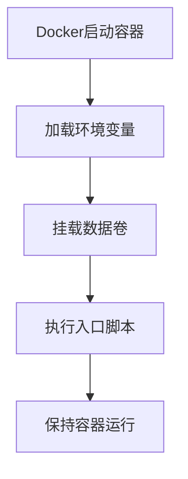
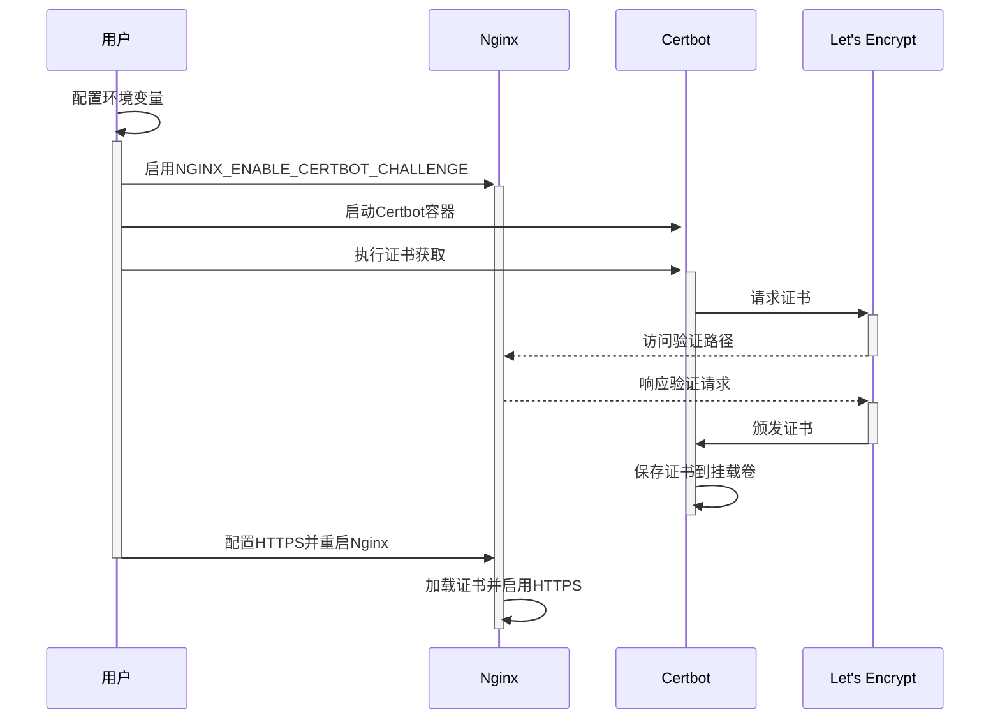

# 【Dify】Certbot镜像启动过程 🔐

## 概述 📋

Certbot服务在Dify平台中负责SSL证书的自动获取和更新，确保平台提供安全的HTTPS连接。本文档详细说明Certbot镜像的启动流程、配置选项及与Nginx的协作机制。

## Certbot在Dify中的角色 🔄

在Dify架构中，Certbot是一个可选服务，主要负责：

1. **SSL证书获取**：自动从Let's Encrypt获取免费的SSL证书
2. **证书更新**：定期检查并自动更新即将过期的证书
3. **与Nginx协作**：为Nginx提供有效的SSL证书，启用HTTPS访问
4. **域名验证**：通过Web验证方式（HTTP-01挑战）证明域名所有权

通过Docker Compose的profile机制，Certbot作为可选组件被集成到Dify平台，用户可以根据需要启用它来实现自动化的HTTPS配置。

## Docker-Compose配置解析 🔍

```yaml
# Certbot服务
# 使用 `docker-compose --profile certbot up` 启动certbot服务
certbot:
  image: certbot/certbot
  profiles:
    - certbot
  volumes:
    - ./volumes/certbot/conf:/etc/letsencrypt
    - ./volumes/certbot/www:/var/www/html
    - ./volumes/certbot/logs:/var/log/letsencrypt
    - ./volumes/certbot/conf/live:/etc/letsencrypt/live
    - ./certbot/update-cert.template.txt:/update-cert.template.txt
    - ./certbot/docker-entrypoint.sh:/docker-entrypoint.sh
  environment:
    - CERTBOT_EMAIL=${CERTBOT_EMAIL}
    - CERTBOT_DOMAIN=${CERTBOT_DOMAIN}
    - CERTBOT_OPTIONS=${CERTBOT_OPTIONS:-}
  entrypoint: [ '/docker-entrypoint.sh' ]
  command: [ 'tail', '-f', '/dev/null' ]
```

### 关键配置点解析：

1. **镜像选择**：使用官方的`certbot/certbot`镜像
2. **Profile机制**：通过`profiles: [certbot]`设置为可选服务
3. **数据卷挂载**：
   - 挂载证书存储目录：`./volumes/certbot/conf:/etc/letsencrypt`
   - 挂载网站根目录：`./volumes/certbot/www:/var/www/html`
   - 挂载日志目录：`./volumes/certbot/logs:/var/log/letsencrypt`
4. **自定义脚本**：挂载自定义的入口脚本和证书更新模板
5. **环境变量**：配置Certbot所需的域名、邮箱等信息
6. **持久运行**：使用`tail -f /dev/null`保持容器运行

## 启动流程 🚀

Certbot容器的启动过程包括以下几个关键阶段：

### 1. 容器初始化



当Docker创建并启动Certbot容器时：

1. 加载环境变量，包括`CERTBOT_EMAIL`、`CERTBOT_DOMAIN`和`CERTBOT_OPTIONS`
2. 挂载必要的数据卷，确保证书存储和验证路径正确
3. 执行自定义的`docker-entrypoint.sh`入口脚本
4. 通过`tail -f /dev/null`命令保持容器在后台运行

### 2. 入口脚本执行

入口脚本`docker-entrypoint.sh`执行以下操作：

1. 打印环境变量信息进行调试检查
2. 验证挂载目录是否正确
3. 基于模板生成证书更新脚本`update-cert.sh`
4. 将模板中的变量替换为实际的环境变量值
5. 最后执行容器的主命令（`tail -f /dev/null`）

### 3. 证书操作（手动触发）

证书的获取和更新不是在容器启动时自动执行的，而是需要手动触发：

```bash
docker compose exec -it certbot /bin/sh /update-cert.sh
```

执行此命令后，`update-cert.sh`脚本会：

1. 检查证书是否已存在
2. 如果证书不存在，执行初次获取命令
3. 如果证书已存在，执行更新命令
4. 完成后提示需要重新加载Nginx以应用新证书

## 环境变量与配置 ⚙️

Certbot服务可通过以下环境变量进行配置：

```properties
# 域名配置，必须填写实际可访问的域名
CERTBOT_DOMAIN=your_domain.com

# 邮箱地址，用于证书到期通知和紧急联系
CERTBOT_EMAIL=your_email@example.com

# 额外的certbot命令选项，如测试模式等
CERTBOT_OPTIONS=--dry-run

# Nginx相关的配置
NGINX_ENABLE_CERTBOT_CHALLENGE=true
NGINX_SSL_CERT_FILENAME=fullchain.pem
NGINX_SSL_CERT_KEY_FILENAME=privkey.pem
NGINX_HTTPS_ENABLED=true
```

## 与Nginx的协作机制 🔄

Certbot与Nginx的协作流程：



1. **配置准备**：
   - 设置`NGINX_ENABLE_CERTBOT_CHALLENGE=true`启用Nginx的验证路径
   - 确保Nginx可以访问Certbot的挂载目录

2. **验证流程**：
   - Certbot请求证书时，Let's Encrypt会尝试访问指定域名的验证路径
   - Nginx配置为将这些验证请求指向Certbot的挂载目录

3. **证书应用**：
   - 证书获取后，Nginx需要重新加载配置
   - 设置`NGINX_HTTPS_ENABLED=true`启用HTTPS

## 日志与监控 📊

Certbot服务的日志记录:

1. **日志位置**：
   - 容器内部: `/var/log/letsencrypt`
   - 挂载到宿主机: `./volumes/certbot/logs`

2. **关键日志文件**：
   - `letsencrypt.log`: 主要操作日志
   - 各域名的专有日志文件

3. **查看日志**：
   ```bash
   docker compose exec certbot cat /var/log/letsencrypt/letsencrypt.log
   ```

## 故障排除 🛠️

常见问题及解决方案：

1. **域名验证失败**：
   - 确认域名DNS已正确设置并可公网访问
   - 检查Nginx的certbot挑战配置是否正确
   - 查看Certbot日志了解具体失败原因

2. **证书无法自动更新**：
   - 确认更新脚本权限正确
   - 检查数据卷挂载是否正确
   - 考虑设置定时任务实现自动更新

3. **Nginx不加载新证书**：
   - 确认证书文件权限正确
   - 检查Nginx配置中的证书路径
   - 执行`docker compose exec nginx nginx -s reload`重新加载

## 最佳实践 💡

1. **证书自动更新**：
   - 设置cron作业定期执行更新脚本
   - 推荐每月自动更新证书

2. **安全加强**：
   - 定期检查证书有效性和到期日期
   - 保护证书私钥文件，限制访问权限

3. **测试与迁移**：
   - 使用`--dry-run`选项测试证书获取流程
   - 制定备份和恢复证书的策略

---

> 👉 [English Version](./en/Certbot_Image_Startup_Process.md) 