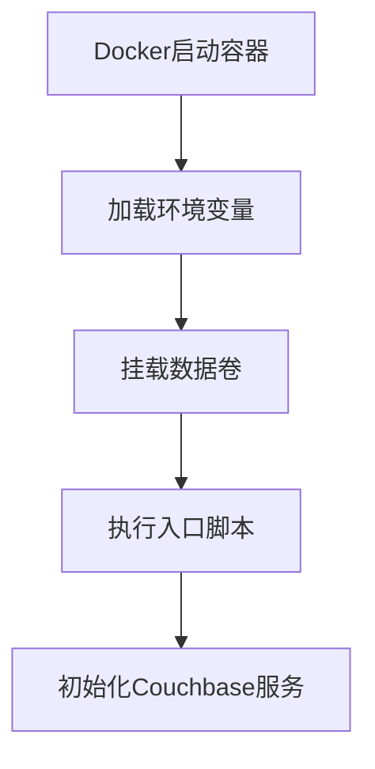
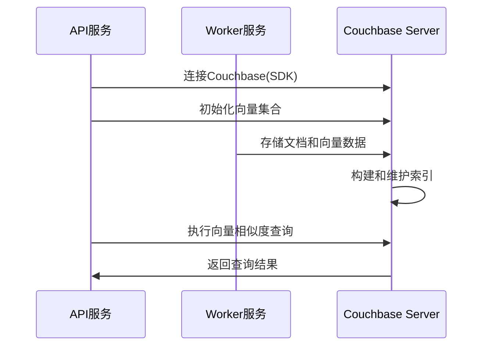

# 【Dify】Couchbase-Server镜像启动过程 🔍

## 概述 📋

Couchbase Server是一个分布式NoSQL文档数据库，在Dify平台中作为可选的向量存储服务，提供高性能的文档存储和向量检索能力。本文档详细说明Couchbase Server镜像的启动流程、配置选项及其在Dify架构中的应用。

## Couchbase Server在Dify中的角色 🔄

在Dify架构中，Couchbase Server作为可选的向量数据库服务，主要负责：

1. **向量存储与索引**：存储和索引向量数据，支持高效的相似度搜索
2. **文档数据库能力**：提供NoSQL文档存储功能，支持JSON数据模型
3. **全文搜索**：通过FTS（全文搜索）服务提供内容检索能力
4. **高可用性**：支持数据复制和故障恢复机制

Couchbase Server通过Docker容器化部署，为Dify提供了功能丰富的向量存储解决方案。

## Docker-Compose配置解析 🔍

```yaml
# Couchbase向量存储服务
couchbase-server:
  build: ./couchbase-server
  profiles:
    - couchbase
  restart: always
  environment:
    - CLUSTER_NAME=dify_search
    - COUCHBASE_ADMINISTRATOR_USERNAME=${COUCHBASE_USER:-Administrator}
    - COUCHBASE_ADMINISTRATOR_PASSWORD=${COUCHBASE_PASSWORD:-password}
    - COUCHBASE_BUCKET=${COUCHBASE_BUCKET_NAME:-Embeddings}
    - COUCHBASE_BUCKET_RAMSIZE=512
    - COUCHBASE_RAM_SIZE=2048
    - COUCHBASE_EVENTING_RAM_SIZE=512
    - COUCHBASE_INDEX_RAM_SIZE=512
    - COUCHBASE_FTS_RAM_SIZE=1024
  hostname: couchbase-server
  container_name: couchbase-server
  working_dir: /opt/couchbase
  stdin_open: true
  tty: true
  entrypoint: [ "" ]
  command: sh -c "/opt/couchbase/init/init-cbserver.sh"
  volumes:
    - ./volumes/couchbase/data:/opt/couchbase/var/lib/couchbase/data
```

### 关键配置点解析：

1. **构建方式**：使用本地`./couchbase-server`目录下的Dockerfile进行构建
2. **可选服务**：通过`profiles: [couchbase]`配置为可选服务，需要时才启用
3. **自动重启**：设置`restart: always`确保服务崩溃后自动恢复
4. **环境变量配置**：
   - 集群名称：`CLUSTER_NAME=dify_search`
   - 管理员账号：默认为`Administrator`
   - 管理员密码：默认为`password`
   - 存储桶名称：默认为`Embeddings`
   - 各项内存分配：为不同服务分配适当的RAM
5. **命令配置**：使用自定义脚本`init-cbserver.sh`初始化服务器
6. **数据持久化**：挂载`./volumes/couchbase/data`目录到容器内存储路径

## 自定义构建分析 🏗️

Dify项目中使用自定义Dockerfile构建Couchbase镜像，核心文件如下：

### Dockerfile

```dockerfile
FROM couchbase/server:latest AS stage_base
COPY init-cbserver.sh /opt/couchbase/init/
RUN chmod +x /opt/couchbase/init/init-cbserver.sh
```

### 初始化脚本 (init-cbserver.sh)

该脚本是启动过程的核心，主要执行以下操作：

1. 启动Couchbase服务器（`/entrypoint.sh couchbase-server &`）
2. 检查是否已完成初始化（通过`setupComplete.txt`文件判断）
3. 如果未初始化，则配置集群（使用`couchbase-cli cluster-init`）
4. 创建存储桶（使用`couchbase-cli bucket-create`）
5. 创建设置完成标记文件
6. 保持容器运行（`tail -f /dev/null`）

## Dify平台的环境变量配置 ⚙️

Dify平台为API和Worker服务提供了以下与Couchbase相关的环境变量配置：

```properties
# Couchbase连接设置
COUCHBASE_CONNECTION_STRING=couchbase://couchbase-server
COUCHBASE_USER=Administrator
COUCHBASE_PASSWORD=password
COUCHBASE_BUCKET_NAME=Embeddings
COUCHBASE_SCOPE_NAME=_default
```

## 启动流程 🚀

Couchbase Server容器的启动过程包括以下几个关键阶段：

### 1. 容器初始化



当Docker创建并启动Couchbase Server容器时：

1. Docker引擎解析docker-compose配置，准备容器环境
2. 加载环境变量，设置Couchbase的配置参数
3. 挂载`./volumes/couchbase/data`目录到容器内，确保数据持久化
4. 执行自定义的`init-cbserver.sh`初始化脚本

### 2. Couchbase服务启动

初始化脚本首先启动基础Couchbase服务：

1. 执行官方容器的入口脚本：`/entrypoint.sh couchbase-server &`
2. 后台启动Couchbase服务器进程
3. 等待服务器完全启动（脚本中有20秒等待时间）

### 3. 集群初始化

如果是首次启动（没有`setupComplete.txt`标记文件），脚本会执行集群初始化：

```bash
/opt/couchbase/bin/couchbase-cli cluster-init -c 127.0.0.1 \
  --cluster-username $COUCHBASE_ADMINISTRATOR_USERNAME \
  --cluster-password $COUCHBASE_ADMINISTRATOR_PASSWORD \
  --services data,index,query,fts \
  --cluster-ramsize $COUCHBASE_RAM_SIZE \
  --cluster-index-ramsize $COUCHBASE_INDEX_RAM_SIZE \
  --cluster-eventing-ramsize $COUCHBASE_EVENTING_RAM_SIZE \
  --cluster-fts-ramsize $COUCHBASE_FTS_RAM_SIZE \
  --index-storage-setting default
```

这一步骤会配置：
- 集群管理员凭据
- 启用的服务（数据、索引、查询、全文搜索）
- 各服务的内存分配
- 索引存储设置

### 4. 存储桶创建

集群初始化后，脚本会创建默认存储桶：

```bash
/opt/couchbase/bin/couchbase-cli bucket-create -c localhost:8091 \
  --username $COUCHBASE_ADMINISTRATOR_USERNAME \
  --password $COUCHBASE_ADMINISTRATOR_PASSWORD \
  --bucket $COUCHBASE_BUCKET \
  --bucket-ramsize $COUCHBASE_BUCKET_RAMSIZE \
  --bucket-type couchbase
```

这一步骤会创建一个指定名称（默认为"Embeddings"）的存储桶，并分配相应的内存。

### 5. 完成初始化

初始化完成后，脚本会：

1. 创建标记文件`/opt/couchbase/init/setupComplete.txt`
2. 通过`tail -f /dev/null`命令保持容器运行

## 服务端口与接口 🌐

Couchbase Server默认启用多个服务端口：

1. **8091**：Web控制台和REST API
2. **8092**：视图查询
3. **8093**：查询服务（N1QL）
4. **8094**：全文搜索服务
5. **8095**：分析服务
6. **8096**：Eventing服务
7. **11210**：数据服务

在Dify的部署中，这些端口主要在容器内部访问，不需要对外暴露。

## 与Dify组件的交互 🔗

Couchbase Server与Dify平台其他组件的交互流程：



1. **连接机制**：
   - API和Worker服务通过Couchbase SDK连接到Couchbase Server
   - 连接参数通过环境变量配置，包括连接字符串、用户名、密码等

2. **数据操作**：
   - 集合管理：通过API创建和配置文档集合
   - 向量存储：Worker服务将文本转换为向量后存入Couchbase
   - 向量检索：使用向量搜索API查询相似文档

## 监控与管理 📊

Couchbase Server提供多种监控和管理方式：

1. **Web控制台**：
   访问`http://couchbase-server:8091`可打开Couchbase Web控制台，提供图形化管理界面

2. **REST API**：
   Couchbase提供完整的REST API，可用于自动化管理和监控

3. **健康检查**：
   Docker Compose中配置了健康检查，确保存储桶正确创建：
   ```yaml
   healthcheck:
     test: [ "CMD-SHELL", "curl -s -f -u Administrator:password http://localhost:8091/pools/default/buckets | grep -q '\\[{' || exit 1" ]
     interval: 10s
   ```

4. **日志查看**：
   ```bash
   docker compose logs couchbase-server
   ```

## 故障排除 🛠️

常见问题及解决方案：

1. **服务无法启动**：
   - 检查端口(8091-8096, 11210)是否被占用
   - 查看Docker日志了解具体错误信息
   - 确认数据目录权限是否正确

2. **内存分配不足**：
   - 适当调整各服务的内存分配参数
   - 确保宿主机有足够的可用内存

3. **连接问题**：
   - 验证环境变量配置是否正确
   - 检查网络连接是否正常
   - 确认凭据是否正确

## 数据管理与优化 💾

1. **数据备份**：
   - Couchbase数据存储在`./volumes/couchbase/data`目录
   - 可使用Couchbase提供的备份工具或直接备份数据目录

2. **性能优化**：
   - 合理分配内存资源，特别是索引和全文搜索服务
   - 为经常使用的查询创建适当的索引
   - 为大规模部署配置适当的内存和存储资源

3. **扩展建议**：
   - 单节点部署适用于开发和测试环境
   - 生产环境可考虑配置Couchbase集群，提高可用性和性能
   - 对大规模数据考虑增加节点和内存分配

---

> 👉 [English Version](./en/Couchbase-Server_Image_Startup_Process.md) 