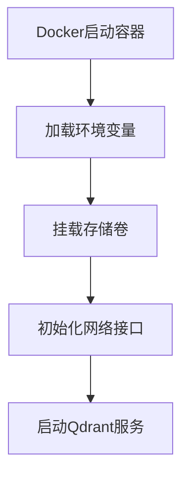
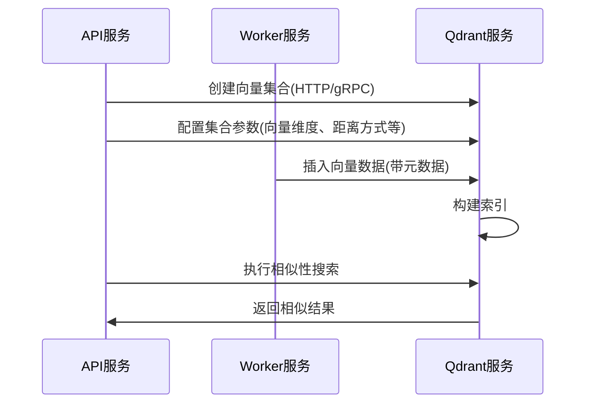

# 【Dify】Qdrant镜像启动过程 🔍

## 概述 📋

Qdrant是一个高效的向量相似度搜索引擎，在Dify平台中作为可选的向量数据库服务，提供高性能的相似度检索和数据管理能力。本文档详细说明Qdrant镜像的启动流程、配置选项及其在Dify架构中的应用。

## Qdrant在Dify中的角色 🔄

在Dify架构中，Qdrant作为可选的向量数据库服务，主要负责：

1. **向量索引与存储**：高效存储和索引向量数据，支持快速的相似度搜索
2. **相似度搜索**：提供多种距离度量方式的相似度搜索功能
3. **过滤器检索**：支持基于结构化元数据的复合过滤查询
4. **数据持久化**：确保向量数据的安全存储和持久化保存

Qdrant通过Docker容器化部署，为Dify提供了轻量级但强大的向量检索基础设施。

## Docker-Compose配置解析 🔍

```yaml
# Qdrant向量存储服务
# (如需使用，需在api和worker服务中设置VECTOR_STORE为qdrant)
qdrant:
  image: langgenius/qdrant:v1.7.3
  profiles:
    - qdrant
  restart: always
  volumes:
    - ./volumes/qdrant:/qdrant/storage
  environment:
    QDRANT_API_KEY: ${QDRANT_API_KEY:-difyai123456}
```

### 关键配置点解析：

1. **镜像版本**：使用`langgenius/qdrant:v1.7.3`镜像，这是基于官方Qdrant镜像的定制版本
2. **可选服务**：通过`profiles: [qdrant]`配置为可选服务，需要时才启用
3. **自动重启**：设置`restart: always`确保服务崩溃后自动恢复
4. **数据持久化**：将`./volumes/qdrant`目录挂载到容器内的`/qdrant/storage`目录，用于存储持久化数据
5. **安全配置**：通过环境变量`QDRANT_API_KEY`设置API密钥，默认值为`difyai123456`

## Dify平台的相关环境变量 ⚙️

Dify平台为API和Worker服务提供了以下与Qdrant相关的环境变量配置：

```properties
# Qdrant连接设置
QDRANT_URL=http://qdrant:6333
QDRANT_API_KEY=difyai123456
QDRANT_CLIENT_TIMEOUT=20
QDRANT_GRPC_ENABLED=false
QDRANT_GRPC_PORT=6334
```

## 启动流程 🚀

Qdrant容器的启动过程包括以下几个关键阶段：

### 1. 容器初始化



当Docker创建并启动Qdrant容器时：

1. Docker引擎解析docker-compose配置，准备容器环境
2. 加载环境变量，包括`QDRANT_API_KEY`，用于设置API访问的安全性
3. 挂载`./volumes/qdrant`目录到容器内的`/qdrant/storage`，确保数据持久化
4. 初始化网络接口，默认监听端口包括：
   - 6333：HTTP API和Web UI
   - 6334：gRPC API
   - 6335：分布式部署（集群内部通信）
5. 启动主Qdrant进程

### 2. 配置加载

Qdrant启动时按以下优先顺序加载配置：

1. 内置默认配置
2. 可选的`/qdrant/config/config.yaml`文件
3. 可选的`/qdrant/config/production.yaml`文件（基于默认RUN_MODE=production）
4. 可选的`/qdrant/config/local.yaml`文件
5. 环境变量（优先级最高）

在Dify的部署中，主要通过环境变量`QDRANT_API_KEY`配置安全性。

### 3. 存储初始化

服务启动后，Qdrant进行存储系统初始化：

1. **检查存储目录**：检查并初始化`/qdrant/storage`目录
2. **WAL恢复**：如存在预写日志(WAL)文件，进行数据恢复
3. **集合加载**：加载现有的向量集合
4. **索引准备**：初始化HNSW索引和其他检索结构

### 4. API服务启动

存储初始化完成后，Qdrant启动API服务：

1. **HTTP服务**：在6333端口启动REST API服务
2. **gRPC服务**：在6334端口启动gRPC API服务（如启用）
3. **Web界面**：在HTTP端口提供Dashboard Web UI

## 与Dify组件的交互 🔗

Qdrant与Dify平台其他组件的交互流程：



1. **连接机制**：
   - API和Worker服务通过HTTP或gRPC协议连接Qdrant
   - 连接参数通过环境变量配置，包括URL、API密钥和超时设置

2. **向量操作**：
   - 集合管理：通过API创建和配置向量集合
   - 数据索引：Worker服务将文本转换为向量后存入Qdrant
   - 相似度搜索：API服务发送向量进行相似度检索

## Qdrant核心配置选项 🔧

Qdrant服务的核心配置选项包括：

1. **日志级别**：
   ```yaml
   log_level: INFO  # 可选：TRACE, DEBUG, INFO, WARN, ERROR
   ```

2. **存储配置**：
   ```yaml
   storage:
     # 数据存储位置
     storage_path: ./storage
     # 快照存储位置
     snapshots_path: ./snapshots
     # payload存储方式配置
     on_disk_payload: true
   ```

3. **性能调优**：
   ```yaml
   storage:
     performance:
       # 搜索线程数，0表示自动选择
       max_search_threads: 0
       # 优化线程数，0表示无限制
       max_optimization_threads: 0
   ```

4. **安全配置**：
   ```yaml
   service:
     # API密钥，用于访问控制
     api_key: ${QDRANT_API_KEY}
   ```

## 监控与日志 📊

Qdrant服务的监控与日志：

1. **日志查看**：
   ```bash
   docker compose logs qdrant
   ```

2. **健康检查**：
   可通过HTTP接口验证服务健康状态：
   ```bash
   curl http://qdrant:6333/healthz
   ```
   
3. **指标监控**：
   Qdrant提供Prometheus格式的指标：
   ```bash
   curl http://qdrant:6333/metrics
   ```

4. **Web界面**：
   通过访问`http://qdrant:6333/dashboard`查看可视化界面

## 故障排除 🛠️

常见问题及解决方案：

1. **服务无法启动**：
   - 检查端口(6333, 6334, 6335)是否被占用
   - 查看Docker日志了解具体错误信息
   - 确认存储目录权限是否正确

2. **API连接失败**：
   - 验证`QDRANT_URL`和`QDRANT_API_KEY`配置是否正确
   - 检查网络连接是否正常
   - 如使用gRPC，确认`QDRANT_GRPC_ENABLED`和`QDRANT_GRPC_PORT`配置正确

3. **搜索性能问题**：
   - 调整集合的`hnsw_config`参数优化搜索性能
   - 考虑增加`max_search_threads`参数
   - 对大数据量考虑启用量化(Quantization)功能

## 数据管理与优化 💾

1. **数据备份**：
   - Qdrant数据存储在`./volumes/qdrant`目录
   - 可通过定期备份该目录或使用Qdrant快照API创建备份

2. **性能优化**：
   - 为集合选择合适的向量距离类型（余弦相似度、欧氏距离或点积）
   - 调整HNSW索引参数，如`m`和`ef_construct`
   - 对大规模数据考虑启用向量量化

3. **扩展建议**：
   - 单实例部署适用于中小规模应用
   - 大型生产环境可考虑配置Qdrant集群模式
   - 资源受限环境可调整`on_disk_payload`优化内存使用

---

> 👉 [English Version](./en/Qdrant_Image_Startup_Process.md) 