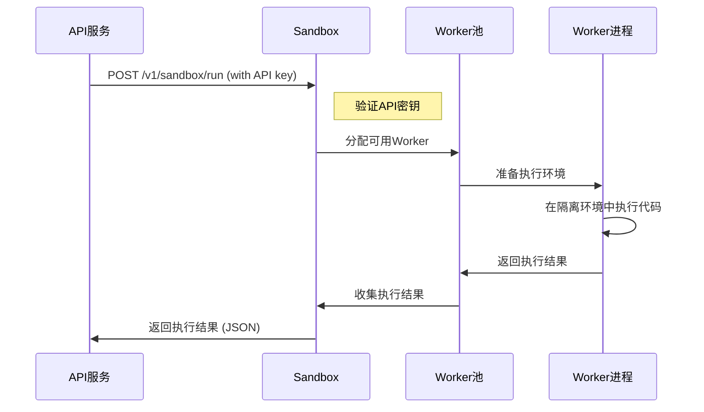

# 【Dify】Sandbox 服务启动过程详解 🚀

> 本文详细解析 Dify 平台中 Sandbox 服务的启动机制、安全隔离架构和代码执行流程，帮助用户深入理解平台的安全代码执行系统是如何工作的。

## 目录 📑

- [Sandbox 服务在 Dify 中的角色](#sandbox-服务在-dify-中的角色)
- [Docker-Compose 配置解析](#docker-compose-配置解析)
- [镜像构建与内容](#镜像构建与内容)
- [启动流程](#启动流程)
- [环境变量与配置](#环境变量与配置)
- [代码执行机制](#代码执行机制)
- [安全隔离模型](#安全隔离模型)
- [与 API 服务的交互](#与-api-服务的交互)
- [监控与健康检查](#监控与健康检查)
- [常见问题与解决方案](#常见问题与解决方案)

## Sandbox 服务在 Dify 中的角色 🔄

在 Dify 架构中，Sandbox 服务是一个安全隔离的代码执行环境，为平台提供了可控且安全的代码运行能力，是实现丰富 AI 应用功能的关键组件。其主要职责包括：

1. **安全代码执行**: 在隔离环境中运行用户或 AI 生成的代码
2. **语言支持**: 提供多种编程语言的执行环境，主要包括 Python 和 Node.js
3. **资源限制**: 限制代码执行的资源使用，如 CPU、内存、执行时间等
4. **网络隔离**: 通过代理控制代码对网络资源的访问
5. **环境管理**: 提供依赖项管理和环境隔离
6. **错误处理**: 安全捕获和报告代码执行过程中的错误

Sandbox 服务使用专门设计的 `langgenius/dify-sandbox` 镜像，在 Dify 中作为独立容器运行，并通过专用网络与 SSRF 代理和 API 服务连接，构成了平台安全代码执行的核心架构。

## Docker-Compose 配置解析 🔍

```yaml
# 安全代码执行沙箱
sandbox:
  image: langgenius/dify-sandbox:0.2.10
  restart: always
  environment:
    # Sandbox 配置
    # 确保在实际部署时更改此密钥以提高安全性
    # 可以使用 `openssl rand -base64 42` 生成强密钥
    API_KEY: ${SANDBOX_API_KEY:-dify-sandbox}
    GIN_MODE: ${SANDBOX_GIN_MODE:-release}
    WORKER_TIMEOUT: ${SANDBOX_WORKER_TIMEOUT:-15}
    ENABLE_NETWORK: ${SANDBOX_ENABLE_NETWORK:-true}
    HTTP_PROXY: ${SANDBOX_HTTP_PROXY:-http://ssrf_proxy:3128}
    HTTPS_PROXY: ${SANDBOX_HTTPS_PROXY:-http://ssrf_proxy:3128}
    SANDBOX_PORT: ${SANDBOX_PORT:-8194}
  volumes:
    # 挂载依赖目录，用于存储安装的依赖包
    - ./volumes/sandbox/dependencies:/dependencies
  healthcheck:
    test: [ 'CMD', 'curl', '-f', 'http://localhost:8194/health' ]
    interval: 1s
    timeout: 3s
    retries: 30
  networks:
    # 仅连接到 SSRF 代理网络，增强安全性
    - ssrf_proxy_network
```

### 关键配置点解析：

1. **镜像版本**: 使用 `langgenius/dify-sandbox:0.2.10` 专用镜像
2. **自动重启**: `restart: always` 确保服务崩溃时自动恢复
3. **安全设置**: 通过环境变量配置 API 密钥和执行超时等安全参数
4. **网络代理**: 配置 HTTP 和 HTTPS 代理，控制外部网络访问
5. **数据卷**: 挂载依赖目录，用于存储和管理代码执行环境的依赖包
6. **健康检查**: 使用 HTTP 请求检查服务健康状态
7. **网络隔离**: 仅连接到专用的 `ssrf_proxy_network`，增强安全性

## 镜像构建与内容 📦

Dify Sandbox 基于专门设计的镜像，包含了安全执行代码所需的所有组件：

### 1. 镜像结构与组件

Dify Sandbox 镜像包含以下主要组件和特点：

- **基础操作系统**: 轻量级 Linux 发行版
- **编程语言环境**:
  - Python 3 解释器及基础库
  - Node.js 运行时环境
- **安全工具**:
  - seccomp: 系统调用过滤机制
  - cgroups: 资源限制控制
  - 网络隔离组件
- **Web 服务组件**:
  - Gin: Go 语言编写的 Web 框架，用于 API 处理
  - 健康检查接口
- **内置工具**:
  - curl: 用于健康检查
  - 依赖管理工具: pip、npm 等

### 2. 文件系统结构

Sandbox 容器内的主要文件系统结构：

- `/app`: 应用程序目录，包含沙箱服务的核心代码
- `/dependencies`: 依赖目录，挂载到主机用于持久化依赖包
- `/tmp`: 临时目录，用于代码执行过程中的临时文件
- `/usr/local/bin`: 包含 Python 和 Node.js 可执行文件

## 启动流程 🚀

Sandbox 容器的启动过程包括以下几个关键阶段：

### 1. 容器初始化

当 Docker 创建并启动 Sandbox 容器时，首先执行以下步骤：

1. 设置环境变量，包括 `API_KEY`, `GIN_MODE` 等
2. 挂载 `./volumes/sandbox/dependencies` 目录到容器的 `/dependencies`
3. 初始化网络配置，连接到 `ssrf_proxy_network`
4. 启动沙箱服务主进程

### 2. 配置加载

沙箱服务启动时会加载配置：

1. 读取环境变量设置，如 API 密钥、工作超时等
2. 检查并初始化依赖目录
3. 配置网络代理设置
4. 设置资源限制和安全策略

### 3. Worker 池初始化

服务启动后会初始化代码执行 Worker 池：

1. 创建预配置数量的 Worker 进程
2. 为每个 Worker 配置资源限制
3. 初始化语言运行时环境
4. 准备代码执行队列

### 4. API 服务启动

完成初始化后，Sandbox 启动 API 服务：

1. 初始化 Gin Web 框架
2. 配置 API 路由和中间件
3. 设置认证机制
4. 启动 HTTP 服务器，监听配置的端口（默认 8194）

### 5. 健康检查

Sandbox 启动后，Docker 会定期执行健康检查：

```yaml
healthcheck:
  test: [ 'CMD', 'curl', '-f', 'http://localhost:8194/health' ]
  interval: 1s
  timeout: 3s
  retries: 30
```

`curl` 命令尝试访问 Sandbox 的健康检查接口，如果服务正常运行，会返回成功状态码，服务被视为健康。

## 环境变量与配置 ⚙️

Sandbox 服务可通过多种环境变量进行配置，这些变量控制服务的行为和安全特性：

### 1. 安全与认证

```properties
# API 密钥，用于验证来自 API 服务的请求
API_KEY=dify-sandbox
# Gin 框架运行模式，生产环境使用 release
GIN_MODE=release
```

### 2. 资源限制

```properties
# 代码执行超时时间（秒）
WORKER_TIMEOUT=15
# 最大 Worker 进程数（配置文件中定义，默认为 4）
# MAX_WORKERS=4
# 每个 Worker 的最大请求数（配置文件中定义，默认为 50）
# MAX_REQUESTS=50
```

### 3. 网络配置

```properties
# 是否允许代码访问网络
ENABLE_NETWORK=true
# HTTP 代理地址，用于控制外部 HTTP 请求
HTTP_PROXY=http://ssrf_proxy:3128
# HTTPS 代理地址，用于控制外部 HTTPS 请求
HTTPS_PROXY=http://ssrf_proxy:3128
# 沙箱服务监听端口
SANDBOX_PORT=8194
```

### 4. 配置文件

除环境变量外，Sandbox 还可通过配置文件进行更详细的设置：

```yaml
# config.yaml 示例
app:
  port: 8194
  debug: True
  key: dify-sandbox
max_workers: 4
max_requests: 50
worker_timeout: 5
python_path: /usr/local/bin/python3
enable_network: True
allowed_syscalls: # 留空表示使用默认安全设置
proxy:
  socks5: ''
  http: ''
  https: ''
```

## 代码执行机制 🔄

Sandbox 服务实现了安全且高效的代码执行流程：

### 1. 请求处理流程

API 服务向 Sandbox 发送代码执行请求的一般流程：



### 2. 代码执行格式

代码执行请求的基本格式：

```json
{
  "language": "python3",
  "code": "print('Hello, World!')",
  "preload": "",
  "enable_network": true
}
```

执行结果响应格式：

```json
{
  "code": 0,
  "message": "success",
  "data": {
    "stdout": "Hello, World!\n",
    "stderr": "",
    "error": null
  }
}
```

### 3. 预加载与依赖管理

Sandbox 支持代码预加载和依赖管理：

```python
# 预加载代码示例
import numpy as np
import pandas as pd

# 主执行代码
def main():
    data = np.array([1, 2, 3])
    print(f"Data: {data}")
    return data.mean()

result = main()
print(f"Result: {result}")
```

对于依赖项，Sandbox 支持在运行时安装缺少的包：

```python
# 安装依赖示例
!pip install matplotlib
import matplotlib.pyplot as plt
```

## 安全隔离模型 🔒

Sandbox 采用多层安全隔离模型，确保代码执行的安全性：

### 1. 访问控制

- **API 密钥认证**: 所有请求必须提供有效的 API 密钥
- **网络隔离**: 通过专用网络和代理限制网络访问
- **文件系统隔离**: 限制对容器文件系统的访问

### 2. 资源限制

- **执行时间限制**: 防止无限循环或长时间运行
- **内存使用限制**: 防止内存泄露和过度消耗
- **CPU 限制**: 防止 CPU 密集型操作影响系统

### 3. 系统调用限制

通过 seccomp 配置文件限制可用的系统调用，提供系统级隔离：

```
# seccomp 系统调用白名单（简化示例）
read, write, open, close, stat, fstat, lstat, poll, lseek, mmap, mprotect,
munmap, brk, rt_sigaction, rt_sigprocmask, rt_sigreturn, ioctl, pread64,
access, pipe, select, sched_yield, mremap, msync, mincore, madvise, shmget,
shmat, shmctl, dup, dup2, pause, nanosleep, getitimer, alarm, setitimer,
getpid, sendfile, socket, connect, accept, sendto, recvfrom, sendmsg,
recvmsg, shutdown, bind, listen, getsockname, getpeername, socketpair,
setsockopt, getsockopt, clone, fork, vfork, execve, exit, wait4, kill,
uname, semget, semop, semctl, shmdt, msgget, msgsnd, msgrcv, msgctl,
fcntl, flock, fsync, fdatasync, truncate, ftruncate, getdents, getcwd,
chdir, fchdir, rename, mkdir, rmdir, creat, link, unlink, symlink,
readlink, chmod, fchmod, chown, fchown, lchown, umask, gettimeofday,
getrlimit, getrusage, sysinfo, times, ptrace, getuid, syslog, getgid,
setuid, setgid, geteuid, getegid, setpgid, getppid, getpgrp, setsid,
setreuid, setregid, getgroups, setgroups, setresuid, getresuid, setresgid,
getresgid, getpgid, setfsuid, setfsgid, getsid, capget, capset, rt_sigpending,
rt_sigtimedwait, rt_sigqueueinfo, rt_sigsuspend, sigaltstack, utime,
mknod, uselib, personality, ustat, statfs, fstatfs, sysfs, getpriority,
setpriority, sched_setparam, sched_getparam, sched_setscheduler,
sched_getscheduler, sched_get_priority_max, sched_get_priority_min,
sched_rr_get_interval, mlock, munlock, mlockall, munlockall, vhangup,
modify_ldt, pivot_root, _sysctl, prctl, arch_prctl, adjtimex, setrlimit,
chroot, sync, acct, settimeofday, mount, umount2, swapon, swapoff,
reboot, sethostname, setdomainname, iopl, ioperm, create_module,
init_module, delete_module, get_kernel_syms, query_module, quotactl,
nfsservctl, getpmsg, putpmsg, afs_syscall, tuxcall, security, gettid,
readahead, setxattr, lsetxattr, fsetxattr, getxattr, lgetxattr, fgetxattr,
listxattr, llistxattr, flistxattr, removexattr, lremovexattr, fremovexattr,
tkill, time, futex, sched_setaffinity, sched_getaffinity, set_thread_area,
io_setup, io_destroy, io_getevents, io_submit, io_cancel, get_thread_area,
lookup_dcookie, epoll_create, epoll_ctl_old, epoll_wait_old, remap_file_pages,
getdents64, set_tid_address, restart_syscall, semtimedop, fadvise64,
timer_create, timer_settime, timer_gettime, timer_getoverrun, timer_delete,
clock_settime, clock_gettime, clock_getres, clock_nanosleep, exit_group,
epoll_wait, epoll_ctl, tgkill, utimes, vserver, mbind, set_mempolicy,
get_mempolicy, mq_open, mq_unlink, mq_timedsend, mq_timedreceive, mq_notify,
mq_getsetattr, kexec_load, waitid, add_key, request_key, keyctl, ioprio_set,
ioprio_get, inotify_init, inotify_add_watch, inotify_rm_watch, migrate_pages,
openat, mkdirat, mknodat, fchownat, futimesat, newfstatat, unlinkat, renameat,
linkat, symlinkat, readlinkat, fchmodat, faccessat, pselect6, ppoll,
unshare, set_robust_list, get_robust_list, splice, tee, sync_file_range,
vmsplice, move_pages, utimensat, epoll_pwait, signalfd, timerfd_create,
eventfd, fallocate, timerfd_settime, timerfd_gettime, accept4, signalfd4,
eventfd2, epoll_create1, dup3, pipe2, inotify_init1, preadv, pwritev,
rt_tgsigqueueinfo, perf_event_open, recvmmsg, fanotify_init, fanotify_mark,
prlimit64, name_to_handle_at, open_by_handle_at, clock_adjtime, syncfs,
sendmmsg, setns, getcpu, process_vm_readv, process_vm_writev, kcmp,
finit_module, sched_setattr, sched_getattr, renameat2, seccomp,
getrandom, memfd_create, kexec_file_load, bpf, execveat, userfaultfd,
membarrier, mlock2, copy_file_range, preadv2, pwritev2, pkey_mprotect,
pkey_alloc, pkey_free, statx
```

### 4. 网络安全

所有外部网络访问都通过 SSRF 代理转发，提供额外的安全层：


## 与 API 服务的交互 🔌

API 服务通过 HTTP 请求与 Sandbox 交互：

### 1. API 服务端调用示例

```python
def execute_code(language, preload, code):
    """
    执行代码
    :param language: 代码语言
    :param preload: 预加载代码
    :param code: 主执行代码
    :return: 执行结果
    """
    url = f"{dify_config.CODE_EXECUTION_ENDPOINT}/v1/sandbox/run"
    headers = {"X-Api-Key": dify_config.CODE_EXECUTION_API_KEY}
    data = {
        "language": language,
        "code": code,
        "preload": preload,
        "enable_network": True,
    }
    
    try:
        response = requests.post(
            url,
            json=data,
            headers=headers,
            timeout=(
                dify_config.CODE_EXECUTION_CONNECT_TIMEOUT,
                dify_config.CODE_EXECUTION_READ_TIMEOUT,
            ),
        )
        if response.status_code == 503:
            raise Exception("Code execution service is unavailable")
        elif response.status_code != 200:
            raise Exception(f"Failed to execute code, got status code {response.status_code}")
            
        response_data = response.json()
        if response_data.get("code") != 0:
            raise Exception(f"Got error code: {response_data.get('code')}")
            
        return response_data.get("data", {}).get("stdout", "")
    except Exception as e:
        raise Exception(f"Failed to execute code: {str(e)}")
```

### 2. 安全策略限制

API 服务对代码执行施加额外的限制：

```python
# 代码大小和复杂度限制
CODE_MAX_STRING_LENGTH = 80000
CODE_MAX_STRING_ARRAY_LENGTH = 30
CODE_MAX_OBJECT_ARRAY_LENGTH = 30
CODE_MAX_NUMBER_ARRAY_LENGTH = 1000
CODE_MAX_NUMBER = 9223372036854775807
CODE_MIN_NUMBER = -9223372036854775807
```

### 3. 错误处理

API 服务会处理 Sandbox 返回的错误：

```python
try:
    result = execute_code(language, preload, code)
    return result
except Exception as e:
    # 记录错误
    logging.error(f"Code execution failed: {str(e)}")
    # 返回友好错误消息
    return f"Code execution failed: {str(e)}"
```

## 监控与健康检查 🩺

### 1. Docker 健康检查

Docker Compose 配置了自动健康检查，用于确认 Sandbox 是否正常运行：

```yaml
healthcheck:
  test: [ 'CMD', 'curl', '-f', 'http://localhost:8194/health' ]
  interval: 1s
  timeout: 3s
  retries: 30
```

这个配置使 Docker 每秒执行一次 `curl` 命令访问健康检查端点，最多重试 30 次，如果超过 30 次检查都失败，容器会被标记为不健康。

### 2. 服务日志

Sandbox 日志可通过 Docker 命令查看：

```bash
# 查看 Sandbox 日志
docker-compose logs sandbox

# 实时跟踪 Sandbox 日志
docker-compose logs -f sandbox
```

### 3. 性能监控

监控 Sandbox 的资源使用情况：

```bash
# 查看容器资源使用
docker stats sandbox

# 查看容器进程
docker top sandbox
```

## 常见问题与解决方案 ❓

### 1. Sandbox 服务无法启动

**问题**: Sandbox 容器启动失败

**解决方案**:
- 检查 Docker 日志: `docker-compose logs sandbox`
- 验证端口可用性: 确保端口 8194 未被占用
- 检查网络配置: 确保 ssrf_proxy_network 正确创建
- 验证卷挂载: 确保 dependencies 目录存在且权限正确

### 2. 代码执行超时

**问题**: 代码执行经常超时

**解决方案**:
- 增加超时设置: 修改 `WORKER_TIMEOUT` 环境变量
- 优化执行代码: 减少复杂度和计算量
- 扩展 Worker 数量: 增加 `max_workers` 配置
- 增加资源分配: 为 Sandbox 容器分配更多资源

### 3. 依赖安装失败

**问题**: 执行依赖安装命令失败

**解决方案**:
- 检查网络设置: 确保 `ENABLE_NETWORK` 设置为 true
- 验证代理配置: 确保 HTTP_PROXY 和 HTTPS_PROXY 正确设置
- 检查依赖目录: 确保 dependencies 目录权限正确
- 预安装依赖: 考虑预先安装常用依赖

### 4. 安全限制问题

**问题**: 代码由于安全限制无法执行特定操作

**解决方案**:
- 查看详细错误: 检查代码执行返回的错误信息
- 调整 seccomp 配置: 根据需要合理调整系统调用白名单
- 修改网络策略: 根据需要调整代理配置
- 替代方案: 寻找不需要受限操作的替代实现方式

### 5. API 连接问题

**问题**: API 服务无法连接到 Sandbox

**解决方案**:
- 验证网络设置: 确保两个服务位于同一网络
- 检查 API 密钥: 确保 API_KEY 设置一致
- 验证端口配置: 确保端口设置正确
- 检查健康状态: 验证 Sandbox 健康检查通过

---

## 相关链接 🔗

- [English Version](en/【Dify】Sandbox服务启动过程详解.md)
- [Dify API 服务启动过程详解](【Dify】API服务启动过程详解.md)
- [Dify Web 服务启动过程详解](【Dify】Web服务启动过程详解.md)
- [Dify Worker 服务启动过程详解](【Dify】Worker服务启动过程详解.md)
- [Dify DB 服务启动过程详解](【Dify】DB服务启动过程详解.md)
- [Dify Redis 服务启动过程详解](【Dify】Redis服务启动过程详解.md) 