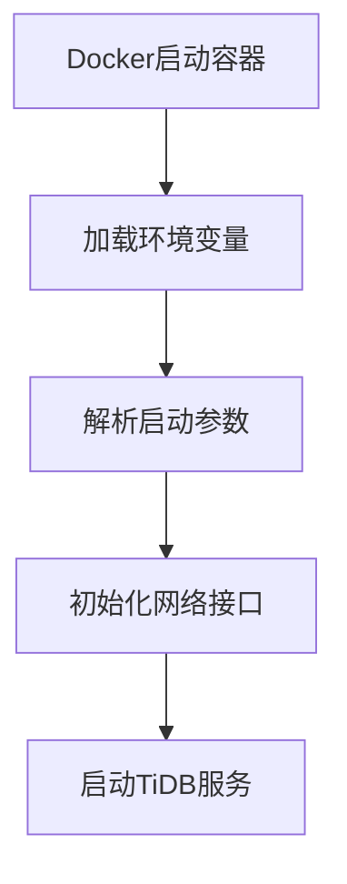
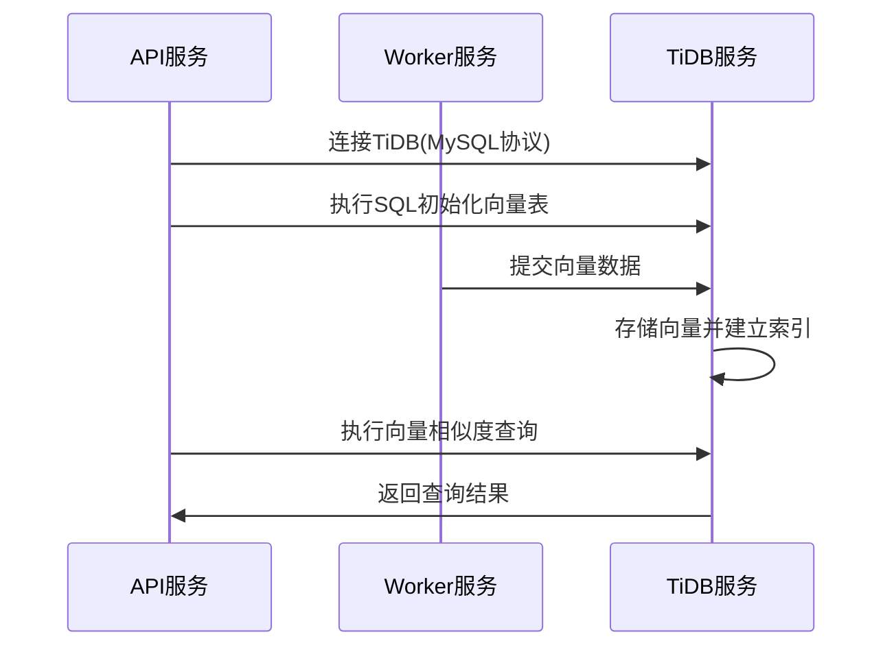

# 【Dify】TiDB镜像启动过程 🔍

## 概述 📋

TiDB是一个开源的分布式SQL数据库，在Dify平台中主要作为向量存储的选项之一，支持高效的向量检索和数据查询能力。本文档详细说明TiDB镜像的启动流程、配置选项及其在Dify架构中的应用。

## TiDB在Dify中的角色 🔄

在Dify架构中，TiDB作为可选的向量数据库服务，主要负责：

1. **向量数据存储**：存储嵌入式向量表示，支持相似度搜索
2. **SQL能力**：提供完整的SQL接口，支持复杂查询操作
3. **数据持久化**：保障数据的可靠存储和恢复
4. **分布式事务**：支持ACID事务，确保数据一致性

TiDB通过Docker容器化部署，为Dify提供了具备SQL能力的向量存储解决方案。

## Docker-Compose配置解析 🔍

```yaml
# TiDB向量存储服务
# 生产环境使用，请参考 https://github.com/pingcap/tidb-docker-compose
tidb:
  image: pingcap/tidb:v8.4.0
  profiles:
    - tidb
  command:
    - --store=unistore
  restart: always
```

### 关键配置点解析：

1. **镜像版本**：使用`pingcap/tidb:v8.4.0`官方镜像
2. **配置文件机制**：通过`profiles: [tidb]`配置为可选服务
3. **存储引擎**：使用`--store=unistore`参数配置本地存储引擎
4. **自动重启**：设置`restart: always`确保服务崩溃后自动恢复
5. **简化配置**：Dify中采用了最小化配置，适用于开发和测试环境

## 启动流程 🚀

TiDB容器的启动过程包括以下几个关键阶段：

### 1. 容器初始化



当Docker创建并启动TiDB容器时：

1. Docker引擎解析docker-compose配置，准备容器环境
2. 加载环境变量，确定运行参数
3. 解析命令行参数，特别是`--store=unistore`参数
4. 初始化网络接口，默认监听4000端口(MySQL协议)和10080端口(HTTP状态报告)
5. 启动主TiDB进程

### 2. 服务初始化

TiDB服务启动时会执行以下初始化步骤：

1. **存储引擎初始化**：根据`--store=unistore`参数初始化本地存储引擎
2. **数据目录检查**：检查并初始化数据存储目录，默认为`/tmp/tidb`
3. **系统表创建**：初始化系统表和元数据
4. **SQL解析器初始化**：准备SQL解析和执行环境
5. **事务管理器初始化**：初始化事务处理系统

### 3. 监听端口设置

TiDB默认启用两个主要端口：

1. **4000端口**：MySQL协议端口，用于SQL连接和数据操作
2. **10080端口**：HTTP状态报告端口，提供监控和管理接口

### 4. 存储引擎启动

TiDB在Dify中使用的是本地存储引擎unistore：

1. **unistore初始化**：启动内置的unistore存储引擎
2. **内存分配**：为存储引擎分配内存资源
3. **存储结构创建**：初始化数据存储结构
4. **索引系统启动**：准备索引系统以支持高效查询

## 与Dify组件的交互 🔗

TiDB与Dify平台其他组件的交互流程：



1. **连接机制**：
   - API和Worker服务通过MySQL协议连接TiDB
   - 连接参数由`TIDB_VECTOR_HOST`、`TIDB_VECTOR_PORT`等环境变量配置

2. **数据操作**：
   - 表创建：使用SQL语句创建向量表和索引
   - 数据写入：通过SQL插入向量数据
   - 向量检索：使用特殊的SQL函数进行相似度查询

## 环境变量与配置 ⚙️

TiDB服务可通过以下关键环境变量进行配置：

```properties
# TiDB服务器连接信息
TIDB_VECTOR_HOST=tidb
TIDB_VECTOR_PORT=4000
TIDB_VECTOR_USER=root  # 默认用户
TIDB_VECTOR_PASSWORD=  # 默认无密码
TIDB_VECTOR_DATABASE=dify  # 默认数据库名

# 存储配置
# --store=unistore：使用本地存储引擎
# --path：数据目录，默认为/tmp/tidb
```

## 命令行参数说明 🔧

TiDB启动时的主要命令行参数：

1. **--store**：
   - 值为`unistore`：使用本地存储引擎，适合单机测试环境
   - 值为`tikv`：使用分布式存储引擎，用于生产环境，需要配合PD和TiKV组件

2. **--path**：
   - 存储引擎数据目录
   - 本地存储引擎(unistore)默认为`/tmp/tidb`
   - 使用`--path=""`可启用纯内存模式

3. **--host**：
   - 服务监听地址，默认为`0.0.0.0`
   
4. **-P**：
   - MySQL协议端口，默认为`4000`

5. **--status**：
   - HTTP状态端口，默认为`10080`

## 监控与日志 📊

TiDB服务的日志和监控：

1. **日志查看**：
   ```bash
   docker compose logs tidb
   ```

2. **健康检查**：
   可通过HTTP接口验证服务健康状态：
   ```bash
   curl http://tidb:10080/status
   ```
   
3. **监控指标**：
   TiDB提供丰富的监控指标，通过以下方式获取：
   ```bash
   # 通过HTTP接口获取指标
   curl http://tidb:10080/metrics
   ```

## 故障排除 🛠️

常见问题及解决方案：

1. **服务无法启动**：
   - 检查端口(4000和10080)是否被占用
   - 查看Docker日志了解具体错误信息
   - 确认数据目录权限是否正确

2. **连接失败**：
   - 验证连接参数(主机、端口、用户名、密码)是否正确
   - 检查网络连接是否正常
   - 确认TiDB服务是否正常运行

3. **性能问题**：
   - 本地存储引擎(unistore)主要用于测试，不适合生产环境的大数据量
   - 对于生产环境，建议使用完整的TiDB集群(TiDB+TiKV+PD)

## 数据管理与优化 💾

1. **数据备份**：
   - 对于本地存储引擎，可通过备份数据目录(`/tmp/tidb`)实现
   - 使用mysqldump等工具导出数据

2. **性能优化**：
   - 本地存储引擎适用于开发测试，数据量不宜过大
   - 增加内存分配可提高性能
   - 考虑使用索引优化查询

3. **生产环境建议**：
   - 单机TiDB+unistore仅适用于开发测试环境
   - 对于生产环境，建议使用完整的TiDB集群部署
   - 参考官方文档进行集群配置和优化：https://github.com/pingcap/tidb-docker-compose

---

> 👉 [English Version](./en/TiDB_Image_Startup_Process.md) 