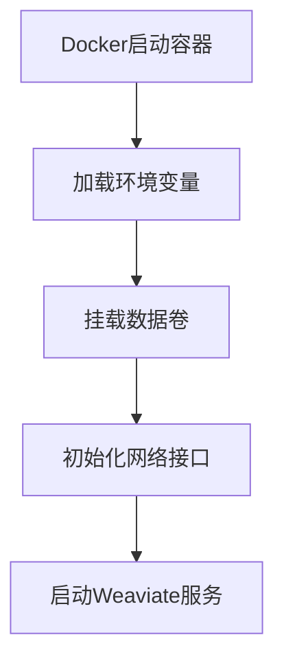
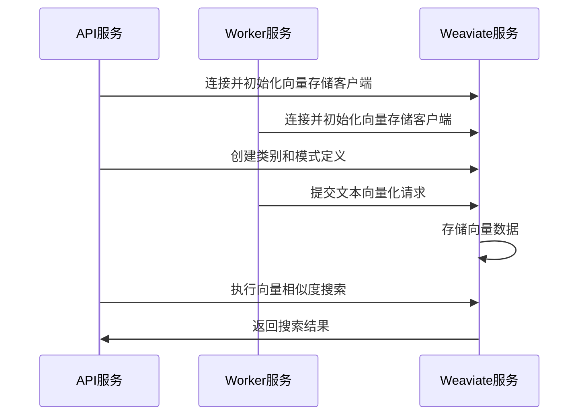

# 【Dify】Weaviate镜像启动过程 🔍

## 概述 📋

Weaviate服务在Dify平台中充当向量数据库，为应用提供高效的语义搜索和相似度检索能力。本文档详细说明Weaviate镜像的启动流程、配置选项及其在Dify中的应用。

## Weaviate在Dify中的角色 🔄

在Dify架构中，Weaviate作为默认的向量数据库，主要负责：

1. **向量存储**：存储文本、图像等非结构化数据的向量表示
2. **语义搜索**：提供基于语义相似度的高效检索功能
3. **数据持久化**：保存向量数据，确保系统重启后数据不丢失
4. **API服务**：提供RESTful和GraphQL接口，便于其他服务调用

Weaviate通过Docker容器化部署，为Dify平台提供了可扩展的向量搜索基础设施。

## Docker-Compose配置解析 🔍

```yaml
# Weaviate向量数据库
weaviate:
  image: semitechnologies/weaviate:1.19.0
  profiles:
    - ''
    - weaviate
  restart: always
  volumes:
    # 挂载Weaviate数据目录到容器
    - ./volumes/weaviate:/var/lib/weaviate
  environment:
    # Weaviate配置
    # 更多信息请参考Weaviate官方文档: https://weaviate.io/developers/weaviate/config-refs/env-vars
    PERSISTENCE_DATA_PATH: ${WEAVIATE_PERSISTENCE_DATA_PATH:-/var/lib/weaviate}
    QUERY_DEFAULTS_LIMIT: ${WEAVIATE_QUERY_DEFAULTS_LIMIT:-25}
    AUTHENTICATION_ANONYMOUS_ACCESS_ENABLED: ${WEAVIATE_AUTHENTICATION_ANONYMOUS_ACCESS_ENABLED:-false}
    DEFAULT_VECTORIZER_MODULE: ${WEAVIATE_DEFAULT_VECTORIZER_MODULE:-none}
    CLUSTER_HOSTNAME: ${WEAVIATE_CLUSTER_HOSTNAME:-node1}
    AUTHENTICATION_APIKEY_ENABLED: ${WEAVIATE_AUTHENTICATION_APIKEY_ENABLED:-true}
    AUTHENTICATION_APIKEY_ALLOWED_KEYS: ${WEAVIATE_AUTHENTICATION_APIKEY_ALLOWED_KEYS:-WVF5YThaHlkYwhGUSmCRgsX3tD5ngdN8pkih}
    AUTHENTICATION_APIKEY_USERS: ${WEAVIATE_AUTHENTICATION_APIKEY_USERS:-hello@dify.ai}
    AUTHORIZATION_ADMINLIST_ENABLED: ${WEAVIATE_AUTHORIZATION_ADMINLIST_ENABLED:-true}
    AUTHORIZATION_ADMINLIST_USERS: ${WEAVIATE_AUTHORIZATION_ADMINLIST_USERS:-hello@dify.ai}
```

### 关键配置点解析：

1. **镜像版本**：使用`semitechnologies/weaviate:1.19.0`镜像
2. **配置文件机制**：支持默认配置和weaviate特定配置文件
3. **自动重启**：设置`restart: always`确保服务崩溃后自动恢复
4. **数据卷挂载**：挂载`./volumes/weaviate:/var/lib/weaviate`保证数据持久化
5. **环境变量配置**：设置多种Weaviate运行参数，包括：
   - 数据存储路径
   - 查询限制
   - 认证方式
   - 向量化模块设置
   - 集群配置

## 启动流程 🚀

Weaviate容器的启动过程包括以下几个关键阶段：

### 1. 容器初始化



当Docker创建并启动Weaviate容器时：

1. Docker引擎解析docker-compose配置，准备容器环境
2. 加载环境变量，设置Weaviate的运行参数
3. 挂载`./volumes/weaviate`目录到容器内的`/var/lib/weaviate`，确保数据持久化
4. 初始化网络接口，默认监听8080端口
5. 启动主Weaviate进程

### 2. 服务初始化

Weaviate服务启动时会执行以下初始化步骤：

1. **配置加载**：从环境变量中读取配置信息
2. **数据目录检查**：检查并初始化`PERSISTENCE_DATA_PATH`指定的数据目录
3. **模块加载**：根据`DEFAULT_VECTORIZER_MODULE`加载向量化模块
4. **安全初始化**：设置API密钥和认证机制
5. **集群初始化**：根据`CLUSTER_HOSTNAME`设置节点标识

### 3. 数据恢复

如果挂载的数据卷中存在之前的数据，Weaviate会执行数据恢复操作：

1. 读取持久化的数据文件
2. 恢复索引结构
3. 加载向量数据到内存
4. 验证数据完整性

### 4. API服务启动

数据恢复完成后，Weaviate会启动API服务：

1. 启动HTTP服务器，监听配置的端口（默认8080）
2. 初始化RESTful API接口
3. 初始化GraphQL接口
4. 准备接收来自其他服务的请求

## 与Dify组件的交互 🔗

Weaviate与Dify平台其他组件的交互流程：



1. **服务连接**：
   - API和Worker服务通过`WEAVIATE_ENDPOINT`和`WEAVIATE_API_KEY`连接Weaviate
   - 连接参数在`.env`文件中配置

2. **向量操作**：
   - 文档索引：Worker服务将文档转换为向量并存储到Weaviate
   - 向量检索：API服务执行相似度搜索，为应用提供相关内容

## 环境变量与配置 ⚙️

Weaviate服务可通过以下关键环境变量进行配置：

```properties
# 数据持久化路径
WEAVIATE_PERSISTENCE_DATA_PATH=/var/lib/weaviate

# 查询默认限制，控制返回结果数量
WEAVIATE_QUERY_DEFAULTS_LIMIT=25

# 匿名访问控制
WEAVIATE_AUTHENTICATION_ANONYMOUS_ACCESS_ENABLED=false

# 默认向量化模块
WEAVIATE_DEFAULT_VECTORIZER_MODULE=none

# 集群主机名
WEAVIATE_CLUSTER_HOSTNAME=node1

# API密钥认证设置
WEAVIATE_AUTHENTICATION_APIKEY_ENABLED=true
WEAVIATE_AUTHENTICATION_APIKEY_ALLOWED_KEYS=WVF5YThaHlkYwhGUSmCRgsX3tD5ngdN8pkih

# 管理员列表设置
WEAVIATE_AUTHORIZATION_ADMINLIST_ENABLED=true
WEAVIATE_AUTHORIZATION_ADMINLIST_USERS=hello@dify.ai
```

## 监控与日志 📊

Weaviate服务的日志记录：

1. **日志查看**：
   ```bash
   docker compose logs weaviate
   ```

2. **健康检查**：
   可通过API验证服务健康状态：
   ```bash
   curl -I http://weaviate:8080/v1/meta
   ```
   
3. **监控指标**：
   Weaviate提供健康指标和状态信息，可通过以下方式查看：
   ```bash
   curl http://weaviate:8080/v1/meta
   ```

## 故障排除 🛠️

常见问题及解决方案：

1. **服务无法启动**：
   - 检查端口是否被占用
   - 验证数据目录权限
   - 查看Docker日志了解具体错误

2. **连接超时**：
   - 确认API和Worker服务配置了正确的`WEAVIATE_ENDPOINT`
   - 检查网络连接是否正常
   - 验证API密钥是否正确

3. **查询性能问题**：
   - 调整`WEAVIATE_QUERY_DEFAULTS_LIMIT`
   - 考虑增加容器资源限制
   - 检查数据量是否过大

## 数据管理与优化 💾

1. **数据备份**：
   - Weaviate的数据存储在`./volumes/weaviate`目录
   - 定期备份此目录以防数据丢失

2. **性能优化**：
   - 增加`QUERY_DEFAULTS_LIMIT`值提高查询结果数量
   - 根据实际需求调整认证设置
   - 考虑使用专门的向量化模块提高效率

3. **扩展建议**：
   - 单机部署适用于中小规模应用
   - 大规模应用考虑配置Weaviate集群
   - 监控数据量增长，适时调整资源配置

---

> 👉 [English Version](./en/Weaviate_Image_Startup_Process.md) 