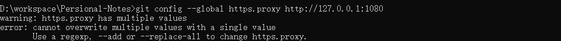

# 【Apusic应用服务器】问题

## number. 问题模板

### 问题

#### 问题原因

#### 问题解决


## 1. 443

### 问题

`Failed to connect to github.com port 443`

### 问题原因

命令行在拉取/推送代码时并没有使用`vpn`进行代理，分为两种情况：① 自己有`vpn`，网页可以打开`github`；② 没有`VPN`。

### 问题解决

#### 自己有vpn

有VPN的情况下说明代理端口未打开，使用以下命令打开：

```shell
# 配置socks5代理
git config --global http.proxy socks5 127.0.0.1:端口地址
git config --global https.proxy socks5 127.0.0.1:端口地址
# 配置http代理
git config --global http.proxy socks5 127.0.0.1:端口地址
git config --global https.proxy socks5 127.0.0.1:端口地址
```

端口地址可以在自己的VPN软件中查看，`Clash for windows`默认是`7890`，代理方式和使用的软件有关，两种都可以测试一下。

#### 没有VPN

建议找一个哈哈。

## 2. 在已存在的远程仓库中初始化失败

### 问题

`Reinitialized existing Git repository in ........................`

### 问题原因

当前仓库下已经存在了一个`git`远程仓库

### 问题解决

删除当前文件下的.git文件即可

```shell
rm -rf .git
```

## 3. warning: http.proxy|https.proxy has multiple values

### 问题



### 问题原因

设置了多个代理

### 问题解决

如果你曾设置过多个代理，便会在取消代理设置时遭遇此错误。使用 `--unset-all` 替代 `--unset` 即可解决。

```git
git config --global --unset-all http.proxy
git config --global --unset-all https.proxy
```
