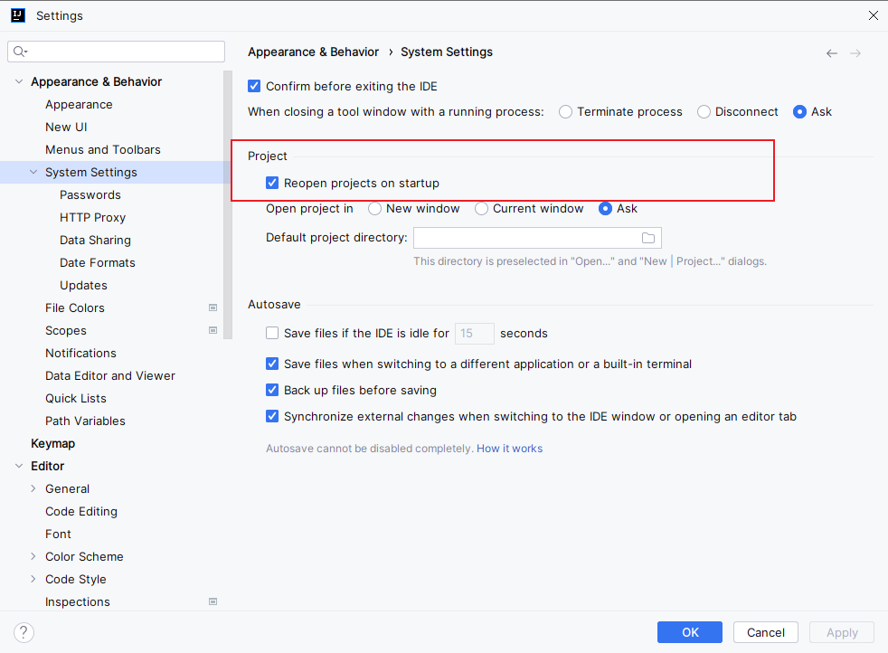
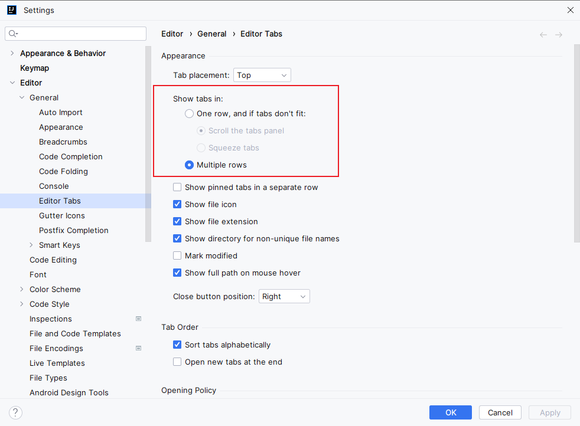
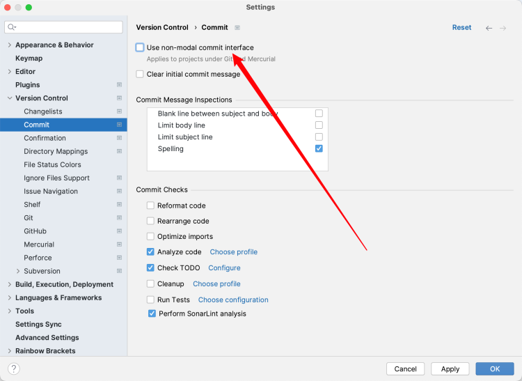
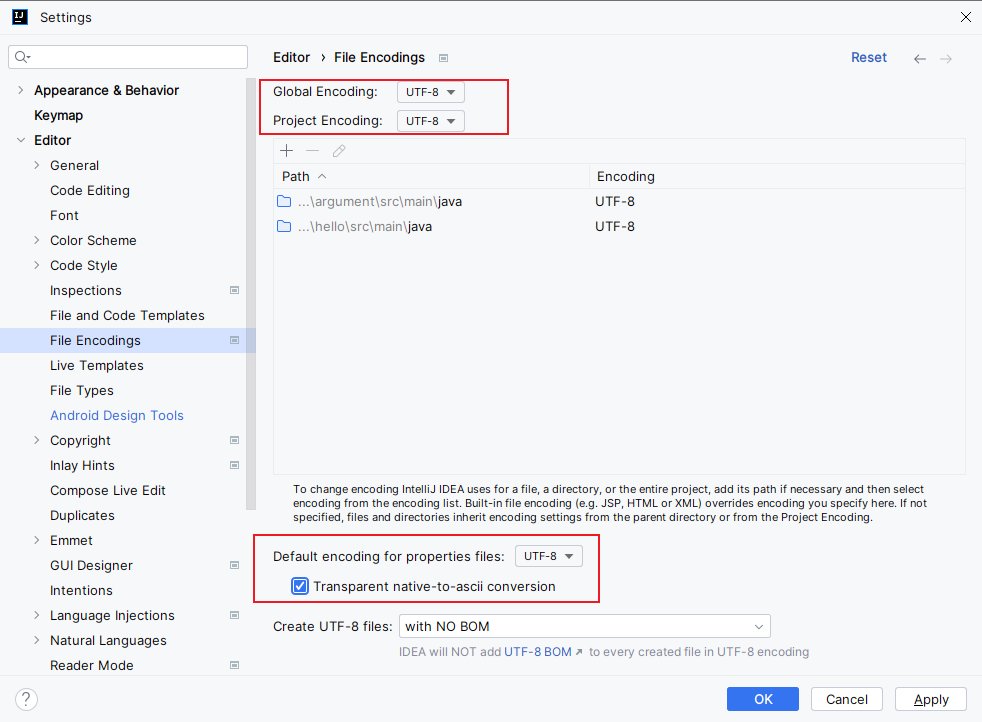
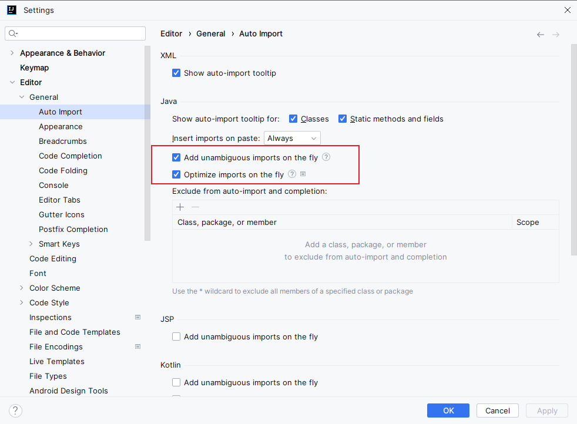

# IDEA 常用设置指南

## 目录

[1. 目录](#目录)

[2. 界面设置](#界面设置)

- [2.1 启动项目设置](#启动项目设置)

- [2.2 文件显示模式](#文件显示模式)

- [2.3 显示变更日志](#显示变更日志)

[3. 编码设置](#编码设置)

- [3.1 文件编码](#文件编码)

- [3.2 自动导包设置](#自动导包设置)

[4. 快捷键](#快捷键)

- [4.1 书签功能](#书签功能)

- [4.2 其他常用快捷键](#其他常用快捷键)

[5. 使用技巧](#使用技巧)

## 界面设置

### 启动项目设置
避免 IDEA 启动时自动打开上次的项目：

1. 路径：`File -> Settings -> Appearance & Behavior -> System Settings`
2. 关闭：`Reopen projects on startup` 选项

### 文件显示模式

启用文件分行显示功能，使界面更清晰：

### 显示变更日志
查看代码变更历史：

## 编码设置

### 文件编码
解决中文乱码问题：

1. 路径：`File -> Settings -> Editor -> File Encodings`
2. 建议设置：
   - Global Encoding: UTF-8
   - Project Encoding: UTF-8
   - Default encoding for properties files: UTF-8

### 自动导包设置
配置自动导入和优化导包：

1. 路径：`File -> Settings -> Editor -> General -> Auto Import`
2. 开启选项：
   - Add unambiguous imports on the fly
   - Optimize imports on the fly

## 快捷键

### 书签功能
- 添加/删除书签：`F11`
- 查看所有书签：`Shift + F11`

### 其他常用快捷键
- 查找文件：`Double Shift`
- 全局搜索：`Ctrl + Shift + F`（Mac：`Command + Shift + F`）
- 最近文件：`Ctrl + E`（Mac：`Command + E`）
- 跳转到定义：`Ctrl + B`（Mac：`Command + B`）
- 重构重命名：`Shift + F6`

## 使用技巧

1. 使用书签功能标记重要代码位置
2. 定期查看变更日志了解代码变化
3. 合理设置文件编码避免乱码问题
4. 启用自动导包提高开发效率
5. 熟练使用快捷键提升开发体验
