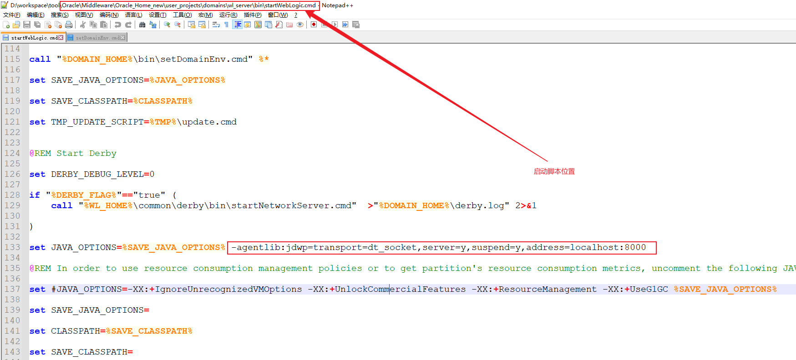
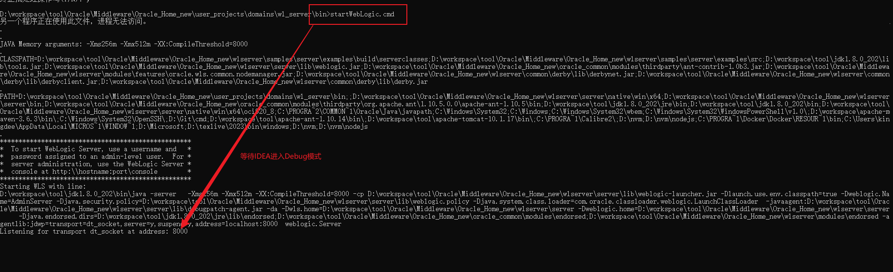
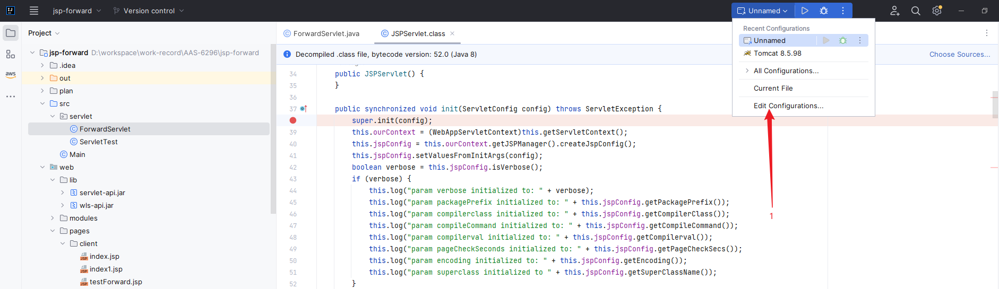
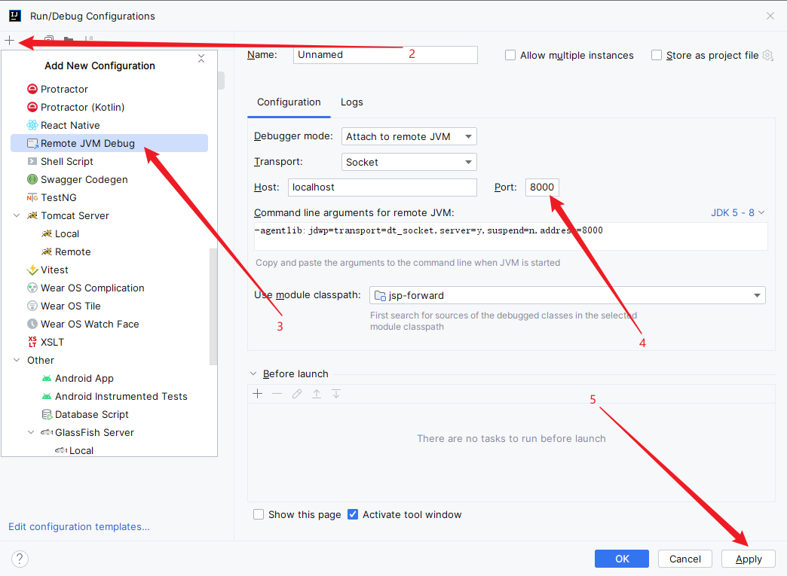
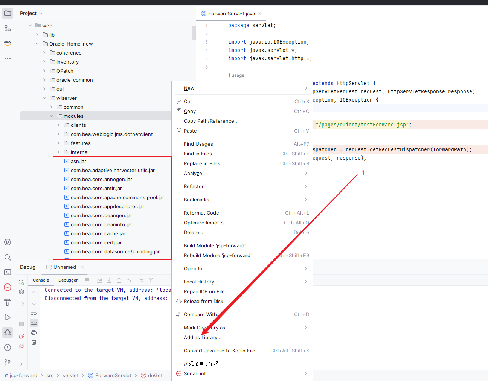
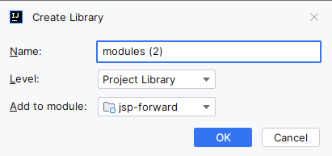
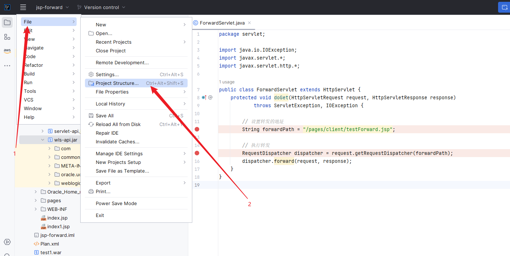
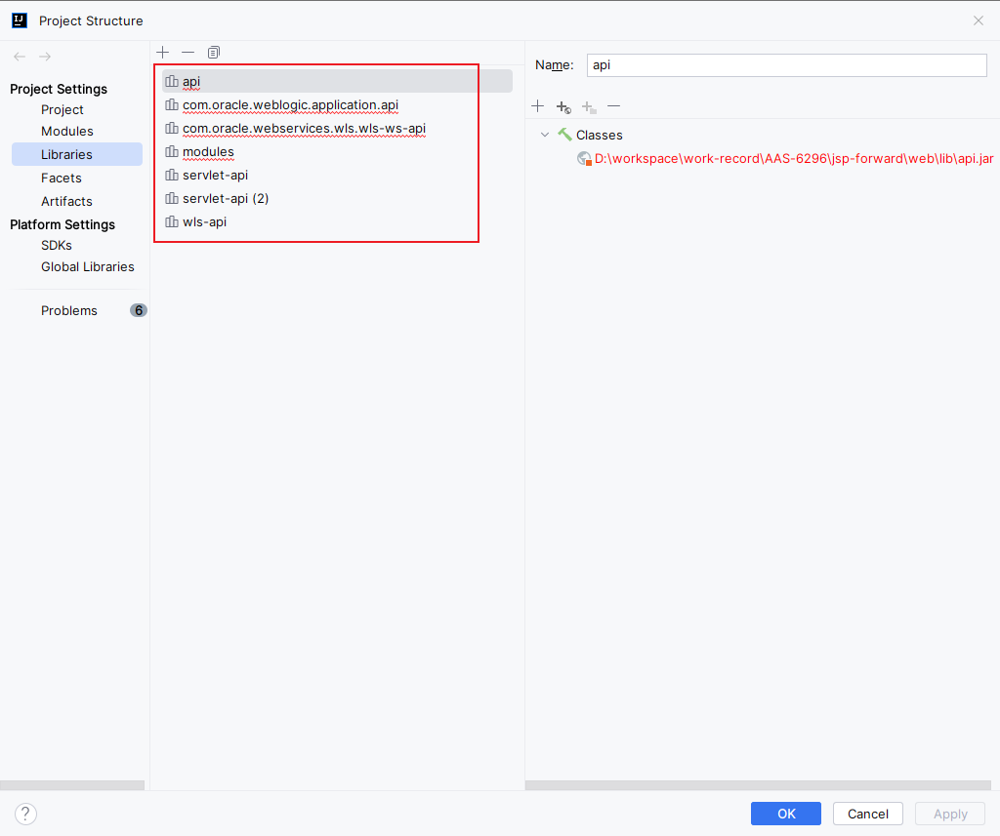

# IDEA 远程调试指南

## 目录

[1. 目录](#目录)

[2. 简介](#简介)

[3. 配置步骤](#配置步骤)

- [3.1 JVM 配置](#jvm-配置)

- [3.2 服务器配置](#服务器配置)

- [3.3 IDEA 配置](#idea-配置)

- [3.4 导入源码/JAR包](#导入源码jar包)

[4. 使用技巧](#使用技巧)


## 简介

远程调试是一项重要的开发技能，特别适用于以下场景：
- 服务器环境没有GUI界面
- 需要在测试环境调试定位问题
- 比日志更直观地分析问题

## 配置步骤

### JVM 配置

根据 JDK 版本选择合适的调试参数：

```bash
# JDK 1.5-1.8
-agentlib:jdwp=transport=dt_socket,server=y,suspend=y,address=127.0.0.1:8000

# JDK 1.9+
-agentlib:jdwp=transport=dt_socket,server=y,suspend=y,address=*:8000
```

参数说明：
- `transport=dt_socket`: 使用 Socket 传输
- `server=y`: 作为调试服务端
- `suspend=y`: 启动时等待调试器连接
- `address`: 监听地址和端口

### 服务器配置

以 WebLogic 为例，在启动脚本中添加调试参数：



> 注意：确保参数添加在一定会被加入 JAVA_OPTIONS 的位置

启动后服务会等待调试器连接：



### IDEA 配置

1. 添加远程调试配置：



2. 设置连接参数：



### 导入源码/JAR包

1. 导入相关 JAR 包：



2. 等待 IDEA 扫描完成：



3. 管理项目库（可选）：
   - 打开 File -> Project Structure
   - 找到 Libraries 选项



4. 清理重复库（可选）：



5. 重新添加为库：


完成后可以查看所有模块源码：


## 使用技巧

1. 建议导入完整项目源码，方便全局检索
2. 设置合适的断点位置
3. 注意生产环境慎用，建议在测试环境使用
4. 可以结合日志辅助分析问题