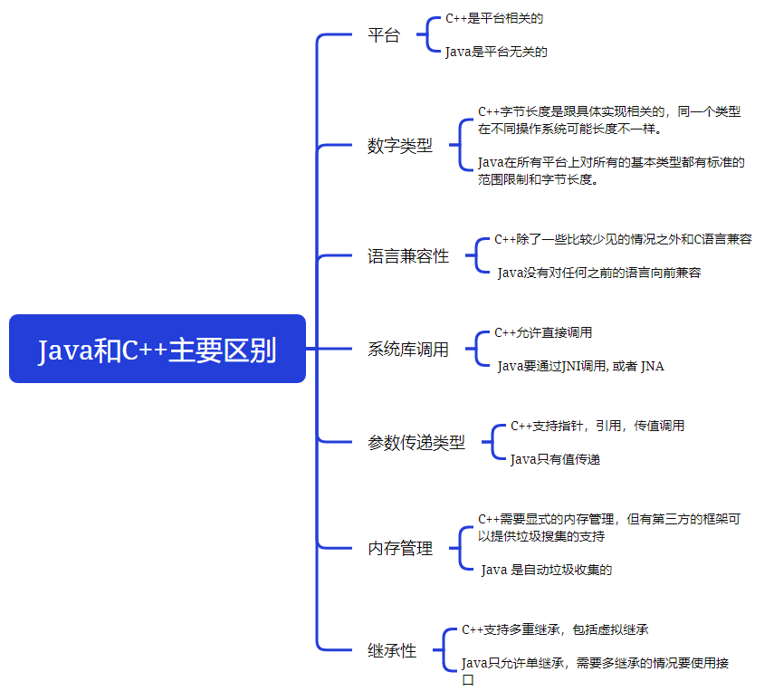

# 主要区别

**C++是编译型语言**（首先将源代码编译生成机器语言，再由机器运行机器码），执行速度快、效率高；依赖编译器、跨平台性差些。

**Java是解释型语言**（源代码不是直接翻译成机器语言，而是先翻译成中间代码，再由解释器对中间代码进行解释运行），执行速度慢、效率低；依赖解释器、跨平台性好。

# 具体区别



## 数字类型


JAVA

| 类型  |  字节大小   |   范围   |
| :---: | :---------: | :------: |
| byte  | 1（8 bit）  | -128-127 |
| short | 2（16 bit） |          |
|  int  | 4（32 bit） |          |
| long  | 8（64 bit） |          |


## 参数传递

### 形参&实参

方法的定义可能会用到 **参数**（有参的方法），参数在程序语言中分为：

- **实参（实际参数，Arguments）**：用于传递给函数/方法的参数，必须有确定的值。
- **形参（形式参数，Parameters）**：用于定义函数/方法，接收实参，不需要有确定的值。

```java
String hello = "Hello!";
// hello 为实参
sayHello(hello);
// str 为形参
void sayHello(String str) {
    System.out.println(str);
}
```

### 值传递&引用传递

程序设计语言将实参传递给方法（或函数）的方式分为两种：

- **值传递**：方法接收的是实参值的拷贝，会创建副本。
- **引用传递**：方法接收的直接是实参所引用的对象在堆中的地址，不会创建副本，对形参的修改将影响到实参。

**值传递和引用传递最大的区别是传递的过程中有没有复制出一个副本来，如果是传递副本，那就是值传递，否则就是引用传递。**

**Java中使用的求值策略就是传共享对象调用，也就是说，Java会将对象的地址的拷贝传递给被调函数的形式参数。**只不过"传共享对象调用"这个词并不常用，所以Java社区的人通常说"Java是传值调用"，这么说也没错，因为传共享对象调用其实是传值调用的一个特例。

详见[Java参数传递](./Java是值传递还是引用传递 )。

## 垃圾回收


## 多继承