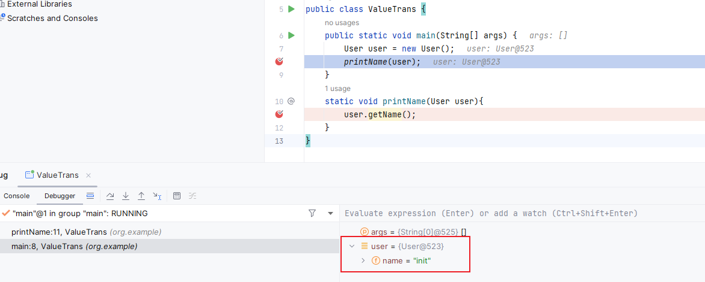
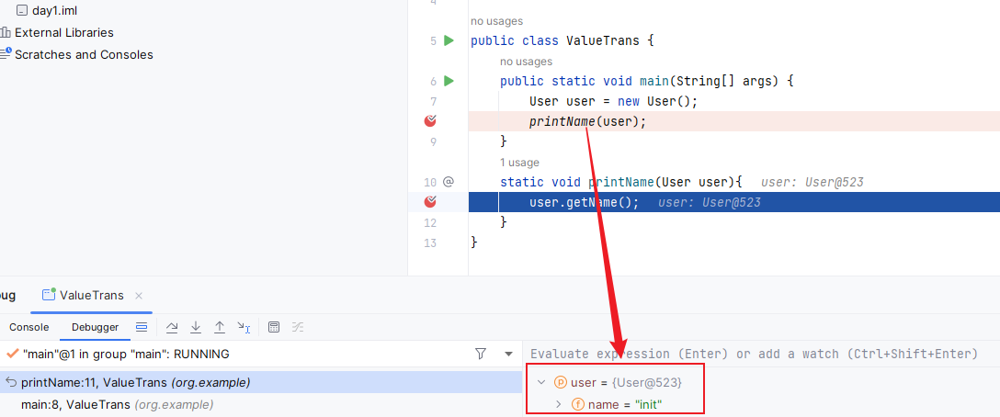
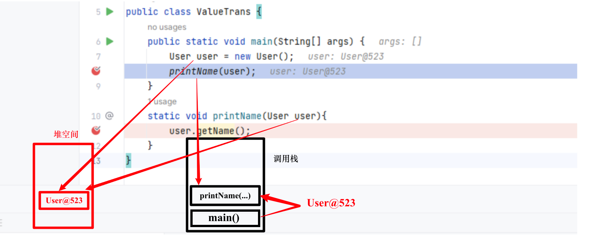

编程语言中需要进行方法间的参数传递，这个传递的策略叫做**求值策略**。

在程序设计中，求值策略有很多种，比较常见的就是**值传递和引用传递**。

**值传递和引用传递最大的区别是传递的过程中有没有复制出一个副本来，如果是传递副本，那就是值传递，否则就是引用传递。**

**`Java`对象的传递，是通过复制的方式把引用关系传递了，因为有复制的过程，所以是值传递**，只不过对于`Java`对象的传递，传递的内容是对象的引用。


# 扩展知识

## 目录
[1. 目录](#目录)
[2. 内存管理](#内存管理)
        [    **堆（Heap）**](#堆heap)
        [    **方法区（Method Area）/元空间（Metaspace）**](#方法区method-area元空间metaspace)
        [    **调用栈（Call Stack）**](#调用栈call-stack)
    [2.4 总结](#总结)


## 内存管理

首选我们要搞清楚新建一个对象的时候涉及到的`Java`内存区，假设我们需要创建一个对象实例：

```java
  User user = new User() // User为自定义对象，这里只用来说明
```

#### **堆（Heap）**

> 对象实例数据存储在堆内存中。当你通过 `new` 关键字创建一个对象时，`JVM` 会在堆内存中为对象实例分配内存。
>
> 堆是一个运行时数据区，它被所有线程共享。在堆上分配的内存将由`Java`垃圾收集器管理，不需要程序员手动释放。

也就是说，堆空间实际上存放的是`new User()`的相关内容，而`user`是`Java`对堆空间中这个地址的引用。

#### **方法区（Method Area）/元空间（Metaspace）**

> 类的元数据（如类的定义信息、常量、静态变量等）存放在方法区。在`Java 8`及之后的版本中，传统的永久代（`PermGen`）已被元空间所取代。
>
> 方法区同样是由所有线程共享。

假设User类的定义如下：

```java
public class User {
    private String username; // 实例变量，在堆中为每个User对象存储
    private String password; // 实例变量，在堆中为每个User对象存储
    private static int userCount; // 静态变量，存储在元空间中

    // Constructor and methods...
}
```

那么，通过`new User()`创建的对象会在堆内存中为`username`和`password`变量存储值。而`userCount`这个静态变量，作为类的一部分，和其他类的元数据存储在元空间中。即使你创建了很多个`User`对象，`userCount`只有一份拷贝。

**类的元数据**

> **类的结构定义**：这包括了类的名称、其直接父类、实现的接口、类的访问级别（`public`、`private`等）、类是类还是接口或枚举等信息。
>
> **方法信息**：这包括了类中定义的所有方法的名称、返回类型、参数列表、访问修饰符（如`public`、`private`）、异常列表、方法的字节码等。
>
> **字段信息**：这包括了类中定义的所有字段（成员变量）的名称、类型、访问修饰符等。
>
> **常量池**：这是运行时常量池，它包含了各种字面量和对类型、字段和方法的符号引用。

#### **调用栈（Call Stack）**

> 每个线程运行时都有自己的调用栈，每个方法调用时会创建一个栈帧（`Stack Frame`）存放在调用栈中。
>
> 栈帧包含了局部变量表（`Local Variables`），操作数栈，动态链接信息等。其中局部变量表存放了基本类型的变量和对象引用变量。

这里才是**关键**的部分，需要理解的是，我们首先需要执行`main`方法在调用栈中创建一个栈帧，然后在这个栈帧中我们定义了一个局部变量`User user`，随后通过new User()我们将在堆空间中开辟出一块空间存放新建的对象的实例数据。随后，这个局部变量用于接收我们新建的这个对象存放在堆空间的地址。

下面在`debug`模式下对参数传递过程进行演示，当我们将我们创建的实例对象`user`传递给某个方法时，例如

```java
static void printName(User user){
				user.getName();
}
```

在这里我们可以看到user的地址是`User@523`。



然后我们`debug`进`printName`方法：



可以看到的是，此时`printName`方法中的`user`的地址和刚刚`new User()`的地址是一致的，也就是说，在这个参数传递过程中传递过来就是`user`的值。



实际上，在调用`printName`方法时，`JVM`已经在栈帧中创建了一个局部变量`user`，调用时`main`方法将本身的`user`的值传递到了`printName`堆栈中的`user`，这个过程也可以理解成创建了副本。

### 总结

编程语言方法之间的参数传递策略被称为求值策略，求值策略有很多种，比较常见的就是值传递和引用传递。还有一种值传递的特例——共享对象传递。

值传递和引用传递最大的区别是传递的过程中有没有复制出一个副本来，如果是传递副本，那就是值传递，否则就是引用传递。

在`Java`中，其实是通过值传递实现的参数传递，只不过对于`Java`对象的传递，传递的内容是对象的引用。

**我们可以总结说，`Java`中的求值策略是共享对象传递，这是完全正确的。**

但是，为了让大家都能理解你说的，**我们说`Java`中只有值传递，只不过传递的内容是对象的引用。这也是没毛病的。**

