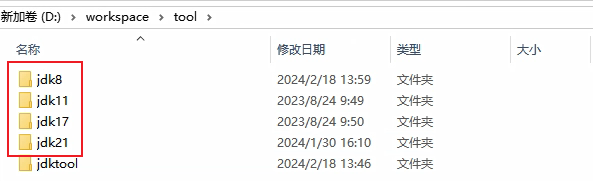
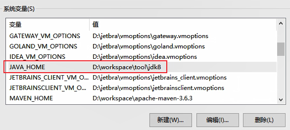
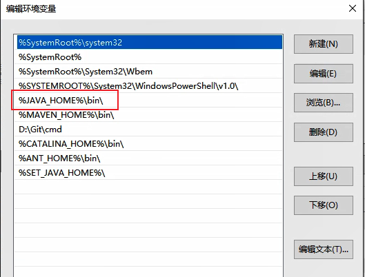
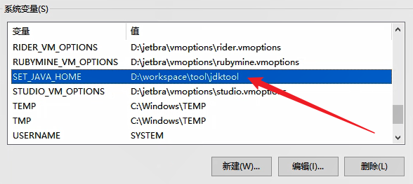
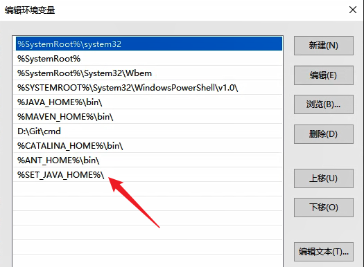
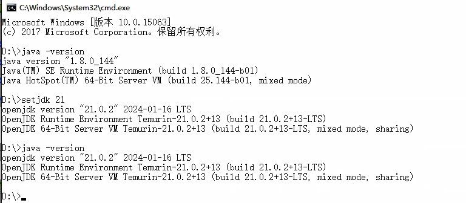

# JDK 版本切换指南

## 目录

[1. 目录](#目录)

[2. 一、Windows 系统配置](#一windows-系统配置)

- [2.1 安装多版本 JDK](#安装多版本-jdk)

- [2.2 创建切换脚本](#创建切换脚本)

[3. 二、macOS 系统配置](#二macos-系统配置)

- [3.1 使用 Homebrew 安装多版本 JDK](#使用-homebrew-安装多版本-jdk)

- [3.2 创建切换脚本](#创建切换脚本-1)

[4. 三、其他方法](#三其他方法)

- [4.1 使用 SDKMAN（推荐用于 Linux/macOS）](#使用-sdkman推荐用于-linuxmacos)

- [4.2 使用 jEnv](#使用-jenv)

[5. 四、IDE 配置](#四ide-配置)

- [5.1 IntelliJ IDEA](#intellij-idea)

- [5.2 Eclipse](#eclipse)


## 一、Windows 系统配置

### 安装多版本 JDK

1. 下载所需的 JDK 版本：
   - 访问 [Oracle JDK 下载页面](https://www.oracle.com/java/technologies/downloads/)
   - 或使用 [OpenJDK 下载页面](https://adoptium.net/)



2. 安装 JDK：
   - 建议将不同版本安装在独立目录，如：
     - `D:\workspace\tool\jdk8`
     - `D:\workspace\tool\jdk11`
     - `D:\workspace\tool\jdk17`
     - `D:\workspace\tool\jdk21`

3. 设置默认 JDK：



4. 配置环境变量：



### 创建切换脚本

1. 创建 `setjdk.bat` 脚本：

```batch
@echo off

:: 显示使用指南
if "%~1"=="" (
    echo 请指定要切换的 JDK 版本
    echo 用法: setjdk.bat [version]
    echo 示例: setjdk.bat 11
    echo 支持的版本: 8, 11, 17, 21
    goto :EOF
)

set "version=%~1"

:: 检查版本是否受支持并调用相关的设置
if "%version%"=="8" (
    goto :SET_JDK_8
) else if "%version%"=="11" (
    goto :SET_JDK_11
) else if "%version%"=="17" (
    goto :SET_JDK_17
) else if "%version%"=="21" (
    goto :SET_JDK_21
) else (
    echo 不支持的 JDK 版本: %version%
    echo 支持的版本: 8, 11, 17, 21
    goto :EOF
)

ENDLOCAL
goto :EOF

:SET_JDK_8
set "JAVA_HOME=D:\workspace\tool\jdk8"
set Path=%JAVA_HOME%\bin;%Path%
echo JDK 版本已切换到 8
java -version
goto :EOF

:SET_JDK_11
set "JAVA_HOME=D:\workspace\tool\jdk11"
set Path=%JAVA_HOME%\bin;%Path%
echo JDK 版本已切换到 11
java -version
goto :EOF

:SET_JDK_17
set "JAVA_HOME=D:\workspace\tool\jdk17"
set Path=%JAVA_HOME%\bin;%Path%
echo JDK 版本已切换到 17
java -version
goto :EOF

:SET_JDK_21
set "JAVA_HOME=D:\workspace\tool\jdk21"
set Path=%JAVA_HOME%\bin;%Path%
echo JDK 版本已切换到 21
java -version
goto :EOF
```

2. 配置脚本环境变量：
   - 将脚本放在 `jdktool` 目录下
   - 添加目录到系统 PATH





3. 使用方法：
   - 打开命令提示符
   - 执行 `setjdk [版本号]` 切换 JDK 版本



## 二、macOS 系统配置

### 使用 Homebrew 安装多版本 JDK

```bash
# 安装 JDK 8
brew install --cask adoptopenjdk8

# 安装 JDK 11
brew install --cask adoptopenjdk11

# 安装 JDK 17
brew install --cask temurin17

# 安装 JDK 21
brew install --cask temurin
```

### 创建切换脚本

1. 创建 `setjdk.sh` 脚本：

```bash
# !/bin/bash

# 显示使用说明
if [ -z "$1" ]; then
    echo "请指定要切换的 JDK 版本"
    echo "用法: setjdk [version]"
    echo "示例: setjdk 11"
    echo "支持的版本: 8, 11, 17, 21"
    exit 1
fi

version=$1

# JDK 路径配置
JDK8_HOME="/Library/Java/JavaVirtualMachines/adoptopenjdk-8.jdk/Contents/Home"
JDK11_HOME="/Library/Java/JavaVirtualMachines/adoptopenjdk-11.jdk/Contents/Home"
JDK17_HOME="/Library/Java/JavaVirtualMachines/temurin-17.jdk/Contents/Home"
JDK21_HOME="/Library/Java/JavaVirtualMachines/temurin-21.jdk/Contents/Home"

# 切换 JDK 版本
case $version in
    "8")
        export JAVA_HOME=$JDK8_HOME
        ;;
    "11")
        export JAVA_HOME=$JDK11_HOME
        ;;
    "17")
        export JAVA_HOME=$JDK17_HOME
        ;;
    "21")
        export JAVA_HOME=$JDK21_HOME
        ;;
    *)
        echo "不支持的 JDK 版本: $version"
        echo "支持的版本: 8, 11, 17, 21"
        exit 1
        ;;
esac

# 更新 PATH
export PATH=$JAVA_HOME/bin:$PATH

# 显示当前 JDK 版本
echo "JDK 版本已切换到 $version"
java -version
```

2. 配置脚本：

```bash
# 移动脚本到 bin 目录
sudo mv setjdk.sh /usr/local/bin/setjdk

# 添加执行权限
sudo chmod +x /usr/local/bin/setjdk

# 添加到 .zshrc 或 .bash_profile
echo 'source /usr/local/bin/setjdk' >> ~/.zshrc
```

3. 使用方法：
```bash
# 切换到 JDK 8
setjdk 8

# 切换到 JDK 11
setjdk 11
```

## 三、其他方法

### 使用 SDKMAN（推荐用于 Linux/macOS）

1. 安装 SDKMAN：
```bash
curl -s "https://get.sdkman.io" | bash
```

2. 安装不同版本 JDK：
```bash
sdk install java 8.0.392-amzn
sdk install java 11.0.21-amzn
sdk install java 17.0.9-amzn
```

3. 切换 JDK 版本：
```bash
sdk use java 11.0.21-amzn
```

### 使用 jEnv

1. 安装 jEnv：
```bash
# macOS
brew install jenv

# Linux
git clone https://github.com/jenv/jenv.git ~/.jenv
```

2. 添加 JDK：
```bash
jenv add /path/to/java_home
```

3. 切换版本：
```bash
# 全局切换
jenv global 11.0

# 当前目录切换
jenv local 11.0
```

## 四、IDE 配置

### IntelliJ IDEA

1. 配置多个 JDK：
   - 打开 `File -> Project Structure -> Platform Settings -> SDKs`
   - 点击 `+` 添加新的 JDK

2. 项目级别切换：
   - 打开 `File -> Project Structure -> Project Settings -> Project`
   - 选择对应的 JDK 版本

### Eclipse

1. 配置多个 JDK：
   - 打开 `Window -> Preferences -> Java -> Installed JREs`
   - 点击 `Add` 添加新的 JDK

2. 项目级别切换：
   - 右键项目 -> `Properties -> Java Compiler`
   - 选择对应的 JDK 版本